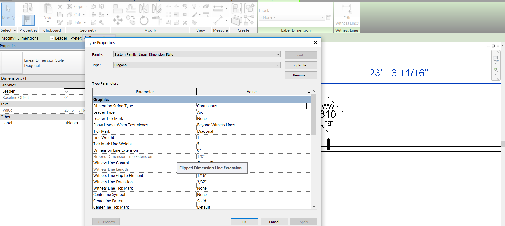

<head>
<meta http-equiv="Content-Type" content="text/html; charset=utf-8">
<link rel="stylesheet" type="text/css" href="bc.css">

</head>

<!---

Accessing the line weight for dimension lines in the #RevitAPI @AutodeskForge @AutodeskRevit #bim #DynamoBim #ForgeDevCon http://bit.ly/dimelineweight

Today we share a quickie from the Revit API discussion forum thread on how to access the line weight for dimension lines
&ndash; I want to programmatically access a dimension line's line weight...

-->

### Accessing Dimension Line Weight

Today we share a quickie from 
the [Revit API discussion forum](http://forums.autodesk.com/t5/revit-api-forum/bd-p/160) thread
on how to [access the line weight for dimension lines](https://forums.autodesk.com/t5/revit-api-forum/access-line-weight-for-dimension-lines/m-p/8463046):

**Question:** I want to programmatically access a dimension line's line weight.

Here is a screenshot of what I am after:

Dimension line weight

**Answer:** Before you do anything else whatsoever, install [RevitLookup](https://github.com/jeremytammik/RevitLookup).

It is an interactive Revit BIM database exploration tool to view and navigate element properties and relationships.

Use that to discover the relationships between the dimension lines, their styles, and the properties you are looking for.

Once you have that installed, you will quickly be able to determine that the dimension line weight is stored in a parameter value on the dimension type.

You can access it like this using the built-in parameter enumeration value `BuiltInParameter.LINE_PEN`:

<pre class="code">
&nbsp;&nbsp;ElementId&nbsp;dimTypeId&nbsp;=&nbsp;dimension.GetTypeId();
&nbsp;&nbsp;Element&nbsp;dimType&nbsp;=&nbsp;document.GetElement(&nbsp;dimTypeId&nbsp;);
 
&nbsp;&nbsp;Parameter&nbsp;lineWeight&nbsp;=&nbsp;dimType.get_Parameter(&nbsp;
&nbsp;&nbsp;&nbsp;&nbsp;BuiltInParameter.LINE_PEN&nbsp;);
</pre>

Many thanks to [Bardia Jahangiri](https://forums.autodesk.com/t5/user/viewprofilepage/user-id/4145125) for the precise detailed answer.
