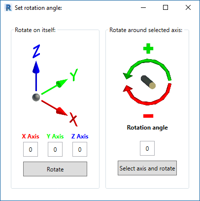
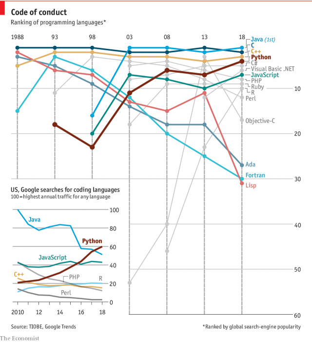

<head>
<meta http-equiv="Content-Type" content="text/html; charset=utf-8">
<link rel="stylesheet" type="text/css" href="bc.css">

</head>

<!---

- https://stackoverflow.com/questions/53756458/how-to-get-the-bounding-box-from-a-revit-element-with-revit-api-then-call-to-ce

Rotate picked element around its bounding box centre using Python in the #RevitAPI @AutodeskForge @AutodeskRevit #bim #DynamoBim #ForgeDevCon @ThePSF http://bit.ly/pybbcentre

Let's highlight a nice interactive didactical Python-based Revit API learning challenge on how to get the bounding box from a Revit element and determine its centre
&ndash; Cyril's Python HVAC blog
&ndash; Rotating elements around their centre in Python
&ndash; Retrieve element and bounding box from picked reference
&ndash; Use location point instead of bounding box centre
&ndash; Final working solution...

-->

### Python Rotate Picked Around Bounding Box Centre

Let's highlight a nice interactive didactical Python-based Revit API learning challenge from StackOverflow, for a change, raised, discussed and solved
by [Christian Gentry](https://stackoverflow.com/users/9662317/christian-gentry),
with help from [Cyril Waechter](https://stackoverflow.com/users/4098083/cyril-waechter),
on [how to get the bounding box from a Revit element and determine its centre](https://stackoverflow.com/questions/53756458/how-to-get-the-bounding-box-from-a-revit-element-with-revit-api-then-call-to-ce):

- [Cyril's Python HVAC blog](#1) 
- [Rotating elements around their centre in Python](#2) 
- [Retrieve element and bounding box from picked reference](#3) 
- [Use location point instead of bounding box centre](#4) 
- [Final working solution](#5)
- [Updated final working solution](#5.1)
- [Python popularity growing](#6) 

####  Cyril's Python HVAC Blog

You can see below why the following discussion also prompted me to look at
Cyril's very nice [Python HVAC blog](http://pythoncvc.net).

In his own words:

> Welcome on this website which promotes and provides scripts and applications for HVAC and BIM purposes.
These are written in Python language.

> When I started my career, I wished I had many time saver tools.
Many people don't realise how much time you can save with just a few lines of code.
In my opinion, everything which can be automated should be.
A human being is here to use his mind, not to copy, paste and input data which doesn't need any brain.

> Why Python? Because it is handy, interactive, open source and cross platform.

[Cyril's FAQ](http://pythoncvc.net/?page_id=302) includes very useful information and resources for getting started with his own [pyRevitMEP MEP extensions for pyRevit](https://github.com/CyrilWaechter/pyRevitMEP), Python and the base Revit API.

####  Rotating Elements Around Their Centre in Python

**Question:** I am trying to rotate Revit elements about their centre points.
In order to do that, I need to select a Revit element and find its centre point, then create a line with the coordinates at that point.

My best idea to accomplish this is to wrap a Revit element in a bounding box and then find the centre of that box.
My problem is that I am unsure how to accomplish this.

I am using [pyRevit](https://github.com/eirannejad/pyRevit) (amazing tool) and I am stuck on how to either wrap the selected element with a bounding box or retrieve its existing bounding box.

Any help would be greatly appreciated!
I am really trying to learn the Revit API and understand how everything works.
I am making progress but there is a lot to unpack.

<pre class="prettyprint">
  def pickobject():
    from Autodesk.Revit.UI.Selection import ObjectType
    
    #define the active Revit application and document
    app = __revit__.Application
    doc = __revit__.ActiveUIDocument.Document
    uidoc = __revit__.ActiveUIDocument
    
    #define a transaction variable and describe the transaction
    t = Transaction(doc, 'This is my new transaction')
    
    # Begin new transaction
    t.Start()
    
    # Select an element in Revit
    picked = uidoc.Selection.PickObject(ObjectType.Element, "Select something.")

    ### ?????????? ###
    
    # Get bounding box of selected element.
    picked_bb = BoundingBoxXYZ(picked)  
    
    # Get max and min points of bounding box.
    picked_bb_max = picked_bb.Max
    picked_bb_min = picked_bb.Min
    
    # Get center point between max and min points of bounding box.
    picked_bb_center = (picked_bb_max + picked_bb_min) / 2
    
    ### ?????????? ###    
    
    # Close the transaction
    t.Commit()
    
    return picked, picked_bb_center
</pre>

Thanks in advance for taking a look at what I have so far.

####  Retrieve Element and Bounding Box from Picked Reference

The centre of the bounding box is very easy to obtain.
`picked` is a `Reference`.
Get the `ElementId` from that, open it using `doc.GetElement`, and retrieve the bounding box using `get_BoundingBox`,
cf. this code snippet from the discussion
of [conduits intersecting a junction box](https://thebuildingcoder.typepad.com/blog/2018/03/create-2d-arc-and-filter-for-intersecting-elements.html#3):

<pre class="code">
&nbsp;&nbsp;Element&nbsp;e&nbsp;=&nbsp;Util.SelectSingleElement(
&nbsp;&nbsp;&nbsp;&nbsp;uidoc,&nbsp;&quot;a&nbsp;junction&nbsp;box&quot;&nbsp;);

&nbsp;&nbsp;BoundingBoxXYZ&nbsp;bb&nbsp;=&nbsp;e.get_BoundingBox(&nbsp;null&nbsp;);
</pre>

For certain elements and certain irregular shapes, you might want to use the centroid instead of the bounding box:

- [Solid centroid and volume calculation](http://thebuildingcoder.typepad.com/blog/2012/12/solid-centroid-and-volume-calculation.html)
- [GetCentroid on GitHub](https://thebuildingcoder.typepad.com/blog/2015/06/dynamo-centroid-volume-calculation-migration-blitz.html#3)

####  Use Location Point Instead of Bounding Box Centre?

**Answer:** Is it not more interesting to use `LocationPoint` instead in your case? In my case it is almost always better. You might be interested to take a look at the two-minute video showing my tool,
a [Revit API 3D rotate script for pyRevit](https://youtu.be/60Y_DJbIL5Y), and its [source code](https://github.com/CyrilWaechter/pyRevitMEP/tree/master/pyRevitMEP.tab/Tools.panel/Element3DRotation.pushbutton):

<iframe width="480" height="270" src="https://www.youtube.com/embed/60Y_DJbIL5Y" frameborder="0" allow="accelerometer; autoplay; encrypted-media; gyroscope; picture-in-picture" allowfullscreen></iframe>

I describe the script shown in the video in full detail in
the [Python HVAC blog](http://pythoncvc.net) in the article
on a [script rotating elements in any direction](http://pythoncvc.net/?p=255).

**Response:** Thanks for this! 

I think you are right. Using `LocationPoint` would probably make more sense.

I looked through the script you linked (thank you btw!) and tried implementing this section in my code:

<pre class="prettyprint">
  transform = doc.GetElement(picked.ElementId).GetTransform()
</pre>

I am passing the `ElementId` through this statement, but I get an error saying that the `Wall` object has no attribute `GetTransform`. Could you please help me understand this?

**Answer:** Because, as said in the error message, the `GetTransform` method do not exist for a `Wall` class instance.

Have you tried to use `ElementTransformUtils` instead?

####  Final Working Solution

Here is how I was able to solve my problem using pyRevit. This code allows you to rotate an element about its Z axis from the centre of its bounding box.

<pre class="prettyprint">
  def pickobject():
    from Autodesk.Revit.UI.Selection import ObjectType
    
    #define the active Revit application and document
    app = __revit__.Application
    doc = __revit__.ActiveUIDocument.Document
    uidoc = __revit__.ActiveUIDocument
    
    #define a transaction variable and describe the transaction
    t = Transaction(doc, 'This is my new transaction')
    
    # Begin new transaction
    t.Start()
    
    # Select an element in Revit
    el = uidoc.Selection.PickObject(ObjectType.Element, "Select something.")
    
    # Get the element from the selected element reference
    el_ID = doc.GetElement(el)      
    
    # Get the Bounding Box of the selected element.
    el_bb = el_ID.get_BoundingBox(doc.ActiveView)
    
    # Get the min and max values of the elements bounding box.
    el_bb_max = el_bb.Max
    el_bb_min = el_bb.Min
    
    # Get the center of the selected elements bounding box.
    el_bb_center = (el_bb_max + el_bb_min) / 2
    
    #Create a line to use as a vector using the center location of the bounding box.
    p1 = XYZ(el_bb_center[0], el_bb_center[1], 0)
    p2 = XYZ(el_bb_center[0], el_bb_center[1], 1)
    myLine = Line.CreateBound(p1, p2)
    
    # Rotate the selected element.
    ElementTransformUtils.RotateElement(doc, el, myLine, converted_value)
    
    # Close the transaction
    t.Commit()
</pre>

Many thanks to Christian for the interesting discussion and Cyril for the wealth of additional information he provides!

####  Updated Final Working Solution

After the winter break, Christian added:

> I have updated my code solution to work directly in the Revit Python Shell without any further modifications. I have also added comments that better explain the code. Would you mind updating your blog post with this latest solution? I feel that the new solution is more beneficial to people with this same issue. Thanks!

Here is how I was able to solve my problem using pyRevit. This code allows you to rotate an element about its Z axis from the center of its bounding box.

To use this code, select a single Revit element and then open the Revit Python Shell. Copy and paste the code below into the Revit Python Shell notepad and click the run button. This will rotate the element by 45 degrees because the current `rotateSelectedElement` argument is `45`. You may change this number to any value before running.

<pre class="prettyprint">
  # Import the math module to convert user input degrees to radians.
  import math
  
  # Get a list of all user selected objects in the Revit Document.
  selection = [doc.GetElement(x) for x in uidoc.Selection.GetElementIds()]
  
  # Definitions
  def rotateSelectedElement(degrees_to_rotate):
    from Autodesk.Revit.UI.Selection import ObjectType
  
    #define the active Revit application and document
    app = __revit__.Application
    doc = __revit__.ActiveUIDocument.Document
    uidoc = __revit__.ActiveUIDocument
  
    #define a transaction variable and describe the transaction
    t = Transaction(doc, 'This is my new transaction')
  
    # Convert the user input from degrees to radians.
    converted_value = float(degrees_to_rotate) * (math.pi / 180.0)
  
    # Begin new transaction
    t.Start()
  
    # Get the first selected element from the current Revit doc.
    el = selection[0].Id
  
    # Get the element from the selected element reference
    el_ID = doc.GetElement(el)      
  
    # Get the Bounding Box of the selected element.
    el_bb = el_ID.get_BoundingBox(doc.ActiveView)
  
    # Get the min and max values of the elements bounding box.
    el_bb_max = el_bb.Max
    el_bb_min = el_bb.Min
  
    # Get the center of the selected elements bounding box.
    el_bb_center = (el_bb_max + el_bb_min) / 2
  
    #Create a line to use as a vector using the center location of the bounding box.
    p1 = XYZ(el_bb_center[0], el_bb_center[1], 0)
    p2 = XYZ(el_bb_center[0], el_bb_center[1], 1)
    myLine = Line.CreateBound(p1, p2)
  
    # Rotate the selected element.
    ElementTransformUtils.RotateElement(doc, el, myLine, converted_value)
  
    # Close the transaction
    t.Commit()
  
    
  # Execute    
  # Add the desired degrees to rotate by as an argument for rotateSelectedElement()
  rotateSelectedElement(45)
</pre>

Happy New Year to Christian and all!

####  Python Popularity Growing

Talking about Python, 
[Python is becoming the world’s most popular coding language](https://www.economist.com/graphic-detail/2018/07/26/python-is-becoming-the-worlds-most-popular-coding-language), according to the Economist and global search engine statistics:

