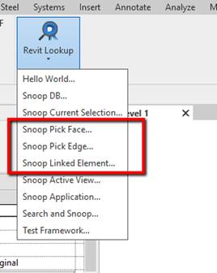
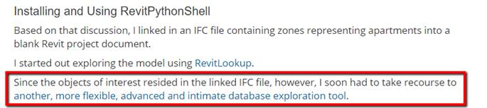
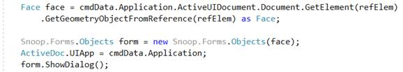
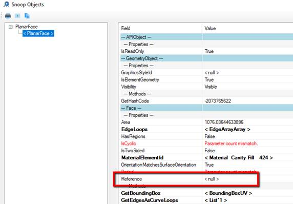

<head>
<meta http-equiv="Content-Type" content="text/html; charset=utf-8">
<link rel="stylesheet" type="text/css" href="bc.css">

</head>

<!---

- revitlookup update
  https://github.com/jeremytammik/RevitLookup/releases/tag/2019.0.0.6
  [diff](https://github.com/jeremytammik/RevitLookup/compare/2019.0.0.5...2019.0.0.6)

New RevitLookup snoops edges, faces and links in the #RevitAPI @AutodeskForge @AutodeskRevit #bim #DynamoBim #ForgeDevCon http://bit.ly/lookupedgefacelink

Håvard Leding of Symetri added three new commands to RevitLookup
&ndash; Three new RevitLookup commands
&ndash; About "Snoop Pick Face"
&ndash; About "Pick Linked Element"
&ndash; Running in a family document...

the [Revit API discussion forum](http://forums.autodesk.com/t5/revit-api-forum/bd-p/160) topic

of [The Building Coder samples](https://github.com/jeremytammik/the_building_coder_samples/releases/tag/2019.0.145.4).

-->

### New RevitLookup Snoops Edge, Face, Link

Before leaving for the weekend, let me highlight some recent additions
to [RevitLookup](https://github.com/jeremytammik/RevitLookup) by 
Håvard Leding of [Symetri](https://www.symetri.com):

- [Three new RevitLookup commands](#3) 
- [About "Snoop Pick Face..."](#4) 
- [About "Pick Linked Element..."](#5) 
- [Running in a family document](#6) 

I added and tested the new commands
in [RevitLookup release 2019.0.0.6](https://github.com/jeremytammik/RevitLookup/releases/tag/2019.0.0.6).

Below is the description and some additional background information in Håvard's own words.

Many thanks to Håvard for implementing and sharing this!

####  Three New RevitLookup Commands

This is perhaps something of interest to someone.

Three very simple additions:

The first one really helped when debugging stable references on joined solid geometry in families.
Just the picked `Reference` passed into the `Object` form.
If I pass the `GeometryObject` (the face), it will not retrieve a reference, presumably because `GeometryObjectFromReference` doesn't calculate references.

If of any use, the [commands are attached here](zip/hl_revitlookup_commands.txt).

Here is the code to generate the additional ribbon entries:

<pre class="code">
  optionsBtn.AddPushButton(&nbsp;new&nbsp;PushButtonData(&nbsp;&quot;Snoop&nbsp;Pick&nbsp;Face...&quot;,&nbsp;&quot;Snoop&nbsp;Pick&nbsp;Face...&quot;,&nbsp;ExecutingAssemblyPath,&nbsp;&quot;RevitLookup.CmdSnoopModScopePickSurface&quot;&nbsp;)&nbsp;);

  optionsBtn.AddPushButton(&nbsp;new&nbsp;PushButtonData(&nbsp;&quot;Snoop&nbsp;Pick&nbsp;Edge...&quot;,&nbsp;&quot;Snoop&nbsp;Pick&nbsp;Edge...&quot;,&nbsp;ExecutingAssemblyPath,&nbsp;&quot;RevitLookup.CmdSnoopModScopePickEdge&quot;&nbsp;)&nbsp;);

  optionsBtn.AddPushButton(&nbsp;new&nbsp;PushButtonData(&nbsp;&quot;Snoop&nbsp;Pick&nbsp;Linked&nbsp;Element...&quot;,&nbsp;&quot;Snoop&nbsp;Linked&nbsp;Element...&quot;,&nbsp;ExecutingAssemblyPath,&nbsp;&quot;RevitLookup.CmdSnoopModScopeLinkedElement&quot;&nbsp;)&nbsp;);
</pre>

####  About "Snoop Pick Face..."

Using `Autodesk.Revit.UI.Selection.ObjectType.Face...` gets you a reference to a face.

But if you use this instead...

<pre class="code">
&nbsp;&nbsp;Face&nbsp;face&nbsp;=&nbsp;cmdData.Application.ActiveUIDocument
&nbsp;&nbsp;&nbsp;&nbsp;.Document.GetElement(&nbsp;refElem&nbsp;)
&nbsp;&nbsp;&nbsp;&nbsp;.GetGeometryObjectFromReference(&nbsp;refElem&nbsp;)&nbsp;as&nbsp;Face;
</pre>

...then `Face.Reference` will be null.

Such a reference is needed when placing face-based families or dimensions, for example.

But it does get you a stable reference to the face:

<pre class="code">
&nbsp;&nbsp;string&nbsp;stableRef&nbsp;=&nbsp;refElem
&nbsp;&nbsp;&nbsp;&nbsp;.ConvertToStableRepresentation(&nbsp;uidoc.Document&nbsp;);
</pre>

Which you can use to find the same face using `Element.get_Geometry`.
Where `Options` calculate the references.
And that face (really the same face) will have a usable reference.

Using Lookup, I found this `stableRef` inside a `GeomCombination`.
And so, I knew I had to include `GeomCombination` in my `FilteredElementCollector`.

Perhaps this could be an improvement on `GetGeometryObjectFromReference`?
An overload to calcuate references if possible.
`GetGeometryObjectFromReference(` `Reference,` `bool` `CalculatedReference )`.

The new pick options helped guide me to my target face.

####  About "Pick Linked Element..."

"Snoop Pick Linked Element..." I haven't had use for yet.

I suspect I will use it quite a bit when debugging interaction with linked elements.

Seems to me you could have used "Pick Linked Element..." yourself in your latest discussion
on [retrieving linked `IfcZone` elements using Python](https://thebuildingcoder.typepad.com/blog/2019/01/retrieving-linked-ifczone-elements-using-python.html).

 

####  Running in a Family Document

In my case, the code is running in a family document, not a project.

I get all the solids I need first, knowing that somewhere inside, there is the face I first picked.

<pre class="code">
&nbsp;&nbsp;List&lt;Solid&gt;&nbsp;solidsInFamily&nbsp;=&nbsp;new&nbsp;List&lt;Solid&gt;();
&nbsp;&nbsp;IList&lt;Type&gt;&nbsp;geomTypes&nbsp;=&nbsp;new&nbsp;List&lt;Type&gt;()&nbsp;{&nbsp;typeof(&nbsp;GenericForm&nbsp;),&nbsp;typeof(&nbsp;GeomCombination&nbsp;)&nbsp;};
&nbsp;&nbsp;ElementMulticlassFilter&nbsp;emcf&nbsp;=&nbsp;new&nbsp;ElementMulticlassFilter(&nbsp;geomTypes&nbsp;);
&nbsp;&nbsp;FilteredElementCollector&nbsp;colForms&nbsp;=&nbsp;new&nbsp;FilteredElementCollector(&nbsp;doc&nbsp;)
&nbsp;&nbsp;.WherePasses(&nbsp;emcf&nbsp;);
 
&nbsp;&nbsp;Options&nbsp;opt&nbsp;=&nbsp;new&nbsp;Options();
&nbsp;&nbsp;opt.ComputeReferences&nbsp;=&nbsp;true;
 
&nbsp;&nbsp;foreach(&nbsp;CombinableElement&nbsp;combinable&nbsp;in&nbsp;colForms&nbsp;)
&nbsp;&nbsp;{
&nbsp;&nbsp;&nbsp;&nbsp;if(&nbsp;combinable&nbsp;is&nbsp;GenericForm&nbsp;&amp;&amp;&nbsp;!(&nbsp;combinable&nbsp;as&nbsp;GenericForm&nbsp;).IsSolid&nbsp;)
&nbsp;&nbsp;&nbsp;&nbsp;&nbsp;&nbsp;continue;
 
&nbsp;&nbsp;&nbsp;&nbsp;GeometryElement&nbsp;geomElem&nbsp;=&nbsp;combinable.get_Geometry(&nbsp;opt&nbsp;);
&nbsp;&nbsp;&nbsp;&nbsp;List&lt;Solid&gt;&nbsp;solids&nbsp;=&nbsp;Utils.GetElementSolids(&nbsp;geomElem&nbsp;);
&nbsp;&nbsp;&nbsp;&nbsp;solidsInFamily.AddRange(&nbsp;solids&nbsp;);
&nbsp;&nbsp;}
</pre>

Then, using the stable reference from "Pick Face", iterate the solids until I find the face I'm looking for:

<pre class="code">
&nbsp;&nbsp;foreach(&nbsp;Solid&nbsp;solid&nbsp;in&nbsp;solids&nbsp;)
&nbsp;&nbsp;{
&nbsp;&nbsp;&nbsp;&nbsp;foreach(&nbsp;Face&nbsp;face&nbsp;in&nbsp;solid.Faces&nbsp;)
&nbsp;&nbsp;&nbsp;&nbsp;{
&nbsp;&nbsp;&nbsp;&nbsp;&nbsp;&nbsp;string&nbsp;stable&nbsp;=&nbsp;face.Reference.ConvertToStableRepresentation(&nbsp;doc&nbsp;);
&nbsp;&nbsp;&nbsp;&nbsp;&nbsp;&nbsp;if(&nbsp;stable&nbsp;==&nbsp;stableRef&nbsp;)
&nbsp;&nbsp;&nbsp;&nbsp;&nbsp;&nbsp;{
&nbsp;&nbsp;&nbsp;&nbsp;&nbsp;&nbsp;&nbsp;&nbsp;return&nbsp;face&nbsp;as&nbsp;PlanarFace;
&nbsp;&nbsp;&nbsp;&nbsp;&nbsp;&nbsp;}
&nbsp;&nbsp;&nbsp;&nbsp;}
&nbsp;&nbsp;}
</pre>

Perhaps there is another, simpler, way of getting (picking) a face which has a reference?

But if I do this, passing the picked face, not the reference:

Then the `Face` has no reference:

Which more or less prevents any interaction with it, such as placing dimensions, alignments or face-based families.

Enjoy!
