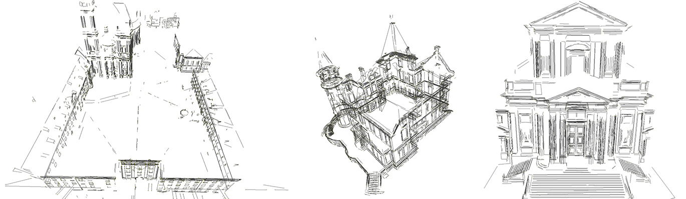

<head>
<meta http-equiv="Content-Type" content="text/html; charset=utf-8">
<link rel="stylesheet" type="text/css" href="bc.css">

</head>

<!---

- 14944349 [Revit terminates process if started with custom parameters]
  workaround to pass custom command line arguments via Revit.exe to be picked up by an add-in

- 14964317 [Verify a face is rectangular]
  https://forums.autodesk.com/t5/revit-api-forum/verify-a-face-is-rectangular/m-p/8520751
  [Verify a face is rectangular](https://forums.autodesk.com/t5/revit-api-forum/verify-a-face-is-rectangular/m-p/8520751)
  [Q] From a slab I get the geometry and then the upper face. I'd like to verify this face is a rectangle. Does anyone has an idea?
  [A] @aignatovich Alexander Ignatovich demos some interesting methods on the `CurveLoop` class:
  [`IsCounterclockwise`](https://apidocs.co/apps/revit/2019/ca966f5d-7db8-b28a-928e-12063dd143e6.htm),
  [`IsRectangular`](https://apidocs.co/apps/revit/2019/5a82c7ad-4b6e-a62c-6b0c-7fe790886995.htm)
  1) Get edges curveloops: face.GetEdgesAsCurveLoops()
  2) Find outer loop: loop = face.GetEdgesAsCurveLoops().First(x => x.IsCounterclockwise(face.ComputeNormal(UV.Zero))
  3) check if curveloop has plane &ndash; curveloop.HasPlane()
  4) check if it is rectangular curveloop.IsRectangular(curveLoop.GetPlane())

- Automate drawing of complex Revit families (for example an Air Handler or a Chiller)
  [Q] I have not worked with the Revit API at all and wanted to know your expert opinion on it. Do you think it possible to completely automate drawing of complex Revit families (for example an Air Handler or a Chiller) using the Revit API in Autodesk Revit? If so could you point me to any Revit API training you know of. Any input would be greatly appreciated.
  [A] Yes, it is.
  Getting started: https://thebuildingcoder.typepad.com/blog/about-the-author.html#2
  The Revit SDK sample FamilyCreation/CreateAirHandler creates an air handler and adds air and water piping and ductwork connectors to it.

- Cool interactive [Human Terrain visualization of population density over time](https://pudding.cool/2018/10/city_3d) by [The Pudding](https://pudding.cool).

Face methods, custom command line arguments and line segment extraction from point cloud in the #RevitAPI @AutodeskForge @AutodeskRevit #bim #DynamoBim #ForgeDevCon http://bit.ly/cmdlineargs

Inundated with interesting topics, let's skim a few topmost ones off
&ndash; Passing an add-in custom command line parameters
&ndash; Useful methods help verify a <code>Face</code> is rectangular
&ndash; Automate complex family creation
&ndash; C++ code extracts 3D line segments from point cloud
&ndash; Big data visualisation and storytelling...

of [The Building Coder samples](https://github.com/jeremytammik/the_building_coder_samples/releases/tag/2019.0.145.4).

-->

### Face Methods and Custom Command Line Arguments

Inundated with interesting topics, let's skim a few topmost ones off:

- [Passing an add-in custom command line parameters](#2) 
- [Useful methods help verify a `Face` is rectangular](#3) 
- [Automate complex family creation](#4) 
- [C++ code extracts 3D line segments from point cloud](#5) 
- [Big data visualisation and storytelling](#6) 

####  Passing an Add-In Custom Command Line Parameters

Morten Bastue Jacobsen, Senior BIM Specialist of [Ramboll](https://ramboll.com),
discovered a way to pass in Custom Command Line Parameters to Revit.exe to be picked up by an add-in.

[Revit implements built-in support for certain command line arguments](https://thebuildingcoder.typepad.com/blog/2017/01/distances-switches-kiss-ing-and-a-dino.html#3),
and their meaning obviously cannot be changed or customised.

If you specify a command line argument that is not one of the 'switches' listed, then the first one must be the path to a Revit model to open, and the second one must be the path to a journal file to replay.

No other non-switch command line arguments seem to be supported.

However, when we start `revit.exe` with custom parameters, the process terminates without any error messages.

Therefore, if we want to add custom parameters, the first parameter to the Revit.exe command must be name of a Revit project file.

This works:

- "C:\Program Files\Autodesk\Revit 2019\Revit.exe" "C:\temp\Revit_export\958-mobj_test.rvt" ---- C:\temp\Revit_export\2d_export_test.txt

This doesn't work:

- "C:\Program Files\Autodesk\Revit 2019\Revit.exe" ---- C:\temp\Revit_export\2d_export_test.txt

The purpose of starting the process with custom parameters is to read out these parameters in an add-in and perform automation tasks on the models.

Exploring this further, I discovered the following behaviour in Revit:

If Revit.exe is started with parameters like `revit.exe` `-param1`, the process terminates with a Windows error without any warning.

I think that no Windows process should ever behave like that.

However, these two alternatives work:

<pre>
  revit.exe &lt;path to revit model&gt; -param1
  revit.exe /param1
</pre>

So, my workaround is to format my custom parameters with a forward slash `/`.

Many thanks to Morten for discovering and sharing this.

####  Useful Methods Help Verify a `Face` is Rectangular

Alexander [@aignatovich](https://forums.autodesk.com/t5/user/viewprofilepage/user-id/1257478) Ignatovich, aka Александр Игнатович,
pointed out some useful methods on the `CurveLoop` class that help solve
the [Revit API discussion forum](http://forums.autodesk.com/t5/revit-api-forum/bd-p/160) task
to [verify a face is rectangular](https://forums.autodesk.com/t5/revit-api-forum/verify-a-face-is-rectangular/m-p/8520751):

**Question:** From a slab, I get the geometry and then the upper face.

I'd like to verify this face is a rectangle. Does anyone have an idea?

**Answer:** Alexander provides a succinct solution demonstrating the use of some interesting methods on the `CurveLoop` class:

- [`IsCounterclockwise`](https://apidocs.co/apps/revit/2019/ca966f5d-7db8-b28a-928e-12063dd143e6.htm),
- [`IsRectangular`](https://apidocs.co/apps/revit/2019/5a82c7ad-4b6e-a62c-6b0c-7fe790886995.htm)

He suggests:

- Get the edge curve loops: `face.GetEdgesAsCurveLoops()`
- Find the outermost loop: `loop` `=` `face.GetEdgesAsCurveLoops().First(` `x` `=>` `x.IsCounterclockwise(` `face.ComputeNormal(` `UV.Zero` `))`
- Check if the curve loop has a plane: `curveloop.HasPlane()`
- Check if it is rectangular: `curveloop.IsRectangular(` `curveLoop.GetPlane())`

Many thanks to Alexander for solving this and pointing out these interesting methods.

####  Automate Complex Family Creation

A non-forum question for a change, on automating the creation of complex Revit families, for example, an air handler or a chiller:

**Question:** I have not worked with the Revit API at all and wanted to know your expert opinion on it.

Do you think it possible to completely automate drawing of complex Revit families (for example an Air Handler or a Chiller) using the Revit API in Autodesk Revit?

If so, could you point me to any Revit API training you know of?

**Answer:** Yes, it is.

First, look at the [Revit API getting started material](https://thebuildingcoder.typepad.com/blog/about-the-author.html#2).

Once you have a grasp of that, you can turn straight to
the [Revit SDK sample FamilyCreation/CreateAirHandler](https://thebuildingcoder.typepad.com/blog/2010/11/connector-direction-and-createairhandler.html) &ndash;
it creates an air handler and adds air and water piping and ductwork connectors to it.

####  C++ Code Extracts 3D Line Segments from Point Cloud

Moving away just a little bit from the Revit API...

Do you have a need to extract 3D line segments from point clouds?

If so, you might want to check out the new algorithm presented by 
the [3DLineDetection C++ library](https://github.com/xiaohulugo/3DLineDetection),
implementing a simple and efficient 3D line detection algorithm for large scale unorganized point clouds,
and the associated conference paper based on this code,
[Fast 3D Line Segment Detection From Unorganized Point Cloud](https://arxiv.org/abs/1901.02532), by Xiaohu Lu, Yahui Liu, and Kai Li.

####  Big Data Visualisation and Storytelling

Finally, an interesting sample of analysing big data, visualising it effectively, and telling a story with it:
the interactive [*Human Terrain* visualization of population density over time](https://pudding.cool/2018/10/city_3d)
by [The Pudding](https://pudding.cool) shows an impressive example of all three steps.

