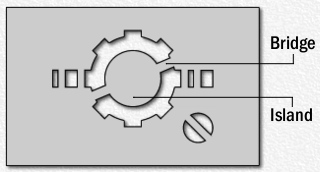

<head>
<meta http-equiv="Content-Type" content="text/html; charset=utf-8">
<link rel="stylesheet" type="text/css" href="bc.css">

</head>

<!---

- lots of interesting stuff stored in and modifiable by editing the ininfile:
  15056740 [Adding Project Template to 'New Project' via API]
  https://forums.autodesk.com/t5/revit-api-forum/adding-project-template-to-new-project-via-api/m-p/8585348

twitter:

Accessing and modifying settings in the Revit.ini file, e.g., adding a project template to the 'New Project' dialog on the Start Window, using the #RevitAPI @AutodeskForge @AutodeskRevit #bim #DynamoBim #ForgeDevCon http://bit.ly/modini
 
Some interesting settings are stored in and can be modified by editing the Revit ini file.
Peter <i>@pgerz</i> pointed out yet another possibility in his answer to 
the Revit API discussion forum thread on adding a project template to 'New Project' via API.
Question: I noticed the UI method for adding a project template to the 'New Project' dialog on the Start Window by going to Options &gt; File Locations and clicking the little plus symbol...

&ndash; 
...

linkedin:

of [The Building Coder samples](https://github.com/jeremytammik/the_building_coder_samples/releases/tag/2019.0.145.4).

-->

### Accessing and Modifying Settings in the Ini File

Some interesting settings are stored in and can be modified by editing the Revit ini file `Revit.ini`.

Peter [@pgerz](https://forums.autodesk.com/t5/user/viewprofilepage/user-id/859112) pointed
out yet another possibility in his answer to 
the [Revit API discussion forum](http://forums.autodesk.com/t5/revit-api-forum/bd-p/160) thread
on [adding a project template to 'New Project' via API](https://forums.autodesk.com/t5/revit-api-forum/adding-project-template-to-new-project-via-api/m-p/8585348):

**Question:** I noticed that the UI method for adding a project template to the 'New Project' dialog on the Start Window is by going to Options &gt; File Locations and clicking the little plus symbol.

Is there any way to achieve this same effect using the API?

I would like to add templates to the dropdown.

**Answer:** You can do it by editing the ini file with standard .NET functions; it is located at:

- C:\Users\%username%\AppData\Roaming\Autodesk\Revit\Autodesk Revit 2019\Revit.ini

In the section `[DirectoriesENU]`, modify the setting `DefaultTemplate`.

Example:

<pre class="code">
&nbsp;&nbsp;string&nbsp;oriFile&nbsp;=&nbsp;@&quot;&quot;
&nbsp;&nbsp;&nbsp;&nbsp;+&nbsp;Environment.GetEnvironmentVariable(&nbsp;&quot;appdata&quot;&nbsp;)
&nbsp;&nbsp;&nbsp;&nbsp;+&nbsp;@&quot;\Autodesk\Revit\Autodesk&nbsp;Revit&nbsp;2019\Revit.ini&quot;;
 
&nbsp;&nbsp;string&nbsp;tmpFile&nbsp;=&nbsp;@&quot;c:\temp\11.ini&quot;;
 
&nbsp;&nbsp;if(&nbsp;System.IO.File.Exists(&nbsp;oriFile&nbsp;)&nbsp;)
&nbsp;&nbsp;{
&nbsp;&nbsp;&nbsp;&nbsp;using(&nbsp;StreamReader&nbsp;sr&nbsp;=&nbsp;new&nbsp;StreamReader(&nbsp;
&nbsp;&nbsp;&nbsp;&nbsp;&nbsp;&nbsp;oriFile,&nbsp;Encoding.Unicode&nbsp;)&nbsp;)
&nbsp;&nbsp;&nbsp;&nbsp;{
&nbsp;&nbsp;&nbsp;&nbsp;&nbsp;&nbsp;StreamWriter&nbsp;sw&nbsp;=&nbsp;new&nbsp;StreamWriter(&nbsp;tmpFile,&nbsp;
&nbsp;&nbsp;&nbsp;&nbsp;&nbsp;&nbsp;&nbsp;&nbsp;false,&nbsp;Encoding.Unicode&nbsp;);
 
&nbsp;&nbsp;&nbsp;&nbsp;&nbsp;&nbsp;string&nbsp;inputLine&nbsp;=&nbsp;&quot;&quot;;
 
&nbsp;&nbsp;&nbsp;&nbsp;&nbsp;&nbsp;while(&nbsp;(&nbsp;inputLine&nbsp;=&nbsp;sr.ReadLine()&nbsp;)&nbsp;!=&nbsp;null&nbsp;)
&nbsp;&nbsp;&nbsp;&nbsp;&nbsp;&nbsp;{
&nbsp;&nbsp;&nbsp;&nbsp;&nbsp;&nbsp;&nbsp;&nbsp;if(&nbsp;inputLine.StartsWith(&nbsp;&quot;DefaultTemplate=&quot;&nbsp;)&nbsp;)
&nbsp;&nbsp;&nbsp;&nbsp;&nbsp;&nbsp;&nbsp;&nbsp;{
&nbsp;&nbsp;&nbsp;&nbsp;&nbsp;&nbsp;&nbsp;&nbsp;&nbsp;&nbsp;if(&nbsp;inputLine.Contains(&nbsp;&quot;Example_SCHEMA.rte&quot;&nbsp;)&nbsp;)
&nbsp;&nbsp;&nbsp;&nbsp;&nbsp;&nbsp;&nbsp;&nbsp;&nbsp;&nbsp;{
&nbsp;&nbsp;&nbsp;&nbsp;&nbsp;&nbsp;&nbsp;&nbsp;&nbsp;&nbsp;&nbsp;&nbsp;//&nbsp;do&nbsp;nothing
&nbsp;&nbsp;&nbsp;&nbsp;&nbsp;&nbsp;&nbsp;&nbsp;&nbsp;&nbsp;}
&nbsp;&nbsp;&nbsp;&nbsp;&nbsp;&nbsp;&nbsp;&nbsp;&nbsp;&nbsp;else
&nbsp;&nbsp;&nbsp;&nbsp;&nbsp;&nbsp;&nbsp;&nbsp;&nbsp;&nbsp;{
&nbsp;&nbsp;&nbsp;&nbsp;&nbsp;&nbsp;&nbsp;&nbsp;&nbsp;&nbsp;&nbsp;&nbsp;inputLine&nbsp;=&nbsp;inputLine
&nbsp;&nbsp;&nbsp;&nbsp;&nbsp;&nbsp;&nbsp;&nbsp;&nbsp;&nbsp;&nbsp;&nbsp;&nbsp;&nbsp;+&nbsp;@&quot;,&nbsp;Example_SCHEMA=C:\temp\Example_SCHEMA.rte&quot;;
&nbsp;&nbsp;&nbsp;&nbsp;&nbsp;&nbsp;&nbsp;&nbsp;&nbsp;&nbsp;}
&nbsp;&nbsp;&nbsp;&nbsp;&nbsp;&nbsp;&nbsp;&nbsp;}
&nbsp;&nbsp;&nbsp;&nbsp;&nbsp;&nbsp;&nbsp;&nbsp;sw.WriteLine(&nbsp;inputLine&nbsp;);
&nbsp;&nbsp;&nbsp;&nbsp;&nbsp;&nbsp;}
&nbsp;&nbsp;&nbsp;&nbsp;&nbsp;&nbsp;sw.Close();
&nbsp;&nbsp;&nbsp;&nbsp;}
&nbsp;&nbsp;&nbsp;&nbsp;System.IO.File.Replace(&nbsp;tmpFile,&nbsp;oriFile,&nbsp;null&nbsp;);
&nbsp;&nbsp;}
</pre>

Many thanks to Peter for this solution!

