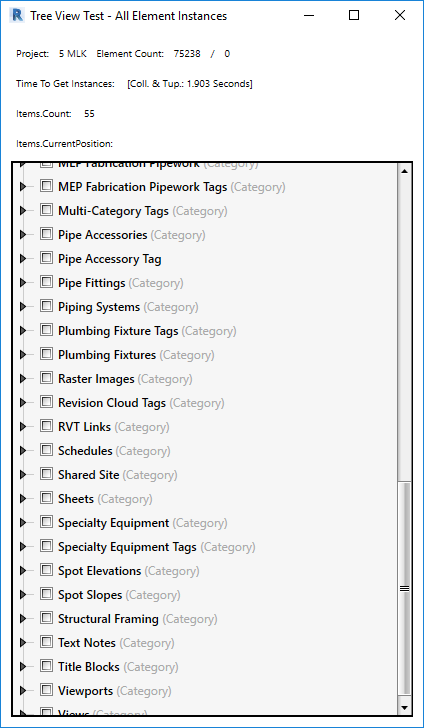
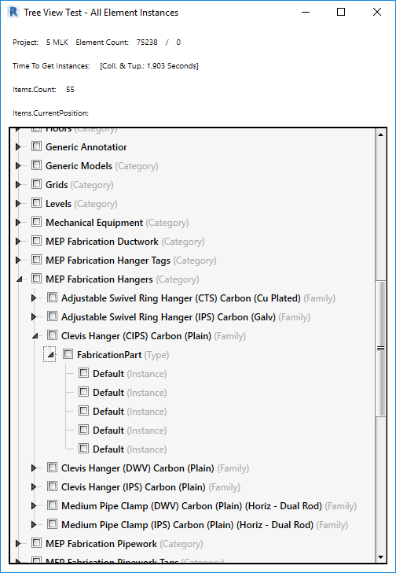

<head>
<meta http-equiv="Content-Type" content="text/html; charset=utf-8">
<link rel="stylesheet" type="text/css" href="bc.css">

</head>

<!---

- naveen second top solution author

- patrick.emin
  [Use a form in Revit API](https://forums.autodesk.com/t5/revit-api-forum/use-a-form-in-revit-api/m-p/8617102)
  Bonjour, pour votre information, nous avons un forum en français: https://forums.autodesk.com/t5/revit-et-bim-francais/bd-p/198
  [Revit et BIM - Français](https://forums.autodesk.com/t5/revit-et-bim-francais/bd-p/198)
  Bienvenue sur les forums Revit d’Autodesk. Partagez vos connaissances, posez des questions, collaborez sur des idées, et explorez les sujets Revit populaires.

- 15089827 [WPF - Window With TreeView - Slow Load With Virtualization]
  https://forums.autodesk.com/t5/revit-api-forum/wpf-window-with-treeview-slow-load-with-virtualization/m-p/8609110
  performance

twitter:

Forum Français and treeview performance in the #RevitAPI @AutodeskForge @AutodeskRevit #bim #DynamoBim #ForgeDevCon http://bit.ly/treeviewperformance

As usual, I have been much too active in the Revit API discussion forum recently and worked too little for my taste here in the blog.
Here are some of the recent items that I want to share plus a few pictures from my latest mountain outing
&ndash; Marat's shapka ushanka and Balmer's Graetli
&ndash; Naveen is a top solution author now
&ndash; Revit et BIM en Français
&ndash; Tree view performance optimisation
&ndash; Underture...

linkedin:

Forum Français and treeview performance in the #RevitAPI @AutodeskForge @AutodeskRevit #bim #DynamoBim #ForgeDevCon http://bit.ly/treeviewperformance

As usual, I have been a bit too active in the Revit API discussion forum recently and worked too little for my taste here in the blog.
Here are some of the recent items that I want to share plus a few pictures from my latest mountain outing
- Marat's shapka ushanka and Balmer's Graetli
- Naveen is a top solution author now
- Revit et BIM en Français
- Tree view performance optimisation
- Underture...

of [The Building Coder samples](https://github.com/jeremytammik/the_building_coder_samples/releases/tag/2019.0.145.4).

-->

### Forum Français and Treeview Performance

As usual, I have been much too active in 
the [Revit API discussion forum](http://forums.autodesk.com/t5/revit-api-forum/bd-p/160) recently
and worked too little for my taste here in the blog.

Here are some of the recent items that I want to share plus a few pictures from my latest mountain outing:

- [Marat's shapka ushanka and Balmer's Graetli](#2) 
- [Naveen is a top solution author now](#3) 
- [Revit et BIM en Français](#4) 
- [Tree view performance optimisation](#5) 
- [Underture](#6) 

####  Marat's Shapka Ushanka and Balmer's Graetli

Here is a picture from a little ski tour to Balmer's Graetli
in [Muotathal](https://en.wikipedia.org/wiki/Muotathal) last Sunday,
sporting a nice new warm fur hat with ear flaps,
aka [shapka ushanka](https://en.wikipedia.org/wiki/Ushanka),
that my ex-Autodesk-colleague Marat got me:

You can see more photos from the tour in my [Balmer's Graetli album](https://flic.kr/s/aHsmyTUkrv).

Many thanks to Marat for the hat and to Conny for the nice destination!

More and longer ski tours are planned for the end of March and April.

####  Naveen is a Top Solution Author Now

Congratulations to my Indian Colleague Naveen Kumar T. for reaching place two in the list of top solution authors!

I am really looking forward to the day he overtakes me!
 
Thank you ever so much, Naveen, for all the hard work and great success!

####  Revit et BIM en Français

Another discussion forum related news item:

For your information, Patrick Emin recently pointed out the new French language Revit and BIM discussion forum in the thread
on [using a form in Revit API](https://forums.autodesk.com/t5/revit-api-forum/use-a-form-in-revit-api/m-p/8617102):

> Bonjour, pour votre information, nous avons un forum en français:
[Revit et BIM &ndash; Français](https://forums.autodesk.com/t5/revit-et-bim-francais/bd-p/198)
&ndash; [forums.autodesk.com/t5/revit-et-bim-francais/bd-p/198](https://forums.autodesk.com/t5/revit-et-bim-francais/bd-p/198)

> <i>Bienvenue sur les forums Revit d’Autodesk.
Partagez vos connaissances, posez des questions, collaborez sur des idées, et explorez les sujets Revit populaires.</i>

####  Tree View Performance Optimisation

Let's return to a more technical Revit API oriented topic in the thread
on a [WPF window with treeview and slow load with virtualization](https://forums.autodesk.com/t5/revit-api-forum/wpf-window-with-treeview-slow-load-with-virtualization/m-p/8622528):

**Question:** 

A tool I'm building has a TreeView control that will show all element instances in a Project/Active/Selection.

The problem is that even with UI virtualization the window load times are far too long.

I'm not sure what to suspect now and am hoping one of the community has run across this.

Some examples of window load times below.

- Project with around 150,000 model Element Instances it takes about 2 minutes to build.
- Project with around 66,000 model Element Instances it takes about a minute to build
- Project with less than 400 model Element Instances it takes about 5 seconds to build

Here is some additional pertinent information .

- I'm using WPF / XAML / MVVM / C# to build it.
- I've timed the Filtered Element Collectors and found they are incredible fast and don't seem to be the issue.
- I've submitted a support ticket to Telerik which only confirmed that the code should be working and does outside of Revit where I can create 180000 objects into 4 tiers in seconds.
- There are 4 tiers (See screenshot 1) of data arranged in the following manner:
    - Tier 1: Category
    - Tier 2: Family Name
    - Tier 3: Type
    - Tier 4: Instance
- The TreeView is initially fully collapsed with only the first tier showing.
- I've enabled UI Virtualization to show more as a user expands each node.
- I've attached a zip file with the code in question

Screenshot #1:

Screenshot #2:

Here is [TreeViewAllElementInstances.zip containing my sample code](zip/wpf_treeview_all_element_instances.zip).

**Answer:** I would suggest initially populating only the Tier 1, and then populating the other ones and their subnodes on demand when clicked by the user to open them.

If a specific node is never opened, there is no need to ever load its subnodes.

I am sure such techniques have already been implemented and published in the past.

In fact, I see a large number of solutions when searching the Internet for [populate tree view on demand](https://duckduckgo.com/?q=populate+tree+view+on+demand).

**Response:** Jeremy, thank you for your suggestions and for continuing to help me and the community!

Much has happened since last Wednesday and I can report back that I now have a virtualized TreeView which quickly handles projects with 200,000+ model elements!

I will gladly share this solution with any needing it so if you're interested please contact me.

Initially, my inexperience drove me to go the 'safe' route towards populating the TreeView, but on Thursday, I deleted most of what I'd done and fully embraced MVVM and working with Objects, in an object, in an object, in an object! Was a mind melter for me but it really paid off!

The method below is truly the meat of the solution and along with the XAML in the previously attached ZIP file make it work. Way shorter and simpler than I thought it would be.

<pre class="code">private&nbsp;static&nbsp;void&nbsp;InitializeDataSource()
{
&nbsp;&nbsp;Tier1CategoryNames&nbsp;=&nbsp;new&nbsp;ObservableCollection&lt;Tier1Object&gt;();
&nbsp;&nbsp;Tier1Object&nbsp;tier1Object&nbsp;=&nbsp;null;
&nbsp;&nbsp;Tier2Object&nbsp;tier2Object&nbsp;=&nbsp;null;
&nbsp;&nbsp;Tier3Object&nbsp;tier3Object&nbsp;=&nbsp;null;
&nbsp;&nbsp;Tier4Object&nbsp;tier4Object&nbsp;=&nbsp;null;
 
&nbsp;&nbsp;foreach(&nbsp;var&nbsp;revitElementInstance&nbsp;in&nbsp;_revitElementInstances&nbsp;)
&nbsp;&nbsp;{
&nbsp;&nbsp;&nbsp;&nbsp;//&nbsp;##########&nbsp;Tier&nbsp;1&nbsp;Start&nbsp;##########
&nbsp;&nbsp;&nbsp;&nbsp;var&nbsp;currentCategoryName&nbsp;=&nbsp;revitElementInstance.Category.Name;
 
&nbsp;&nbsp;&nbsp;&nbsp;if(&nbsp;Tier1CategoryNames.Count&nbsp;==&nbsp;0&nbsp;
&nbsp;&nbsp;&nbsp;&nbsp;&nbsp;&nbsp;||&nbsp;Tier1CategoryNames.All(&nbsp;tier1Object1
&nbsp;&nbsp;&nbsp;&nbsp;&nbsp;&nbsp;&nbsp;&nbsp;=&gt;&nbsp;tier1Object1.Tier1CategoryName&nbsp;!=&nbsp;currentCategoryName&nbsp;)&nbsp;)
&nbsp;&nbsp;&nbsp;&nbsp;{
&nbsp;&nbsp;&nbsp;&nbsp;&nbsp;&nbsp;Tier1CategoryNames.Add(&nbsp;tier1Object&nbsp;
&nbsp;&nbsp;&nbsp;&nbsp;&nbsp;&nbsp;&nbsp;&nbsp;=&nbsp;new&nbsp;Tier1Object(&nbsp;currentCategoryName&nbsp;)&nbsp;);
&nbsp;&nbsp;&nbsp;&nbsp;}
 
&nbsp;&nbsp;&nbsp;&nbsp;//&nbsp;##########&nbsp;Tier&nbsp;2&nbsp;Start&nbsp;##########
&nbsp;&nbsp;&nbsp;&nbsp;var&nbsp;currentFamilyName&nbsp;=&nbsp;revitElementInstance.FamilyName;
 
&nbsp;&nbsp;&nbsp;&nbsp;if(&nbsp;tier1Object.Tier2FamilyNames.Count&nbsp;==&nbsp;0&nbsp;
&nbsp;&nbsp;&nbsp;&nbsp;&nbsp;&nbsp;||&nbsp;tier1Object.Tier2FamilyNames.All(&nbsp;tier2Object1&nbsp;
&nbsp;&nbsp;&nbsp;&nbsp;&nbsp;&nbsp;&nbsp;&nbsp;=&gt;&nbsp;tier2Object1.Tier2FamilyName&nbsp;!=&nbsp;currentFamilyName&nbsp;)&nbsp;)
&nbsp;&nbsp;&nbsp;&nbsp;{
&nbsp;&nbsp;&nbsp;&nbsp;&nbsp;&nbsp;tier1Object.Tier2FamilyNames.Add(&nbsp;tier2Object&nbsp;
&nbsp;&nbsp;&nbsp;&nbsp;&nbsp;&nbsp;&nbsp;&nbsp;=&nbsp;new&nbsp;Tier2Object(&nbsp;currentFamilyName&nbsp;)&nbsp;);
&nbsp;&nbsp;&nbsp;&nbsp;}
 
&nbsp;&nbsp;&nbsp;&nbsp;//&nbsp;##########&nbsp;Tier&nbsp;3&nbsp;Start&nbsp;##########
&nbsp;&nbsp;&nbsp;&nbsp;var&nbsp;currentElementTypeName&nbsp;=&nbsp;revitElementInstance.ElementType.Name;
 
&nbsp;&nbsp;&nbsp;&nbsp;if(&nbsp;tier2Object.Tier3ElementTypeNames.Count&nbsp;==&nbsp;0&nbsp;
&nbsp;&nbsp;&nbsp;&nbsp;&nbsp;&nbsp;||&nbsp;tier2Object.Tier3ElementTypeNames.All(&nbsp;tier3Object1&nbsp;
&nbsp;&nbsp;&nbsp;&nbsp;&nbsp;&nbsp;&nbsp;&nbsp;=&gt;&nbsp;tier3Object1.Tier3ElementTypeName&nbsp;!=&nbsp;currentElementTypeName&nbsp;)&nbsp;)
&nbsp;&nbsp;&nbsp;&nbsp;{
&nbsp;&nbsp;&nbsp;&nbsp;&nbsp;&nbsp;tier2Object.Tier3ElementTypeNames.Add(&nbsp;tier3Object&nbsp;
&nbsp;&nbsp;&nbsp;&nbsp;&nbsp;&nbsp;&nbsp;&nbsp;=&nbsp;new&nbsp;Tier3Object(&nbsp;currentElementTypeName&nbsp;)&nbsp;);
&nbsp;&nbsp;&nbsp;&nbsp;}
 
&nbsp;&nbsp;&nbsp;&nbsp;//&nbsp;##########&nbsp;Tier&nbsp;4&nbsp;Start&nbsp;##########
&nbsp;&nbsp;&nbsp;&nbsp;var&nbsp;currentElementInstanceName&nbsp;=&nbsp;revitElementInstance.ElementInstance.Name;
 
&nbsp;&nbsp;&nbsp;&nbsp;tier3Object.Tier4ElementInstanceNames.Add(&nbsp;tier4Object&nbsp;
&nbsp;&nbsp;&nbsp;&nbsp;&nbsp;&nbsp;=&nbsp;new&nbsp;Tier4Object(&nbsp;currentElementInstanceName&nbsp;)&nbsp;);
&nbsp;&nbsp;}
}
</pre>

Congratulations on the brilliant result and many thanks to Chris for sharing the solution!

####  Underture

Unrelated to the Revit API and technology, you might be interested
in [Underture](https://youtu.be/JJvDaBhofyc), 
a truly beautiful two-minute underwater video
by [LaughingEelVideo](https://www.youtube.com/channel/UCdD9nAv0ITzU-fiZr8cEXNw) with
masses of fascinating creatures filmed in Indonesia to the music
of [The Barber of Seville](https://en.wikipedia.org/wiki/The_Barber_of_Seville)
by [Gioachino Rossini](https://en.wikipedia.org/wiki/Gioachino_Rossini):

> Sometimes, being underwater feels like a window on the world's biggest stage.
Here's a bouncy 4K introduction to some of its principal characters, shot in Indonesia: Komodo, Ambon, Raja Ampat, and Bali.

<iframe width="560" height="315" src="https://www.youtube.com/embed/JJvDaBhofyc" frameborder="0" allow="accelerometer; autoplay; encrypted-media; gyroscope; picture-in-picture" allowfullscreen></iframe>

