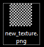
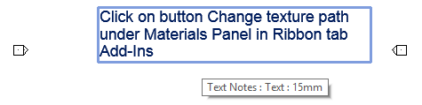
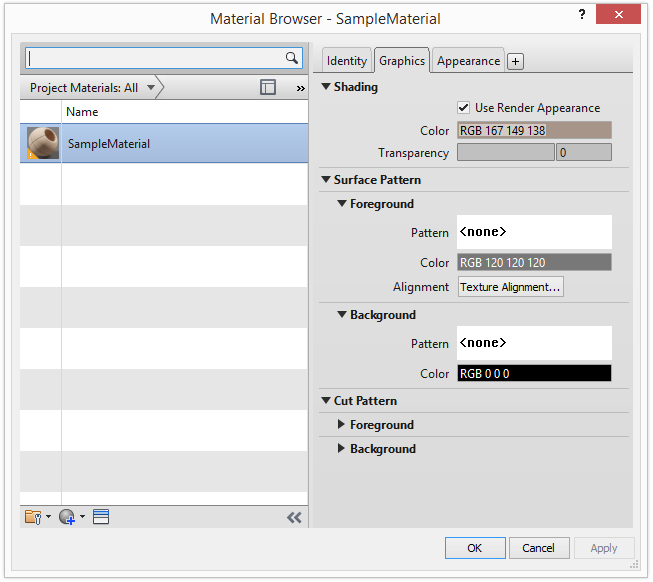
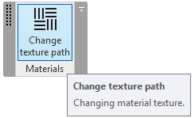
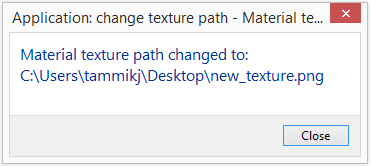
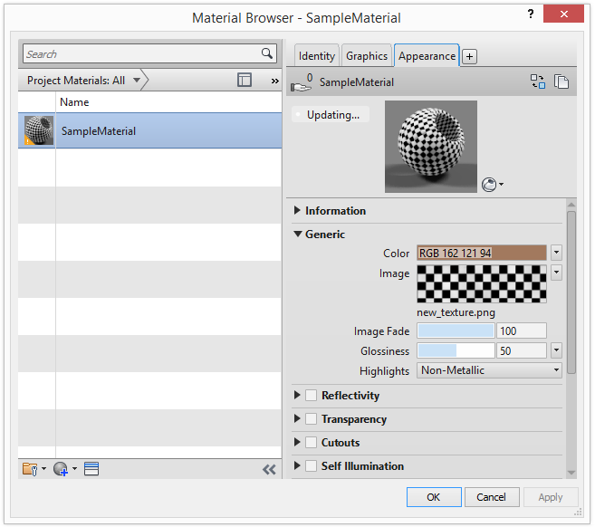

<head>
<meta http-equiv="Content-Type" content="text/html; charset=utf-8">
<link rel="stylesheet" type="text/css" href="bc.css">

</head>

<!---

twitter:

Setting the material texture path in EditScope in the #RevitAPI @AutodeskForge @AutodeskRevit #bim #DynamoBim #ForgeDevCon http://bit.ly/texturepath

Lukáš Kohout brought up an interesting and important issue on changing material texture path with <code>EditScope</code>
&ndash; How to set the material texture path?
&ndash; Suggestions
&ndash; Solution and sample material
&ndash; <code>ChangeRenderingTexturePath</code> method
&ndash; Step by step guide
&ndash; Test run...

linkedin:

Setting the material texture path in EditScope in the #RevitAPI @AutodeskForge @AutodeskRevit #bim #DynamoBim #ForgeDevCon http://bit.ly/texturepath

Lukáš Kohout brought up an interesting and important issue on changing material texture path with EditScope:

- How to set the material texture path?
- Suggestions
- Solution and sample material
- <code>ChangeRenderingTexturePath</code> method
- Step by step guide
- Test run...

-->

### Set Material Texture Path in EditScope

Lukáš [kohoulu3](https://forums.autodesk.com/t5/user/viewprofilepage/user-id/767846) Kohout
brought up an interesting and important issue in 
the [Revit API discussion forum](http://forums.autodesk.com/t5/revit-api-forum/bd-p/160) thread
on [changing material texture path with `EditScope`](https://forums.autodesk.com/t5/revit-api-forum/changing-material-texture-path-with-editscope/m-p/8017578) that
I wanted to highlight last year. Here it is, finally:

- [How to set the material texture path?](#2) 
- [Suggestions](#3) 
- [Solution and sample material](#4) 
- [`ChangeRenderingTexturePath` method](#5) 
- [Step by step guide](#6) 
- [Test run](#7) 
 
####  How to Set the Material Texture Path?

I am trying to set material texture path using following code (Revit 2018):

<pre class="code">
&nbsp;&nbsp;public&nbsp;void&nbsp;ChangeRenderingTexturePath(&nbsp;
&nbsp;&nbsp;&nbsp;&nbsp;Material&nbsp;mat,&nbsp;
&nbsp;&nbsp;&nbsp;&nbsp;Document&nbsp;doc,
&nbsp;&nbsp;&nbsp;&nbsp;string&nbsp;texturePath&nbsp;)
&nbsp;&nbsp;{
&nbsp;&nbsp;&nbsp;&nbsp;AppearanceAssetElement&nbsp;appearanceAsset
&nbsp;&nbsp;&nbsp;&nbsp;&nbsp;&nbsp;=&nbsp;(AppearanceAssetElement)&nbsp;doc.GetElement(
&nbsp;&nbsp;&nbsp;&nbsp;&nbsp;&nbsp;&nbsp;&nbsp;mat.AppearanceAssetId&nbsp;);
 
&nbsp;&nbsp;&nbsp;&nbsp;Asset&nbsp;renderingAsset&nbsp;=&nbsp;appearanceAsset
&nbsp;&nbsp;&nbsp;&nbsp;&nbsp;&nbsp;.GetRenderingAsset();
 
&nbsp;&nbsp;&nbsp;&nbsp;int&nbsp;size&nbsp;=&nbsp;renderingAsset.Size;
&nbsp;&nbsp;&nbsp;&nbsp;for(&nbsp;int&nbsp;assetIdx&nbsp;=&nbsp;0;&nbsp;assetIdx&nbsp;&lt;&nbsp;size;&nbsp;assetIdx++&nbsp;)
&nbsp;&nbsp;&nbsp;&nbsp;{
&nbsp;&nbsp;&nbsp;&nbsp;&nbsp;&nbsp;AssetProperty&nbsp;aProperty&nbsp;=&nbsp;renderingAsset[assetIdx];
 
&nbsp;&nbsp;&nbsp;&nbsp;&nbsp;&nbsp;if(&nbsp;aProperty.NumberOfConnectedProperties&nbsp;&lt;&nbsp;1&nbsp;)
&nbsp;&nbsp;&nbsp;&nbsp;&nbsp;&nbsp;&nbsp;&nbsp;continue;
 
&nbsp;&nbsp;&nbsp;&nbsp;&nbsp;&nbsp;Asset&nbsp;connectedAsset&nbsp;=&nbsp;aProperty.GetConnectedProperty(
&nbsp;&nbsp;&nbsp;&nbsp;&nbsp;&nbsp;&nbsp;&nbsp;0&nbsp;)&nbsp;as&nbsp;Asset;
 
&nbsp;&nbsp;&nbsp;&nbsp;&nbsp;&nbsp;if(&nbsp;connectedAsset.Name&nbsp;==&nbsp;&quot;UnifiedBitmapSchema&quot;&nbsp;)
&nbsp;&nbsp;&nbsp;&nbsp;&nbsp;&nbsp;{
&nbsp;&nbsp;&nbsp;&nbsp;&nbsp;&nbsp;&nbsp;&nbsp;AssetPropertyString&nbsp;path&nbsp;=&nbsp;connectedAsset.FindByName(&nbsp;
&nbsp;&nbsp;&nbsp;&nbsp;&nbsp;&nbsp;&nbsp;&nbsp;&nbsp;&nbsp;UnifiedBitmap.UnifiedbitmapBitmap&nbsp;)
&nbsp;&nbsp;&nbsp;&nbsp;&nbsp;&nbsp;&nbsp;&nbsp;&nbsp;&nbsp;&nbsp;&nbsp;as&nbsp;AssetPropertyString;
 
&nbsp;&nbsp;&nbsp;&nbsp;&nbsp;&nbsp;&nbsp;&nbsp;using(&nbsp;AppearanceAssetEditScope&nbsp;editScope&nbsp;
&nbsp;&nbsp;&nbsp;&nbsp;&nbsp;&nbsp;&nbsp;&nbsp;&nbsp;&nbsp;=&nbsp;new&nbsp;AppearanceAssetEditScope(&nbsp;doc&nbsp;)&nbsp;)
&nbsp;&nbsp;&nbsp;&nbsp;&nbsp;&nbsp;&nbsp;&nbsp;{
&nbsp;&nbsp;&nbsp;&nbsp;&nbsp;&nbsp;&nbsp;&nbsp;&nbsp;&nbsp;Asset&nbsp;editableAsset&nbsp;=&nbsp;editScope.Start(&nbsp;
&nbsp;&nbsp;&nbsp;&nbsp;&nbsp;&nbsp;&nbsp;&nbsp;&nbsp;&nbsp;&nbsp;&nbsp;mat.AppearanceAssetId&nbsp;);
 
&nbsp;&nbsp;&nbsp;&nbsp;&nbsp;&nbsp;&nbsp;&nbsp;&nbsp;&nbsp;//&nbsp;Exception&nbsp;thrown,&nbsp;asset&nbsp;is&nbsp;read&nbsp;only,&nbsp;
&nbsp;&nbsp;&nbsp;&nbsp;&nbsp;&nbsp;&nbsp;&nbsp;&nbsp;&nbsp;//&nbsp;need&nbsp;to&nbsp;use&nbsp;editScope
 
&nbsp;&nbsp;&nbsp;&nbsp;&nbsp;&nbsp;&nbsp;&nbsp;&nbsp;&nbsp;path.Value&nbsp;=&nbsp;texturePath;
&nbsp;&nbsp;&nbsp;&nbsp;&nbsp;&nbsp;&nbsp;&nbsp;&nbsp;&nbsp;editScope.Commit(&nbsp;true&nbsp;);
&nbsp;&nbsp;&nbsp;&nbsp;&nbsp;&nbsp;&nbsp;&nbsp;}
&nbsp;&nbsp;&nbsp;&nbsp;&nbsp;&nbsp;}
&nbsp;&nbsp;&nbsp;&nbsp;}
&nbsp;&nbsp;}
</pre>

I know that editScope accepts only ElementId (specifically AppearanceElementAsset.Id), but with this I cannot get to edit the texture path that is saved in `RenderingAsset` of the `AppearanceAsset`.

Do anyone know any way to get around this?

Finally, we can create materials with API, but without textures? Does not make sense.

I am using the latest Revit 2018 API with the asset editing functionality included.

I am able to duplicate and edit `AppearanceAsset`.

I have searched The Building Coder and read both the relevant posts:

- [Modifying Material Visual Appearance](http://thebuildingcoder.typepad.com/blog/2017/11/modifying-material-visual-appearance.html)
- [Material Texture Path](http://thebuildingcoder.typepad.com/blog/2017/10/material-texture-path.html)

The way I obtain the current texture path is taken directly from the latter.

Problem with the texture path as I see it is, that it is not directly contained in the `AppearanceAsset` but in the connected `RenderingAsset`. And to that I cannot get through the `EditScope`. `RenderingAsset` has no `ElementId` and cannot be used in the `AppearanceAssetEditScope.Start` function.

Exception message:

<pre>
  An exception of type 'Autodesk.Revit.Exceptions.InvalidOperationException' occurred in RevitAPI.dll but was not handled in user code.
  Additional information: The asset property is not editable. Asset can be edited only in an edit scope.
</pre>

Problem is that the returned asset from `AppearanceAssetEditScope.Start` does not contain the desired `UnifiedBitmapSchema` property. That property is contained only in the `RenderingAsset`.

####  Suggestions

The only editable asset inside the edit scope is the one returned from `AppearanceAssetEditScope.Start`, and those connected assets which it directly returns.
 
I think if you reverse your code and get the `UnifiedBitmapSchema` from the returned asset from `Start`, you will be able to change it.

I'd recommend starting from the code snippet which shows how to do this, available from the [help documentation on `GetSingleConnectedAsset`](Http://www.revitapidocs.com/2018.1/3a190829-9269-0e56-8b9b-a53b89de35a6.htm).

####  Solution and Sample Material

Thanks Jeremy. Finally, I got it to work. It was quite simple, actually, in the end.

There is just one small change from the code snippet I posted at first.

Here is the (MaterialTexturePath.zip archive)[zip/lk_MaterialTexturePath.zip] containing
the entire sample Visual Studio solution with detailed guide as well as a sample project and texture to demonstrate.

I hope that someone finds this useful.

####  ChangeRenderingTexturePath Method

Here is the final code:

<pre class="code">
&nbsp;&nbsp;void&nbsp;ChangeRenderingTexturePath(&nbsp;
&nbsp;&nbsp;&nbsp;&nbsp;Document&nbsp;doc&nbsp;)
&nbsp;&nbsp;{
&nbsp;&nbsp;&nbsp;&nbsp;//&nbsp;As&nbsp;there&nbsp;is&nbsp;only&nbsp;one&nbsp;material&nbsp;in&nbsp;the&nbsp;sample&nbsp;
&nbsp;&nbsp;&nbsp;&nbsp;//&nbsp;project,&nbsp;we&nbsp;can&nbsp;use&nbsp;FilteredElementCollector&nbsp;
&nbsp;&nbsp;&nbsp;&nbsp;//&nbsp;and&nbsp;grab&nbsp;the&nbsp;first&nbsp;result
 
&nbsp;&nbsp;&nbsp;&nbsp;Material&nbsp;mat&nbsp;=&nbsp;new&nbsp;FilteredElementCollector(&nbsp;doc&nbsp;)
&nbsp;&nbsp;&nbsp;&nbsp;&nbsp;&nbsp;.OfClass(&nbsp;typeof(&nbsp;Material&nbsp;)&nbsp;)
&nbsp;&nbsp;&nbsp;&nbsp;&nbsp;&nbsp;.FirstElement()&nbsp;as&nbsp;Material;
 
&nbsp;&nbsp;&nbsp;&nbsp;//&nbsp;Fixed&nbsp;path&nbsp;for&nbsp;new&nbsp;texture
&nbsp;&nbsp;&nbsp;&nbsp;//&nbsp;Texture&nbsp;included&nbsp;in&nbsp;sample&nbsp;files
 
&nbsp;&nbsp;&nbsp;&nbsp;string&nbsp;texturePath&nbsp;=&nbsp;Path.Combine(&nbsp;
&nbsp;&nbsp;&nbsp;&nbsp;&nbsp;&nbsp;Environment.GetFolderPath(&nbsp;Environment.SpecialFolder.Desktop&nbsp;),&nbsp;
&nbsp;&nbsp;&nbsp;&nbsp;&nbsp;&nbsp;&quot;new_texture.png&quot;&nbsp;);
 
&nbsp;&nbsp;&nbsp;&nbsp;using(&nbsp;Transaction&nbsp;t&nbsp;=&nbsp;new&nbsp;Transaction(&nbsp;doc&nbsp;)&nbsp;)
&nbsp;&nbsp;&nbsp;&nbsp;{
&nbsp;&nbsp;&nbsp;&nbsp;&nbsp;&nbsp;t.Start(&nbsp;&quot;Changing&nbsp;material&nbsp;texture&nbsp;path&quot;&nbsp;);
 
&nbsp;&nbsp;&nbsp;&nbsp;&nbsp;&nbsp;using(&nbsp;AppearanceAssetEditScope&nbsp;editScope&nbsp;
&nbsp;&nbsp;&nbsp;&nbsp;&nbsp;&nbsp;&nbsp;&nbsp;=&nbsp;new&nbsp;AppearanceAssetEditScope(&nbsp;doc&nbsp;)&nbsp;)
&nbsp;&nbsp;&nbsp;&nbsp;&nbsp;&nbsp;{
&nbsp;&nbsp;&nbsp;&nbsp;&nbsp;&nbsp;&nbsp;&nbsp;Asset&nbsp;editableAsset&nbsp;=&nbsp;editScope.Start(&nbsp;
&nbsp;&nbsp;&nbsp;&nbsp;&nbsp;&nbsp;&nbsp;&nbsp;&nbsp;&nbsp;mat.AppearanceAssetId&nbsp;);
 
&nbsp;&nbsp;&nbsp;&nbsp;&nbsp;&nbsp;&nbsp;&nbsp;//&nbsp;Getting&nbsp;the&nbsp;correct&nbsp;AssetProperty
#if&nbsp;VERSION2018
&nbsp;&nbsp;&nbsp;&nbsp;&nbsp;&nbsp;&nbsp;&nbsp;AssetProperty&nbsp;assetProperty&nbsp;
&nbsp;&nbsp;&nbsp;&nbsp;&nbsp;&nbsp;&nbsp;&nbsp;&nbsp;&nbsp;=&nbsp;editableAsset[&quot;generic_diffuse&quot;];
#elif&nbsp;VERSION2019
&nbsp;&nbsp;&nbsp;&nbsp;&nbsp;&nbsp;&nbsp;&nbsp;&nbsp;&nbsp;AssetProperty&nbsp;assetProperty&nbsp;
&nbsp;&nbsp;&nbsp;&nbsp;&nbsp;&nbsp;&nbsp;&nbsp;&nbsp;&nbsp;=&nbsp;editableAsset.FindByName(&quot;generic_diffuse&quot;);
#endif
 
&nbsp;&nbsp;&nbsp;&nbsp;&nbsp;&nbsp;&nbsp;&nbsp;Asset&nbsp;connectedAsset&nbsp;=&nbsp;assetProperty
&nbsp;&nbsp;&nbsp;&nbsp;&nbsp;&nbsp;&nbsp;&nbsp;&nbsp;&nbsp;.GetConnectedProperty(&nbsp;0&nbsp;)&nbsp;as&nbsp;Asset;
 
&nbsp;&nbsp;&nbsp;&nbsp;&nbsp;&nbsp;&nbsp;&nbsp;//&nbsp;Getting&nbsp;the&nbsp;right&nbsp;connected&nbsp;Asset
 
&nbsp;&nbsp;&nbsp;&nbsp;&nbsp;&nbsp;&nbsp;&nbsp;if(&nbsp;connectedAsset.Name&nbsp;==&nbsp;&quot;UnifiedBitmapSchema&quot;&nbsp;)
&nbsp;&nbsp;&nbsp;&nbsp;&nbsp;&nbsp;&nbsp;&nbsp;{
&nbsp;&nbsp;&nbsp;&nbsp;&nbsp;&nbsp;&nbsp;&nbsp;&nbsp;&nbsp;AssetPropertyString&nbsp;path&nbsp;
&nbsp;&nbsp;&nbsp;&nbsp;&nbsp;&nbsp;&nbsp;&nbsp;&nbsp;&nbsp;&nbsp;&nbsp;=&nbsp;connectedAsset.FindByName(&nbsp;
&nbsp;&nbsp;&nbsp;&nbsp;&nbsp;&nbsp;&nbsp;&nbsp;&nbsp;&nbsp;&nbsp;&nbsp;&nbsp;&nbsp;UnifiedBitmap.UnifiedbitmapBitmap&nbsp;)&nbsp;
&nbsp;&nbsp;&nbsp;&nbsp;&nbsp;&nbsp;&nbsp;&nbsp;&nbsp;&nbsp;&nbsp;&nbsp;&nbsp;&nbsp;&nbsp;&nbsp;as&nbsp;AssetPropertyString;
 
&nbsp;&nbsp;&nbsp;&nbsp;&nbsp;&nbsp;&nbsp;&nbsp;&nbsp;&nbsp;if(&nbsp;path.IsValidValue(&nbsp;texturePath&nbsp;)&nbsp;)
&nbsp;&nbsp;&nbsp;&nbsp;&nbsp;&nbsp;&nbsp;&nbsp;&nbsp;&nbsp;&nbsp;&nbsp;path.Value&nbsp;=&nbsp;texturePath;
&nbsp;&nbsp;&nbsp;&nbsp;&nbsp;&nbsp;&nbsp;&nbsp;}
&nbsp;&nbsp;&nbsp;&nbsp;&nbsp;&nbsp;&nbsp;&nbsp;editScope.Commit(&nbsp;true&nbsp;);
&nbsp;&nbsp;&nbsp;&nbsp;&nbsp;&nbsp;}
&nbsp;&nbsp;&nbsp;&nbsp;&nbsp;&nbsp;TaskDialog.Show(&nbsp;&quot;Material&nbsp;texture&nbsp;path&quot;,&nbsp;
&nbsp;&nbsp;&nbsp;&nbsp;&nbsp;&nbsp;&nbsp;&nbsp;&quot;Material&nbsp;texture&nbsp;path&nbsp;changed&nbsp;to:\n&quot;&nbsp;
&nbsp;&nbsp;&nbsp;&nbsp;&nbsp;&nbsp;&nbsp;&nbsp;+&nbsp;texturePath&nbsp;);
 
&nbsp;&nbsp;&nbsp;&nbsp;&nbsp;&nbsp;t.Commit();
&nbsp;&nbsp;&nbsp;&nbsp;&nbsp;&nbsp;t.Dispose();
&nbsp;&nbsp;&nbsp;&nbsp;}
&nbsp;&nbsp;}
</pre>

####  Step by Step Guide

Here are the steps to reproduce the solution:

Goal:

- I want to create materials in Revit programmatically, so would not have to create thousands of materials (NCS palette) by hand.

That is quite simple with the new Revit 2018.1 API and the sample code provided.

Furthermore, for some materials, I want to change the texture as well, and that was bit of a problem.

Solution:

- Retrieve the "generic_diffuse" `AssetProperty` from the asset returned from `AppearanceAssetEditScope.Start`.
- Retrieve the first `ConnectedProperty` as `Asset`.
- From that, retrieve the `UnifiedBitmap.UnifiedbitmapBitmap` `AssetPropertyString`.
- Set its value.

Guide to reproduce the solution:

1. Open MaterialTexturePath.sln in Visual Studio.
2. Reload references RevitAPI.dll, RevitAPIUI.dll and RevitAddinUtility.dll from your local folder (usually, where you have Revit installed).
3. Build the project for the Revit version you want; works only for Revit 2018 and Revit 2019.
4. Copy contents of the output folder to *C:\ProgramData\Autodesk\Revit\Addins\&lt;revit_version&gt;*.
5. Copy the sample texture (new_texture.png file) to your desktop.
6. Open the sample project.
7. Go to Manage/Materials and see the texture path in the only present material in the project.
8. Navigate to the Add-Ins ribbon tab and click the Change texture path button.
9. Go to Manage/Materials again and note that the texture path changed.

####  Test Run

Here are screen snapshots illustrating some of the steps from my test run:

Store the sample texture file on desktop:

Open the sample model and observe the instructions:

The sample model contains one single sample material:

Click the sample command in its custom ribbon panel:

The add-in displays a message on completion:

The sample material texture is updated:

Many thanks to Lukáš for his research, putting together and documenting this sample so well!
