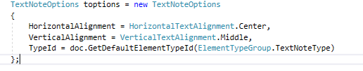

<head>
<meta http-equiv="Content-Type" content="text/html; charset=utf-8">
<link rel="stylesheet" type="text/css" href="bc.css">

</head>

<!---

- don't trust the family instance location point
  [Element Location property value is far from the element bounding box](https://forums.autodesk.com/t5/revit-api-forum/element-location-property-value-is-far-from-the-element-bounding/m-p/8762611)

- find by name element type, family symbol, text note type
  15324672 [Creating a TextNote with a specific Type (i.e 1/10" Arial, 1/10" Monospace...)]
  https://forums.autodesk.com/t5/revit-api-forum/creating-a-textnote-with-a-specific-type-i-e-1-10-quot-arial-1/m-p/8765648

- delete non-room-separator lines
  15324372 [Deleting Lines that are not assigned to the <Room Separation> subcategory]
  https://forums.autodesk.com/t5/revit-api-forum/deleting-lines-that-are-not-assigned-to-the-lt-room-separation/m-p/8765491

twitter:

Location point and filtering hints for the #RevitAPI @AutodeskForge @AutodeskRevit #bim #DynamoBim #ForgeDevCon http://bit.ly/locpntfilter

I am probably doomed to spend the rest of my life telling people not to unnecessarily apply <code>ToList</code> to a filtered element collector.
It happened several times again today answering questions in the Revit API discussion forum
&ndash; Don't trust the family instance location point
&ndash; Searching by name for element type and text note type
&ndash; Searching using a negated category filter...

linkedin:

Location point and filtering hints for the #RevitAPI #bim #DynamoBim #ForgeDevCon #Revit #API #IFC #SDK #AI #VisualStudio #Autodesk #AEC #adsk

http://bit.ly/locpntfilter

I am probably doomed to spend the rest of my life telling people not to unnecessarily apply ToList to a filtered element collector.

It happened several times again today answering questions in the Revit API discussion forum:

- Don't trust the family instance location point
- Searching by name for element type and text note type
- Searching using a negated category filter...

-->

### Location Point and Filtering Hints

I am probably doomed to spend the rest of my life telling people not to unnecessarily apply `ToList` to a filtered element collector.

It happened several times again today answering questions in 
the [Revit API discussion forum](http://forums.autodesk.com/t5/revit-api-forum/bd-p/160):

- [Don't trust the family instance location point](#2) 
- [Searching by name for element type and text note type](#3) 
- [Searching using a negated category filter](#4) 

#### Don't Trust the Family Instance Location Point

The first issue is not directly related to filtering, however; Benoit explains why
the [element `Location` property value is far from the element bounding box](https://forums.autodesk.com/t5/revit-api-forum/element-location-property-value-is-far-from-the-element-bounding/m-p/8762611):

**Question:** I have a FamilyInstance element.
I'm trying to determine its location (X,Y,Z) coordinates.
The value that is returned is ca. (33, -86, 0).
The true location of the element is ca. (-153, -32, 58).
It doesn't seem to be related to the document Transform since it doesn't fix it, and also the bounding box doesn't even bound this element, neither before nor after applying the transform.
Not even close.
I even tried to look at the element geometry and it still doesn't match.
Is there something I'm missing?
The element location is a `LocationPoint`:

<pre class="code">
  Location&nbsp;L&nbsp;=&nbsp;e.Location;
  LocationPoint&nbsp;lp&nbsp;=&nbsp;L&nbsp;as&nbsp;LocationPoint;
  lp.Point;
</pre>

**Answer:** The location point only depends on how the family is modelled.

If you don't like this, you can modify the family, save it and update it in the model.

That is why you should never use the `LocationPoint` to find an element.

You can't know how the family was modelled, or whether it was modified later...

Many thanks to Benoit Favre, CEO of [etudes &amp; automates](http://www.etudesetautomates.com), for this answer!

#### Searching by Name for Element Type and Text Note Type

A question
on [creating a `TextNote` with a specific type, e.g., 1/10" Arial, 1/10" Monospace...](https://forums.autodesk.com/t5/revit-api-forum/creating-a-textnote-with-a-specific-type-i-e-1-10-quot-arial-1/m-p/8765648):

**Question:** I am trying to create a text note using `TextNote.Create`.

But I am struggling to use anything other than the default `TextNoteType` id.

I want to be able to create text using the '1/10" Monospace' family type that I already have loaded in:

Can anyone please tell me how to easily do that? I think there used to be a `GetFamilyTypeIdByName` function which no longer exists.

Here are the creation options I set up:

I use them like this:

Thank you!

**Answer:** You can obtain the text note type from the document with a filtered element collector and LINQ.

Here is a code snippet showing how:

<pre class="code">
&nbsp;&nbsp;TextNoteType&nbsp;textNoteType
&nbsp;&nbsp;&nbsp;&nbsp;=&nbsp;new&nbsp;FilteredElementCollector(&nbsp;doc&nbsp;)
&nbsp;&nbsp;&nbsp;&nbsp;&nbsp;&nbsp;.OfClass(&nbsp;typeof(&nbsp;TextNoteType&nbsp;)&nbsp;)
&nbsp;&nbsp;&nbsp;&nbsp;&nbsp;&nbsp;.Cast&lt;TextNoteType&gt;()
&nbsp;&nbsp;&nbsp;&nbsp;&nbsp;&nbsp;.Where(&nbsp;q&nbsp;=&gt;&nbsp;q.Name&nbsp;==&nbsp;&quot;2.5mm&nbsp;Arial&quot;&nbsp;)
&nbsp;&nbsp;&nbsp;&nbsp;&nbsp;&nbsp;.First();
</pre>

Then you can set the text note id in text note creation call or after it has been created.

<pre class="code">
  TypeId = textNoteType.Id;
</pre>

The method you mention, `GetFamilyTypeIdByName`, was probably implemented very similarly.

However, pondering its name, *FamilyType* is really more suited for the family editor context.

In the project context, you have a base class for types, `ElementType`.

The `TextNoteType` class is derived from that, as is the `FamilySymbol` class.

Just from the name, I cannot infer whether `GetFamilyTypeIdByName` retrieved `ElementType` objects, `FamilySymbol` ones, or something else.

Anyway, for safety's sake, to cover all bases, I implemented and added three new methods to The Building Coder samples for you:

- GetElementTypeByName
- GetFamilySymbolByName
- GetTextNoteTypeByName

Their implementations are almost identical, except that they retrieve the first named object of the specific class, respectively.

Since there are more `ElementType` objects than `TextNoteType` ones in the project, the latter method is certainly faster.

Also, all three methods could be speeded up by using a (quick) parameter filter instead of the (slower than slow) LINQ post-processing accessed by the `First` method, as described in the recent discussion
on [slow, slower still and faster filtering](https://thebuildingcoder.typepad.com/blog/2019/04/slow-slower-still-and-faster-filtering.html#2).

You can see the methods I added in
this [diff to the previous version](https://github.com/jeremytammik/the_building_coder_samples/compare/2020.0.145.1...2020.0.145.2).

For the sake of completeness, I copied their code here as well:

<pre class="code">
&nbsp;&nbsp;///&nbsp;&lt;summary&gt;
&nbsp;&nbsp;///&nbsp;Return&nbsp;the&nbsp;first&nbsp;element&nbsp;type&nbsp;matching&nbsp;the&nbsp;given&nbsp;name.
&nbsp;&nbsp;///&nbsp;This&nbsp;filter&nbsp;could&nbsp;be&nbsp;speeded&nbsp;up&nbsp;by&nbsp;using&nbsp;a&nbsp;(quick)
&nbsp;&nbsp;///&nbsp;parameter&nbsp;filter&nbsp;instead&nbsp;of&nbsp;the&nbsp;(slower&nbsp;than&nbsp;slow)
&nbsp;&nbsp;///&nbsp;LINQ&nbsp;post-processing.
&nbsp;&nbsp;///&nbsp;&lt;/summary&gt;
&nbsp;&nbsp;public&nbsp;static&nbsp;ElementType&nbsp;GetElementTypeByName(
&nbsp;&nbsp;&nbsp;&nbsp;Document&nbsp;doc,
&nbsp;&nbsp;&nbsp;&nbsp;string&nbsp;name&nbsp;)
&nbsp;&nbsp;{
&nbsp;&nbsp;&nbsp;&nbsp;return&nbsp;new&nbsp;FilteredElementCollector(&nbsp;doc&nbsp;)
&nbsp;&nbsp;&nbsp;&nbsp;&nbsp;&nbsp;.OfClass(&nbsp;typeof(&nbsp;ElementType&nbsp;)&nbsp;)
&nbsp;&nbsp;&nbsp;&nbsp;&nbsp;&nbsp;.First(&nbsp;q&nbsp;=&gt;&nbsp;q.Name.Equals(&nbsp;name&nbsp;)&nbsp;)
&nbsp;&nbsp;&nbsp;&nbsp;&nbsp;&nbsp;&nbsp;&nbsp;as&nbsp;ElementType;
&nbsp;&nbsp;}
 
&nbsp;&nbsp;///&nbsp;&lt;summary&gt;
&nbsp;&nbsp;///&nbsp;Return&nbsp;the&nbsp;first&nbsp;family&nbsp;symbol&nbsp;matching&nbsp;the&nbsp;given&nbsp;name.
&nbsp;&nbsp;///&nbsp;Note&nbsp;that&nbsp;FamilySymbol&nbsp;is&nbsp;a&nbsp;subclass&nbsp;of&nbsp;ElementType,
&nbsp;&nbsp;///&nbsp;so&nbsp;this&nbsp;method&nbsp;is&nbsp;more&nbsp;restrictive&nbsp;above&nbsp;all&nbsp;faster
&nbsp;&nbsp;///&nbsp;than&nbsp;the&nbsp;previous&nbsp;one.
&nbsp;&nbsp;///&nbsp;&lt;/summary&gt;
&nbsp;&nbsp;public&nbsp;static&nbsp;ElementType&nbsp;GetFamilySymbolByName(
&nbsp;&nbsp;&nbsp;&nbsp;Document&nbsp;doc,
&nbsp;&nbsp;&nbsp;&nbsp;string&nbsp;name&nbsp;)
&nbsp;&nbsp;{
&nbsp;&nbsp;&nbsp;&nbsp;return&nbsp;new&nbsp;FilteredElementCollector(&nbsp;doc&nbsp;)
&nbsp;&nbsp;&nbsp;&nbsp;&nbsp;&nbsp;.OfClass(&nbsp;typeof(&nbsp;FamilySymbol&nbsp;)&nbsp;)
&nbsp;&nbsp;&nbsp;&nbsp;&nbsp;&nbsp;.First(&nbsp;q&nbsp;=&gt;&nbsp;q.Name.Equals(&nbsp;name&nbsp;)&nbsp;)
&nbsp;&nbsp;&nbsp;&nbsp;&nbsp;&nbsp;&nbsp;&nbsp;as&nbsp;FamilySymbol;
&nbsp;&nbsp;}
 
&nbsp;&nbsp;///&nbsp;&lt;summary&gt;
&nbsp;&nbsp;///&nbsp;Return&nbsp;the&nbsp;first&nbsp;text&nbsp;note&nbsp;type&nbsp;matching&nbsp;the&nbsp;given&nbsp;name.
&nbsp;&nbsp;///&nbsp;Note&nbsp;that&nbsp;TextNoteType&nbsp;is&nbsp;a&nbsp;subclass&nbsp;of&nbsp;ElementType,
&nbsp;&nbsp;///&nbsp;so&nbsp;this&nbsp;method&nbsp;is&nbsp;more&nbsp;restrictive&nbsp;above&nbsp;all&nbsp;faster
&nbsp;&nbsp;///&nbsp;than&nbsp;Util.GetElementTypeByName.
&nbsp;&nbsp;///&nbsp;&lt;/summary&gt;
&nbsp;&nbsp;TextNoteType&nbsp;GetTextNoteTypeByName(
&nbsp;&nbsp;&nbsp;&nbsp;Document&nbsp;doc,
&nbsp;&nbsp;&nbsp;&nbsp;string&nbsp;name&nbsp;)
&nbsp;&nbsp;{
&nbsp;&nbsp;&nbsp;&nbsp;return&nbsp;new&nbsp;FilteredElementCollector(&nbsp;doc&nbsp;)
&nbsp;&nbsp;&nbsp;&nbsp;&nbsp;&nbsp;.OfClass(&nbsp;typeof(&nbsp;TextNoteType&nbsp;)&nbsp;)
&nbsp;&nbsp;&nbsp;&nbsp;&nbsp;&nbsp;.First(&nbsp;q&nbsp;=&gt;&nbsp;q.Name.Equals(&nbsp;name&nbsp;)&nbsp;)
&nbsp;&nbsp;&nbsp;&nbsp;&nbsp;&nbsp;&nbsp;&nbsp;as&nbsp;TextNoteType;
&nbsp;&nbsp;}
</pre>

#### Searching using a Negated Category Filter

Finally, we got a chance to make use of a negated category filter answering this question 
on [deleting lines that are not assigned to the &lt;Room Separation&gt; subcategory](https://forums.autodesk.com/t5/revit-api-forum/deleting-lines-that-are-not-assigned-to-the-lt-room-separation/m-p/8765491):

**Question:** I have code that deletes all lines in the document.
I only want to delete the lines that are not on the &lt;Room Separation&gt; subcategory.
I probably need to add something to my `FilteredElementCollector`, but I can't figure out what. 

<pre class="code">
&nbsp;&nbsp;//Lines
&nbsp;&nbsp;var&nbsp;linIds&nbsp;=&nbsp;new&nbsp;FilteredElementCollector(&nbsp;doc,&nbsp;vw.Id&nbsp;)
&nbsp;&nbsp;&nbsp;&nbsp;.OfClass(&nbsp;typeof(&nbsp;CurveElement&nbsp;)&nbsp;)
&nbsp;&nbsp;&nbsp;&nbsp;.ToElementIds();
&nbsp;&nbsp;&nbsp;&nbsp;
&nbsp;&nbsp;foreach&nbsp;(var&nbsp;lin_id&nbsp;in&nbsp;linIds)
&nbsp;&nbsp;{
&nbsp;&nbsp;&nbsp;&nbsp;doc.Delete(lin_id);
&nbsp;&nbsp;&nbsp;&nbsp;linCount++;
&nbsp;&nbsp;}
</pre>

**Answer:** You can use LINQ to query the elements.

With LINQ, you can check an element's category like this:

<pre class="code">
&nbsp;&nbsp;//&nbsp;This&nbsp;filtered&nbsp;element&nbsp;collector&nbsp;collects&nbsp;all&nbsp;
&nbsp;&nbsp;//&nbsp;elements&nbsp;in&nbsp;the&nbsp;document&nbsp;except&nbsp;room&nbsp;separation&nbsp;lines
&nbsp;&nbsp;var&nbsp;lines&nbsp;=&nbsp;new&nbsp;FilteredElementCollector(&nbsp;doc&nbsp;)
&nbsp;&nbsp;&nbsp;&nbsp;.OfClass(&nbsp;typeof(&nbsp;CurveElement&nbsp;)&nbsp;)
&nbsp;&nbsp;&nbsp;&nbsp;.Where(&nbsp;q&nbsp;=&gt;&nbsp;q.Category.Id&nbsp;!=&nbsp;new&nbsp;ElementId(
&nbsp;&nbsp;&nbsp;&nbsp;&nbsp;&nbsp;&nbsp;&nbsp;BuiltInCategory.OST_RoomSeparationLines&nbsp;)&nbsp;)
&nbsp;&nbsp;&nbsp;&nbsp;.ToList();
 
&nbsp;&nbsp;foreach&nbsp;(var&nbsp;line&nbsp;in&nbsp;lines)
&nbsp;&nbsp;{
&nbsp;&nbsp;&nbsp;&nbsp;doc.Delete(line.Id);
&nbsp;&nbsp;}
</pre>

However, this initial suggestion can be improved upon significantly.

As I already very frequently pointed out, calling `ToList` at the end is a waste of time and space.

It requests a (totally unnecessary) copy of all the results from the filtered element collector.

You can iterate over the collector itself directly.

Furthermore, a built-in Revit filter will always be faster than LINQ post-processing.

In this case, you can use
a [negated `ElementCategoryFilter`](https://apidocs.co/apps/revit/2019/6b8f4e3a-1975-7388-3848-462cf305d523.htm) taking
a Boolean argument.

Yet further, you might gain some additional performance by deleting all the elements in one single call to `Delete`, rather than by stepping through them one by one.

For instance, like this:

<pre class="code">
&nbsp;&nbsp;///&nbsp;&lt;summary&gt;
&nbsp;&nbsp;///&nbsp;Delete&nbsp;all&nbsp;non-room-separating&nbsp;curve&nbsp;elements
&nbsp;&nbsp;///&nbsp;&lt;/summary&gt;
&nbsp;&nbsp;void&nbsp;DeleteNonRoomSeparators(&nbsp;Document&nbsp;doc&nbsp;)
&nbsp;&nbsp;{
&nbsp;&nbsp;&nbsp;&nbsp;ElementCategoryFilter&nbsp;non_room_separator
&nbsp;&nbsp;&nbsp;&nbsp;&nbsp;&nbsp;=&nbsp;new&nbsp;ElementCategoryFilter(
&nbsp;&nbsp;&nbsp;&nbsp;&nbsp;&nbsp;&nbsp;&nbsp;BuiltInCategory.OST_RoomSeparationLines,
&nbsp;&nbsp;&nbsp;&nbsp;&nbsp;&nbsp;&nbsp;&nbsp;true&nbsp;);
 
&nbsp;&nbsp;&nbsp;&nbsp;FilteredElementCollector&nbsp;a
&nbsp;&nbsp;&nbsp;&nbsp;&nbsp;&nbsp;=&nbsp;new&nbsp;FilteredElementCollector(&nbsp;doc&nbsp;)
&nbsp;&nbsp;&nbsp;&nbsp;&nbsp;&nbsp;&nbsp;&nbsp;.OfClass(&nbsp;typeof(&nbsp;CurveElement&nbsp;)&nbsp;)
&nbsp;&nbsp;&nbsp;&nbsp;&nbsp;&nbsp;&nbsp;&nbsp;.WherePasses(&nbsp;non_room_separator&nbsp;);
 
&nbsp;&nbsp;&nbsp;&nbsp;doc.Delete(&nbsp;a.ToElementIds()&nbsp;);
&nbsp;&nbsp;}
</pre>

I added this method to The Building Coder samples for you, as you can see from
the [diff to the preceding version](https://github.com/jeremytammik/the_building_coder_samples/compare/2020.0.145.2...2020.0.145.3).

