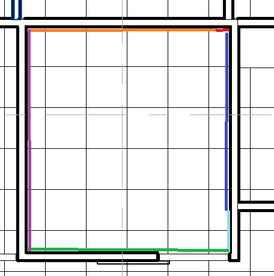
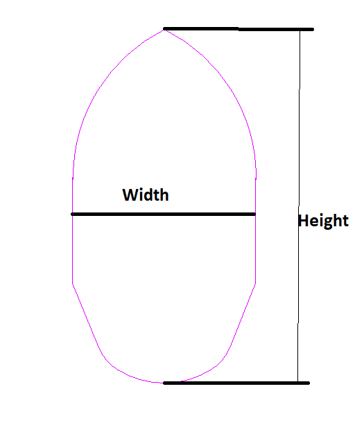
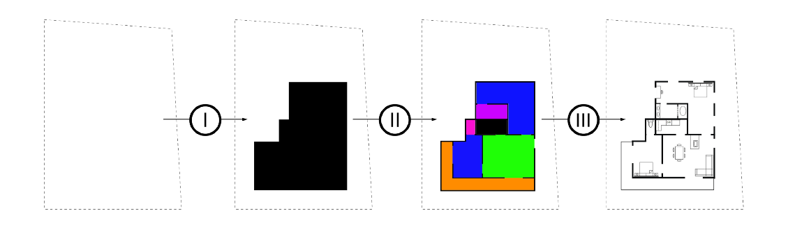

<head>
<meta http-equiv="Content-Type" content="text/html; charset=utf-8">
<link rel="stylesheet" type="text/css" href="bc.css">

</head>

<!---

- more room boundary segments than expected:
  boundary segments issue -- https://forums.autodesk.com/t5/revit-api-forum/boundary-segments-issue/m-p/8759586
  revit room boundary segments question -- https://forums.autodesk.com/t5/revit-api-forum/revit-room-boundary-segments-question/m-p/8771634

- How to get width and Height of curveloop
  https://forums.autodesk.com/t5/revit-api-forum/how-to-get-width-and-height-of-curveloop/m-p/8686230

twitter:

AI and architecture, room boundaries, curve loops and RevitApiDocs 2020 for the #RevitAPI @AutodeskForge @AutodeskRevit #bim #DynamoBim #ForgeDevCon http://bit.ly/revitapidocs2020

Yet another eagerly awaited update for the Revit 2020 API, a couple of interesting Revit API discussion forum threads, and some thoughts on how AI might affect and be used in an architectural context
&ndash; RevitApiDocs updated with the Revit 2020 API
&ndash; More room boundary segments than expected
&ndash; How to get width and height of a <code>CurveLoop</code>
&ndash; AI and architecture...

linkedin:

 the #RevitAPI #bim #DynamoBim #ForgeDevCon #Revit #API #IFC #SDK #AI #VisualStudio #Autodesk #AEC #adsk

AI and architecture, room boundaries, curve loops and RevitApiDocs 2020 for the #RevitAPI #bim #DynamoBim #ForgeDevCon #Revit #API #IFC #SDK #AI #VisualStudio #Autodesk #AEC #adsk

http://bit.ly/revitapidocs2020

Yet another eagerly awaited update for the Revit 2020 API, a couple of interesting Revit API discussion forum threads, and some thoughts on how AI might affect and be used in an architectural context:

- RevitApiDocs updated with the Revit 2020 API
- More room boundary segments than expected
- How to get width and height of a CurveLoop
- AI and architecture...

-->

### AI, Boundaries, Loops and RevitApiDocs 2020

Yet another eagerly awaited update for the Revit 2020 API, a couple of interesting Revit API discussion forum threads, and some thoughts on how AI might affect and be used in an architectural context:

- [RevitApiDocs updated with the Revit 2020 API](#2) 
- [More room boundary segments than expected](#3) 
- [How to get width and height of a `CurveLoop`](#4) 
- [AI and architecture](#5) 

#### RevitApiDocs Updated with the Revit 2020 API

[@RevitApiDocs](https://twitter.com/RevitApiDocs) announced the update
of [RevitApiDocs.com](https://www.revitapidocs.com) for the Revit 2020 API:

> This update also includes:
>
> - 2015 removed from navbar &ndash; the old docs are still available through the `/2015` URL
> - Footer reminds ad-block users to whitelist domain (if you get false positives, please let me know)
>
> Thanks to [@60secondrevit](https://twitter.com/60secondrevit) for sending the `.chm` file
> and [@yarnchitect](https://twitter.com/yarnchitect) for nudging me and testing beta release.

Many thanks to [Gui Talarico](http://www.gtalarico.com) for this eagerly awaited update!

#### More Room Boundary Segments than Expected

Two separate questions were raised in
the [Revit API discussion forum](http://forums.autodesk.com/t5/revit-api-forum/bd-p/160) asking
why a rectangular room might return more than the expected four boundary segments:

- [Boundary segments issue](https://forums.autodesk.com/t5/revit-api-forum/boundary-segments-issue/m-p/8759586)
- [Revit room boundary segments question](https://forums.autodesk.com/t5/revit-api-forum/revit-room-boundary-segments-question/m-p/8771634)

The first thread provides an answer for both:

**Question:** A question concerning segments that bound a space:
In theory, for just a single rectangular room, I should have 4 segments per room;
however, in most cases, I get more.
I guess this happens because there are some other elements which divide those segments (like a wall).

For example, for the case above, I expected 4 segments, but I'm getting 6 instead due the perpendicular wall that divides the segment.

My question is: is there any way to get only the 4 segments?

I'm trying to get the four corners of a room.

**Answer:** Your assumption is correct.

The separate segments stem from different elements.

Note that you can query each boundary segment for the element that is producing it using
its [ElementId property](http://www.revitapidocs.com/2020/eaf7d628-d9c2-80a3-2fd7-00013bab1377.htm).

> Retrieve the id of the element that produces this boundary segment. If the segment is created from an element in a link, this is the id of the RevitLinkInstance.

To obtain just four segments for your square room, you can perform some geometric analysis to combine collinear segments into longer pieces.

If all you need are the four corners, you can (much more) easily determine those by stepping through all the segments (optionally tessellated, if they may be curved) and determine their max and min X, Y and Z coordinates.

The solution is similar to the approach below
showing [how to get width and height of a `CurveLoop`](#4).

#### How to get Width and Height of a CurveLoop

I answered a question a couple of weeks ago in 
the [Revit API discussion forum](http://forums.autodesk.com/t5/revit-api-forum/bd-p/160) thread
asking [how to get width and height of `Curveloop`](https://forums.autodesk.com/t5/revit-api-forum/how-to-get-width-and-height-of-curveloop/m-p/8686230).

Since the same approach can easily be adapted to obtain the four corners of a room, I'll mention it here also:

**Question:** How to calculate the height and width of a curve loop as shown below?

**Answer:** One easy way to get a pretty good approximate value would be to iterate over the curve loop curves,
[tessellate each curve](http://www.revitapidocs.com/2020/f95f3199-3251-c708-c5a3-a0e9ef95ecfa.htm) and
determine the minimum and maximum resulting vertex coordinates:

I added something similar
to [The Building Coder samples](https://github.com/jeremytammik/the_building_coder_samples) for
future reference.

To make it more generic, I implemented an extension method <code>ExpandToContain( IEnumerable&lt;XYZ&gt; )</code> on the bounding box and use it to calculate the bounding box of a curve loop like this:

<pre class="code">
  ///&nbsp;&lt;summary&gt;
  ///&nbsp;Expand&nbsp;the&nbsp;given&nbsp;bounding&nbsp;box&nbsp;to&nbsp;include&nbsp;
  ///&nbsp;and&nbsp;contain&nbsp;the&nbsp;given&nbsp;points.
  ///&nbsp;&lt;/summary&gt;
  public&nbsp;static&nbsp;void&nbsp;ExpandToContain(
  &nbsp;&nbsp;this&nbsp;BoundingBoxXYZ&nbsp;bb,
  &nbsp;&nbsp;IEnumerable&lt;XYZ&gt;&nbsp;pts&nbsp;)
  {
  &nbsp;&nbsp;bb.ExpandToContain(&nbsp;new&nbsp;XYZ(
  &nbsp;&nbsp;&nbsp;&nbsp;pts.Min&lt;XYZ,&nbsp;double&gt;(&nbsp;p&nbsp;=&gt;&nbsp;p.X&nbsp;),
  &nbsp;&nbsp;&nbsp;&nbsp;pts.Min&lt;XYZ,&nbsp;double&gt;(&nbsp;p&nbsp;=&gt;&nbsp;p.Y&nbsp;),
  &nbsp;&nbsp;&nbsp;&nbsp;pts.Min&lt;XYZ,&nbsp;double&gt;(&nbsp;p&nbsp;=&gt;&nbsp;p.Z&nbsp;)&nbsp;)&nbsp;);
   
  &nbsp;&nbsp;bb.ExpandToContain(&nbsp;new&nbsp;XYZ(
  &nbsp;&nbsp;&nbsp;&nbsp;pts.Max&lt;XYZ,&nbsp;double&gt;(&nbsp;p&nbsp;=&gt;&nbsp;p.X&nbsp;),
  &nbsp;&nbsp;&nbsp;&nbsp;pts.Max&lt;XYZ,&nbsp;double&gt;(&nbsp;p&nbsp;=&gt;&nbsp;p.Y&nbsp;),
  &nbsp;&nbsp;&nbsp;&nbsp;pts.Max&lt;XYZ,&nbsp;double&gt;(&nbsp;p&nbsp;=&gt;&nbsp;p.Z&nbsp;)&nbsp;)&nbsp;);
  }

  ///&nbsp;&lt;summary&gt;
  ///&nbsp;Return&nbsp;the&nbsp;bounding&nbsp;box&nbsp;of&nbsp;a&nbsp;curve&nbsp;loop.
  ///&nbsp;&lt;/summary&gt;
  public&nbsp;static&nbsp;BoundingBoxXYZ&nbsp;GetBoundingBox(
  &nbsp;&nbsp;CurveLoop&nbsp;curveLoop&nbsp;)
  {
  &nbsp;&nbsp;List&lt;XYZ&gt;&nbsp;pts&nbsp;=&nbsp;new&nbsp;List&lt;XYZ&gt;();
  &nbsp;&nbsp;foreach(&nbsp;Curve&nbsp;c&nbsp;in&nbsp;curveLoop&nbsp;)
  &nbsp;&nbsp;{
  &nbsp;&nbsp;&nbsp;&nbsp;pts.AddRange(&nbsp;c.Tessellate()&nbsp;);
  &nbsp;&nbsp;}
   
  &nbsp;&nbsp;BoundingBoxXYZ&nbsp;bb&nbsp;=&nbsp;new&nbsp;BoundingBoxXYZ();
  &nbsp;&nbsp;bb.Clear();
  &nbsp;&nbsp;bb.ExpandToContain(&nbsp;pts&nbsp;);
  &nbsp;&nbsp;return&nbsp;bb;
  }
</pre>

Can you confirm that this works for you as well?

Here are the [entire diffs](https://github.com/jeremytammik/the_building_coder_samples/compare/2019.0.145.12...2019.0.145.13)
(unfortunately including lots of superfluous whitespace modifications):

**Response:** I tried your code in my project.
It is working without any error and returns expected result.
Thank you.

#### AI and Architecture

Let's end by mentioning this interesting overview
of [AI and Architecture](https://towardsdatascience.com/ai-architecture-f9d78c6958e0) from
an experimental perspective by Stanislas Chaillou of Harvard Graduate School of Design.

Here are a few abbreviated quotes from his conclusion:

- AI will soon massively empower architects in their day to day practice. ...
- Conceptually first, our belief is that a statistical approach to design conception shapes AI’s potential for Architecture...
- Second, we are directionally convinced that our ability to design the right pipeline will condition AI’s success as a new architectural toolset...
- Third, we technically believe that the sequential nature of the application will facilitate its manageability and foster its development...
- Finally, we hope our framework will help address the endless breadth and complexity of the models to be trained and those used in any generation pipeline...
- Far from thinking about AI as the new dogma in Architecture, we conceive this field as a new challenge full of potential and promises. We see here the possibility for rich results that will complement our practice and address some blind spots of our discipline.

 <!-- 1129 -->

