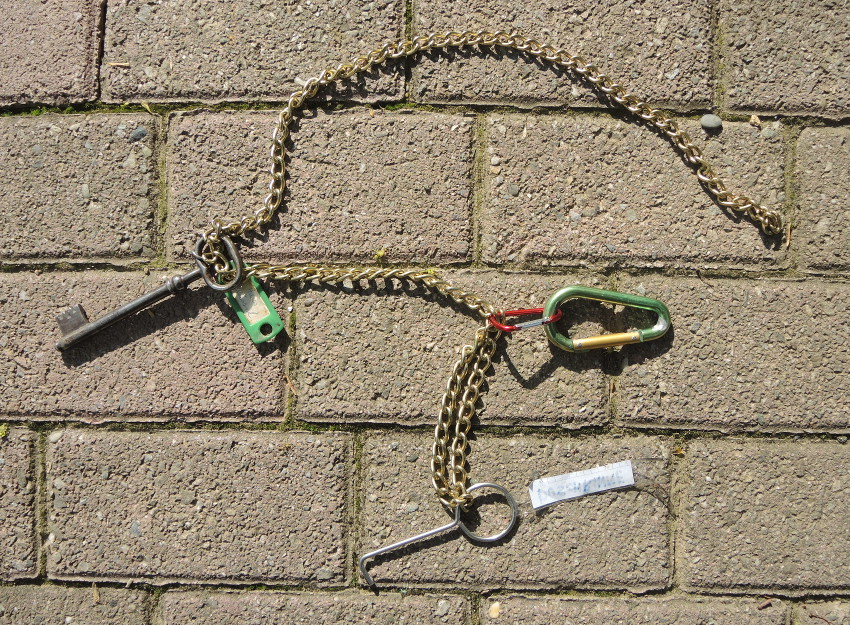

<head>
<meta http-equiv="Content-Type" content="text/html; charset=utf-8">
<link rel="stylesheet" type="text/css" href="bc.css">

</head>

<!---

- 10027136 [highlight and tag linked elements]
  http://forums.autodesk.com/t5/revit-api/highlight-and-tag-linked-elements/m-p/5294217
  tagging linked elements can be solved using two different approaches, either via RevitLinkInstance + CreateLinkReference or using the ParseFromStableRepresentation method.

- 15175390 [Tagging Linked Elements using Revit API]
  https://forums.autodesk.com/t5/revit-api-forum/tagging-linked-elements-using-revit-api/m-p/8669001

twitter:

Tagging a linked element and retrieving untagged in the #RevitAPI @AutodeskForge @AutodeskRevit #bim #DynamoBim #ForgeDevCon http://bit.ly/taglinked

The linked file enhancements introduced in the Revit 2014 API obviously need more awareness
&ndash; Link enhancements &ndash; Conversion of geometric references
&ndash; Tagging a linked element
&ndash; Using the stable representation to tag a linked element
&ndash; List all untagged doors...

linkedin:

 the #RevitAPI #bim #DynamoBim #ForgeDevCon #Revit #API #IFC #SDK #AI #VisualStudio #Autodesk #AEC #adsk

Tagging a linked element and retrieving untagged in the #RevitAPI

http://bit.ly/taglinked

The linked file enhancements introduced in the Revit 2014 API obviously need more awareness:

- Link enhancements
- Conversion of geometric references
- Tagging a linked element
- Using the stable representation to tag a linked element
- List all untagged doors...

#bim #DynamoBim #ForgeDevCon #Revit #API #IFC #SDK #AI #VisualStudio #Autodesk #AEC #adsk

-->

### Tagging a Linked Element

The linked file enhancements introduced in the Revit 2014 API obviously need more awareness:

- [Link enhancements &ndash; conversion of geometric references](#2) 
- [Tagging a linked element](#3) 
- [Using the stable representation to tag a linked element](#4) 
- [List all untagged doors](#5) 

#### Link Enhancements &ndash; Conversion of Geometric References

`CreateLinkReference` was introduced way back in
the [Revit 2014 API](https://thebuildingcoder.typepad.com/blog/2013/04/whats-new-in-the-revit-2014-api.html).

Conversion of geometric references in links is mentioned as one of the major enhancements:

The API calls:

- [Reference.LinkedElementId](http://www.revitapidocs.com/2020/97813744-6e64-00a7-da5c-b2c6de7919ad.htm) &ndash; The id of the top-level element in the linked document that is referred to by this reference.
- [Reference.CreateLinkReference(RevitLinkInstance)](http://www.revitapidocs.com/2020/919d7d3f-f8c2-eb12-4069-0022c20fa13a.htm) &ndash; Creates a `Reference` from a `Reference` in an RVT Link.
- [Reference.CreateReferenceInLink()](http://www.revitapidocs.com/2020/20a8bee7-2378-c0a6-36f0-07ca42eaedc3.htm) &ndash; Creates a `Reference` in an RVT Link from a `Reference` in the RVT host file.

allow conversion between `Reference` objects which reference only the contents of the link and `Reference` objects which reference the host.

This allows an application, for example, to look at the geometry in the link, find the needed face, and convert the reference to that face into a reference in the host suitable for use to place a face-based instance.

Also, they allow you to obtain a reference in the host (e.g., from a dimension or family) and convert it to a reference in the link, suitable for use in `Element.GetGeometryObjectFromReference`.

This enhancement was often overlooked, and several questions were raised on how to tag an element in a linked file.

#### Tagging a Linked Element

Ilia Ivanov used these methods to answer his own question in
the [Revit API discussion forum](http://forums.autodesk.com/t5/revit-api-forum/bd-p/160) thread
on [tagging linked elements using Revit API](https://forums.autodesk.com/t5/revit-api-forum/tagging-linked-elements-using-revit-api/m-p/8669001):

**Question:** Hello, Is it possibly to tag a linked element?

And also retrieve the reference of the tagged linked element?

**Answer:** Hello, I have done it:

<pre class="code">
&nbsp;&nbsp;RevitLinkInstance&nbsp;link&nbsp;=&nbsp;doc.GetElement(
&nbsp;&nbsp;&nbsp;&nbsp;tag.TaggedElementId.LinkInstanceId&nbsp;)
&nbsp;&nbsp;&nbsp;&nbsp;&nbsp;&nbsp;as&nbsp;RevitLinkInstance;
 
&nbsp;&nbsp;Reference&nbsp;refer&nbsp;=&nbsp;new&nbsp;Reference(
&nbsp;&nbsp;&nbsp;&nbsp;link.GetLinkDocument()
&nbsp;&nbsp;&nbsp;&nbsp;&nbsp;&nbsp;.GetElement(&nbsp;tag.TaggedElementId.LinkedElementId&nbsp;)&nbsp;)
&nbsp;&nbsp;&nbsp;&nbsp;.CreateLinkReference(&nbsp;link&nbsp;);
</pre>

For a bit more context, here is a slightly nonsensical sample method to tag all walls in all linked documents, placing all tags in one single constant spot:

<pre class="code">
///&nbsp;&lt;summary&gt;
///&nbsp;Tag&nbsp;all&nbsp;walls&nbsp;in&nbsp;all&nbsp;linked&nbsp;documents
///&nbsp;&lt;/summary&gt;
void&nbsp;TagAllLinkedWalls(&nbsp;Document&nbsp;doc&nbsp;)
{
&nbsp;&nbsp;//&nbsp;Point&nbsp;near&nbsp;my&nbsp;wall
&nbsp;&nbsp;XYZ&nbsp;xyz&nbsp;=&nbsp;new&nbsp;XYZ(&nbsp;-20,&nbsp;20,&nbsp;0&nbsp;);
 
&nbsp;&nbsp;//&nbsp;At&nbsp;first&nbsp;need&nbsp;to&nbsp;find&nbsp;our&nbsp;links
&nbsp;&nbsp;FilteredElementCollector&nbsp;collector
&nbsp;&nbsp;&nbsp;&nbsp;=&nbsp;new&nbsp;FilteredElementCollector(&nbsp;doc&nbsp;)
&nbsp;&nbsp;&nbsp;&nbsp;&nbsp;&nbsp;.OfClass(&nbsp;typeof(&nbsp;RevitLinkInstance&nbsp;)&nbsp;);
 
&nbsp;&nbsp;foreach(&nbsp;Element&nbsp;elem&nbsp;in&nbsp;collector&nbsp;)
&nbsp;&nbsp;{
&nbsp;&nbsp;&nbsp;&nbsp;//&nbsp;Get&nbsp;linkInstance
&nbsp;&nbsp;&nbsp;&nbsp;RevitLinkInstance&nbsp;instance&nbsp;=&nbsp;elem&nbsp;
&nbsp;&nbsp;&nbsp;&nbsp;&nbsp;&nbsp;as&nbsp;RevitLinkInstance;
 
&nbsp;&nbsp;&nbsp;&nbsp;//&nbsp;Get&nbsp;linkDocument
&nbsp;&nbsp;&nbsp;&nbsp;Document&nbsp;linkDoc&nbsp;=&nbsp;instance.GetLinkDocument();
 
&nbsp;&nbsp;&nbsp;&nbsp;//&nbsp;Get&nbsp;linkType
&nbsp;&nbsp;&nbsp;&nbsp;RevitLinkType&nbsp;type&nbsp;=&nbsp;doc.GetElement(&nbsp;
&nbsp;&nbsp;&nbsp;&nbsp;&nbsp;&nbsp;instance.GetTypeId()&nbsp;)&nbsp;as&nbsp;RevitLinkType;
 
&nbsp;&nbsp;&nbsp;&nbsp;//&nbsp;Check&nbsp;if&nbsp;link&nbsp;is&nbsp;loaded
&nbsp;&nbsp;&nbsp;&nbsp;if(&nbsp;RevitLinkType.IsLoaded(&nbsp;doc,&nbsp;type.Id&nbsp;)&nbsp;)
&nbsp;&nbsp;&nbsp;&nbsp;{
&nbsp;&nbsp;&nbsp;&nbsp;&nbsp;&nbsp;//&nbsp;Find&nbsp;walls&nbsp;for&nbsp;tagging
&nbsp;&nbsp;&nbsp;&nbsp;&nbsp;&nbsp;FilteredElementCollector&nbsp;walls
&nbsp;&nbsp;&nbsp;&nbsp;&nbsp;&nbsp;&nbsp;&nbsp;=&nbsp;new&nbsp;FilteredElementCollector(&nbsp;linkDoc&nbsp;)
&nbsp;&nbsp;&nbsp;&nbsp;&nbsp;&nbsp;&nbsp;&nbsp;&nbsp;&nbsp;.OfCategory(&nbsp;BuiltInCategory.OST_Walls&nbsp;)
&nbsp;&nbsp;&nbsp;&nbsp;&nbsp;&nbsp;&nbsp;&nbsp;&nbsp;&nbsp;.OfClass(&nbsp;typeof(&nbsp;Wall&nbsp;)&nbsp;);
 
&nbsp;&nbsp;&nbsp;&nbsp;&nbsp;&nbsp;//&nbsp;Create&nbsp;reference
&nbsp;&nbsp;&nbsp;&nbsp;&nbsp;&nbsp;foreach(&nbsp;Wall&nbsp;wall&nbsp;in&nbsp;walls&nbsp;)
&nbsp;&nbsp;&nbsp;&nbsp;&nbsp;&nbsp;{
&nbsp;&nbsp;&nbsp;&nbsp;&nbsp;&nbsp;&nbsp;&nbsp;Reference&nbsp;newRef&nbsp;=&nbsp;new&nbsp;Reference(&nbsp;wall&nbsp;)
&nbsp;&nbsp;&nbsp;&nbsp;&nbsp;&nbsp;&nbsp;&nbsp;&nbsp;&nbsp;.CreateLinkReference(&nbsp;instance&nbsp;);
 
&nbsp;&nbsp;&nbsp;&nbsp;&nbsp;&nbsp;&nbsp;&nbsp;//&nbsp;Create&nbsp;transaction
&nbsp;&nbsp;&nbsp;&nbsp;&nbsp;&nbsp;&nbsp;&nbsp;using(&nbsp;Transaction&nbsp;tx&nbsp;=&nbsp;new&nbsp;Transaction(&nbsp;doc&nbsp;)&nbsp;)
&nbsp;&nbsp;&nbsp;&nbsp;&nbsp;&nbsp;&nbsp;&nbsp;{
&nbsp;&nbsp;&nbsp;&nbsp;&nbsp;&nbsp;&nbsp;&nbsp;&nbsp;&nbsp;tx.Start(&nbsp;&quot;Create&nbsp;tags&quot;&nbsp;);
 
&nbsp;&nbsp;&nbsp;&nbsp;&nbsp;&nbsp;&nbsp;&nbsp;&nbsp;&nbsp;IndependentTag&nbsp;newTag&nbsp;=&nbsp;IndependentTag.Create(&nbsp;
&nbsp;&nbsp;&nbsp;&nbsp;&nbsp;&nbsp;&nbsp;&nbsp;&nbsp;&nbsp;&nbsp;&nbsp;doc,&nbsp;doc.ActiveView.Id,&nbsp;newRef,&nbsp;true,&nbsp;
&nbsp;&nbsp;&nbsp;&nbsp;&nbsp;&nbsp;&nbsp;&nbsp;&nbsp;&nbsp;&nbsp;&nbsp;TagMode.TM_ADDBY_MATERIAL,&nbsp;
&nbsp;&nbsp;&nbsp;&nbsp;&nbsp;&nbsp;&nbsp;&nbsp;&nbsp;&nbsp;&nbsp;&nbsp;TagOrientation.Horizontal,&nbsp;xyz&nbsp;);
 
&nbsp;&nbsp;&nbsp;&nbsp;&nbsp;&nbsp;&nbsp;&nbsp;&nbsp;&nbsp;//&nbsp;Use&nbsp;TaggedElementId.LinkInstanceId&nbsp;and&nbsp;
&nbsp;&nbsp;&nbsp;&nbsp;&nbsp;&nbsp;&nbsp;&nbsp;&nbsp;&nbsp;//&nbsp;TaggedElementId.LinkInstanceId&nbsp;to&nbsp;retrieve&nbsp;
&nbsp;&nbsp;&nbsp;&nbsp;&nbsp;&nbsp;&nbsp;&nbsp;&nbsp;&nbsp;//&nbsp;the&nbsp;id&nbsp;of&nbsp;the&nbsp;tagged&nbsp;link&nbsp;and&nbsp;element:
 
&nbsp;&nbsp;&nbsp;&nbsp;&nbsp;&nbsp;&nbsp;&nbsp;&nbsp;&nbsp;LinkElementId&nbsp;linkId&nbsp;=&nbsp;newTag.TaggedElementId;
&nbsp;&nbsp;&nbsp;&nbsp;&nbsp;&nbsp;&nbsp;&nbsp;&nbsp;&nbsp;ElementId&nbsp;linkInsancetId&nbsp;=&nbsp;linkId.LinkInstanceId;
&nbsp;&nbsp;&nbsp;&nbsp;&nbsp;&nbsp;&nbsp;&nbsp;&nbsp;&nbsp;ElementId&nbsp;linkedElementId&nbsp;=&nbsp;linkId.LinkedElementId;
 
&nbsp;&nbsp;&nbsp;&nbsp;&nbsp;&nbsp;&nbsp;&nbsp;&nbsp;&nbsp;tx.Commit();
&nbsp;&nbsp;&nbsp;&nbsp;&nbsp;&nbsp;&nbsp;&nbsp;}
&nbsp;&nbsp;&nbsp;&nbsp;&nbsp;&nbsp;}
&nbsp;&nbsp;&nbsp;&nbsp;}
&nbsp;&nbsp;}
}
</pre>

Many thanks to Ilia for sharing this!

#### Using the Stable Representation to Tag a Linked Element

In another extensive thread
on [highlighting and tagging linked elements](http://forums.autodesk.com/t5/revit-api/highlight-and-tag-linked-elements/m-p/5294217).
Carolina Machado suggested an alternative approach and less official solution to tag a linked element using the `ParseFromStableRepresentation` method instead:

> Using RevitLookup and a post from your blog, I noticed that the Stable Representation of references in linked instances conform to the following pattern:

> <code>&nbsp; revitLinkInstance.UniqueId
 &nbsp; &nbsp; +&quot;:0:RVTLINK/&quot;&nbsp;+&nbsp;revitLinkType.UniqueId
 &nbsp; &nbsp; +&quot;:&quot;&nbsp;+&nbsp;element.Id.ToString()</code>

> Using this string, it is possible to get the `Reference` through `Reference.ParseFromStableRepresentation` method and then use it to tag the element.

Many thanks to Carolina for sharing this!

#### List All Untagged Doors

On a another tagging topic, however with no links involved, here are two suggestions by my colleague Naveen Kumar and
Alexander [@aignatovich](https://forums.autodesk.com/t5/user/viewprofilepage/user-id/1257478) Ignatovich, aka Александр Игнатович,
answering a whole slew of questions on how to retrieve all untagged doors in the model:

- [I want to check whether tag is present on door by API](https://forums.autodesk.com/t5/revit-api-forum/i-want-to-check-whether-tag-is-present-on-door-by-api-how-should/td-p/8532032)
- [How to get relation of element with its tag or its label](https://forums.autodesk.com/t5/revit-api-forum/how-to-gets-relation-of-element-with-its-tag-or-its-label/td-p/8602124)
- [How to verify label on element using Revit API](https://forums.autodesk.com/t5/revit-api-forum/how-to-verify-label-on-element-using-revit-api/td-p/8594801)

**Question:** Can we determine the relationship between a tag and its tagged element?

I can retrieve all independent tags of particular category.

E.g., having 6 doors, I can retrieve the 6 door tags.

Suppose one of doors does not have tag.

How can I find the particular door lacking a tag?

In other words, how to find relation between element category and element tag category.

**Answer:** Try using the below code. It will highlight the elements that are not tagged:

<pre class="code">
&nbsp;&nbsp;FilteredElementCollector&nbsp;doors
&nbsp;&nbsp;&nbsp;&nbsp;=&nbsp;new&nbsp;FilteredElementCollector(&nbsp;doc&nbsp;)
&nbsp;&nbsp;&nbsp;&nbsp;&nbsp;&nbsp;.OfCategory(&nbsp;BuiltInCategory.OST_Doors&nbsp;)
&nbsp;&nbsp;&nbsp;&nbsp;&nbsp;&nbsp;.OfClass(&nbsp;typeof(&nbsp;FamilyInstance&nbsp;)&nbsp;);
 
&nbsp;&nbsp;IEnumerable&lt;IndependentTag&gt;&nbsp;tags
&nbsp;&nbsp;&nbsp;&nbsp;=&nbsp;new&nbsp;FilteredElementCollector(&nbsp;doc&nbsp;)
&nbsp;&nbsp;&nbsp;&nbsp;&nbsp;&nbsp;.OfClass(&nbsp;typeof(&nbsp;IndependentTag&nbsp;)&nbsp;)
&nbsp;&nbsp;&nbsp;&nbsp;&nbsp;&nbsp;.Cast&lt;IndependentTag&gt;();
 
&nbsp;&nbsp;IList&lt;ElementId&gt;&nbsp;untagged_elements&nbsp;
&nbsp;&nbsp;&nbsp;&nbsp;=&nbsp;new&nbsp;List&lt;ElementId&gt;();
 
&nbsp;&nbsp;foreach(&nbsp;Element&nbsp;e&nbsp;in&nbsp;doors&nbsp;)
&nbsp;&nbsp;{
&nbsp;&nbsp;&nbsp;&nbsp;if(&nbsp;!tags.Any(&nbsp;q&nbsp;
&nbsp;&nbsp;&nbsp;&nbsp;&nbsp;&nbsp;=&gt;&nbsp;q.TaggedLocalElementId&nbsp;==&nbsp;e.Id&nbsp;)&nbsp;)
&nbsp;&nbsp;&nbsp;&nbsp;{
&nbsp;&nbsp;&nbsp;&nbsp;&nbsp;&nbsp;untagged_elements.Add(&nbsp;e.Id&nbsp;);
&nbsp;&nbsp;&nbsp;&nbsp;}
&nbsp;&nbsp;}
&nbsp;&nbsp;uidoc.Selection.SetElementIds(&nbsp;untagged_elements&nbsp;);
&nbsp;&nbsp;uidoc.RefreshActiveView();
</pre>

**Answer 2:** To check whether a specific door is untagged, you can find all `IndependentTag` elements present in the document of `OST_DoorTags` category and the door elements that they are tagging like this:

<pre class="code">
&nbsp;&nbsp;var&nbsp;collector&nbsp;=&nbsp;new&nbsp;FilteredElementCollector(&nbsp;doc&nbsp;)
&nbsp;&nbsp;&nbsp;&nbsp;.OfClass(&nbsp;typeof(&nbsp;IndependentTag&nbsp;)&nbsp;)
&nbsp;&nbsp;&nbsp;&nbsp;.OfCategory(&nbsp;BuiltInCategory.OST_DoorTags&nbsp;);
 
&nbsp;&nbsp;var&nbsp;doorTagsIds
&nbsp;&nbsp;&nbsp;&nbsp;=&nbsp;new&nbsp;HashSet&lt;ElementId&gt;(
&nbsp;&nbsp;&nbsp;&nbsp;&nbsp;&nbsp;collector.OfType&lt;IndependentTag&gt;()
&nbsp;&nbsp;&nbsp;&nbsp;&nbsp;&nbsp;&nbsp;&nbsp;.Select(&nbsp;x&nbsp;=&gt;&nbsp;x.GetTaggedLocalElement()?.Id&nbsp;)
&nbsp;&nbsp;&nbsp;&nbsp;&nbsp;&nbsp;&nbsp;&nbsp;.Where(&nbsp;x&nbsp;=&gt;&nbsp;x&nbsp;!=&nbsp;null&nbsp;)&nbsp;);
</pre>

Then you can iterate over your doors collection and check if `doorTagsIds` contains the `door.Id`.

Both of these suggestions can probably be speeded up by storing the entire relationship between the tags and the tagged elements in a dictionary and inverting that relationship, as I explained in the recent thread
on [`FilteredElementCollector` &ndash; unreferenced sections only](https://forums.autodesk.com/t5/revit-api-forum/filteredelementcollector-unreferenced-sections-only/m-p/8773472).

