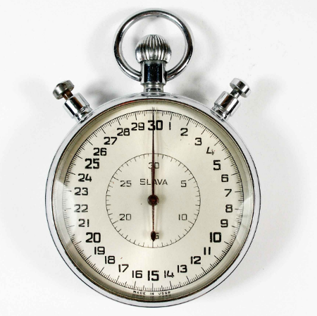

<head>
<meta http-equiv="Content-Type" content="text/html; charset=utf-8">
<link rel="stylesheet" type="text/css" href="bc.css">

</head>

<!---

- filtering benchmark
  https://thebuildingcoder.typepad.com/blog/2019/04/slow-slower-still-and-faster-filtering.html#comment-4421443231

twitter:

Forge learning resource and filtered element collector benchmark for the #RevitAPI @AutodeskForge @AutodeskRevit #bim #DynamoBim #ForgeDevCon http://bit.ly/filterbenchmark

Today, let's present a benchmark monitoring filtered element collector performance.
First, however, a quick note on a very useful Forge learning resource
&ndash; Forge learning resource
&ndash; Filtered element collector benchmark...

linkedin:

Forge learning resource and filtered element collector benchmark for the #RevitAPI

http://bit.ly/filterbenchmark

Today, let's present a benchmark monitoring filtered element collector performance.

First, however, a quick note on a very useful Forge learning resource:

- Forge learning resource
- Filtered element collector benchmark...

#bim #DynamoBim #ForgeDevCon #Revit #API #IFC #SDK #AI #VisualStudio #Autodesk #AEC #adsk

-->

### Filtered Element Collector Benchmark

Today, let's present a benchmark monitoring filtered element collector performance.

First, however, a quick note on a very useful Forge learning resource:

- [Forge learning resource](#2) 
- [Filtered element collector benchmark](#3) 

#### Forge Learning Resource

If you are new to Forge or want to dive in deeper, you can find a collection of very cool Forge training material
at [learnforge.autodesk.io](https://learnforge.autodesk.io), focusing specifically on BIM360 and design automation.

Here is the table of contents:

- Before you start coding
- Tools
- OAuth
- View your models
    - Create a server
    - Authenticate
    - Upload file to OSS
    - Translate the file
    - Show on Viewer
- View BIM 360 & Fusion models
    - Create a server
    - Authorize
    - List hubs & projects
    - User information
    - Show on Viewer
- Modify your models
    - Create a server
    - Basic app UI
    - Prepare a plugin
    - Define an activity

#### Filtered Element Collector Benchmark

Back to the Revit API, I recently reiterated the differences between [slow, slower still and faster filtering](https://thebuildingcoder.typepad.com/blog/2019/04/slow-slower-still-and-faster-filtering.html).

In the end, the only way to tell whether your filter is performing well or not is to implement
some [benchmarking](https://en.wikipedia.org/wiki/Benchmark_(computing)) for it.

Jai Hari Hara Sudhan very commendably did so, documenting his progress and sharing his results in
a [series of](https://thebuildingcoder.typepad.com/blog/2019/04/slow-slower-still-and-faster-filtering.html#comment-4421084673)
[comments on](https://thebuildingcoder.typepad.com/blog/2019/04/slow-slower-still-and-faster-filtering.html#comment-4421183783)
[that post](https://thebuildingcoder.typepad.com/blog/2019/04/slow-slower-still-and-faster-filtering.html#comment-4421443231) and in
his [API speed test screencast](https://knowledge.autodesk.com/community/screencast/99858ef7-c4c8-4599-ba6d-0394ff830d62) demonstrating
the benchmark running live.

<!-- https://autode.sk/2IwemGr -->

Here is a summary of our discussion and his final benchmarking code:

**Question:** The above content is very useful.

I am using three methods to filter and select the element:

1. Using `FilterRule` method (filters in floor by floor / level)
2. Using `Factory` Method (filters in the projects)
3. Selection with interface (element by element)

Question 1. Which one is the best in performance (quick)? `FilterRule` or `Factory` method?

Question 2. In the FamilySelectionFilter method, is there any better or more performant method to select the elements?

**Answer:** Nobody can tell you beforehand how these different approaches will perform in your specific context.

I therefore suggest that you benchmark them yourself and let us know the result.

[The Building Coder topic groups](https://thebuildingcoder.typepad.com/blog/about-the-author.html#5) lists
several benchmarking examples that you can look at to see how.

**Response:** I implemented a benchmark.

It is impossible to determine exact constant performance (time), because the results differ from run to run. 

Please refer to my [API speed test screencast](https://knowledge.autodesk.com/community/screencast/99858ef7-c4c8-4599-ba6d-0394ff830d62). <!-- https://autode.sk/2IwemGr -->

Finally, I rank the different approaches as follows:

<!--
<ul style="list-style-type: none">
<li>1st &ndash; `Factory` method (average time = 766.1 microseconds) 100% </li>
<li>2nd &ndash; `FilterRule` method (average time = 889.0 microseconds) &ndash; 116% slower than `Factory`</li>
<li>3rd &ndash; `Linq2` method (average time = 983.5 microseconds) &ndash; 128% slower than `Factory`</li>
<li>4th &ndash; `Linq1` method (average time = 1173.3 microseconds) &ndash; 153% slower than `Factory`</li>
</ul>
-->

<ol>
<li>`Factory` method (average time = 766.1 microseconds)  &ndash; 100% </li>
<li>`FilterRule` method (average time = 889.0 microseconds)  &ndash; 116% slower than `Factory`</li>
<li>`Linq2` method (average time = 983.5 microseconds)  &ndash; 128% slower than `Factory`</li>
<li>`Linq1` method (average time = 1173.3 microseconds)  &ndash; 153% slower than `Factory`</li>
</ol>

The code as follows:

<pre class="code">
[Transaction(&nbsp;TransactionMode.Manual&nbsp;)]
public&nbsp;class&nbsp;Elec_test&nbsp;:&nbsp;IExternalCommand
{
&nbsp;&nbsp;public&nbsp;Result&nbsp;Execute(
&nbsp;&nbsp;&nbsp;&nbsp;ExternalCommandData&nbsp;commandData,
&nbsp;&nbsp;&nbsp;&nbsp;ref&nbsp;string&nbsp;message,
&nbsp;&nbsp;&nbsp;&nbsp;ElementSet&nbsp;elements&nbsp;)
&nbsp;&nbsp;{
&nbsp;&nbsp;&nbsp;&nbsp;UIApplication&nbsp;uiapp&nbsp;=&nbsp;commandData.Application;
&nbsp;&nbsp;&nbsp;&nbsp;UIDocument&nbsp;uidoc&nbsp;=&nbsp;uiapp.ActiveUIDocument;
&nbsp;&nbsp;&nbsp;&nbsp;Application&nbsp;app&nbsp;=&nbsp;uiapp.Application;
&nbsp;&nbsp;&nbsp;&nbsp;Document&nbsp;doc&nbsp;=&nbsp;uidoc.Document;
&nbsp;&nbsp;&nbsp;&nbsp;Selection&nbsp;sel&nbsp;=&nbsp;uidoc.Selection;
 
&nbsp;&nbsp;&nbsp;&nbsp;TaskDialog.Show(&nbsp;&quot;BuilDTecH&nbsp;Architects&quot;,
&nbsp;&nbsp;&nbsp;&nbsp;&nbsp;&nbsp;&quot;BuilDTecH&nbsp;Architects&nbsp;by&nbsp;Sudhan&quot;&nbsp;);
 
&nbsp;&nbsp;&nbsp;&nbsp;InputData&nbsp;InputData&nbsp;=&nbsp;new&nbsp;InputData();
&nbsp;&nbsp;&nbsp;&nbsp;InputData.ShowDialog();
&nbsp;&nbsp;&nbsp;&nbsp;IList&lt;object&gt;&nbsp;data&nbsp;=&nbsp;InputData.Data;
 
&nbsp;&nbsp;&nbsp;&nbsp;///////////////////////////////&nbsp;Input&nbsp;Values
&nbsp;&nbsp;&nbsp;&nbsp;double&nbsp;LeftOffset&nbsp;=&nbsp;Convert.ToDouble(&nbsp;data[1]&nbsp;),
&nbsp;&nbsp;&nbsp;&nbsp;RightOffset&nbsp;=&nbsp;Convert.ToDouble(&nbsp;data[2]&nbsp;),
&nbsp;&nbsp;&nbsp;&nbsp;TopOffset&nbsp;=&nbsp;Convert.ToDouble(&nbsp;data[3]&nbsp;),
&nbsp;&nbsp;&nbsp;&nbsp;BottomOffset&nbsp;=&nbsp;Convert.ToDouble(&nbsp;data[4]&nbsp;),
&nbsp;&nbsp;&nbsp;&nbsp;NearClipOffset&nbsp;=&nbsp;-Convert.ToDouble(&nbsp;data[5]&nbsp;),
&nbsp;&nbsp;&nbsp;&nbsp;FarClipOffset&nbsp;=&nbsp;Convert.ToDouble(&nbsp;data[6]&nbsp;);
&nbsp;&nbsp;&nbsp;&nbsp;string&nbsp;Section_Name&nbsp;=&nbsp;&quot;Electrical&nbsp;GangBox&quot;,
&nbsp;&nbsp;&nbsp;&nbsp;ElectricalEquipment&nbsp;=&nbsp;&quot;Modular&nbsp;Gang&nbsp;Box&quot;;
&nbsp;&nbsp;&nbsp;&nbsp;//Input&nbsp;///////////////////////////////&nbsp;Input&nbsp;Values
 
&nbsp;&nbsp;&nbsp;&nbsp;if(&nbsp;data[0].Equals(&nbsp;InputData.Option.ByFloor&nbsp;)&nbsp;)
&nbsp;&nbsp;&nbsp;&nbsp;{
&nbsp;&nbsp;&nbsp;&nbsp;&nbsp;&nbsp;Timer&nbsp;floortimeLinq1&nbsp;=&nbsp;new&nbsp;Timer();
&nbsp;&nbsp;&nbsp;&nbsp;&nbsp;&nbsp;floortimeLinq1.Start();
&nbsp;&nbsp;&nbsp;&nbsp;&nbsp;&nbsp;IEnumerable&lt;Element&gt;&nbsp;elems&nbsp;=&nbsp;Linq1(&nbsp;doc,
&nbsp;&nbsp;&nbsp;&nbsp;&nbsp;&nbsp;&nbsp;&nbsp;BuiltInCategory.OST_ElectricalEquipment,
&nbsp;&nbsp;&nbsp;&nbsp;&nbsp;&nbsp;&nbsp;&nbsp;ElectricalEquipment&nbsp;);
 
&nbsp;&nbsp;&nbsp;&nbsp;&nbsp;&nbsp;floortimeLinq1.Stop();
&nbsp;&nbsp;&nbsp;&nbsp;&nbsp;&nbsp;TaskDialog.Show(&nbsp;&quot;time&quot;,&nbsp;&quot;LINQ1&nbsp;Method&nbsp;Time&nbsp;=&nbsp;&quot;
&nbsp;&nbsp;&nbsp;&nbsp;&nbsp;&nbsp;&nbsp;&nbsp;+&nbsp;floortimeLinq1.Duration.ToString()
&nbsp;&nbsp;&nbsp;&nbsp;&nbsp;&nbsp;&nbsp;&nbsp;+&nbsp;&quot;&nbsp;No.&nbsp;of&nbsp;Elements&nbsp;=&nbsp;&quot;&nbsp;+&nbsp;elems.Count().ToString()&nbsp;);
 
&nbsp;&nbsp;&nbsp;&nbsp;&nbsp;&nbsp;elems&nbsp;=&nbsp;null;
&nbsp;&nbsp;&nbsp;&nbsp;&nbsp;&nbsp;Timer&nbsp;floortimeLinq2&nbsp;=&nbsp;new&nbsp;Timer();
&nbsp;&nbsp;&nbsp;&nbsp;&nbsp;&nbsp;floortimeLinq2.Start();
&nbsp;&nbsp;&nbsp;&nbsp;&nbsp;&nbsp;elems&nbsp;=&nbsp;Linq2(&nbsp;doc,
&nbsp;&nbsp;&nbsp;&nbsp;&nbsp;&nbsp;&nbsp;&nbsp;BuiltInCategory.OST_ElectricalEquipment,
&nbsp;&nbsp;&nbsp;&nbsp;&nbsp;&nbsp;&nbsp;&nbsp;ElectricalEquipment&nbsp;);
 
&nbsp;&nbsp;&nbsp;&nbsp;&nbsp;&nbsp;floortimeLinq2.Stop();
&nbsp;&nbsp;&nbsp;&nbsp;&nbsp;&nbsp;TaskDialog.Show(&nbsp;&quot;time&quot;,&nbsp;&quot;LINQ2&nbsp;Method&nbsp;Time&nbsp;=&nbsp;&quot;
&nbsp;&nbsp;&nbsp;&nbsp;&nbsp;&nbsp;&nbsp;&nbsp;+&nbsp;floortimeLinq2.Duration.ToString()
&nbsp;&nbsp;&nbsp;&nbsp;&nbsp;&nbsp;&nbsp;&nbsp;+&nbsp;&quot;&nbsp;No.&nbsp;of&nbsp;Elements&nbsp;=&nbsp;&quot;&nbsp;+&nbsp;elems.Count().ToString()&nbsp;);
 
&nbsp;&nbsp;&nbsp;&nbsp;&nbsp;&nbsp;elems&nbsp;=&nbsp;null;
 
&nbsp;&nbsp;&nbsp;&nbsp;&nbsp;&nbsp;Timer&nbsp;floortimeFilterRule&nbsp;=&nbsp;new&nbsp;Timer();
&nbsp;&nbsp;&nbsp;&nbsp;&nbsp;&nbsp;floortimeFilterRule.Start();
&nbsp;&nbsp;&nbsp;&nbsp;&nbsp;&nbsp;elems&nbsp;=&nbsp;FilterRule(&nbsp;doc,&nbsp;//&nbsp;uidoc.ActiveView.Id,
&nbsp;&nbsp;&nbsp;&nbsp;&nbsp;&nbsp;&nbsp;&nbsp;BuiltInCategory.OST_ElectricalEquipment,
&nbsp;&nbsp;&nbsp;&nbsp;&nbsp;&nbsp;&nbsp;&nbsp;ElectricalEquipment&nbsp;);
 
&nbsp;&nbsp;&nbsp;&nbsp;&nbsp;&nbsp;floortimeFilterRule.Stop();
&nbsp;&nbsp;&nbsp;&nbsp;&nbsp;&nbsp;TaskDialog.Show(&nbsp;&quot;time&quot;,&nbsp;&quot;Filter&nbsp;Rule&nbsp;Method&nbsp;Time&nbsp;=&nbsp;&quot;
&nbsp;&nbsp;&nbsp;&nbsp;&nbsp;&nbsp;&nbsp;&nbsp;+&nbsp;floortimeFilterRule.Duration.ToString()
&nbsp;&nbsp;&nbsp;&nbsp;&nbsp;&nbsp;&nbsp;&nbsp;+&nbsp;&quot;&nbsp;No.&nbsp;of&nbsp;Elements&nbsp;=&nbsp;&quot;&nbsp;+&nbsp;elems.Count().ToString()&nbsp;);
&nbsp;&nbsp;&nbsp;&nbsp;&nbsp;&nbsp;elems&nbsp;=&nbsp;null;
 
&nbsp;&nbsp;&nbsp;&nbsp;&nbsp;&nbsp;Timer&nbsp;floortimeFactoryRule&nbsp;=&nbsp;new&nbsp;Timer();
&nbsp;&nbsp;&nbsp;&nbsp;&nbsp;&nbsp;floortimeFactoryRule.Start();
 
&nbsp;&nbsp;&nbsp;&nbsp;&nbsp;&nbsp;elems&nbsp;=&nbsp;Factory(&nbsp;doc,
&nbsp;&nbsp;&nbsp;&nbsp;&nbsp;&nbsp;&nbsp;&nbsp;BuiltInCategory.OST_ElectricalEquipment,
&nbsp;&nbsp;&nbsp;&nbsp;&nbsp;&nbsp;&nbsp;&nbsp;ElectricalEquipment&nbsp;);
 
&nbsp;&nbsp;&nbsp;&nbsp;&nbsp;&nbsp;floortimeFactoryRule.Stop();
 
&nbsp;&nbsp;&nbsp;&nbsp;&nbsp;&nbsp;TaskDialog.Show(&nbsp;&quot;time&quot;,&nbsp;&quot;&nbsp;Factory&nbsp;Rule&nbsp;Method&nbsp;Time&nbsp;=&nbsp;&quot;
&nbsp;&nbsp;&nbsp;&nbsp;&nbsp;&nbsp;&nbsp;&nbsp;+&nbsp;floortimeFactoryRule.Duration.ToString()
&nbsp;&nbsp;&nbsp;&nbsp;&nbsp;&nbsp;&nbsp;&nbsp;+&nbsp;&quot;&nbsp;No.&nbsp;of&nbsp;Elements&nbsp;=&nbsp;&quot;&nbsp;+&nbsp;elems.Count().ToString()&nbsp;);
&nbsp;&nbsp;&nbsp;&nbsp;}
&nbsp;&nbsp;&nbsp;&nbsp;else&nbsp;if(&nbsp;data[0].Equals(&nbsp;InputData.Option.BySingle&nbsp;)&nbsp;)
&nbsp;&nbsp;&nbsp;&nbsp;{
&nbsp;&nbsp;&nbsp;&nbsp;&nbsp;&nbsp;TaskDialog&nbsp;td&nbsp;=&nbsp;new&nbsp;TaskDialog(&nbsp;&quot;Element&nbsp;By&nbsp;Element&quot;&nbsp;);
&nbsp;&nbsp;&nbsp;&nbsp;&nbsp;&nbsp;td.Title&nbsp;=&nbsp;&quot;Want&nbsp;to&nbsp;Continue&quot;;
&nbsp;&nbsp;&nbsp;&nbsp;&nbsp;&nbsp;td.MainInstruction&nbsp;=&nbsp;&quot;Do&nbsp;you&nbsp;want&nbsp;to&nbsp;create&nbsp;a&nbsp;new&nbsp;section&quot;;
&nbsp;&nbsp;&nbsp;&nbsp;&nbsp;&nbsp;td.CommonButtons&nbsp;=&nbsp;TaskDialogCommonButtons.Yes
&nbsp;&nbsp;&nbsp;&nbsp;&nbsp;&nbsp;&nbsp;&nbsp;|&nbsp;TaskDialogCommonButtons.No;
&nbsp;&nbsp;&nbsp;&nbsp;&nbsp;&nbsp;td.DefaultButton&nbsp;=&nbsp;TaskDialogResult.Yes;
&nbsp;&nbsp;&nbsp;&nbsp;&nbsp;&nbsp;bool&nbsp;next&nbsp;=&nbsp;true;
&nbsp;&nbsp;&nbsp;&nbsp;&nbsp;&nbsp;while(&nbsp;next&nbsp;)
&nbsp;&nbsp;&nbsp;&nbsp;&nbsp;&nbsp;{
&nbsp;&nbsp;&nbsp;&nbsp;&nbsp;&nbsp;&nbsp;&nbsp;ISelectionFilter&nbsp;selFilter
&nbsp;&nbsp;&nbsp;&nbsp;&nbsp;&nbsp;&nbsp;&nbsp;&nbsp;&nbsp;=&nbsp;new&nbsp;FamilySelectionFilter(&nbsp;doc,
&nbsp;&nbsp;&nbsp;&nbsp;&nbsp;&nbsp;&nbsp;&nbsp;&nbsp;&nbsp;&nbsp;&nbsp;BuiltInCategory.OST_ElectricalEquipment,
&nbsp;&nbsp;&nbsp;&nbsp;&nbsp;&nbsp;&nbsp;&nbsp;&nbsp;&nbsp;&nbsp;&nbsp;ElectricalEquipment&nbsp;);
&nbsp;&nbsp;&nbsp;&nbsp;&nbsp;&nbsp;&nbsp;&nbsp;Reference&nbsp;refe&nbsp;=&nbsp;sel.PickObject(
&nbsp;&nbsp;&nbsp;&nbsp;&nbsp;&nbsp;&nbsp;&nbsp;&nbsp;&nbsp;ObjectType.Element,&nbsp;selFilter,&nbsp;&quot;Select&nbsp;Object&quot;&nbsp;);
&nbsp;&nbsp;&nbsp;&nbsp;&nbsp;&nbsp;&nbsp;&nbsp;Element&nbsp;ele&nbsp;=&nbsp;doc.GetElement(&nbsp;refe&nbsp;);
&nbsp;&nbsp;&nbsp;&nbsp;&nbsp;&nbsp;&nbsp;&nbsp;Draw_Section.Draw(&nbsp;doc,&nbsp;ele,&nbsp;Section_Name,
&nbsp;&nbsp;&nbsp;&nbsp;&nbsp;&nbsp;&nbsp;&nbsp;&nbsp;&nbsp;LeftOffset,&nbsp;RightOffset,&nbsp;TopOffset,&nbsp;BottomOffset,
&nbsp;&nbsp;&nbsp;&nbsp;&nbsp;&nbsp;&nbsp;&nbsp;&nbsp;&nbsp;NearClipOffset,&nbsp;FarClipOffset&nbsp;);
 
&nbsp;&nbsp;&nbsp;&nbsp;&nbsp;&nbsp;&nbsp;&nbsp;TaskDialogResult&nbsp;tdRes&nbsp;=&nbsp;td.Show();
&nbsp;&nbsp;&nbsp;&nbsp;&nbsp;&nbsp;&nbsp;&nbsp;if(&nbsp;tdRes&nbsp;==&nbsp;TaskDialogResult.No&nbsp;)
&nbsp;&nbsp;&nbsp;&nbsp;&nbsp;&nbsp;&nbsp;&nbsp;{&nbsp;next&nbsp;=&nbsp;false;&nbsp;}
&nbsp;&nbsp;&nbsp;&nbsp;&nbsp;&nbsp;}
&nbsp;&nbsp;&nbsp;&nbsp;}
&nbsp;&nbsp;&nbsp;&nbsp;else&nbsp;if(&nbsp;data[0].Equals(&nbsp;InputData.Option.ByProject&nbsp;)&nbsp;)
&nbsp;&nbsp;&nbsp;&nbsp;{
&nbsp;&nbsp;&nbsp;&nbsp;&nbsp;&nbsp;Timer&nbsp;floortimeFactoryRule&nbsp;=&nbsp;new&nbsp;Timer();
&nbsp;&nbsp;&nbsp;&nbsp;&nbsp;&nbsp;floortimeFactoryRule.Start();
&nbsp;&nbsp;&nbsp;&nbsp;&nbsp;&nbsp;IEnumerable&lt;Element&gt;&nbsp;elems&nbsp;=&nbsp;Factory(&nbsp;doc,
&nbsp;&nbsp;&nbsp;&nbsp;&nbsp;&nbsp;&nbsp;&nbsp;BuiltInCategory.OST_ElectricalEquipment,
&nbsp;&nbsp;&nbsp;&nbsp;&nbsp;&nbsp;&nbsp;&nbsp;ElectricalEquipment&nbsp;);
&nbsp;&nbsp;&nbsp;&nbsp;&nbsp;&nbsp;floortimeFactoryRule.Stop();
&nbsp;&nbsp;&nbsp;&nbsp;&nbsp;&nbsp;TaskDialog.Show(&nbsp;&quot;time&quot;,&nbsp;&quot;&nbsp;Factory&nbsp;Rule&nbsp;Method&nbsp;Time&nbsp;=&nbsp;&quot;
&nbsp;&nbsp;&nbsp;&nbsp;&nbsp;&nbsp;&nbsp;&nbsp;+&nbsp;floortimeFactoryRule.Duration.ToString()
&nbsp;&nbsp;&nbsp;&nbsp;&nbsp;&nbsp;&nbsp;&nbsp;+&nbsp;&quot;&nbsp;No.&nbsp;of&nbsp;Elements&nbsp;=&nbsp;&quot;&nbsp;+&nbsp;elems.Count().ToString()&nbsp;);
&nbsp;&nbsp;&nbsp;&nbsp;&nbsp;&nbsp;foreach(&nbsp;Element&nbsp;ele&nbsp;in&nbsp;elems&nbsp;)
&nbsp;&nbsp;&nbsp;&nbsp;&nbsp;&nbsp;{
&nbsp;&nbsp;&nbsp;&nbsp;&nbsp;&nbsp;&nbsp;&nbsp;Draw_Section.Draw(&nbsp;doc,&nbsp;ele,&nbsp;Section_Name,
&nbsp;&nbsp;&nbsp;&nbsp;&nbsp;&nbsp;&nbsp;&nbsp;&nbsp;&nbsp;LeftOffset,&nbsp;RightOffset,&nbsp;TopOffset,&nbsp;BottomOffset,
&nbsp;&nbsp;&nbsp;&nbsp;&nbsp;&nbsp;&nbsp;&nbsp;&nbsp;&nbsp;NearClipOffset,&nbsp;FarClipOffset&nbsp;);
&nbsp;&nbsp;&nbsp;&nbsp;&nbsp;&nbsp;}
&nbsp;&nbsp;&nbsp;&nbsp;}
&nbsp;&nbsp;&nbsp;&nbsp;return&nbsp;Result.Succeeded;
&nbsp;&nbsp;}
&nbsp;&nbsp;public&nbsp;class&nbsp;FamilySelectionFilter&nbsp;:&nbsp;ISelectionFilter
&nbsp;&nbsp;{
&nbsp;&nbsp;&nbsp;&nbsp;Document&nbsp;Doc;
&nbsp;&nbsp;&nbsp;&nbsp;string&nbsp;FmlyName&nbsp;=&nbsp;&quot;&quot;;
&nbsp;&nbsp;&nbsp;&nbsp;int&nbsp;BultCatId;
&nbsp;&nbsp;&nbsp;&nbsp;public&nbsp;FamilySelectionFilter(
&nbsp;&nbsp;&nbsp;&nbsp;&nbsp;&nbsp;Document&nbsp;doc,
&nbsp;&nbsp;&nbsp;&nbsp;&nbsp;&nbsp;BuiltInCategory&nbsp;BuiltInCat,
&nbsp;&nbsp;&nbsp;&nbsp;&nbsp;&nbsp;string&nbsp;familyTypeName&nbsp;)
&nbsp;&nbsp;&nbsp;&nbsp;{
&nbsp;&nbsp;&nbsp;&nbsp;&nbsp;&nbsp;Doc&nbsp;=&nbsp;doc;
&nbsp;&nbsp;&nbsp;&nbsp;&nbsp;&nbsp;FmlyName&nbsp;=&nbsp;familyTypeName;
&nbsp;&nbsp;&nbsp;&nbsp;&nbsp;&nbsp;BultCatId&nbsp;=&nbsp;(int)&nbsp;BuiltInCat;
&nbsp;&nbsp;&nbsp;&nbsp;}
 
&nbsp;&nbsp;&nbsp;&nbsp;public&nbsp;bool&nbsp;AllowElement(&nbsp;Element&nbsp;elem&nbsp;)
&nbsp;&nbsp;&nbsp;&nbsp;{
&nbsp;&nbsp;&nbsp;&nbsp;&nbsp;&nbsp;return&nbsp;elem.Category.Id.IntegerValue&nbsp;==&nbsp;BultCatId;
&nbsp;&nbsp;&nbsp;&nbsp;}
 
&nbsp;&nbsp;&nbsp;&nbsp;public&nbsp;bool&nbsp;AllowReference(&nbsp;Reference&nbsp;refer,&nbsp;XYZ&nbsp;point&nbsp;)
&nbsp;&nbsp;&nbsp;&nbsp;{
&nbsp;&nbsp;&nbsp;&nbsp;&nbsp;&nbsp;Element&nbsp;e&nbsp;=&nbsp;Doc.GetElement(&nbsp;refer&nbsp;);
&nbsp;&nbsp;&nbsp;&nbsp;&nbsp;&nbsp;return&nbsp;e.get_Parameter(&nbsp;BuiltInParameter.ELEM_FAMILY_PARAM&nbsp;)
&nbsp;&nbsp;&nbsp;&nbsp;&nbsp;&nbsp;&nbsp;&nbsp;.AsValueString().Equals(&nbsp;FmlyName&nbsp;);
&nbsp;&nbsp;&nbsp;&nbsp;}
&nbsp;&nbsp;}
 
&nbsp;&nbsp;#region&nbsp;Retrieve&nbsp;named&nbsp;family&nbsp;type&nbsp;using&nbsp;either&nbsp;LINQ&nbsp;or&nbsp;a&nbsp;parameter&nbsp;filter&nbsp;
&nbsp;&nbsp;static&nbsp;IEnumerable&lt;Element&gt;&nbsp;Linq1(
&nbsp;&nbsp;Document&nbsp;doc,
&nbsp;&nbsp;BuiltInCategory&nbsp;BultCat,
&nbsp;&nbsp;string&nbsp;familyTypeName&nbsp;)
&nbsp;&nbsp;{
 
&nbsp;&nbsp;&nbsp;&nbsp;return&nbsp;new&nbsp;FilteredElementCollector(&nbsp;doc&nbsp;).OfCategory(&nbsp;BultCat&nbsp;).OfClass(&nbsp;typeof(&nbsp;FamilyInstance&nbsp;)&nbsp;)
&nbsp;&nbsp;&nbsp;&nbsp;.Cast&lt;FamilyInstance&gt;()
&nbsp;&nbsp;&nbsp;&nbsp;.Where(&nbsp;x&nbsp;=&gt;&nbsp;x.Symbol.Family.Name.Equals(&nbsp;familyTypeName&nbsp;)&nbsp;);
&nbsp;&nbsp;}
 
&nbsp;&nbsp;static&nbsp;IEnumerable&lt;Element&gt;&nbsp;Linq2(
&nbsp;&nbsp;Document&nbsp;doc,
&nbsp;&nbsp;BuiltInCategory&nbsp;BultCat,
&nbsp;&nbsp;string&nbsp;familyTypeName&nbsp;)
&nbsp;&nbsp;{
&nbsp;&nbsp;&nbsp;&nbsp;return&nbsp;new&nbsp;FilteredElementCollector(&nbsp;doc&nbsp;).OfClass(&nbsp;typeof(&nbsp;FamilyInstance&nbsp;)&nbsp;).Cast&lt;FamilyInstance&gt;()
&nbsp;&nbsp;&nbsp;&nbsp;.Where(&nbsp;x&nbsp;=&gt;&nbsp;x.get_Parameter(&nbsp;BuiltInParameter.ELEM_FAMILY_PARAM&nbsp;)
&nbsp;&nbsp;&nbsp;&nbsp;&nbsp;.AsValueString()&nbsp;==&nbsp;familyTypeName&nbsp;);
&nbsp;&nbsp;}
&nbsp;&nbsp;static&nbsp;IEnumerable&lt;Element&gt;&nbsp;FilterRule(
&nbsp;&nbsp;Document&nbsp;doc,
&nbsp;&nbsp;//&nbsp;ElementId&nbsp;ActiveViewId,
&nbsp;&nbsp;BuiltInCategory&nbsp;BultCat,
&nbsp;&nbsp;string&nbsp;familyTypeName&nbsp;)
&nbsp;&nbsp;{
&nbsp;&nbsp;&nbsp;&nbsp;return&nbsp;new&nbsp;FilteredElementCollector(&nbsp;doc&nbsp;)//,ActiveViewId)
&nbsp;&nbsp;&nbsp;&nbsp;.OfCategory(&nbsp;BultCat&nbsp;)
&nbsp;&nbsp;&nbsp;&nbsp;.OfClass(&nbsp;typeof(&nbsp;FamilyInstance&nbsp;)&nbsp;)
&nbsp;&nbsp;&nbsp;&nbsp;.WherePasses(
&nbsp;&nbsp;&nbsp;&nbsp;new&nbsp;ElementParameterFilter(
&nbsp;&nbsp;&nbsp;&nbsp;new&nbsp;FilterStringRule(
&nbsp;&nbsp;&nbsp;&nbsp;new&nbsp;ParameterValueProvider(
&nbsp;&nbsp;&nbsp;&nbsp;new&nbsp;ElementId(&nbsp;BuiltInParameter.ELEM_FAMILY_PARAM&nbsp;)&nbsp;),
&nbsp;&nbsp;&nbsp;&nbsp;new&nbsp;FilterStringEquals(),&nbsp;familyTypeName,&nbsp;true&nbsp;)&nbsp;)&nbsp;);
&nbsp;&nbsp;}
&nbsp;&nbsp;static&nbsp;IEnumerable&lt;Element&gt;&nbsp;Factory(
&nbsp;&nbsp;Document&nbsp;doc,
&nbsp;&nbsp;BuiltInCategory&nbsp;BultCat,
&nbsp;&nbsp;string&nbsp;familyTypeName&nbsp;)
&nbsp;&nbsp;{
&nbsp;&nbsp;&nbsp;&nbsp;return&nbsp;new&nbsp;FilteredElementCollector(&nbsp;doc&nbsp;)
&nbsp;&nbsp;&nbsp;&nbsp;.OfCategory(&nbsp;BultCat&nbsp;)
&nbsp;&nbsp;&nbsp;&nbsp;.OfClass(&nbsp;typeof(&nbsp;FamilyInstance&nbsp;)&nbsp;)
&nbsp;&nbsp;&nbsp;&nbsp;.WherePasses(
&nbsp;&nbsp;&nbsp;&nbsp;new&nbsp;ElementParameterFilter(
&nbsp;&nbsp;&nbsp;&nbsp;ParameterFilterRuleFactory.CreateEqualsRule(
&nbsp;&nbsp;&nbsp;&nbsp;new&nbsp;ElementId(&nbsp;BuiltInParameter.ELEM_FAMILY_PARAM&nbsp;),&nbsp;familyTypeName,&nbsp;true&nbsp;)&nbsp;)&nbsp;);
&nbsp;&nbsp;}
&nbsp;&nbsp;#endregion&nbsp;//&nbsp;Retrieve&nbsp;named&nbsp;family&nbsp;symbols&nbsp;using&nbsp;either&nbsp;LINQ&nbsp;or&nbsp;a&nbsp;parameter&nbsp;filter
 
&nbsp;&nbsp;#region&nbsp;Timer
&nbsp;&nbsp;public&nbsp;class&nbsp;Timer
&nbsp;&nbsp;{
&nbsp;&nbsp;&nbsp;&nbsp;[DllImport(&nbsp;&quot;Kernel32.dll&quot;&nbsp;)]
&nbsp;&nbsp;&nbsp;&nbsp;private&nbsp;static&nbsp;extern&nbsp;bool&nbsp;QueryPerformanceCounter(
&nbsp;&nbsp;&nbsp;&nbsp;out&nbsp;long&nbsp;lpPerformanceCount&nbsp;);
 
&nbsp;&nbsp;&nbsp;&nbsp;[DllImport(&nbsp;&quot;Kernel32.dll&quot;&nbsp;)]
&nbsp;&nbsp;&nbsp;&nbsp;private&nbsp;static&nbsp;extern&nbsp;bool&nbsp;QueryPerformanceFrequency(
&nbsp;&nbsp;&nbsp;&nbsp;out&nbsp;long&nbsp;lpFrequency&nbsp;);
 
&nbsp;&nbsp;&nbsp;&nbsp;private&nbsp;long&nbsp;startTime,&nbsp;stopTime;
&nbsp;&nbsp;&nbsp;&nbsp;private&nbsp;long&nbsp;freq;
 
&nbsp;&nbsp;&nbsp;&nbsp;///&nbsp;&lt;summary&gt;
&nbsp;&nbsp;&nbsp;&nbsp;///&nbsp;Constructor
&nbsp;&nbsp;&nbsp;&nbsp;///&nbsp;&lt;/summary&gt;
&nbsp;&nbsp;&nbsp;&nbsp;public&nbsp;Timer()
&nbsp;&nbsp;&nbsp;&nbsp;{
&nbsp;&nbsp;&nbsp;&nbsp;&nbsp;&nbsp;startTime&nbsp;=&nbsp;0;
&nbsp;&nbsp;&nbsp;&nbsp;&nbsp;&nbsp;stopTime&nbsp;=&nbsp;0;
&nbsp;&nbsp;&nbsp;&nbsp;&nbsp;&nbsp;if(&nbsp;!QueryPerformanceFrequency(&nbsp;out&nbsp;freq&nbsp;)&nbsp;)
&nbsp;&nbsp;&nbsp;&nbsp;&nbsp;&nbsp;{
&nbsp;&nbsp;&nbsp;&nbsp;&nbsp;&nbsp;&nbsp;&nbsp;throw&nbsp;new&nbsp;Win32Exception(
&nbsp;&nbsp;&nbsp;&nbsp;&nbsp;&nbsp;&nbsp;&nbsp;&nbsp;&nbsp;&quot;high-performance&nbsp;counter&nbsp;not&nbsp;supported&quot;&nbsp;);
&nbsp;&nbsp;&nbsp;&nbsp;&nbsp;&nbsp;}
&nbsp;&nbsp;&nbsp;&nbsp;}
 
&nbsp;&nbsp;&nbsp;&nbsp;///&nbsp;&lt;summary&gt;
&nbsp;&nbsp;&nbsp;&nbsp;///&nbsp;Start&nbsp;the&nbsp;timer
&nbsp;&nbsp;&nbsp;&nbsp;///&nbsp;&lt;/summary&gt;
&nbsp;&nbsp;&nbsp;&nbsp;public&nbsp;void&nbsp;Start()
&nbsp;&nbsp;&nbsp;&nbsp;{
&nbsp;&nbsp;&nbsp;&nbsp;&nbsp;&nbsp;Thread.Sleep(&nbsp;0&nbsp;);&nbsp;//&nbsp;let&nbsp;waiting&nbsp;threads&nbsp;work
&nbsp;&nbsp;&nbsp;&nbsp;&nbsp;&nbsp;QueryPerformanceCounter(&nbsp;out&nbsp;startTime&nbsp;);
&nbsp;&nbsp;&nbsp;&nbsp;}
 
&nbsp;&nbsp;&nbsp;&nbsp;///&nbsp;&lt;summary&gt;
&nbsp;&nbsp;&nbsp;&nbsp;///Stop&nbsp;the&nbsp;timer&nbsp;
&nbsp;&nbsp;&nbsp;&nbsp;///&nbsp;&lt;/summary&gt;
&nbsp;&nbsp;&nbsp;&nbsp;public&nbsp;void&nbsp;Stop()
&nbsp;&nbsp;&nbsp;&nbsp;{
&nbsp;&nbsp;&nbsp;&nbsp;&nbsp;&nbsp;QueryPerformanceCounter(&nbsp;out&nbsp;stopTime&nbsp;);
&nbsp;&nbsp;&nbsp;&nbsp;}
 
&nbsp;&nbsp;&nbsp;&nbsp;///&nbsp;&lt;summary&gt;
&nbsp;&nbsp;&nbsp;&nbsp;///&nbsp;Return&nbsp;the&nbsp;duration&nbsp;of&nbsp;the&nbsp;timer&nbsp;in&nbsp;seconds
&nbsp;&nbsp;&nbsp;&nbsp;///&nbsp;&lt;/summary&gt;
&nbsp;&nbsp;&nbsp;&nbsp;public&nbsp;double&nbsp;Duration
&nbsp;&nbsp;&nbsp;&nbsp;{
&nbsp;&nbsp;&nbsp;&nbsp;&nbsp;&nbsp;get
&nbsp;&nbsp;&nbsp;&nbsp;&nbsp;&nbsp;{
&nbsp;&nbsp;&nbsp;&nbsp;&nbsp;&nbsp;&nbsp;&nbsp;return&nbsp;(double)&nbsp;(&nbsp;stopTime&nbsp;-&nbsp;startTime&nbsp;)
&nbsp;&nbsp;&nbsp;&nbsp;&nbsp;&nbsp;&nbsp;&nbsp;&nbsp;&nbsp;/&nbsp;(double)&nbsp;freq;
&nbsp;&nbsp;&nbsp;&nbsp;&nbsp;&nbsp;}
&nbsp;&nbsp;&nbsp;&nbsp;}
&nbsp;&nbsp;}
&nbsp;&nbsp;#endregion&nbsp;//&nbsp;Timer
</pre>

Many thanks to Sudhan for implementing this benchmark and reporting these useful (and reassuring) results!

I created a complete Visual Studio solution and added the missing bits and pieces to test this live in
the [FilterBenchmark GitHub repository](https://github.com/jeremytammik/FilterBenchmark).

I hope that this encourages you to do some benchmarking as well and helps you optimise your own filtered element collectors.

<!--

the [Revit API discussion forum](http://forums.autodesk.com/t5/revit-api-forum/bd-p/160) thread

**Question:** 

**Answer:** 

<pre class="code">
</pre>

Dear Sudhan,

I grabbed this code of yours and created an add-in from it. However, I cannot test or reproduce your result, since the definitions of the Draw_Section and InputData classes are lacking. I created a GitHub repository to hold the current state of the sample I created:

https://github.com/jeremytammik/FilterBenchmark

Would you like to fork that, add the missing definitions, and submit a pull request for me to integrate your changes?

Thank you!

Cheers, Jeremy.

-->
