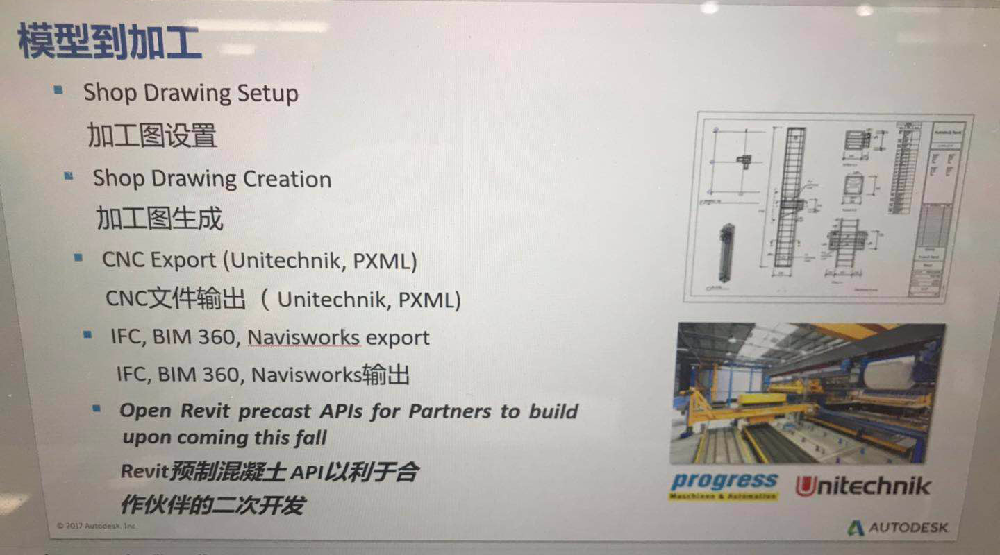

<head>
<meta http-equiv="Content-Type" content="text/html; charset=utf-8">
<link rel="stylesheet" type="text/css" href="bc.css">

</head>

<!---

- precast api
  [Q] I saw a slide on Precast for Revit. The slide also indicates the Precast also exposes an API.
  Could you direct where the API document is? It sounds as if it has its own specific API, instead of general Revit API.
  [A] here is a blog post discussing the Autodesk Structural Precast Extension for Revit 2019, including a section on the API for precast automation:
  https://blogs.autodesk.com/revit/2018/05/09/new-structural-precast-extension-for-revit-2019/
  img/precast_api_slide.jpg

- https://thebuildingcoder.typepad.com/blog/2018/04/whats-new-in-the-revit-2019-api.html#comment-4464470775

- https://forums.autodesk.com/t5/revit-api-forum/how-to-implement-iopenfromcloudcallback-interface/m-p/8794693#M38829

twitter:

Structural Precast API, cloud open callback interface and default implementation in the #RevitAPI @AutodeskForge @AutodeskRevit #bim #DynamoBim #ForgeDevCon http://bit.ly/precastapi

As usual, I am over-active in the Revit API discussion forum, so you can see most of what I have been up to right there.
Here and now, I'll highlight one of those threads and clarify how to access the Revit 2019 Precast API
&ndash; Structural Precast API
&ndash; <code>IOpenFromCloudCallback</code> and the <code>DefaultOpenFromCloudCallback</code> class...

linkedin:

Structural Precast API, cloud open callback interface and default implementation in the #RevitAPI

http://bit.ly/precastapi

As usual, I am over-active in the Revit API discussion forum, so you can see most of what I have been up to right there.

Here and now, I'll highlight one of those threads and clarify how to access the Revit 2019 Precast API:

- Structural Precast API
- <code>IOpenFromCloudCallback</code> and the <code>DefaultOpenFromCloudCallback</code> class...

#bim #DynamoBim #ForgeDevCon #Revit #API #IFC #SDK #AI #VisualStudio #Autodesk #AEC #adsk

-->

### Precast API and Cloud Open Callback

As usual, I am over-active in 
the [Revit API discussion forum](http://forums.autodesk.com/t5/revit-api-forum/bd-p/160), so
you can see most of what I have been up to right there.

Here and now, I'll highlight one of those threads and clarify how to access the Revit 2019 Precast API:

- [Structural Precast API](#2) 
- [`IOpenFromCloudCallback` and the `DefaultOpenFromCloudCallback` class](#3) 

#### Structural Precast API

**Question:** I saw a slide on Precast for Revit:

The slide indicates that Precast also exposes an API.

It sounds as if it has its own specific API, instead of the general Revit API.

Where can I find some information on this API, please?

**Answer:** Check out the blog posts discussing
the [Structural Precast Extension](https://blogs.autodesk.com/revit/tag/structural-precast-extension), especially 
the [Autodesk Structural Precast Extension for Revit 2019](https://blogs.autodesk.com/revit/2018/05/09/new-structural-precast-extension-for-revit-2019).

It includes a section on the *API for precast automation*.

Its software installation folder *%programfiles%/Autodesk/Structural Precast for Revit 2019* provides a subfolder named `SDK` containing:

- A help file that listing all the exposed classes, methods and properties;
- An archive containing code samples

 
#### IOpenFromCloudCallback and the DefaultOpenFromCloudCallback Class

Next, let's highlight a question raised in
a [comment](https://thebuildingcoder.typepad.com/blog/2018/04/whats-new-in-the-revit-2019-api.html#comment-4464470775)
on [What's New in the Revit 2019 API](https://thebuildingcoder.typepad.com/blog/2018/04/whats-new-in-the-revit-2019-api.html) and
also in 
the [Revit API discussion forum](http://forums.autodesk.com/t5/revit-api-forum/bd-p/160) thread
on [how to implement `IOpenFromCloudCallback` interface](https://forums.autodesk.com/t5/revit-api-forum/how-to-implement-iopenfromcloudcallback-interface/m-p/8794693):

**Question:** I am using the Revit API 2019 to detach a model from BIM360 with the following code: 

<pre class="code">
&nbsp;&nbsp;UIApplication&nbsp;app&nbsp;=&nbsp;commandData.Application;
 
&nbsp;&nbsp;string&nbsp;path&nbsp;=&nbsp;&quot;BIM&nbsp;360://myfile&quot;;
&nbsp;&nbsp;ModelPath&nbsp;modelPath&nbsp;=&nbsp;ModelPathUtils
&nbsp;&nbsp;&nbsp;&nbsp;.ConvertUserVisiblePathToModelPath(&nbsp;path&nbsp;);
 
&nbsp;&nbsp;OpenOptions&nbsp;openOptions&nbsp;=&nbsp;new&nbsp;OpenOptions();
&nbsp;&nbsp;openOptions.DetachFromCentralOption&nbsp;
&nbsp;&nbsp;&nbsp;&nbsp;=&nbsp;DetachFromCentralOption.DetachAndDiscardWorksets;
 
&nbsp;&nbsp;using(&nbsp;Transaction&nbsp;t&nbsp;=&nbsp;new&nbsp;Transaction(&nbsp;doc&nbsp;)&nbsp;)
&nbsp;&nbsp;{
&nbsp;&nbsp;&nbsp;&nbsp;t.Start(&nbsp;&quot;Open&nbsp;Cloud&nbsp;model&quot;&nbsp;);
 
&nbsp;&nbsp;&nbsp;&nbsp;app.OpenAndActivateDocument(&nbsp;modelPath,&nbsp;
&nbsp;&nbsp;&nbsp;&nbsp;&nbsp;&nbsp;openOptions,&nbsp;true,&nbsp;IOpenFromCloudCallback&nbsp;);
 
&nbsp;&nbsp;&nbsp;&nbsp;t.Commit();
&nbsp;&nbsp;}
</pre>

The problem is, I don't know how to implement `IOpenFromCloudCallback` correctly, so if anyone has experience with this, please help me. 

Thank you so much :)

Later: I just figured out how to implement it like this:

<pre class="code">
&nbsp;&nbsp;public&nbsp;Result&nbsp;Execute(&nbsp;
&nbsp;&nbsp;&nbsp;&nbsp;ExternalCommandData&nbsp;commandData,&nbsp;
&nbsp;&nbsp;&nbsp;&nbsp;ref&nbsp;string&nbsp;message,&nbsp;
&nbsp;&nbsp;&nbsp;&nbsp;ElementSet&nbsp;elements&nbsp;)
&nbsp;&nbsp;{
&nbsp;&nbsp;&nbsp;&nbsp;UIDocument&nbsp;uIDocument&nbsp;=&nbsp;commandData.Application.ActiveUIDocument;
&nbsp;&nbsp;&nbsp;&nbsp;UIApplication&nbsp;app&nbsp;=&nbsp;commandData.Application;
&nbsp;&nbsp;&nbsp;&nbsp;Document&nbsp;document&nbsp;=&nbsp;uIDocument.Document;
&nbsp;&nbsp;&nbsp;&nbsp;View&nbsp;currentview&nbsp;=&nbsp;document.ActiveView;
 
&nbsp;&nbsp;&nbsp;&nbsp;Guid&nbsp;projectid&nbsp;=&nbsp;Guid.Parse(&nbsp;&quot;myProjectGUID&quot;&nbsp;);
&nbsp;&nbsp;&nbsp;&nbsp;Guid&nbsp;modelid&nbsp;=&nbsp;Guid.Parse(&nbsp;&quot;myModelGUID&quot;&nbsp;);
 
&nbsp;&nbsp;&nbsp;&nbsp;ModelPath&nbsp;modelPath&nbsp;=&nbsp;ModelPathUtils
&nbsp;&nbsp;&nbsp;&nbsp;&nbsp;&nbsp;.ConvertCloudGUIDsToCloudPath(&nbsp;projectid,&nbsp;modelid&nbsp;);
 
&nbsp;&nbsp;&nbsp;&nbsp;OpenOptions&nbsp;openOptions&nbsp;=&nbsp;new&nbsp;OpenOptions();
&nbsp;&nbsp;&nbsp;&nbsp;IOpenFromCloudCallback&nbsp;openFromCloudCallback&nbsp;
&nbsp;&nbsp;&nbsp;&nbsp;&nbsp;&nbsp;=&nbsp;new&nbsp;cloudinterdace();
 
&nbsp;&nbsp;&nbsp;&nbsp;app.OpenAndActivateDocument(&nbsp;modelPath,&nbsp;
&nbsp;&nbsp;&nbsp;&nbsp;&nbsp;&nbsp;openOptions,&nbsp;true,&nbsp;openFromCloudCallback&nbsp;);
 
&nbsp;&nbsp;&nbsp;&nbsp;return&nbsp;Result.Succeeded;
&nbsp;&nbsp;}
 
public&nbsp;class&nbsp;cloudinterdace&nbsp;:&nbsp;IOpenFromCloudCallback
{
&nbsp;&nbsp;public&nbsp;OpenConflictResult&nbsp;OnOpenConflict(&nbsp;
&nbsp;&nbsp;&nbsp;&nbsp;OpenConflictScenario&nbsp;scenario&nbsp;)
&nbsp;&nbsp;{
&nbsp;&nbsp;&nbsp;&nbsp;throw&nbsp;new&nbsp;NotImplementedException();
&nbsp;&nbsp;}
}
</pre>

**Answer by Phil Xia:** I am Phil from Revit engineering team.

I saw your sample and the exception thrown in your implementation of `IOpenFromCloudCallback`.
That is probably not a good choice.

You can use the default implementation provided by the `DefaultOpenFromCloudCallback` class that will always use the latest version for an open conflict.

Here is the introduction for this callback in the *Revit API 2019 What's New* sections
on [Existing APIs now support open from cloud paths (Collaboration for Revit)](https://thebuildingcoder.typepad.com/blog/2018/04/whats-new-in-the-revit-2019-api.html#4.1.5)
and [Callback for conflict cases when opening from a cloud path](https://thebuildingcoder.typepad.com/blog/2018/04/whats-new-in-the-revit-2019-api.html#4.1.5.2):

The callback method:

- Autodesk.Revit.DB.IOpenFromCloudCallback.OnOpenConflict()

can be passed to the document open methods to gain to handle conflict cases.
The method is passed an `OpenConflictScenario` value identifying the reason for the conflict (Rollback, Relinquished or OutOfDate) and should return an `OpenConflictResult` with the desired response (keep local changes, discard local changes and open the latest version or cancel).

The new class:

- DefaultOpenFromCloudCallback

provides a default way to handle conflicts: it always discards the local change and gets the latest version from the cloud.

 

The [`OpenConflictScenario` enumeration](https://www.revitapidocs.com/2019/7db711fa-cfb1-39da-a184-5aaf4230b660.htm) lists the values you can use to implement your handling logic to return `KeepLocalChanges`, `DiscardLocalChangesAndOpenLatestVersion` or just cancel the opening.

- Rollback &ndash; Central model is restored to an earlier version.
- Relinquished &ndash; Ownership to model elements is relinquished.
- OutOfDate &ndash; Model is out of date.

Many thanks to Phil for jumping in and clarifying!

