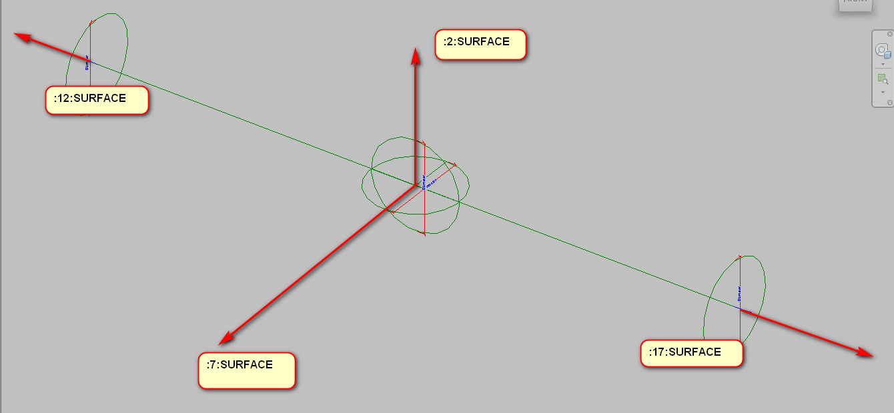

<head>
<meta http-equiv="Content-Type" content="text/html; charset=utf-8">
<link rel="stylesheet" type="text/css" href="bc.css">

</head>

<!---

- HOK Mission Control .NET
  https://github.com/HOKGroup/HOK-Revit-Addins/tree/master/HOK.MissionControl
  archi-lab
  [playing with Power Shell commands and Post Build events](http://archi-lab.net/playing-with-power-shell-commands-and-post-build-events)
  BY KONRAD K SOBON

  [code signing of your revit plug-ins](http://archi-lab.net/code-signing-of-your-revit-plug-ins)

- create connectors on reference line
  https://forums.autodesk.com/t5/revit-api-forum/creating-connectors-on-reference-line/m-p/8707761
  
twitter:

Secret reference line faces in the #RevitAPI @AutodeskForge @AutodeskRevit #bim #DynamoBim #ForgeDevCon http://bit.ly/reflinefaces

The open source space around the Revit API is continuously growing richer, solutions are shared and exciting discoveries are made, both in
the Revit API discussion forum and elsewhere
&ndash; Debugging, code signing and HOK Mission Control
&ndash; Creating connectors on a reference line...

linkedin:

Secret reference line faces in the #RevitAPI

http://bit.ly/reflinefaces

The open source space around the Revit API is continuously growing richer, solutions are shared and exciting discoveries are made, both in
the Revit API discussion forum and elsewhere:

- Debugging, code signing and HOK Mission Control
- Creating connectors on a reference line...

#bim #DynamoBim #ForgeDevCon #Revit #API #IFC #SDK #AI #VisualStudio #Autodesk #AEC #adsk

-->

### Secret Reference Line Faces

The open source space around the Revit API is continuously growing richer, solutions are shared and exciting discoveries are made, both in
the [Revit API discussion forum](http://forums.autodesk.com/t5/revit-api-forum/bd-p/160) and elsewhere:

- [Debugging, code signing and HOK Mission Control](#2)
- [Creating connectors on a reference line](#3)

#### Debugging, Code Signing and HOK Mission Control  

Yesterday I happened to notice a tweet
by Konrad Sobon, [@arch_laboratory](https://twitter.com/arch_laboratory), pointing
out a couple of exciting blog posts
on [archi+lab](http://archi-lab.net), e.g.:

- [Debugging Revit add-ins](http://archi-lab.net/debugging-revit-add-ins)
- [Code signing of your Revit plug-ins](http://archi-lab.net/code-signing-of-your-revit-plug-ins)
- [Playing with Power Shell commands and Post Build events](http://archi-lab.net/playing-with-power-shell-commands-and-post-build-events)

The latter one discusses some aspects of
the [Mission Control repository](https://github.com/HOKGroup/HOK-Revit-Addins/tree/master/HOK.MissionControl) and
making it easier to pull, build, and deploy.

In fact, it is worth while taking a look at all
the open source [HOK Revit Addins](https://github.com/HOKGroup/HOK-Revit-Addins).

This is all very exciting stuff indeed.

Browsing further, I also discovered that Konrad just started
the [next chapter](http://archi-lab.net/next-chapter) of his career.

Congratulations, Konrad!

The best of luck to you, and have fun!

#### Creating Connectors on a Reference Line

[MarryTookMyCoffe](https://forums.autodesk.com/t5/user/viewprofilepage/user-id/3894260) points
out a surprising and useful possibility 
for [creating connectors on a reference line](https://forums.autodesk.com/t5/revit-api-forum/creating-connectors-on-reference-line/m-p/8707761):

I made some tests and thought I will share my results with the forum:

The problem with putting connectors on a reference line is that the API doesn’t give us any references to any surfaces, no matter for what view we ask.

There is however a way to get around this one by adding a secret suffix to the unique id and calling the `ParseFromStableRepresentation` method on it:

<pre>
  Reference.ParseFromStableRepresentation(
    document, uniqueID );
</pre>

With the right secret suffix, this can be used to retrieve a reference to a face on the reference line.

With lots of trial and error, we learned that the codes for specific faces will be always the same:

For example, let's look at this stable representation:

<pre>
  3ded2a48-367f-42c7-83bd-9fd4f659891a-00000fd0:2
</pre>

Here is a table summarising the possible secret suffixes:

<table>
<tr><td style="text-align: right">3ded2a48-367f-42c7-83bd&nbsp;&nbsp;&nbsp; -9fd4f659891a-00000fd0&nbsp;&nbsp;&nbsp;</td><td>The Reference Line unique id</td></tr>
<tr><td style="text-align: right">:0&nbsp;&nbsp;&nbsp;</td><td>ref to line</td></tr>
<tr><td style="text-align: right">:1&nbsp;&nbsp;&nbsp;</td><td>ref to solid</td></tr>
<tr><td style="text-align: right">:2&nbsp;&nbsp;&nbsp;</td><td>ref to face</td></tr>
<tr><td style="text-align: right">:7&nbsp;&nbsp;&nbsp;</td><td>ref to face</td></tr>
<tr><td style="text-align: right">:12&nbsp;&nbsp;&nbsp;</td><td>ref to face</td></tr>
<tr><td style="text-align: right">:17&nbsp;&nbsp;&nbsp;</td><td>ref to face</td></tr>
</table>

The gaps between the numbers may seems strange, but I think that after every face, we have hidden edges of this face; what would explain the numeration.

[Q] Does that apply to each and every reference line?

[A] Yes, it applies to every reference line, always the same numbers.

[Q] So each reference line implicitly defines a solid and four faces?

[A] Faces are in the solid, but yes.

[Q] What solid is that?

[A] Similar to an extrusion, you can get a solid of the object with faces and lines, with the only difference that its faces don't have references. I guess the programmer forgot to set up this property.

[Q] Can you share a concrete use case for this?

[A] I use reference line with connectors in all fittings and accessories; that enables my family definition to work with minimal graphics. That way, you can easily define a family with low details (that is important in GB) and high details (that is important in Russia), without messing up how they work.

I plan to go even further and implement an auto-creation tool for fittings, accessories, and mechanical equipment. 

The idea was to add to any family made on the market the same functionality that our families have &ndash; all you have to do is set length and type of connection, like: thread, pressed, etc.

Very many thanks to MarryTookMyCoffe for discovering and sharing this valuable insight!

<i>once downhill, once uphill, but always on foot.</i>

