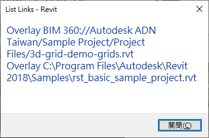
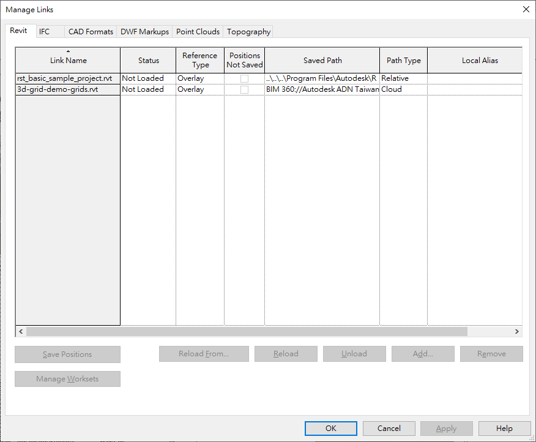
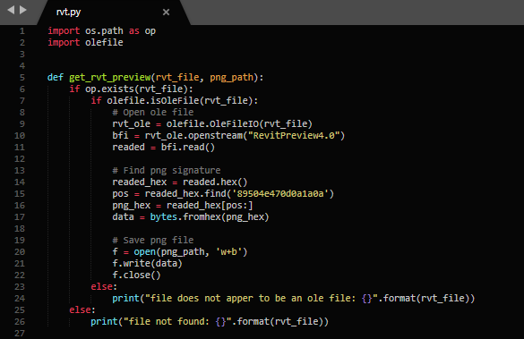

<head>
<meta http-equiv="Content-Type" content="text/html; charset=utf-8">
<link rel="stylesheet" type="text/css" href="bc.css">

</head>

<!---

twitter:

Accessing BIM360 cloud links, RVT thumbnail, Dynamo, a MacBook slowdown solution and a German political video upheaval with and without the #RevitAPI @AutodeskForge @AutodeskRevit #bim #DynamoBim #ForgeDevCon http://bit.ly/bim360links

This post is somewhat overdue and hence rather full of various topics, mainly due to my struggles with my MacBook slowing to an unbearable crawl in the heat last week
&ndash; Accessing BIM360 cloud links
&ndash; Retrieve RVT preview thumbnail image with Python
&ndash; Paolo's Dynamo primer and slide deck compendium
&ndash; Slow MacBook with kernel_task using several 100% CPU
&ndash; Failings of the political establishment...

linkedin:

Accessing BIM360 cloud links, RVT thumbnail, Dynamo, a MacBook slowdown solution and a German political video upheaval with and without the #RevitAPI

http://bit.ly/bim360links

This post is somewhat overdue and hence rather full of various topics, mainly due to my struggles with my MacBook slowing to an unbearable crawl in the heat last week:

- Accessing BIM360 cloud links
- Retrieve RVT preview thumbnail image with Python
- Paolo's Dynamo primer and slide deck compendium
- Slow MacBook with kernel_task using several 100% CPU
- Failings of the political establishment...

#bim #DynamoBim #ForgeDevCon #Revit #API #IFC #SDK #AI #VisualStudio #Autodesk #AEC #adsk

the [Revit API discussion forum](http://forums.autodesk.com/t5/revit-api-forum/bd-p/160) thread

-->

### Access BIM360 Cloud Links, Thumbnail and Dynamo

This post is somewhat overdue and hence rather full of various topics, mainly due to my struggles with my MacBook slowing to an unbearable crawl in the heat last week:

- [Accessing BIM360 cloud links](#2)
- [Retrieve RVT preview thumbnail image with Python](#3)
- [Paolo's Dynamo primer and slide deck compendium](#4)
- [Slow MacBook with kernel_task using several 100% CPU](#5)
- [Failings of the political establishment](#6)

#### Accessing BIM360 Cloud Links

My colleague Eason Kang researched how to access BIM360 file links in a Revit project and summarised the results for us:

**Question:** In Revit 2017, I used a method based on `ExternalFileReferences` to report linked files hosted in BIM360.

In Revit 2019, this method no longer works.

- `TransmissionData` `GetAllExternalFileReferenceIds`, used in the sample
to [list linked files and `TransmissionData`](http://thebuildingcoder.typepad.com/blog/2011/05/list-linked-files-and-transmissiondata.html),
does not report links hosted in BIM360.
It reports local files that are linked only.
This is an old sample.
- Similarly, the `ExternalFileUtils` `GetAllExternalFileReferences` method does not return these items.

Has there been a change in this area?

Is there a different method we should be using?

**Answer:** Neither of these two methods support cloud links in Revit 2018 or Revit 2019.

In Revit 2017, they appeared to work, because back then, the cloud links were downloaded as local copies by the Autodesk Desktop Connector before linking.

Nowadays, BIM360 cloud links are treated as external sources. This behaviour started from with Revit 2018.

Therefore, please use `ExternalResourceUtils` `GetAllExternalResourceReferences` instead.

Here is a working code snippet:

<pre class="code">
&nbsp;&nbsp;//&nbsp;Obtain&nbsp;all&nbsp;external&nbsp;resource&nbsp;references&nbsp;
&nbsp;&nbsp;//&nbsp;(saying&nbsp;BIM360&nbsp;Cloud&nbsp;references&nbsp;and&nbsp;local&nbsp;
&nbsp;&nbsp;//&nbsp;file&nbsp;references&nbsp;this&nbsp;time)

&nbsp;&nbsp;ISet&lt;ElementId&gt;&nbsp;xrefs&nbsp;=&nbsp;ExternalResourceUtils
&nbsp;&nbsp;&nbsp;&nbsp;.GetAllExternalResourceReferences(&nbsp;doc&nbsp;);

&nbsp;&nbsp;string&nbsp;caption&nbsp;=&nbsp;&quot;BIM360&nbsp;Links&quot;;

&nbsp;&nbsp;try
&nbsp;&nbsp;{
&nbsp;&nbsp;&nbsp;&nbsp;int&nbsp;n&nbsp;=&nbsp;0;
&nbsp;&nbsp;&nbsp;&nbsp;var&nbsp;msg&nbsp;=&nbsp;string.Empty;

&nbsp;&nbsp;&nbsp;&nbsp;foreach(&nbsp;ElementId&nbsp;eid&nbsp;in&nbsp;xrefs&nbsp;)
&nbsp;&nbsp;&nbsp;&nbsp;{
&nbsp;&nbsp;&nbsp;&nbsp;&nbsp;&nbsp;var&nbsp;elem&nbsp;=&nbsp;doc.GetElement(&nbsp;eid&nbsp;);
&nbsp;&nbsp;&nbsp;&nbsp;&nbsp;&nbsp;if(&nbsp;elem&nbsp;==&nbsp;null&nbsp;)&nbsp;continue;

&nbsp;&nbsp;&nbsp;&nbsp;&nbsp;&nbsp;//&nbsp;Get&nbsp;RVT&nbsp;document&nbsp;links&nbsp;only&nbsp;this&nbsp;time

&nbsp;&nbsp;&nbsp;&nbsp;&nbsp;&nbsp;var&nbsp;link&nbsp;=&nbsp;elem&nbsp;as&nbsp;RevitLinkType;
&nbsp;&nbsp;&nbsp;&nbsp;&nbsp;&nbsp;if(&nbsp;link&nbsp;==&nbsp;null&nbsp;)&nbsp;continue;

&nbsp;&nbsp;&nbsp;&nbsp;&nbsp;&nbsp;var&nbsp;map&nbsp;=&nbsp;link.GetExternalResourceReferences();
&nbsp;&nbsp;&nbsp;&nbsp;&nbsp;&nbsp;var&nbsp;keys&nbsp;=&nbsp;map.Keys;

&nbsp;&nbsp;&nbsp;&nbsp;&nbsp;&nbsp;foreach(&nbsp;var&nbsp;key&nbsp;in&nbsp;keys&nbsp;)
&nbsp;&nbsp;&nbsp;&nbsp;&nbsp;&nbsp;{
&nbsp;&nbsp;&nbsp;&nbsp;&nbsp;&nbsp;&nbsp;&nbsp;var&nbsp;reference&nbsp;=&nbsp;map[key];

&nbsp;&nbsp;&nbsp;&nbsp;&nbsp;&nbsp;&nbsp;&nbsp;//&nbsp;Contains&nbsp;Forge&nbsp;BIM360&nbsp;ProjectId&nbsp;
&nbsp;&nbsp;&nbsp;&nbsp;&nbsp;&nbsp;&nbsp;&nbsp;//&nbsp;(i.e.,&nbsp;LinkedModelModelId)&nbsp;and&nbsp;
&nbsp;&nbsp;&nbsp;&nbsp;&nbsp;&nbsp;&nbsp;&nbsp;//&nbsp;ModelId&nbsp;(i.e.,&nbsp;LinkedModelModelId)&nbsp;
&nbsp;&nbsp;&nbsp;&nbsp;&nbsp;&nbsp;&nbsp;&nbsp;//&nbsp;if&nbsp;it&#39;s&nbsp;from&nbsp;BIM360&nbsp;Docs.&nbsp;
&nbsp;&nbsp;&nbsp;&nbsp;&nbsp;&nbsp;&nbsp;&nbsp;//&nbsp;They&nbsp;can&nbsp;be&nbsp;used&nbsp;in&nbsp;calls&nbsp;to
&nbsp;&nbsp;&nbsp;&nbsp;&nbsp;&nbsp;&nbsp;&nbsp;//&nbsp;ModelPathUtils.ConvertCloudGUIDsToCloudPath.

&nbsp;&nbsp;&nbsp;&nbsp;&nbsp;&nbsp;&nbsp;&nbsp;var&nbsp;dictinfo&nbsp;=&nbsp;reference.GetReferenceInformation();

&nbsp;&nbsp;&nbsp;&nbsp;&nbsp;&nbsp;&nbsp;&nbsp;//&nbsp;Link&nbsp;Name&nbsp;shown&nbsp;on&nbsp;the&nbsp;Manage&nbsp;Links&nbsp;dialog

&nbsp;&nbsp;&nbsp;&nbsp;&nbsp;&nbsp;&nbsp;&nbsp;var&nbsp;displayName&nbsp;=&nbsp;reference.GetResourceShortDisplayName();
&nbsp;&nbsp;&nbsp;&nbsp;&nbsp;&nbsp;&nbsp;&nbsp;var&nbsp;path&nbsp;=&nbsp;reference.InSessionPath;
&nbsp;&nbsp;&nbsp;&nbsp;&nbsp;&nbsp;}

&nbsp;&nbsp;&nbsp;&nbsp;&nbsp;&nbsp;try
&nbsp;&nbsp;&nbsp;&nbsp;&nbsp;&nbsp;{
&nbsp;&nbsp;&nbsp;&nbsp;&nbsp;&nbsp;&nbsp;&nbsp;//&nbsp;Load&nbsp;model&nbsp;temporarily&nbsp;to&nbsp;get&nbsp;the&nbsp;model&nbsp;
&nbsp;&nbsp;&nbsp;&nbsp;&nbsp;&nbsp;&nbsp;&nbsp;//&nbsp;path&nbsp;of&nbsp;the&nbsp;cloud&nbsp;link

&nbsp;&nbsp;&nbsp;&nbsp;&nbsp;&nbsp;&nbsp;&nbsp;var&nbsp;result&nbsp;=&nbsp;link.Load();

&nbsp;&nbsp;&nbsp;&nbsp;&nbsp;&nbsp;&nbsp;&nbsp;//&nbsp;Link&nbsp;ModelPath&nbsp;for&nbsp;Revit&nbsp;internal&nbsp;use

&nbsp;&nbsp;&nbsp;&nbsp;&nbsp;&nbsp;&nbsp;&nbsp;var&nbsp;mdPath&nbsp;=&nbsp;result.GetModelName();

&nbsp;&nbsp;&nbsp;&nbsp;&nbsp;&nbsp;&nbsp;&nbsp;link.Unload(&nbsp;null&nbsp;);

&nbsp;&nbsp;&nbsp;&nbsp;&nbsp;&nbsp;&nbsp;&nbsp;//&nbsp;Convert&nbsp;model&nbsp;path&nbsp;to&nbsp;user&nbsp;visible&nbsp;path,&nbsp;
&nbsp;&nbsp;&nbsp;&nbsp;&nbsp;&nbsp;&nbsp;&nbsp;//&nbsp;i.e.,&nbsp;saved&nbsp;Path&nbsp;shown&nbsp;on&nbsp;the&nbsp;Manage&nbsp;Links&nbsp;
&nbsp;&nbsp;&nbsp;&nbsp;&nbsp;&nbsp;&nbsp;&nbsp;//&nbsp;dialog

&nbsp;&nbsp;&nbsp;&nbsp;&nbsp;&nbsp;&nbsp;&nbsp;var&nbsp;path&nbsp;=&nbsp;ModelPathUtils
&nbsp;&nbsp;&nbsp;&nbsp;&nbsp;&nbsp;&nbsp;&nbsp;&nbsp;&nbsp;.ConvertModelPathToUserVisiblePath(&nbsp;mdPath&nbsp;);

&nbsp;&nbsp;&nbsp;&nbsp;&nbsp;&nbsp;&nbsp;&nbsp;//&nbsp;Reference&nbsp;Type&nbsp;shown&nbsp;on&nbsp;the&nbsp;Manage&nbsp;Links&nbsp;dialog

&nbsp;&nbsp;&nbsp;&nbsp;&nbsp;&nbsp;&nbsp;&nbsp;var&nbsp;refType&nbsp;=&nbsp;link.AttachmentType;

&nbsp;&nbsp;&nbsp;&nbsp;&nbsp;&nbsp;&nbsp;&nbsp;msg&nbsp;+=&nbsp;string.Format(&nbsp;&quot;{0}&nbsp;{1}\r\n&quot;,&nbsp;
&nbsp;&nbsp;&nbsp;&nbsp;&nbsp;&nbsp;&nbsp;&nbsp;&nbsp;&nbsp;link.AttachmentType,&nbsp;path&nbsp;);

&nbsp;&nbsp;&nbsp;&nbsp;&nbsp;&nbsp;&nbsp;&nbsp;++n;
&nbsp;&nbsp;&nbsp;&nbsp;&nbsp;&nbsp;}
&nbsp;&nbsp;&nbsp;&nbsp;&nbsp;&nbsp;catch(&nbsp;Exception&nbsp;ex&nbsp;)&nbsp;//&nbsp;never&nbsp;catch&nbsp;all&nbsp;exceptions!
&nbsp;&nbsp;&nbsp;&nbsp;&nbsp;&nbsp;{
&nbsp;&nbsp;&nbsp;&nbsp;&nbsp;&nbsp;&nbsp;&nbsp;TaskDialog.Show(&nbsp;caption,&nbsp;ex.Message&nbsp;);
&nbsp;&nbsp;&nbsp;&nbsp;&nbsp;&nbsp;}
&nbsp;&nbsp;&nbsp;&nbsp;}

&nbsp;&nbsp;&nbsp;&nbsp;caption&nbsp;=&nbsp;string.Format(&nbsp;&quot;{0}&nbsp;BIM360&nbsp;Link{1}&quot;,&nbsp;
&nbsp;&nbsp;&nbsp;&nbsp;&nbsp;&nbsp;n,&nbsp;Util.PluralSuffix(&nbsp;n&nbsp;)&nbsp;);

&nbsp;&nbsp;&nbsp;&nbsp;TaskDialog.Show(&nbsp;caption,&nbsp;msg&nbsp;);
&nbsp;&nbsp;}
&nbsp;&nbsp;catch(&nbsp;Exception&nbsp;ex&nbsp;)
&nbsp;&nbsp;{
&nbsp;&nbsp;&nbsp;&nbsp;TaskDialog.Show(&nbsp;caption,&nbsp;ex.Message&nbsp;);
&nbsp;&nbsp;}
</pre>

Here are snapshots of the result:

Many thanks to Eason for this research and clear explanation!

I added this sample code
to [The Building Coder samples](https://github.com/jeremytammik/the_building_coder_samples)
as a new external
command [CmdBim360Links ](https://github.com/jeremytammik/the_building_coder_samples/blob/master/BuildingCoder/BuildingCoder/CmdBim360Links.cs)
in [release 2020.0.146.0](https://github.com/jeremytammik/the_building_coder_samples/releases/tag/2020.0.146.0)

#### Retrieve RVT Preview Thumbnail Image with Python

Franco Tonutti researched and solved how to retrieve the RVT preview thumbnail image with Python
in [his](https://thebuildingcoder.typepad.com/blog/2017/06/determining-rvt-file-version-using-python.html#comment-4484205626)
[comments](https://thebuildingcoder.typepad.com/blog/2017/06/determining-rvt-file-version-using-python.html#comment-4486812442)
on [determining the RVT file version using Python](https://thebuildingcoder.typepad.com/blog/2017/06/determining-rvt-file-version-using-python.html)

**Question:** Hi Jeremy, how can I get the preview image of a .rfa file?

I'm trying the following without success:

<pre class="prettyprint">
  import os.path as op
  import olefile

  def get_rvt_preview(rvt_file):
    if op.exists(rvt_file):
      if olefile.isOleFile(rvt_file):
        rvt_ole = olefile.OleFileIO(rvt_file)
        bfi = rvt_ole.openstream("RevitPreview4.0")
        readed = bfi.read()
        f = open('my_file.bmp', 'w+b')
        f.write(readed)
        f.close()
      else:
        print("file does not apper to be an ole file: {}".format(rvt_file))
    else:
      print("file not found: {}".format(rvt_file))
</pre>

**Answer:** I have not looked into this for a while.

Please take a look at the other explorations reading RVT files without using the Revit API:

- [Open Revit OLE Storage](http://thebuildingcoder.typepad.com/blog/2010/06/open-revit-ole-storage.html)
- [Basic File Info and RVT File Version](http://thebuildingcoder.typepad.com/blog/2013/01/basic-file-info-and-rvt-file-version.html)
- [Custom File Properties](https://thebuildingcoder.typepad.com/blog/2015/09/lunar-eclipse-and-custom-file-properties.html#3)
- [Reading an RVT File without Revit](http://thebuildingcoder.typepad.com/blog/2016/02/reading-an-rvt-file-without-revit.html)
- [Determining RVT File Version Using Python](http://thebuildingcoder.typepad.com/blog/2017/06/determining-rvt-file-version-using-python.html)

**Response:** Thank you very much.

I solved the problem by looking for
the [PNG file signature](https://www.filesignatures.net/index.php?page=search&search=89504E470D0A1A0A&mode=SIG) `89504e470d0a1a0a`:

<pre class="prettyprint">
def get_rvt_preview(rvt_file, png_path):
  if op.exists(rvt_file):
    if olefile.isOleFile(rvt_file):
      # Open ole file
      rvt_ole = olefile.OleFileIO(rvt_file)
      bfi = rvt_ole.openstream("RevitPreview4.0")
      readed = bfi.read()

      # Find png signature
      readed_hex = readed.hex()
      pos = readed_hex.find('89504e470d0a1a0a')
      png_hex = readed_hex[pos:]
      data = bytes.fromhex(png_hex)

      # Save png file
      f = open(png_path, 'w+b')
      f.write(data)
      f.close()
    else:
      print("file does not apper to be an ole file: {}".format(rvt_file))
  else:
    print("file not found: {}".format(rvt_file))
</pre>

#### Paolo's Dynamo Primer and Slide Deck Compendium

I already mentioned
Paolo Serra's [Dynamo Primer](https://primer.dynamobim.org)
discussing [Revit API versus Dynamo for Revit](https://thebuildingcoder.typepad.com/blog/2018/12/dynamo-symbol-vs-type-and-exporter-exception.html#2).

Here is another very valuable and extensive related resource of his, covering numerous aspects of Dynamo, its features, Python, the Revit API and the relationships between them.

> In terms of Dynamo for Revit you can refer to my [Dynamo Primer](https://primer.dynamobim.org),
specifically chapter 8 for the integration with Revit.

> You can also check out the slide deck compendium I put together over the years that covers the basics of the Revit API and how to access it through Dynamo and Python
at

<a href="https://a360.co/2LfuM5p">a360.co/2LfuM5p</a>

> It includes the following sections:

> - Dynamo Overview
- User Interface
- Graphs Management
- Autodesk Standards
- Visual Programming Principles
- Filtering, Grouping & Sorting
- Dynamo-Excel Link
- Design Script
- Geometry Library
- Automation Applications
- Dynamo for Revit
- Dynamo and Python
- Object Oriented Programming
- Revit API Introduction
- Next Steps

#### Slow MacBook with kernel_task Using Several 100% CPU

As I mentioned in the introduction above, after three years or so, my MacBook Pro slowed down to an unusable crawl, especially when it got warm.

I looked at the results in the activity monitor, worrying about a virus, and only saw that the `kernel_task` was often using several hundred percent of the CPU.

After weeks of this, I decided to upgrade OSX to the newest version to see whether that would help.

The upgrade went fine, and at least the situation was no worse.

Soon, however, the slowdown worsened still further.

Finally, I found the solution:

This description
of [what `kernel_task` is, and why it is running on my Mac](https://www.howtogeek.com/310293/WHAT-IS-KERNEL_TASK-AND-WHY-IS-IT-RUNNING-ON-MY-MAC),
explains how `kernel_task` pretends to use CPU cycles to keep things cool.

That is confirmed by the Apple support thread
on [`kernel_task` using a large percentage of your Mac CPU](https://support.apple.com/en-us/HT207359).

In the next step, I looked at a helpful five-minute video
on [how to clean MacBook Pro fans](https://youtu.be/ABs0L2VpLuA).

Opening the MacBook is simple, but it does require the smallest screwdriver I have ever seen,
a [1.2 mm Pentalobe](https://en.wikipedia.org/wiki/List_of_screw_drives#Pentalobe):

I never opened the PC before myself.

Using that, however, it was easy to open and blow out the dust clogging the fans with a pressurised air spray can.

One fan was so clogged with dust it was probably not running at all.

It seems better now. Please keep your fingers crossed for me that it stays that way and continues working &nbsp; :-)

#### Failings of the Political Establishment

Turning from technical stuff to politics for a moment,
Rezo's German 55-minute [video about the failings of the established politicians](https://youtu.be/4Y1lZQsyuSQ) who
have been driving the planet to the brink of catastrophe, ignoring all scientifical evidence and economic indicators for several decades, caused quite a stir in the past few weeks, including affecting the recent election results:

<iframe width="560" height="315" src="https://www.youtube.com/embed/4Y1lZQsyuSQ" frameborder="0" allow="accelerometer; autoplay; encrypted-media; gyroscope; picture-in-picture" allowfullscreen></iframe>

I tested the auto-translated English subtitles for this video.
Sorry to say, they do not make much sense in this case.
