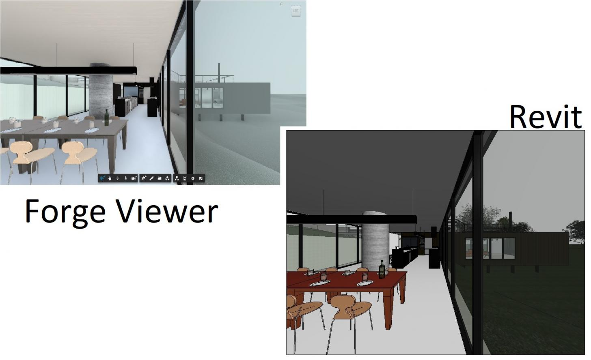

<head>
<meta http-equiv="Content-Type" content="text/html; charset=utf-8">
<link rel="stylesheet" type="text/css" href="bc.css">

</head>

<!---

- Map Forge Viewer Camera back to Revit
  https://forge.autodesk.com/blog/map-forge-viewer-camera-back-revit
  by Eason Kang
  converting camera state of the Viewer back to the Revit via Revit API

- project plasma
A discussion by AEC Magazine -- https://aecmag.com -- of the past, present, potential future of Revit and the long-term Autodesk vision for BIM:

What comes after Revit? Autodesk aims to reinvent collaborative BIM -- https://aecmag.com/technology-mainmenu-35/1821-beyond-revit-autodesk-seeks-to-reinvent-collaborative-bim

In 2016, Autodesk announced Project Quantum, described as a platform technology for “evolving the way BIM works, in the era of the cloud, by providing a common data environment”. The project then went dark but now it’s back and called Project Plasma

Awe inspiring
Data Contracts and Escrow
Quality issues
Asynchronous vs Synchronous
Speeding up Revit?
Revit development
Replacing Revit
Typical customers
Timeframe
Conclusion

The 'awe inspiring' section is based on an interview with chief software architect Jim Awe.

Data contracts also mention blockchain and other, more lightweight, legally secure and binding technologies.

...

A discussion by [AEC Magazine](https://aecmag.com) of the past, present, potential future of Revit and the long-term Autodesk vision for BIM
[What comes after Revit? Autodesk aims to reinvent collaborative BIM](https://aecmag.com/technology-mainmenu-35/1821-beyond-revit-autodesk-seeks-to-reinvent-collaborative-bim)
In 2016, Autodesk announced Project Quantum, described as a platform technology for “evolving the way BIM works, in the era of the cloud, by providing a common data environment”. The project then went dark but now it’s back and called Project Plasma
- Awe inspiring
- Data Contracts and Escrow
- Quality issues
- Asynchronous vs Synchronous
- Speeding up Revit?
- Revit development
- Replacing Revit
- Typical customers
- Timeframe
- Conclusion
The 'awe inspiring' section is based on an interview with chief software architect Jim Awe.
Data contracts also mention blockchain and other, more lightweight, legally secure and binding technologies.
Interestingly, AEC Magazine surmises that 'reading between the lines, Revit’s demise is a long way off, if ever'.

- mikako's da4r overview:
  [DA for Revit – Learning Materials](https://fieldofviewblog.wordpress.com/2019/05/24/da-for-revit-learning-materials)
  and [Where to Get Help about Forge])(https://fieldofviewblog.wordpress.com/2016/10/27/where-to-get-help-about-forge)

- AI game strategy
  very interesting link!
  fascinating!
  Read Manny's review of Game Changer: AlphaZero's Groundbreaking Chess Strategies and the Promise of AI by Matthew Sadler
  https://www.goodreads.com/review/show/2731237101

- AI Speech to gesture.  https://www.youtube.com/watch?time_continue=1&v=xzTE5sobpFY
  Project website containing paper and 144 hour person-specific video dataset of 10 speakers : http://people.eecs.berkeley.edu/~shiry/speech2gesture/
  [Learning Individual Styles of Conversational Gesture](https://www.youtube.com/watch?time_continue=1&amp=&v=xzTE5sobpFY)

twitter:

Project Quantum becomes Plasma, AI, DA4R and camera settings in the #RevitAPI @AutodeskForge @AutodeskRevit #bim #DynamoBim #ForgeDevCon http://bit.ly/plasma_camera

Here are this week's interesting items I want to share with you
&ndash; Map Forge Viewer camera settings back to Revit
&ndash; Project Quantum becomes Plasma
&ndash; Mikako's DA4R overview
&ndash; AI is affecting human game strategies
&ndash; AI can convert speech to gesture
&ndash; Barcelona Forge accelerator
&ndash; Open positions at Autodesk...

linkedin:

Project Quantum becomes Plasma, AI, DA4R and camera settings in the #RevitAPI

http://bit.ly/plasma_camera

Here are this week's interesting items I want to share with you:

- Map Forge Viewer camera settings back to Revit
- Project Quantum becomes Plasma
- Mikako's DA4R overview
- AI is affecting human game strategies
- AI can convert speech to gesture
- Barcelona Forge accelerator
- Open positions at Autodesk...

#bim #DynamoBim #ForgeDevCon #Revit #API #IFC #SDK #AI #VisualStudio #Autodesk #AEC #adsk

the [Revit API discussion forum](http://forums.autodesk.com/t5/revit-api-forum/bd-p/160) thread

-->

### Revit Camera Settings, Project Plasma, DA4R and AI

Once again, I have been spending way too much time answering questions in
the [Revit API discussion forum](http://forums.autodesk.com/t5/revit-api-forum/bd-p/160) and
much too little time writing for The Building Coder.

So, before the end of this week, here are some interesting items I want to share with you:

- [Map Forge Viewer camera settings back to Revit](#2)
- [Project Quantum becomes Plasma](#3)
- [Mikako's DA4R overview](#4)
- [AI is affecting human game strategies](#5)
- [AI can convert speech to gesture](#6)
- [Barcelona Forge accelerator](#7)
- [Open positions at Autodesk](#8)

#### Map Forge Viewer Camera Settings back to Revit

My colleague Eason Kang invested some research
in [converting the camera state of the Forge Viewer back to the Revit model via Revit API](https://forge.autodesk.com/blog/map-forge-viewer-camera-back-revit).

Here is the main gist of the Revit part of his solution:

<pre class="code">
///&nbsp;&lt;summary&gt;
///&nbsp;Create&nbsp;perspective&nbsp;view&nbsp;with&nbsp;camera&nbsp;settings&nbsp;
///&nbsp;matching&nbsp;the&nbsp;Forge&nbsp;Viewer.
///&nbsp;&lt;/summary&gt;
void&nbsp;CreatePerspectiveViewMatchingCamera(
&nbsp;&nbsp;Document&nbsp;doc&nbsp;)
{
&nbsp;&nbsp;using(&nbsp;var&nbsp;trans&nbsp;=&nbsp;new&nbsp;Transaction(&nbsp;doc&nbsp;)&nbsp;)
&nbsp;&nbsp;{
&nbsp;&nbsp;&nbsp;&nbsp;trans.Start(&nbsp;&quot;Map&nbsp;Forge&nbsp;Viewer&nbsp;Camera&quot;&nbsp;);

&nbsp;&nbsp;&nbsp;&nbsp;ViewFamilyType&nbsp;typ
&nbsp;&nbsp;&nbsp;&nbsp;&nbsp;&nbsp;=&nbsp;new&nbsp;FilteredElementCollector(&nbsp;doc&nbsp;)
&nbsp;&nbsp;&nbsp;&nbsp;&nbsp;&nbsp;&nbsp;&nbsp;.OfClass(&nbsp;typeof(&nbsp;ViewFamilyType&nbsp;)&nbsp;)
&nbsp;&nbsp;&nbsp;&nbsp;&nbsp;&nbsp;&nbsp;&nbsp;.Cast&lt;ViewFamilyType&gt;()
&nbsp;&nbsp;&nbsp;&nbsp;&nbsp;&nbsp;&nbsp;&nbsp;.First&lt;ViewFamilyType&gt;(&nbsp;
&nbsp;&nbsp;&nbsp;&nbsp;&nbsp;&nbsp;&nbsp;&nbsp;&nbsp;&nbsp;x&nbsp;=&gt;&nbsp;x.ViewFamily.Equals(&nbsp;
&nbsp;&nbsp;&nbsp;&nbsp;&nbsp;&nbsp;&nbsp;&nbsp;&nbsp;&nbsp;&nbsp;&nbsp;ViewFamily.ThreeDimensional&nbsp;)&nbsp;);

&nbsp;&nbsp;&nbsp;&nbsp;//&nbsp;Create&nbsp;a&nbsp;new&nbsp;perspective&nbsp;3D&nbsp;view

&nbsp;&nbsp;&nbsp;&nbsp;View3D&nbsp;view3D&nbsp;=&nbsp;View3D.CreatePerspective(&nbsp;
&nbsp;&nbsp;&nbsp;&nbsp;&nbsp;&nbsp;doc,&nbsp;typ.Id&nbsp;);

&nbsp;&nbsp;&nbsp;&nbsp;Random&nbsp;rnd&nbsp;=&nbsp;new&nbsp;Random();
&nbsp;&nbsp;&nbsp;&nbsp;view3D.Name&nbsp;=&nbsp;string.Format(&nbsp;&quot;Camera{0}&quot;,&nbsp;
&nbsp;&nbsp;&nbsp;&nbsp;&nbsp;&nbsp;rnd.Next()&nbsp;);

&nbsp;&nbsp;&nbsp;&nbsp;//&nbsp;By&nbsp;default,&nbsp;the&nbsp;3D&nbsp;view&nbsp;uses&nbsp;a&nbsp;default&nbsp;
&nbsp;&nbsp;&nbsp;&nbsp;//&nbsp;orientation.&nbsp;Change&nbsp;that&nbsp;by&nbsp;creating&nbsp;and&nbsp;
&nbsp;&nbsp;&nbsp;&nbsp;//&nbsp;setting&nbsp;up&nbsp;a&nbsp;suitable&nbsp;ViewOrientation3D.

&nbsp;&nbsp;&nbsp;&nbsp;var&nbsp;position&nbsp;=&nbsp;new&nbsp;XYZ(&nbsp;-15.12436009332275,
&nbsp;&nbsp;&nbsp;&nbsp;&nbsp;&nbsp;-8.984616232971192,&nbsp;4.921260089050291&nbsp;);

&nbsp;&nbsp;&nbsp;&nbsp;var&nbsp;up&nbsp;=&nbsp;new&nbsp;XYZ(&nbsp;0,&nbsp;0,&nbsp;1&nbsp;);

&nbsp;&nbsp;&nbsp;&nbsp;var&nbsp;target&nbsp;=&nbsp;new&nbsp;XYZ(&nbsp;-15.02436066552734,
&nbsp;&nbsp;&nbsp;&nbsp;&nbsp;&nbsp;-8.984211875061035,&nbsp;4.921260089050291&nbsp;);

&nbsp;&nbsp;&nbsp;&nbsp;var&nbsp;sightDir&nbsp;=&nbsp;target.Subtract(&nbsp;position&nbsp;).Normalize();

&nbsp;&nbsp;&nbsp;&nbsp;var&nbsp;orientation&nbsp;=&nbsp;new&nbsp;ViewOrientation3D(
&nbsp;&nbsp;&nbsp;&nbsp;&nbsp;&nbsp;position,&nbsp;up,&nbsp;sightDir&nbsp;);

&nbsp;&nbsp;&nbsp;&nbsp;view3D.SetOrientation(&nbsp;orientation&nbsp;);

&nbsp;&nbsp;&nbsp;&nbsp;//&nbsp;Turn&nbsp;off&nbsp;the&nbsp;far&nbsp;clip&nbsp;plane,&nbsp;etc.

&nbsp;&nbsp;&nbsp;&nbsp;view3D.LookupParameter(&nbsp;&quot;Far&nbsp;Clip&nbsp;Active&quot;&nbsp;)
&nbsp;&nbsp;&nbsp;&nbsp;&nbsp;&nbsp;.Set(&nbsp;0&nbsp;);

&nbsp;&nbsp;&nbsp;&nbsp;view3D.LookupParameter(&nbsp;&quot;Crop&nbsp;Region&nbsp;Visible&quot;&nbsp;)
&nbsp;&nbsp;&nbsp;&nbsp;&nbsp;&nbsp;.Set(&nbsp;1&nbsp;);

&nbsp;&nbsp;&nbsp;&nbsp;view3D.LookupParameter(&nbsp;&quot;Crop&nbsp;View&quot;&nbsp;)
&nbsp;&nbsp;&nbsp;&nbsp;&nbsp;&nbsp;.Set(&nbsp;1&nbsp;);

&nbsp;&nbsp;&nbsp;&nbsp;trans.Commit();
&nbsp;&nbsp;}
}
</pre>

I am sure this will prove very useful for anyone aiming to precisely adjust the camera settings in a Revit perspective view.

Many thanks to Eason for his careful research and documentation!

I added this
to [The Building Coder samples](https://github.com/jeremytammik/the_building_coder_samples)
in the new method [CreatePerspectiveViewMatchingCamera](https://github.com/jeremytammik/the_building_coder_samples/commit/e332d672ccf4232aee7371a29a08a494dbbf248a).

#### Project Quantum Becomes Plasma

I read an interesting discussion by [AEC Magazine](https://aecmag.com) of the past, present, potential future of Revit and the long-term Autodesk vision for BIM:
[What comes after Revit? Autodesk aims to reinvent collaborative BIM](https://aecmag.com/technology-mainmenu-35/1821-beyond-revit-autodesk-seeks-to-reinvent-collaborative-bim).

Here is a quick overview and executive summary of the contents:

In 2016, Autodesk announced Project Quantum, described as a platform technology for “evolving the way BIM works, in the era of the cloud, by providing a common data environment”.

The project then went dark but now it’s back and called Project Plasma:

- Awe inspiring
- Data Contracts and Escrow
- Quality issues
- Asynchronous vs Synchronous
- Speeding up Revit?
- Revit development
- Replacing Revit
- Typical customers
- Timeframe
- Conclusion

The 'awe inspiring' section is based on an interview with chief software architect Jim Awe.

Data contracts also mention blockchain and other, more lightweight, legally secure and binding technologies.

Interestingly, AEC Magazine surmises that 'reading between the lines, Revit’s demise is a long way off, if ever'.

I found it a very interesting read.

#### Mikako's DA4R Overview

I have been rather silent lately on the topic
of [DA4R, Forge Design Automation for Revit](https://thebuildingcoder.typepad.com/blog/about-the-author.html#5.55),
mainly due to the fact that my Forge-focussed colleagues are dealing with that more than I am, focussing on the Revit instead.

Mikako Harada now published her own overview
of [DA for Revit learning materials](https://fieldofviewblog.wordpress.com/2019/05/24/da-for-revit-learning-materials)
and [where to get help about Forge](https://fieldofviewblog.wordpress.com/2016/10/27/where-to-get-help-about-forge) that
you might want to check out.

#### AI is Affecting Human Game Strategies

I enjoyed following the development
of [AlphaGo](http://thebuildingcoder.typepad.com/blog/2017/10/au-recording-books-education-and-units.html#6)
and [AlphaZero](https://thebuildingcoder.typepad.com/blog/2019/03/ai-trends-and-yearly-deprecated-api-usage-cleanup.html#2) quite closely in the past.

My daughter Marie now pointed out an interesting book review
on [Game Changer &ndash; AlphaZero's Groundbreaking Chess Strategies and the Promise of AI](https://www.goodreads.com/review/show/2731237101) by
Matthew Sadler.

Next on my own reading list
is [Ian McEwan](https://en.wikipedia.org/wiki/Ian_McEwan)'s
[Machines like me](https://en.wikipedia.org/wiki/Machines_Like_Me_(novel)),
partially inspired by the recent 'game changing' developments in AI.

#### AI can Convert Speech to Gesture

Continuing on the topic of AI, here is an quite fascinating two-and-a-half-minute video
on [learning individual styles of conversational gesture](https://youtu.be/xzte5sobpfy) describing
an AI system that generates realistic gestures and applies them to synthesise a video from a couple of photographs and an audio recording of a person speaking:

<iframe width="480" height="270" src="https://www.youtube.com/embed/xzTE5sobpFY" frameborder="0" allow="accelerometer; autoplay; encrypted-media; gyroscope; picture-in-picture" allowfullscreen></iframe>

#### Barcelona Forge Accelerator

Where am I?

I just arrived in Barcelona to participate in next week's [Forge accelerator](http://autodeskcloudaccelerator.com/forge-accelerator) here.

Looking forward very much to meeting my colleagues again and working on some inspiring and exciting new projects!

#### Open Positions at Autodesk

Autodesk is recruiting, with many open positions.

One AEC-related European one is for a [Director of Named Accounts AEC Sales &ndash; #19WD33872](https://rolp.co/ceVeg):

> The Director of Named Accounts AEC Sales, EMEA &amp; ANZ leads a sales organization responsible for selling our portfolio of products across Autodesk Named Accounts customers in the EMEA &amp; ANZ region. Success in this role is measured in terms of ACV growth, providing direction on account strategy, effective sales management, and execution to drive business results and meet/exceed financial and business objectives. The incumbent possesses strong sales management skills, international sales experience, and business acumen skills necessary for driving an overall AEC sales strategy in conjunction with Business Strategy &amp; Marketing (BSM) and Product Development (PDG) groups.

If that is not up your alley, check out the numerous other positions at [autodesk.com/careers](https://www.autodesk.com/careers).

