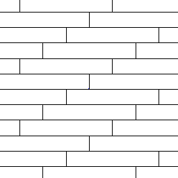

<head>
<meta http-equiv="Content-Type" content="text/html; charset=utf-8">
<link rel="stylesheet" type="text/css" href="bc.css">

</head>

<!---

- two enhancements on AddMaterials, and flat migration to Revit 2020
  pull request #4 by @ridespirals: handle 0 or negative DashPatterns https://github.com/jeremytammik/AddMaterials/pull/4
  suggestion by Александр Пекшев: Replace FillPattern = '{Binding CutPattern}' with FillPattern = '{Binding CutPattern, IsAsync=True}' and drawing thumbnails can get even faster
  add_materials_segments_le_zero.png
  add_materials_segments_le_zero_fixed.png

- retrieving element rotation:
  https://autodesk.slack.com/archives/C0SR6NAP8/p1560327374009400
  Shigekazu Saitou
  Revit2018:Get rotation angle of element(15426610)
  If you are rotating an element with the rotation tool, how do you write source code to get the rotation angle?
  https://www.revitapidocs.com/2020/3968f4e8-759c-f975-6c1f-7de42be633ed.htm
  RotateElement Method
  Scott Conover  [12 minutes ago]
  RotateElement has an angle parameter, but that angle is not necessarily stored in an element.  It depends on how the element's location is stored.   For many elements, Element.Location can be cast to LocationPoint and the rotation property read.  For Elements which inherit from Instance, they inherit a GetTransform() which can be parsed to read the rotation.  For elements that don't align with one or both of those, the rotation is more implicit with other element properties, e.g. a wall which is driven by endpoints and a curve, after rotating, is still driven by endpoints and a curve, just in different locations.

- 15395147 [Changing an Element's Phase Created Parameter]
  https://forums.autodesk.com/t5/revit-api-forum/changing-an-element-s-phase-created-parameter/m-p/8808894
  [Setting an elements phase]
  https://forums.autodesk.com/t5/revit-api-forum/setting-an-elements-phase/m-p/6224664
  [Q] How can I set the Phase Created or the Phase Demolished of a element?
  I can retrieve the Phase Created of an element with:
  phaseCreated = element.Document.GetElement(element.CreatedPhaseId) as Phase;
  However, I can't figure out how to change it to set the phase.
  [A] element.get_Parameter(BuiltInParameter.PHASE_CREATED).Set(phaseCrea​ted.Id);
  and
  element.get_Parameter(BuiltInParameter.PHASE_DEMOLISHED).Set(phaseC​reated.Id);

twitter:

Barcelona accelerator, AddMaterials dash pattern fix, element rotation and phase in the #RevitAPI @AutodeskForge @AutodeskRevit #bim #DynamoBim #ForgeDevCon http://bit.ly/barca2019

I am participating in the Forge Accelerator in Barcelona this week.
Let me mention some pending Revit API issues before diving into any accelerator topics
&ndash; AddMaterials enhancements
&ndash; Retrieving element rotation
&ndash; Changing the phase created parameter...

linkedin:

Barcelona accelerator, AddMaterials dash pattern fix, element rotation and phase in the #RevitAPI

http://bit.ly/barca2019

I am participating in the Forge Accelerator in Barcelona this week.

Let me mention some pending Revit API issues before diving into any accelerator topics:

- AddMaterials enhancements
- Retrieving element rotation
- Changing the phase created parameter...

#bim #DynamoBim #ForgeDevCon #Revit #API #IFC #SDK #AI #VisualStudio #Autodesk #AEC #adsk

the [Revit API discussion forum](http://forums.autodesk.com/t5/revit-api-forum/bd-p/160) thread

-->

### Accelerator, Dash Pattern Fix, Rotation and Phase

I am participating in the Forge Accelerator in Barcelona this week.

We are hosting a large number of participants, split up into separate manufacturing and AEC related groups:

I arrived good and early, spending the weekend visiting my sister, who moved here last summer:

My brother came too, and we went climbing, right in the middle of town,
in [Las Foixardas](http://www.rockclimbing.com/routes/Europe/Spain/Catalunya/Las_Foixardas) in
the [Parc Montju%C3%AFc](https://en.wikipedia.org/wiki/Montju%C3%AFc):

Let me mention some pending Revit API issues before diving into any accelerator topics:

- [AddMaterials enhancements](#3)
- [Retrieving element rotation](#4)
- [Changing the phase created parameter](#5)

#### AddMaterials Enhancements

The [AddMaterials add-in](https://github.com/jeremytammik/AddMaterials) originally
just added materials to the Revit model from a list of properties defined in Excel.

It has since been enhanced to also visualise them in WPF.

I recently added a couple of enhancements to the it that have not been mentioned here yet:

- Integrated [pull request #4 by @ridespirals to handle 0 or negative DashPatterns](https://github.com/jeremytammik/AddMaterials/pull/4)
- Flat migration from Revit 2016 to Revit 2020 API
- Acted on
the [suggestion by Александр Пекшев](https://thebuildingcoder.typepad.com/blog/2014/04/wpf-fill-pattern-viewer-control-benchmark.html#comment-4497075532) to
replace `FillPattern` = `'{Binding CutPattern}'` with `FillPattern` = `'{Binding CutPattern, IsAsync=True}'` to speed up the drawing of thumbnails

In the pull request, John [@ridespirals](https://github.com/ridespirals) Varga points out an important hint to handle errors caused by real number imprecision in dash or hash pattern definitions:

> We are using similar code in a project of ours, and we ran into an issue where some fill patterns had blank preview images.
Some of the patterns had very small negative values (such as -5.9211894646675012E-16), and DashPatterns must be greater than 0.
Using `float.Epsilon` produces previews that actually look correct.

Example preview we got by filtering out segments that were <= 0 (Third Bond - Emporer Brick - partial fix):

Example using the fix in this pull request, using `float.Epsilon` (Third Bond - Emporer Brick - fixed):

#### Retrieving Element Rotation

**Question:** How can I retrieve the rotation angle of an element that has been rotated, e.g., using the rotation tool or
the [`RotateElement` method](https://www.revitapidocs.com/2020/3968f4e8-759c-f975-6c1f-7de42be633ed.htm)?

**Answer:** `RotateElement` takes an angle parameter, but that angle is not necessarily stored in an element.

It depends on how the element's location is stored.

For many elements, `Element.Location` can be cast to a `LocationPoint`, and its `Rotation` property read.

Elements that inherit from `Instance` inherit a `GetTransform` method whose result can be parsed to read the rotation.

For elements that don't align with either of these options, the rotation is more implicit with other element properties.

For instance, a wall that is driven by endpoints and a curve, after rotating, is still driven by endpoints and a curve, just in different locations.

#### Changing the Phase Created Parameter

From the [Revit API discussion forum](http://forums.autodesk.com/t5/revit-api-forum/bd-p/160) thread
on [changing an element's phase created parameter](https://forums.autodesk.com/t5/revit-api-forum/changing-an-element-s-phase-created-parameter/m-p/8808894)
and [setting an element's phase](https://forums.autodesk.com/t5/revit-api-forum/setting-an-elements-phase/m-p/6224664):

**Question:** How can I set the 'Phase Created' or the 'Phase Demolished' of an element?

I know I can retrieve the 'Phase Created' like this:

<pre class="code">
&nbsp;&nbsp;phaseCreated&nbsp;=&nbsp;element.Document.GetElement(&nbsp;
&nbsp;&nbsp;&nbsp;&nbsp;element.CreatedPhaseId&nbsp;)&nbsp;as&nbsp;Phase;
</pre>

However, I can't figure out how to change it to set the phase.

**Answer:** You can use two built-in parameters:

<pre class="code">
&nbsp;&nbsp;element.get_Parameter(&nbsp;
&nbsp;&nbsp;&nbsp;&nbsp;BuiltInParameter.PHASE_CREATED&nbsp;)
&nbsp;&nbsp;&nbsp;&nbsp;&nbsp;&nbsp;.Set(&nbsp;phaseCrea​ted.Id&nbsp;);

&nbsp;&nbsp;element.get_Parameter(&nbsp;
&nbsp;&nbsp;&nbsp;&nbsp;BuiltInParameter.PHASE_DEMOLISHED&nbsp;)
&nbsp;&nbsp;&nbsp;&nbsp;&nbsp;&nbsp;.Set(&nbsp;phaseC​reated.Id&nbsp;);
</pre>
