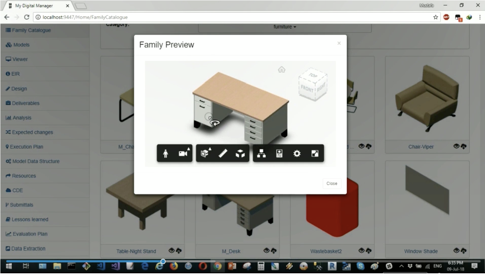

<head>
<meta http-equiv="Content-Type" content="text/html; charset=utf-8">
<link rel="stylesheet" type="text/css" href="bc.css">

</head>

<!---

- Revit Public Roadmap – July 2019
  https://blogs.autodesk.com/revit/2019/07/21/revit-public-roadmap-july-2019/

- rebar curves
  Cannot get rebar centerline curve using GetCenterlineCurves()
  https://forums.autodesk.com/t5/revit-api-forum/cannot-get-rebar-centerline-curve-using-getcenterlinecurves/m-p/8910986

- visual studio revit add-in wizard includes a built-in zip utility
  merged [pull request #9](https://github.com/jeremytammik/VisualStudioRevitAddinWizard/pull/9) by
  Brandon [@ProjectBarks](https://github.com/ProjectBarks) Barker
  providing visual studio version support and an integrated zip utility
  https://github.com/jeremytammik/VisualStudioRevitAddinWizard/releases/tag/2020.0.0.1

- 15565451 [试用 SectionView创建俯视图。-- Try SectionView to create a top view.]
  top view can be created using detail view

- DA4R display RFA instance:
  [Q] I came across an AU class recording where the customer with WS Atkins & Partners demoed their Revit IO apps. One thing he showed was to extract Revit families using Revit IO and display the families on the web using Derivative service and viewer. However, I don’t believe Derivative service supports RFA file type. Do you know how they managed to show Revit families 3d model on the web?
  da4r_rfa_instance.png
  [A] The workaround is to place a family instance in an empty project and have it translated.
  So the source files are actually RVT not RFA.

- https://stackoverflow.com/questions/56984043/path-gettemppath-method-returns-usertemppath-with-guid-in-the-end-when-using-r
  i ran into the very same issue myself as well.
  That's probably due to Revit defining its own %TMP/TEMP% Environment Variable. – haim770 yesterday
  As per this forum link, Revit 2020 alters the value returned as per what you are seeing.
  https://forums.autodesk.com/t5/revit-api-forum/revit-2020-temp-path-changes-every-session/td-p/8759058
  Since Revit 2020 the requested temp path contains an additional guid at the end of the path, which changes after every restart of Revit(ie. C:\Users\USERNAME\AppData\Local\Temp\84ae8c0d-197b-4b44-b8d3-8823fabbba4f). It seems like Revit changes the temp path for the scope of the application.
  i chose the easy solution, "C:/tmp".
  other reliable solutions include:
  Searching for "Temp" and dropping the GUID sub-folder
  Environment.GetFolderPath(Environment.SpecialFolder.ApplicationData) + @"\AppData\Local\Temp\"
  Path.Combine(System.Environment.GetEnvironmentVariable("LOCALAPPDATA"), "Temp")

- math trick, chinese multiplication or japanese mathematics using lines
  [Multiply Numbers By Drawing Lines](https://youtu.be/bbKjXKV9QNA)
  <iframe width="560" height="315" src="https://www.youtube.com/embed/bbKjXKV9QNA" frameborder="0" allow="accelerometer; autoplay; encrypted-media; gyroscope; picture-in-picture" allowfullscreen></iframe>

twitter:

@AutodeskRevit roadmap, rebar curves, built-in add-in wizard zip utility, top view direction section views, family instances in Forge viewer and more in the #RevitAPI @AutodeskForge  #bim #DynamoBim #ForgeDevCon http://bit.ly/rebarcurves

Topics for this week
&ndash; Revit public roadmap July 2019
&ndash; Rebar curves
&ndash; Built-in zip utility for add-in wizard
&ndash; Only detail section views can be used for top view direction
&ndash; Displaying an RFA family instance in DA4R
&ndash; Revit 2020 alters the TEMP file system variable
&ndash; Lattice multiplication...

linkedin:

Revit roadmap, rebar curves, built-in add-in wizard zip utility, top view direction section views, family instances in Forge viewer and more in the #RevitAPI

http://bit.ly/rebarcurves

Topics for this week:

- Revit public roadmap July 2019
- Rebar curves
- Built-in zip utility for add-in wizard
- Only detail section views can be used for top view direction
- Displaying an RFA family instance in DA4R
- Revit 2020 alters the TEMP file system variable
- Lattice multiplication...

#bim #DynamoBim #ForgeDevCon #Revit #API #IFC #SDK #AI #VisualStudio #Autodesk #AEC #adsk

the [Revit API discussion forum](http://forums.autodesk.com/t5/revit-api-forum/bd-p/160) thread

-->

### Roadmap, Rebar Curves, Wizard Zip and More

I returned from my vacation and Buddhist retreat in France, on the Atlantic coast and in the countryside around Bordeaux.

I am going off on vacation again next week, though, in the French Jura, so this is just a short break in between vacations  :-)

Here are my topics for this week:

- [Revit public roadmap &ndash; July 2019](#2)
- [Rebar curves](#3)
- [Built-in zip utility for add-in wizard](#4)
- [Only detail section views can be used for top view direction](#5)
- [Displaying an RFA family instance in DA4R](#6)
- [Revit 2020 alters the TEMP file system variable](#7)
- [Lattice multiplication](#8)

#### Revit Public Roadmap &ndash; July 2019

Sasha Crotty and The Factory published
an [update to the *Revit Public Roadmap &ndash; July 2019*](https://blogs.autodesk.com/revit/2019/07/21/revit-public-roadmap-july-2019).

I urge you to check it out to see where Revit is headed.

If you wish to get involved, submit your own ideas and requests, please do so in
the [Revit Idea Station](http://www.autodesk.com/RevitIdeas).

#### Rebar Curves

I recently implemented
a new [external command `CmdRebarCurves`](https://github.com/jeremytammik/the_building_coder_samples/blob/master/BuildingCoder/BuildingCoder/CmdRebarCurves.cs)
in [The Building Coder samples](https://github.com/jeremytammik/the_building_coder_samples).

It was originally intended to be used to simplify and minimise models for Forge processing.

However, it seems that may no longer be required, since
Michael [@micbeale](https://twitter.com/micbeale) [@wallabyway](https://github.com/wallabyway) Beale lists
some alternative options as well:

>    - Avoid Revit solids due to 'triangle explosion', i.e., too many triangles in SVF, making downstream processing extremely problematic and expensive.
>    - Jeremy looked into using the Revit API, prototyping a Revit API plugin solution to be piped through DA4R to extract the Revit primitive information about the rebar centre lines that can avoid the triangle explosion problem.
>    - We are now investigating a new 'rebar-lines' solution that includes enough meta-data information to avoid needing Jeremy's add-in.

> The latter is the winning solution, since it avoids the triangle explosion, because rebar-lines use low bytes compared to the heavily tessellated rebar-solids, and we can create 'unit-mesh' cylinder primitives during Forge processing, thus outputting highly optimised rebar solids in a future  updated Forge Viewer.

Therefore, I see no need to enhance the current `CmdRebarCurves` implementation at this point.

I still hope that it will remain useful in its current state for answering questions such as the following one from
the [Revit API discussion forum](http://forums.autodesk.com/t5/revit-api-forum/bd-p/160) thread
on [getting rebar centreline curves using `GetCenterlineCurves`](https://forums.autodesk.com/t5/revit-api-forum/cannot-get-rebar-centerline-curve-using-getcenterlinecurves/m-p/8910986):

**Question:** I am using the Revit 2019 API and I want to get the centre line curve of the first and the last rebars in a rebar set.
I tried using the following method:

<pre>
  Rebar.GetCenterlineCurves(
    bool adjustForSelfIntersection,
    bool suppressHooks,
    bool suppressBendRadius,
    MultiplanarOption multiplanarOption,
    int barPositionIndex);
</pre>

However, it seems that the parameter `barPositionIndex` has no effect at all.

No matter what valid position index of the rebar set I input, the curve list I receive is the curves of the first bar &ndash; the same as the result of calling `RebarShapeDriveAccessor.ComputeDrivingCurve`.

How is this possible? Is there anything I missed in the document?

P.S. I found another way to achieve what I want by translating the first rebar curves along the direction of rebar set.

**Answer:** Congratulations on solving the problem as described in your post scriptum.

Take a look at the
new [external command `CmdRebarCurves`](https://github.com/jeremytammik/the_building_coder_samples/blob/master/BuildingCoder/BuildingCoder/CmdRebarCurves.cs)
in [The Building Coder samples](https://github.com/jeremytammik/the_building_coder_samples).

It seems to be using the very same approach you describe.

Manuel Solís López of [SOFiSTiK AG](https://www.sofistik.com) explains:

`Rebar.GetCenterlineCurves(... , i )` will return the curves of the Rebar at the i-th position.

However, You must distinguish three different cases, depending on the `DistributionType`:

- `Uniform` &ndash; The rebar curves will be equal at all valid positions.
- `VaryingLength` &ndash; According to the rebar constraints, the rebar curves may vary along the distribution path. For example, a set of straight rebar in a triangular slab.
- `IsRebarFreeForm()` == `true` &ndash; The Rebar curves of FreeFormRebar at each position will be defined by the given constraints, but also by the specific RebarUpdateServer to which the Rebar is subscribed, for instance using SurfaceDistribution or AlignedDistribution.

The Rebar curves at each i-th position could vary or not, but in case of non-FreeFormRebar (Rebar.IsRebarFreeForm() == false), you would have to apply the corresponding Transformation in order to obtain the actual location in 3D Space:

<pre>
  Rebar.GetShapeDrivenAccessor()
    .GetBarPositionTransform(i);
</pre>

Many thanks to Manuel for his helpful explanation!

#### Built-In Zip Utility for Add-In Wizard

The [Visual Studio Revit add-in wizards](https://thebuildingcoder.typepad.com/blog/about-the-author.html#5.20) provide
Visual Studio templates for generating C# and VB .NET Revit add-ins.
They enable the instantaneous automatic generation, installation and debugging of a new Revit add-in skeleton with one single click.

The current version of the wizards now includes a built-in zip utility.

It was added by Brandon [@ProjectBarks](https://github.com/ProjectBarks) Barker
in his [pull request #9 providing Visual Studio version support and an integrated zip utility](https://github.com/jeremytammik/VisualStudioRevitAddinWizard/pull/9).

The most up-to-date version today
is [VisualStudioRevitAddinWizard release 2020.0.0.1](https://github.com/jeremytammik/VisualStudioRevitAddinWizard/releases/tag/2020.0.0.1).

Many thanks to Brandon for this useful contribution!

#### Only Detail Section Views can be Used for Top View Direction

In another case, an add-in developer wishes to create a section view with a top view direction:

- 15565451 *试用 SectionView创建俯视图。&ndash; try `SectionView` to create a top view*

**Question:** When passing the `BoundingBoxXYZ` parameter, what is the requirement for the corresponding base(i) vector?
What is the specific logic?

I tried it myself, and it seems that the logic of `BoundingBoxXYZ` is different when generating an inside view and generating a top view.

Do any special rules apply when using the `ViewSection` creation methods to generate a top view, i.e., view direction equal to (0,0,-1)?

**Answer:** Looking at the Revit API documentation, the `ViewSection` class covers sections, details, elevations, and callouts, all in their reference and non-reference variations. Its creation methods can be used to specify the view direction:

- CreateCallout Creates a new callout view.
- CreateDetail Returns a new detail ViewSection.
- CreateReferenceCallout Creates a new reference callout.
- CreateReferenceSection Creates a new reference section.
- CreateSection Returns a new section ViewSection.

In the last of these,
[CreateSection](https://www.revitapidocs.com/2020/d6228f68-3643-8aaf-72bb-f9a0b4125886.htm),
the notes explain:

> Create a section whose view volume corresponds geometrically with the specified sectionBox.
The view direction of the resulting section will be sectionBox.Transform.BasisZ and the up direction will be sectionBox.Transform.BasisY.
The right-hand direction will be computed so that (right, up, view direction) form a left handed coordinate system.
The resulting view will be cropped, and far clipping will be active.
The crop region will correspond to the projections of BoundingBoxXYZ.Min and BoundingBoxXYZ.Max onto the view's cut plane.
The far clip distance will be equal to the difference of the z-coordinates of BoundingBoxXYZ.Min and BoundingBoxXYZ.Max.
The new section ViewSection will receive a unique view name.

The development team clarifies:

For most section views, the UI does not allow this, and therefore the API does not do so either.

Sections created in elevation views must be vertical.

For instance, `ViewSection.CreateSection` restricts the view direction to be horizontal, i.e., the view plane to be vertical.

However, `ViewSection.CreateDetail` has no restrictions on the view direction and can therefore be used to create a section view parallel to a plan view.

So, you should be able to use a detail view to achieve what you require.

#### Displaying an RFA Family Instance in DA4R

[Forge Design Automation for Revit or DA4R](https://thebuildingcoder.typepad.com/blog/about-the-author.html#5.55) supports RVT file processing, but not RFA.

This begs the question:

**Question:** I came across an AU class recording showing a customer with WS Atkins & Partners demoing their Revit IO apps.

One thing it showed was extracting Revit families using Revit IO and displaying them on the web using the Forge derivative service and viewer.

However, I don’t believe the derivative service supports the RFA file type.

Do you know how they managed to show 3D models of Revit families on the web?

**Answer:** The workaround is to place a family instance in an empty project and have it translated.

So, the source files are actually RVT, not RFA.

#### Revit 2020 Alters the TEMP File System Variable

Many add-in make use of the Windows `TEMP` system variable to define a path for outputting a temporary file.

Revit 2020 apparently alters the value of that variable, affecting the add-in behaviour as well.

I ran into this issue myself, prompting me to discover the StackOverflow discussion
on [`Path.GetTempPath` method returning `UserTempPath` with GUID added in Revit 2020](https://stackoverflow.com/questions/56984043/path-gettemppath-method-returns-usertemppath-with-guid-in-the-end-when-using-r).

The answers there explain:

- Since Revit 2020, the requested temp path contains an additional GUID at the end of the path that changes after every restart of Revit, i.e.,  *C:\Users\USERNAME\AppData\Local\Temp\84ae8c0d-197b-4b44-b8d3-8823fabbba4f*.
- That's probably due to Revit defining its own %TMP/TEMP% environment variable
- [Revit 2020 temp path changes every session](https://forums.autodesk.com/t5/revit-api-forum/revit-2020-temp-path-changes-every-session/td-p/8759058)

Apparently, Revit changes the temp path for the scope of the application.

I chose the easy solution in my add-in, using a constant `"C:/tmp"` instead.

Other possible solutions include:

- Searching for "Temp" and dropping the GUID sub-folder
- Using
    <pre>
      Environment.GetFolderPath(
        Environment.SpecialFolder.ApplicationData )
          + @"\AppData\Local\Temp\"
    </pre>
- Using
    <pre>
      Path.Combine(
        System.Environment.GetEnvironmentVariable(
          "LOCALAPPDATA" ),
            "Temp")
    </pre>

#### Lattice Multiplication

Let us round this off with an interesting little mathematical non-Revit-API observation:

I ran across several neat demonstrations of an ancient and well-known multiplication method previously unknown to me,
[lattice multiplication](https://en.wikipedia.org/wiki/Lattice_multiplication), e.g. this
three-minute video on [multiplying numbers by drawing lines](https://youtu.be/bbKjXKV9QNA):

  <iframe width="560" height="315" src="https://www.youtube.com/embed/bbKjXKV9QNA" frameborder="0" allow="accelerometer; autoplay; encrypted-media; gyroscope; picture-in-picture" allowfullscreen></iframe>

