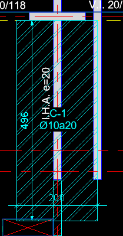
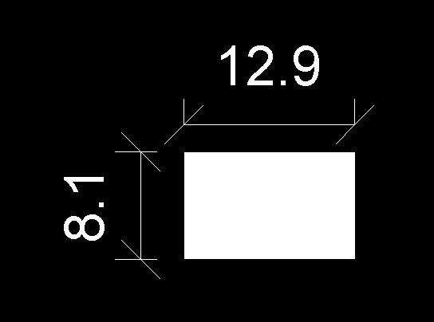
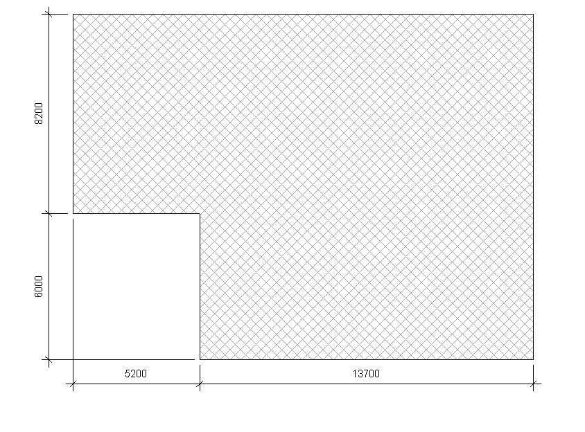

<head>
<meta http-equiv="Content-Type" content="text/html; charset=utf-8">
<link rel="stylesheet" type="text/css" href="bc.css">

</head>

<!---

- 15582252 [Create dimensions for Filled Region Boundary]
  https://forums.autodesk.com/t5/revit-api-forum/create-dimensions-for-filled-region-boundary/m-p/8926301

twitter:

Auto-dimensioning filled region boundaries using the #RevitAPI @AutodeskForge @AutodeskRevit #bim #DynamoBim #ForgeDevCon http://bit.ly/dimfilledregion

I am back from my break and picked up the question about creating dimensions for a filled region boundary
&ndash; Programmatically creating dimensions for a filled region
&ndash; Coding suggestion
&ndash; Final solution...

linkedin:

Auto-dimensioning filled region boundaries using the #RevitAPI

http://bit.ly/dimfilledregion

I am back from my break and picked up the question about creating dimensions for a filled region boundary:

- Programmatically creating dimensions for a filled region
- Coding suggestion
- Final solution...

#bim #DynamoBim #ForgeDevCon #Revit #API #IFC #SDK #AI #VisualStudio #Autodesk #AEC #adsk

the [Revit API discussion forum](http://forums.autodesk.com/t5/revit-api-forum/bd-p/160) thread

-->

### Auto-Dimension Filled Region Boundary

I am back from my break in the French Jura and looking at all the
interesting [Revit API forum discussions](http://forums.autodesk.com/t5/revit-api-forum/bd-p/160) again.

One that stands out and that I'll pick up to get back into the blogging rhythm again is Jorge Villarroel's question
about [creating dimensions for a filled region boundary](https://forums.autodesk.com/t5/revit-api-forum/create-dimensions-for-filled-region-boundary/m-p/8926301),
answered by Alexander [@aignatovich](https://forums.autodesk.com/t5/user/viewprofilepage/user-id/1257478) [@CADBIMDeveloper](https://github.com/CADBIMDeveloper) Ignatovich, aka Александр Игнатович:

- [Programmatically creating dimensions for a filled region](#2)
- [Coding suggestion](#3)
- [Final solution](#4)

#### Programmatically Creating Dimensions for a Filled Region

I am working with dimensions for multiple objects.
The dimension creation method needs a `ReferenceArray` to work.
Now, I need to create dimensions for a filled region:

Filled region

I can create dimensions manually in the user interface using native commands, no API, just clicking, using "Align Dimension":

Dimensions for the filled region

However, I can't retrieve the reference for the boundary curves to create them programmatically.

I used RevitLookup to search for some reference in the Filled Region sub-elements with no results.

Also tried to get the references from the `CurveLoop` curves, but again, with no results.

Any tip of advice will be very well received.

#### Coding Suggestion

Hi!

The trick is to retrieve the filled region geometry using the appropriate view and setting `ComputeReferences` to true.

Try this code:

<pre class="code">
[Transaction(&nbsp;TransactionMode.Manual&nbsp;)]
public&nbsp;class&nbsp;CreateFillledRegionDimensionsCommand&nbsp;:&nbsp;IExternalCommand
{
&nbsp;&nbsp;public&nbsp;Result&nbsp;Execute(&nbsp;
&nbsp;&nbsp;&nbsp;&nbsp;ExternalCommandData&nbsp;commandData,&nbsp;
&nbsp;&nbsp;&nbsp;&nbsp;ref&nbsp;string&nbsp;message,&nbsp;
&nbsp;&nbsp;&nbsp;&nbsp;ElementSet&nbsp;elements&nbsp;)
&nbsp;&nbsp;{
&nbsp;&nbsp;&nbsp;&nbsp;var&nbsp;uiapp&nbsp;=&nbsp;commandData.Application;
&nbsp;&nbsp;&nbsp;&nbsp;var&nbsp;uidoc&nbsp;=&nbsp;uiapp.ActiveUIDocument;
&nbsp;&nbsp;&nbsp;&nbsp;var&nbsp;doc&nbsp;=&nbsp;uidoc.Document;

&nbsp;&nbsp;&nbsp;&nbsp;var&nbsp;view&nbsp;=&nbsp;uidoc.ActiveGraphicalView;

&nbsp;&nbsp;&nbsp;&nbsp;var&nbsp;filledRegions&nbsp;=&nbsp;FindFilledRegions(&nbsp;doc,&nbsp;view.Id&nbsp;);

&nbsp;&nbsp;&nbsp;&nbsp;using(&nbsp;var&nbsp;transaction&nbsp;=&nbsp;new&nbsp;Transaction(&nbsp;doc,&nbsp;
&nbsp;&nbsp;&nbsp;&nbsp;&nbsp;&nbsp;&quot;filled&nbsp;regions&nbsp;dimensions&quot;&nbsp;)&nbsp;)
&nbsp;&nbsp;&nbsp;&nbsp;{
&nbsp;&nbsp;&nbsp;&nbsp;&nbsp;&nbsp;transaction.Start();

&nbsp;&nbsp;&nbsp;&nbsp;&nbsp;&nbsp;foreach(&nbsp;var&nbsp;filledRegion&nbsp;in&nbsp;filledRegions&nbsp;)
&nbsp;&nbsp;&nbsp;&nbsp;&nbsp;&nbsp;{
&nbsp;&nbsp;&nbsp;&nbsp;&nbsp;&nbsp;&nbsp;&nbsp;CreateDimensions(&nbsp;filledRegion,&nbsp;
&nbsp;&nbsp;&nbsp;&nbsp;&nbsp;&nbsp;&nbsp;&nbsp;&nbsp;&nbsp;-1&nbsp;*&nbsp;view.RightDirection&nbsp;);

&nbsp;&nbsp;&nbsp;&nbsp;&nbsp;&nbsp;&nbsp;&nbsp;CreateDimensions(&nbsp;filledRegion,&nbsp;view.UpDirection&nbsp;);
&nbsp;&nbsp;&nbsp;&nbsp;&nbsp;&nbsp;}

&nbsp;&nbsp;&nbsp;&nbsp;&nbsp;&nbsp;transaction.Commit();
&nbsp;&nbsp;&nbsp;&nbsp;}
&nbsp;&nbsp;&nbsp;&nbsp;return&nbsp;Result.Succeeded;
&nbsp;&nbsp;}

&nbsp;&nbsp;private&nbsp;static&nbsp;void&nbsp;CreateDimensions(&nbsp;
&nbsp;&nbsp;&nbsp;&nbsp;FilledRegion&nbsp;filledRegion,&nbsp;
&nbsp;&nbsp;&nbsp;&nbsp;XYZ&nbsp;dimensionDirection&nbsp;)
&nbsp;&nbsp;{
&nbsp;&nbsp;&nbsp;&nbsp;var&nbsp;document&nbsp;=&nbsp;filledRegion.Document;

&nbsp;&nbsp;&nbsp;&nbsp;var&nbsp;view&nbsp;=&nbsp;(View)&nbsp;document.GetElement(&nbsp;
&nbsp;&nbsp;&nbsp;&nbsp;&nbsp;&nbsp;filledRegion.OwnerViewId&nbsp;);

&nbsp;&nbsp;&nbsp;&nbsp;var&nbsp;edgesDirection&nbsp;=&nbsp;dimensionDirection.CrossProduct(&nbsp;
&nbsp;&nbsp;&nbsp;&nbsp;&nbsp;&nbsp;view.ViewDirection&nbsp;);

&nbsp;&nbsp;&nbsp;&nbsp;var&nbsp;edges&nbsp;=&nbsp;FindRegionEdges(&nbsp;filledRegion&nbsp;)
&nbsp;&nbsp;&nbsp;&nbsp;&nbsp;&nbsp;.Where(&nbsp;x&nbsp;=&gt;&nbsp;IsEdgeDirectionSatisfied(&nbsp;x,&nbsp;edgesDirection&nbsp;)&nbsp;)
&nbsp;&nbsp;&nbsp;&nbsp;&nbsp;&nbsp;.ToList();

&nbsp;&nbsp;&nbsp;&nbsp;if(&nbsp;edges.Count&nbsp;&lt;&nbsp;2&nbsp;)
&nbsp;&nbsp;&nbsp;&nbsp;&nbsp;&nbsp;return;

&nbsp;&nbsp;&nbsp;&nbsp;var&nbsp;shift&nbsp;=&nbsp;UnitUtils.ConvertToInternalUnits(&nbsp;
&nbsp;&nbsp;&nbsp;&nbsp;&nbsp;&nbsp;-10&nbsp;*&nbsp;view.Scale,&nbsp;DisplayUnitType.DUT_MILLIMETERS&nbsp;)&nbsp;
&nbsp;&nbsp;&nbsp;&nbsp;&nbsp;&nbsp;*&nbsp;edgesDirection;

&nbsp;&nbsp;&nbsp;&nbsp;var&nbsp;dimensionLine&nbsp;=&nbsp;Line.CreateUnbound(&nbsp;
&nbsp;&nbsp;&nbsp;&nbsp;&nbsp;&nbsp;filledRegion.get_BoundingBox(&nbsp;view&nbsp;).Min&nbsp;
&nbsp;&nbsp;&nbsp;&nbsp;&nbsp;&nbsp;+&nbsp;shift,&nbsp;dimensionDirection&nbsp;);

&nbsp;&nbsp;&nbsp;&nbsp;var&nbsp;references&nbsp;=&nbsp;new&nbsp;ReferenceArray();

&nbsp;&nbsp;&nbsp;&nbsp;foreach(&nbsp;var&nbsp;edge&nbsp;in&nbsp;edges&nbsp;)
&nbsp;&nbsp;&nbsp;&nbsp;&nbsp;&nbsp;references.Append(&nbsp;edge.Reference&nbsp;);

&nbsp;&nbsp;&nbsp;&nbsp;document.Create.NewDimension(&nbsp;view,&nbsp;dimensionLine,&nbsp;
&nbsp;&nbsp;&nbsp;&nbsp;&nbsp;&nbsp;references&nbsp;);
&nbsp;&nbsp;}

&nbsp;&nbsp;private&nbsp;static&nbsp;bool&nbsp;IsEdgeDirectionSatisfied(&nbsp;
&nbsp;&nbsp;&nbsp;&nbsp;Edge&nbsp;edge,&nbsp;
&nbsp;&nbsp;&nbsp;&nbsp;XYZ&nbsp;edgeDirection&nbsp;)
&nbsp;&nbsp;{
&nbsp;&nbsp;&nbsp;&nbsp;var&nbsp;edgeCurve&nbsp;=&nbsp;edge.AsCurve()&nbsp;as&nbsp;Line;

&nbsp;&nbsp;&nbsp;&nbsp;if(&nbsp;edgeCurve&nbsp;==&nbsp;null&nbsp;)
&nbsp;&nbsp;&nbsp;&nbsp;&nbsp;&nbsp;return&nbsp;false;

&nbsp;&nbsp;&nbsp;&nbsp;return&nbsp;edgeCurve.Direction.CrossProduct(&nbsp;
&nbsp;&nbsp;&nbsp;&nbsp;&nbsp;&nbsp;edgeDirection&nbsp;).IsAlmostEqualTo(&nbsp;XYZ.Zero&nbsp;);
&nbsp;&nbsp;}

&nbsp;&nbsp;private&nbsp;static&nbsp;IEnumerable&lt;Edge&gt;&nbsp;FindRegionEdges(&nbsp;
&nbsp;&nbsp;&nbsp;&nbsp;FilledRegion&nbsp;filledRegion&nbsp;)
&nbsp;&nbsp;{
&nbsp;&nbsp;&nbsp;&nbsp;var&nbsp;view&nbsp;=&nbsp;(View)&nbsp;filledRegion.Document.GetElement(&nbsp;
&nbsp;&nbsp;&nbsp;&nbsp;&nbsp;&nbsp;filledRegion.OwnerViewId&nbsp;);

&nbsp;&nbsp;&nbsp;&nbsp;var&nbsp;options&nbsp;=&nbsp;new&nbsp;Options
&nbsp;&nbsp;&nbsp;&nbsp;{
&nbsp;&nbsp;&nbsp;&nbsp;&nbsp;&nbsp;View&nbsp;=&nbsp;view,
&nbsp;&nbsp;&nbsp;&nbsp;&nbsp;&nbsp;ComputeReferences&nbsp;=&nbsp;true
&nbsp;&nbsp;&nbsp;&nbsp;};

&nbsp;&nbsp;&nbsp;&nbsp;return&nbsp;filledRegion
&nbsp;&nbsp;&nbsp;&nbsp;&nbsp;&nbsp;.get_Geometry(&nbsp;options&nbsp;)
&nbsp;&nbsp;&nbsp;&nbsp;&nbsp;&nbsp;.OfType&lt;Solid&gt;()
&nbsp;&nbsp;&nbsp;&nbsp;&nbsp;&nbsp;.SelectMany(&nbsp;x&nbsp;=&gt;&nbsp;x.Edges.Cast&lt;Edge&gt;()&nbsp;);
&nbsp;&nbsp;}

&nbsp;&nbsp;private&nbsp;static&nbsp;IEnumerable&lt;FilledRegion&gt;&nbsp;
&nbsp;&nbsp;&nbsp;&nbsp;FindFilledRegions(&nbsp;
&nbsp;&nbsp;&nbsp;&nbsp;&nbsp;&nbsp;Document&nbsp;document,&nbsp;
&nbsp;&nbsp;&nbsp;&nbsp;&nbsp;&nbsp;ElementId&nbsp;viewId&nbsp;)
&nbsp;&nbsp;{
&nbsp;&nbsp;&nbsp;&nbsp;var&nbsp;collector&nbsp;=&nbsp;new&nbsp;FilteredElementCollector(&nbsp;
&nbsp;&nbsp;&nbsp;&nbsp;&nbsp;&nbsp;document,&nbsp;viewId&nbsp;);

&nbsp;&nbsp;&nbsp;&nbsp;return&nbsp;collector
&nbsp;&nbsp;&nbsp;&nbsp;&nbsp;&nbsp;.OfClass(&nbsp;typeof(&nbsp;FilledRegion&nbsp;)&nbsp;)
&nbsp;&nbsp;&nbsp;&nbsp;&nbsp;&nbsp;.Cast&lt;FilledRegion&gt;();
&nbsp;&nbsp;}
}
</pre>

It produces something like this:

Dimensioning in Revit is one of my favorite topics &nbsp; :-)

#### Final Solution

Thanks, @aignatovich. I really appreciate it.

Your suggestion was the solution to my problem!

I extended the approach, so the method asks for the type name (string) of the dimension you want to assign:

<pre class="code">
private&nbsp;void&nbsp;CreateDimensions(
&nbsp;&nbsp;FilledRegion&nbsp;filledRegion,
&nbsp;&nbsp;XYZ&nbsp;dimensionDirection,
&nbsp;&nbsp;string&nbsp;typeName&nbsp;)
{
&nbsp;&nbsp;var&nbsp;document&nbsp;=&nbsp;filledRegion.Document;

&nbsp;&nbsp;var&nbsp;view&nbsp;=&nbsp;(View)&nbsp;document.GetElement(&nbsp;
&nbsp;&nbsp;&nbsp;&nbsp;filledRegion.OwnerViewId&nbsp;);

&nbsp;&nbsp;var&nbsp;edgesDirection&nbsp;=&nbsp;dimensionDirection.CrossProduct(&nbsp;
&nbsp;&nbsp;&nbsp;&nbsp;view.ViewDirection&nbsp;);

&nbsp;&nbsp;var&nbsp;edges&nbsp;=&nbsp;FindRegionEdges(&nbsp;filledRegion&nbsp;)
&nbsp;&nbsp;&nbsp;&nbsp;.Where(&nbsp;x&nbsp;=&gt;&nbsp;IsEdgeDirectionSatisfied(&nbsp;x,&nbsp;edgesDirection&nbsp;)&nbsp;)
&nbsp;&nbsp;&nbsp;&nbsp;.ToList();

&nbsp;&nbsp;if(&nbsp;edges.Count&nbsp;&lt;&nbsp;2&nbsp;)
&nbsp;&nbsp;&nbsp;&nbsp;return;

&nbsp;&nbsp;//&nbsp;Se&nbsp;hace&nbsp;este&nbsp;ajuste&nbsp;para&nbsp;que&nbsp;la&nbsp;distancia&nbsp;no&nbsp;
&nbsp;&nbsp;//&nbsp;depende&nbsp;de&nbsp;la&nbsp;escala.&nbsp;&lt;&lt;&lt;&lt;&lt;&lt;&nbsp;evaluar&nbsp;para&nbsp;
&nbsp;&nbsp;//&nbsp;información&nbsp;de&nbsp;acotado&nbsp;y&nbsp;etiquetado!!!

&nbsp;&nbsp;var&nbsp;shift&nbsp;=&nbsp;UnitUtils.ConvertToInternalUnits(&nbsp;
&nbsp;&nbsp;&nbsp;&nbsp;5&nbsp;*&nbsp;view.Scale,&nbsp;DisplayUnitType.DUT_MILLIMETERS&nbsp;)&nbsp;
&nbsp;&nbsp;&nbsp;&nbsp;*&nbsp;edgesDirection;

&nbsp;&nbsp;var&nbsp;dimensionLine&nbsp;=&nbsp;Line.CreateUnbound(
&nbsp;&nbsp;&nbsp;&nbsp;filledRegion.get_BoundingBox(&nbsp;view&nbsp;).Min&nbsp;+&nbsp;shift,
&nbsp;&nbsp;&nbsp;&nbsp;dimensionDirection&nbsp;);

&nbsp;&nbsp;var&nbsp;references&nbsp;=&nbsp;new&nbsp;ReferenceArray();

&nbsp;&nbsp;foreach(&nbsp;var&nbsp;edge&nbsp;in&nbsp;edges&nbsp;)
&nbsp;&nbsp;&nbsp;&nbsp;references.Append(&nbsp;edge.Reference&nbsp;);

&nbsp;&nbsp;Dimension&nbsp;dim&nbsp;=&nbsp;document.Create.NewDimension(&nbsp;
&nbsp;&nbsp;&nbsp;&nbsp;view,&nbsp;dimensionLine,&nbsp;references&nbsp;);

&nbsp;&nbsp;ElementId&nbsp;dr_id&nbsp;=&nbsp;DimensionTypeId(
&nbsp;&nbsp;&nbsp;&nbsp;document,&nbsp;typeName&nbsp;);

&nbsp;&nbsp;if(&nbsp;dr_id&nbsp;!=&nbsp;null&nbsp;)
&nbsp;&nbsp;{
&nbsp;&nbsp;&nbsp;&nbsp;dim.ChangeTypeId(&nbsp;dr_id&nbsp;);
&nbsp;&nbsp;}
}

private&nbsp;static&nbsp;bool&nbsp;IsEdgeDirectionSatisfied(&nbsp;
&nbsp;&nbsp;Edge&nbsp;edge,&nbsp;
&nbsp;&nbsp;XYZ&nbsp;edgeDirection&nbsp;)
{
&nbsp;&nbsp;var&nbsp;edgeCurve&nbsp;=&nbsp;edge.AsCurve()&nbsp;as&nbsp;Line;

&nbsp;&nbsp;if(&nbsp;edgeCurve&nbsp;==&nbsp;null&nbsp;)
&nbsp;&nbsp;&nbsp;&nbsp;return&nbsp;false;

&nbsp;&nbsp;return&nbsp;edgeCurve.Direction.CrossProduct(&nbsp;
&nbsp;&nbsp;&nbsp;&nbsp;edgeDirection&nbsp;).IsAlmostEqualTo(&nbsp;XYZ.Zero&nbsp;);
}

private&nbsp;static&nbsp;IEnumerable&lt;FilledRegion&gt;&nbsp;
&nbsp;&nbsp;FindFilledRegions(&nbsp;
&nbsp;&nbsp;&nbsp;&nbsp;Document&nbsp;document,&nbsp;
&nbsp;&nbsp;&nbsp;&nbsp;ElementId&nbsp;viewId&nbsp;)
{
&nbsp;&nbsp;var&nbsp;collector&nbsp;=&nbsp;new&nbsp;FilteredElementCollector(&nbsp;
&nbsp;&nbsp;&nbsp;&nbsp;document,&nbsp;viewId&nbsp;);

&nbsp;&nbsp;return&nbsp;collector
&nbsp;&nbsp;&nbsp;&nbsp;.OfClass(&nbsp;typeof(&nbsp;FilledRegion&nbsp;)&nbsp;)
&nbsp;&nbsp;&nbsp;&nbsp;.Cast&lt;FilledRegion&gt;();
}

private&nbsp;static&nbsp;IEnumerable&lt;Edge&gt;&nbsp;
&nbsp;&nbsp;FindRegionEdges(&nbsp;
&nbsp;&nbsp;&nbsp;&nbsp;FilledRegion&nbsp;filledRegion&nbsp;)
{
&nbsp;&nbsp;var&nbsp;view&nbsp;=&nbsp;(View)&nbsp;filledRegion.Document.GetElement(&nbsp;
&nbsp;&nbsp;&nbsp;&nbsp;filledRegion.OwnerViewId&nbsp;);

&nbsp;&nbsp;var&nbsp;options&nbsp;=&nbsp;new&nbsp;Options
&nbsp;&nbsp;{
&nbsp;&nbsp;&nbsp;&nbsp;View&nbsp;=&nbsp;view,
&nbsp;&nbsp;&nbsp;&nbsp;ComputeReferences&nbsp;=&nbsp;true
&nbsp;&nbsp;};

&nbsp;&nbsp;return&nbsp;filledRegion
&nbsp;&nbsp;&nbsp;&nbsp;.get_Geometry(&nbsp;options&nbsp;)
&nbsp;&nbsp;&nbsp;&nbsp;.OfType&lt;Solid&gt;()
&nbsp;&nbsp;&nbsp;&nbsp;.SelectMany(&nbsp;x&nbsp;=&gt;&nbsp;x.Edges.Cast&lt;Edge&gt;()&nbsp;);
}

private&nbsp;static&nbsp;ElementId&nbsp;DimensionTypeId(
&nbsp;&nbsp;Document&nbsp;doc,
&nbsp;&nbsp;string&nbsp;typeName&nbsp;)
{
&nbsp;&nbsp;FilteredElementCollector&nbsp;mt_coll&nbsp;
&nbsp;&nbsp;&nbsp;&nbsp;=&nbsp;new&nbsp;FilteredElementCollector(&nbsp;doc&nbsp;)
&nbsp;&nbsp;&nbsp;&nbsp;&nbsp;&nbsp;.OfClass(&nbsp;typeof(&nbsp;DimensionType&nbsp;)&nbsp;)
&nbsp;&nbsp;&nbsp;&nbsp;&nbsp;&nbsp;.WhereElementIsElementType();

&nbsp;&nbsp;DimensionType&nbsp;dimType&nbsp;=&nbsp;null;

&nbsp;&nbsp;foreach(&nbsp;Element&nbsp;type&nbsp;in&nbsp;mt_coll&nbsp;)
&nbsp;&nbsp;{
&nbsp;&nbsp;&nbsp;&nbsp;if(&nbsp;type&nbsp;is&nbsp;DimensionType&nbsp;)
&nbsp;&nbsp;&nbsp;&nbsp;{
&nbsp;&nbsp;&nbsp;&nbsp;&nbsp;&nbsp;if(&nbsp;type.Name&nbsp;==&nbsp;typeName&nbsp;)
&nbsp;&nbsp;&nbsp;&nbsp;&nbsp;&nbsp;{
&nbsp;&nbsp;&nbsp;&nbsp;&nbsp;&nbsp;&nbsp;&nbsp;dimType&nbsp;=&nbsp;type&nbsp;as&nbsp;DimensionType;
&nbsp;&nbsp;&nbsp;&nbsp;&nbsp;&nbsp;&nbsp;&nbsp;break;
&nbsp;&nbsp;&nbsp;&nbsp;&nbsp;&nbsp;}
&nbsp;&nbsp;&nbsp;&nbsp;}
&nbsp;&nbsp;}
&nbsp;&nbsp;return&nbsp;dimType.Id;
}
</pre>

This code produces dimensioning as shown in the top-most screen snapshot.

Hope this is helpful for others also!

Many thanks to Jorge and Alexander for this nice solution!
