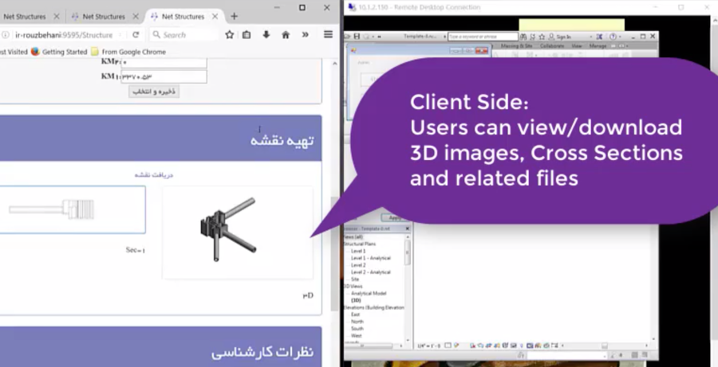

<head>
<meta http-equiv="Content-Type" content="text/html; charset=utf-8">
<link rel="stylesheet" type="text/css" href="bc.css">

</head>

<!---

- revit ifc update
  [Release 20.1.0 for Revit 2020](https://github.com/Autodesk/revit-ifc/releases/tag/IFC_v20.1.0)
  Angel Velez
  @avelezsosa
  Finally!  #Revit #IFC #OpenSource #GitHub v20.1 is out! (link: https://bit.ly/2GPRdwX) bit.ly/2GPRdwX.  Up next: App Store version, v19.3.

- Daniel Alvarado invites all Revit API users to
  a [Community Discussion on Revit](https://forums.autodesk.com/t5/revit-api-forum/community-discussion-revit/m-p/8962297)
  [How Ongoing Innovations Have Made Revit More Automated Than Ever](https://blogs.autodesk.com/revit/2019/08/12/how-ongoing-innovations-have-made-revit-more-automated-than-ever)

- [GeometryInstances](https://knowledge.autodesk.com/search-result/caas/CloudHelp/cloudhelp/2016/ENU/Revit-API/files/GUID-B4F83374-0DF6-4737-91EB-900E676E862B-htm.html)
  > Note that not all Family instances will include GeometryInstances. When Revit needs to make a unique copy of the family geometry for a given instance (because of the effect of local joins, intersections, and other factors related to the instance placement) no GeometryInstance will be encountered; instead the Solid geometry will be found at the top level of the hierarchy.
  and [Example: Retrieve Geometry Data from a Beam](https://knowledge.autodesk.com/search-result/caas/CloudHelp/cloudhelp/2016/ENU/Revit-API/files/GUID-F092BCCC-77E9-4DA9-9264-10F0DB354BF5-htm.html)
  > The GeometryElement may contain the desired geometry as a Solid or GeometryInstance depending on whether a beam is joined or standalone, and this code covers both cases.
  pointed out by Bobby C Jones in the discussion on
  [Solid element is missing](https://forums.autodesk.com/t5/revit-api-forum/solid-element-is-missing/m-p/8950786)

- export parameters to ms access
https://forums.autodesk.com/t5/revit-api-forum/how-to-export-selected-parameters-to-ms-access-using-my-own/m-p/8960356
How to export selected parameters to MS access using my own ribbon?
[Q] If I want to create my own ribbon within add-ins menu of revit 2019. And when I click the ribbon, it will show the window that asks me which parameters I want to export to MS access file. (I want to be able to select the required parameters of each element.) Can you suggest any api sample code? Thank you.
[A] Look at the ADN Xtra labs:
https://github.com/jeremytammik/AdnRevitApiLabsXtra
Look at the XtraCs project, module Lab4.cs, especially the external commands Lab4_1_ElementParameters and Lab4_2_ExportParametersToExcel.
https://thebuildingcoder.typepad.com/blog/2017/09/use-forge-or-spreadsheet-to-create-shared-parameters.html#comment-4568543582
[https://forums.autodesk.com/t5/revit-api-forum/getting-shared-type-parameters/m-p/8919695](Getting Shared Type Parameters)
https://thebuildingcoder.typepad.com/blog/2019/06/lookup-family-types-and-parameter-definition-names.html#comment-4531067073

Ahmad Rouzbehani shared on LinkedIn
Civil Engineer/Software Developer at [Mahab Ghodss](http://mahabghodss.net/ExternalSites/new/en/DefaultEN.aspx)
This video shows how I automate REVIT to produce 3D models by reusing pre-built families in a REVIT project after reshaping them by user parameter values- an intake in this case.
By programming on the server side to automate Autodesk Revit and Autodesk Civil 3D, as well as many JavaScript coding on the client side, engineers are able to design the irrigation network and belonging structures, get true 3D images of structural models, print shop drawings, as well as have quantities measured for structures or excavation volumes only through a web browser or a mobile device which is connected to the local network.
Thanks all the colleges who helped me in this project:
mozhgan hoseini,  Bijan Khatamipour, Arezoo Javadi,  Mina Birjandi, Enayatollah Farahani, saeid Zare, Jeremy Tammik
https://dms.licdn.com/playback/C4D05AQGxc2GCtF1W5A/5b63cbd0e027484da68e17ef5504d8ad/feedshare-mp4_3300-captions-thumbnails/1507940147251-drlcss?e=1565766000&v=beta&t=wrjeczTUvfw8Y-oamIE17J3GX_A9DU9iCAgsyHH9-GQ

<video tabindex="-1" id="vjs_video_3_html5_api" preload="auto" class="vjs-tech" poster="https://dms.licdn.com/video-thumbs/C4D05AQGxc2GCtF1W5A/16aa585a8da14797b1e8613c29a306e4/feedshare-videocover_high-captions-thumbnails/800x600-00001.jpg" src="https://dms.licdn.com/playback/C4D05AQGxc2GCtF1W5A/5b63cbd0e027484da68e17ef5504d8ad/feedshare-mp4_3300-captions-thumbnails/1507940147251-drlcss?e=1565766000&amp;v=beta&amp;t=wrjeczTUvfw8Y-oamIE17J3GX_A9DU9iCAgsyHH9-GQ" autoplay="autoplay"></video>

twitter:

IFC update, access to family instance geometry, parameters, global data and Iranian civil engineering app using the #RevitAPI @AutodeskForge @AutodeskRevit #bim #DynamoBim #ForgeDevCon http://bit.ly/rvtifc201

I completed the move to my new computer, and happily all systems go now.
Here are some other topics that came up in the past few days
&ndash; Revit-IFC Release 20.1.0
&ndash; Community discussion on Revit
&ndash; Solid or instance, depending
&ndash; Exporting parameters to Access
&ndash; Store globals on custom <code>DataStorage</code>, not <code>ProjectInfo</code>
&ndash; Iranian civil engineering project video...

linkedin:

IFC update, access to family instance geometry, parameters, global data and Iranian civil engineering app using the #RevitAPI

http://bit.ly/rvtifc201

I completed the move to my new computer, and happily all systems go now.
Here are some other topics that came up in the past few days:

- Revit-IFC Release 20.1.0
- Community discussion on Revit
- Solid or instance, depending
- Exporting parameters to Access
- Store globals on custom <code>DataStorage</code>, not <code>ProjectInfo</code>
- Iranian civil engineering project video...

#bim #DynamoBim #ForgeDevCon #Revit #API #IFC #SDK #AI #VisualStudio #Autodesk #AEC #adsk

the [Revit API discussion forum](http://forums.autodesk.com/t5/revit-api-forum/bd-p/160) thread

-->

### IFC Update, Instance Geometry, Parameters

I completed the move to my new computer, and happily all systems go now.

Here are some other topics that came up in the past few days:

- [Revit-IFC Release 20.1.0](#2)
- [Community discussion on Revit](#3)
- [Solid or instance, depending](#4)
- [Exporting parameters to Access](#5)
- [Store globals on custom `DataStorage`, not `ProjectInfo`](#6)

<!-- - [Iranian civil engineering project video](#7) --> 

Mahab Ghodss civil engineering project (<a href="https://thebuildingcoder.typepad.com/files/mahabghodss_video.mp4">video</a>)
 

- [Iranian civil engineering project video](#7)

#### Revit-IFC Release 20.1.0 

[Release 20.1.0 for Revit 2020](https://github.com/Autodesk/revit-ifc/releases/tag/IFC_v20.1.0) has been released.

It includes 20.0.0.0 plus the out-of-the-box Revit 2020 IFC functionalities, bug fixes and various regression fixes.

Says Angel [@avelezsosa](https://twitter.com/avelezsosa) Velez:

<blockquote class="twitter-tweet">
Finally! <a href="https://twitter.com/hashtag/Revit?src=hash&amp;ref_src=twsrc%5Etfw">#Revit</a> <a href="https://twitter.com/hashtag/IFC?src=hash&amp;ref_src=twsrc%5Etfw">#IFC</a> <a href="https://twitter.com/hashtag/OpenSource?src=hash&amp;ref_src=twsrc%5Etfw">#OpenSource</a> <a href="https://twitter.com/hashtag/GitHub?src=hash&amp;ref_src=twsrc%5Etfw">#GitHub</a> v20.1 is out! <a href="https://t.co/TmCc62uDjA">https://t.co/TmCc62uDjA</a>. Up next: App Store version, v19.3.
&mdash; Angel Velez (@avelezsosa) <a href="https://twitter.com/avelezsosa/status/1159476876538187777?ref_src=twsrc%5Etfw">August 8, 2019</a></blockquote> 

#### Community Discussion on Revit

In the [Revit API discussion forum](http://forums.autodesk.com/t5/revit-api-forum/bd-p/160),
Daniel Alvarado invites all Revit API users to
a [community discussion on Revit](https://forums.autodesk.com/t5/revit-api-forum/community-discussion-revit/m-p/8962297), saying:

> I found an interesting article on the Revit Blog.
I am sharing this article by Amie Vaccaro to discuss

> - [How ongoing innovations have made Revit more automated than ever](https://blogs.autodesk.com/revit/2019/08/12/how-ongoing-innovations-have-made-revit-more-automated-than-ever)

> To participate in the discussion, write your comments, thoughts, and questions and feel free to agree or disagree with the ideas presented in the article. I would like to hear all kinds of feedback &nbsp; :-)

> Discussion questions:

> - What features of Revit do you wish were automated?  
> - Now that you know what features are automated, which one is most useful for you?  

> We invite anyone to participate in these discussions and look forward to animated conversations! 

#### Solid or Instance, Depending

Also in the discussion forum, in the thread asking why
the [solid element is missing](https://forums.autodesk.com/t5/revit-api-forum/solid-element-is-missing/m-p/8950786),
Bobby C Jones points out two important basic knowledgebase articles clarifying how to retrieve geometry from family instances:

First, the article
on [GeometryInstances](https://knowledge.autodesk.com/search-result/caas/CloudHelp/cloudhelp/2016/ENU/Revit-API/files/GUID-B4F83374-0DF6-4737-91EB-900E676E862B-htm.html) explains:

  > Note that not all Family instances will include GeometryInstances.
  When Revit needs to make a unique copy of the family geometry for a given instance (because of the effect of local joins, intersections, and other factors related to the instance placement), no GeometryInstance will be encountered; instead, the Solid geometry will be found at the top level of the hierarchy.
  
  It also points to the helpful [Example: Retrieve Geometry Data from a Beam](https://knowledge.autodesk.com/search-result/caas/CloudHelp/cloudhelp/2016/ENU/Revit-API/files/GUID-F092BCCC-77E9-4DA9-9264-10F0DB354BF5-htm.html), which reiterates:
  
  > The `GeometryElement` may contain the desired geometry as a `Solid` or `GeometryInstance`, depending on whether a beam is joined or standalone, and this code covers both cases...

If this is unclear to you, please refer to the detailed knowledgebase explanations.

#### Exporting Parameters to Access

Another short note from the discussion forum
on [how to export selected parameters to MS access using my own ribbon](https://forums.autodesk.com/t5/revit-api-forum/how-to-export-selected-parameters-to-ms-access-using-my-own/m-p/8960356):

**Question:** If I want to create my own ribbon within add-ins menu of Revit 2019. And when I click the ribbon, it will show the window that asks me which parameters I want to export to MS access file. (I want to be able to select the required parameters of each element.) Can you suggest any API sample code? Thank you.

**Answer:** Look at the [ADN Xtra labs](https://github.com/jeremytammik/AdnRevitApiLabsXtra), 
in the `XtraCs` project, module Lab4.cs, especially the external
commands [Lab4_1_ElementParameters](https://github.com/jeremytammik/AdnRevitApiLabsXtra/blob/master/XtraCs/Labs4.cs#L45-L266)
and [Lab4_2_ExportParametersToExcel](https://github.com/jeremytammik/AdnRevitApiLabsXtra/blob/master/XtraCs/Labs4.cs#L268-L509).

#### Store Globals on Custom DataStorage, not ProjectInfo

Talking about parameters, I implemented an add-in to round-trip Revit element parameters to Forge and back, enabling
the [use of Forge or an external spreadsheet to create shared parameters](https://thebuildingcoder.typepad.com/blog/2017/09/use-forge-or-spreadsheet-to-create-shared-parameters.html).

A recent [comment](https://thebuildingcoder.typepad.com/blog/2017/09/use-forge-or-spreadsheet-to-create-shared-parameters.html#comment-4568543582) on that once again brought up the topic of storing global information in the model.

If you wish to do so, do not store it on the `ProjectInfo` singleton element; rather, you can and should create your own `DataStorage` element for this purpose, as explained in the note
on [storing a dictionary &ndash; use `DataStorage`, not `ProjectInfo`](https://thebuildingcoder.typepad.com/blog/2016/11/1500-posts-devday-and-storing-a-dictionary.html#5).

<!--

#### Iranian Civil Engineering Project Video

To close, Ahmad Rouzbehani, Civil Engineer and Software Developer at [Mahab Ghodss](http://mahabghodss.net/ExternalSites/new/en/DefaultEN.aspx),
shared an impressive [video](https://dms.licdn.com/playback/C4D05AQGxc2GCtF1W5A/5b63cbd0e027484da68e17ef5504d8ad/feedshare-mp4_3300-captions-thumbnails/1507940147251-drlcss?e=1565766000&v=beta&t=wrjeczTUvfw8Y-oamIE17J3GX_A9DU9iCAgsyHH9-GQ) ([local link](zip/mahabghodss_video.mp4)) on LinkedIn:

> This video shows how I automate Revit to produce 3D models by reusing pre-built families in a Revit project after reshaping them by user parameter values &ndash; an intake in this case.

> By programming on the server side to automate Autodesk Revit and Autodesk Civil 3D, as well as a lot of JavaScript coding on the client side, engineers are able to design the irrigation network and belonging structures, get true 3D images of structural models, print shop drawings, as well as have quantities measured for structures or excavation volumes simply through a web browser or a mobile device which is connected to the local network.

Thanks to Ahmad for sharing this, and congratulations on implementing this impressive workflow!

-->