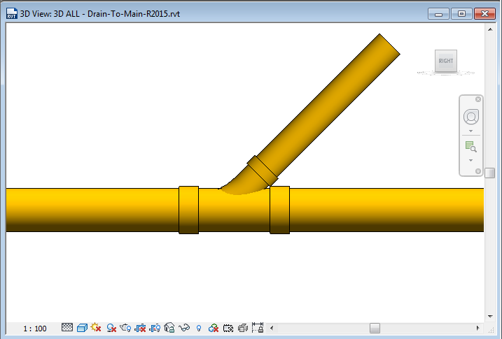

<head>
<meta http-equiv="Content-Type" content="text/html; charset=utf-8">
<link rel="stylesheet" type="text/css" href="bc.css">

</head>

<!---

- 11711167 [Connect/Add Pipe at Specified Angle]

- mep ductwork creation tips from ollikat
  https://forums.autodesk.com/t5/revit-api-forum/automatic-duct-between-fittings/m-p/8890265

twitter:

MEP ductwork and changing pipe direction in the #RevitAPI @AutodeskForge @AutodeskRevit #bim #DynamoBim #ForgeDevCon http://bit.ly/pipedirection

One of today's Revit API discussion forum threads prompted a discussion of MEP duct- and pipework creation topics
&ndash; Changing pipe direction
&ndash; MEP ductwork creation tip...

linkedin:

MEP ductwork and changing pipe direction in the #RevitAPI

http://bit.ly/pipedirection

One of today's Revit API discussion forum threads prompted a discussion of MEP duct- and pipework creation topics:

- Changing pipe direction
- MEP ductwork creation tip...

#bim #DynamoBim #ForgeDevCon #Revit #API #IFC #SDK #AI #VisualStudio #Autodesk #AEC #adsk

the [Revit API discussion forum](http://forums.autodesk.com/t5/revit-api-forum/bd-p/160) thread

-->

### MEP Ductwork and Changing Pipe Direction

One of today's [Revit API discussion forum](http://forums.autodesk.com/t5/revit-api-forum/bd-p/160) threads
prompted a discussion of MEP duct- and pipework creation topics:

- [Changing pipe direction](#2)
- [MEP ductwork creation tip](#3)

#### Changing Pipe Direction

Neerav Mehta shared some research on determining precise directions for inserting pipe fittings in
the [Revit API discussion forum](http://forums.autodesk.com/t5/revit-api-forum/bd-p/160) thread
on [changing pipe direction](https://forums.autodesk.com/t5/revit-api-forum/changing-pipe-direction/m-p/8966993):

**Question:** I am trying to place a pipe precisely between two points: intersectionPoint and intersectionPoint + perpendicularDirection. I am using the following statement to move the pipe:

<pre class="code">
  Pipe dummyPipe = doc.GetElement(
    ElementTransformUtils.CopyElement(
      doc, branchPipe.Id, XYZ.Zero).First()) as Pipe;

  (dummyPipe.Location as LocationCurve).Curve
    = Line.CreateBound( intersectionPoint,
      intersectionPoint + perpendicularDirection );
</pre>

With the above placement, I would expect the pipe's curve's direction to be exactly equal to perpendicularDirection, but that's not the case.

As an example, if `perpendicularDirection` is set to {(-0.016831296, 0.968685013, -0.052781984)}, the direction of the pipe comes out to be {(-0.017347059, 0.998368562, -0.054399389)}.

Note that there is a slight difference in the direction and, as a result, I am not able to connect this pipe to a Tee fitting, as described in the thread
on [how to create a tee fitting with a non-90 degree branch angle for pipe](https://forums.autodesk.com/t5/revit-api-forum/how-to-create-a-tee-fitting-of-not-90-degree-branch-angle-for/td-p/8433556).

BTW, the same issue happens even if I create a new pipe between two points.

Any idea how to fix this?

**Suggestion:** In some cases, you do not need to specify an exact pipe direction to create a pipe between fittings, nor an exact fitting location to insert a fitting between existing pipes.

Revit will automatically adjust the newly created element appropriately to connect with the existing elements.

Different variations of this approach are explored and discussed in the research series
on [creating a rolling offset](http://thebuildingcoder.typepad.com/blog/2014/01/final-rolling-offset-using-pipecreate.html).

Here are some previous articles on the `NewTakeoffFitting` method and taps:

- [Use of `NewTakeOffFitting` on a duct](http://thebuildingcoder.typepad.com/blog/2011/02/use-of-newtakeofffitting-on-a-duct.html)
- [Use of `NewTakeOffFitting` on a pipe](http://thebuildingcoder.typepad.com/blog/2011/04/use-of-newtakeofffitting-on-a-pipe.html)
- [Adjustable versus perpendicular spud](http://thebuildingcoder.typepad.com/blog/2013/02/adjustable-versus-perpendicular-spud.html)
- [Splitting a duct or pipe with taps](http://thebuildingcoder.typepad.com/blog/2014/02/daylighting-extension-and-splitting-with-taps.html#3)

**Solution:** I looked at the rolling offset, but it deals only with elbows, not tee fittings.

The problem in this case, however, was due to inaccuracy in the cross product.

I was deriving the pipe direction by doing two cross-products of unit-norm vectors. In other words:

<pre>
  pipeDirection = X.CrossProduct(Y).CrossProduct(X)
</pre>

Since X and Y are of unit-norm, I was expecting `pipeDirection` to be unit-norm as well.

However, even if both X and Y are unit length, their cross product will still NOT be unit length unless they are exactly perpendicular, cf.
the [detailed explanation of the cross product](https://en.wikipedia.org/wiki/Cross_product).

Therefore, the length of `pipeDirection` was about 0.971 instead of 1.0.

Once I normalise `pipeDirection`, it works fine.

BTW, the rolling offset posts only deal with inserting elbows, which works pretty well.

In my case, I am inserting a T connection, and that API is a horrible mess. Here are the issues:

- `CreateTeeFitting` works only when the connection is 90 degrees, so you have to use the workaround mentioned in [Tee Fitting with no right angle](https://forums.autodesk.com/t5/revit-api-forum/tee-fitting-with-no-right-angle/m-p/8954339).
- The above workaround works only when the base pipe is placed in a way that's acceptable to Revit. As an example, adding a Tee connection works if the two pipes are placed along X axis and the branch pipe is along the Y-axis. But, if I rotate the three pipes slightly, for example by 0.1 degrees, the `CreateTeeFitting` function fails.
- So now I have to use another workaround, creating dummy pipes in a position that Revit likes and a 90-degree T connection. Then delete all the dummy pipes and the fittings that were automatically created, except the T connection. Now rotate the T fitting to what I want, for e.g. by 0.1 degrees. Then change the angle of the branch connector to something other than 90 degrees.

This issue along
with [line based family location don't update origin after change](https://forums.autodesk.com/t5/revit-api-forum/tee-fitting-with-no-right-angle/m-p/8954339) has
taken me about a week to create a T connection at the right place and orientation instead of probably an hour if the API had worked more intuitively in the first place.

Congratulations and many thanks to Neerav Mehta for this research and solution.

Sorry to hear that the API is so hard to use in this situation. 

#### MEP Ductwork Creation Tip 

A while ago, Ollikat shared a general MEP ductwork creation tip in
the [Revit API discussion forum](http://forums.autodesk.com/t5/revit-api-forum/bd-p/160) thread
on [automatic duct between fittings](https://forums.autodesk.com/t5/revit-api-forum/automatic-duct-between-fittings/m-p/8890265), summarising his extensive experience in this area:

> In summary, I have been co-working several years with my colleague in a feature where different parts of network (duct, pipes, etc.) are being created and connected via API. If we would need to redo everything from scratch today, we definitely would use only low-level methods, like `CreateFamilyInstance` etc., and then explicitly move, rotate and connect each part of the network separately (also meaning that if there's a need for reducer, create it manually). This is the best approach, because using higher level methods like `NewElbowFitting` etc. causes all sort of problems, and it is a very tedious job to implement a reliable solution for every possible scenario. Using low level methods gives you total control over what's happening. It's not convenient, but, in the long run, will save your time. This, of course, depends what kind of add-in you are developing.

> Unfortunately, the main point is that there's no easy way of generating networks in the Revit API.

