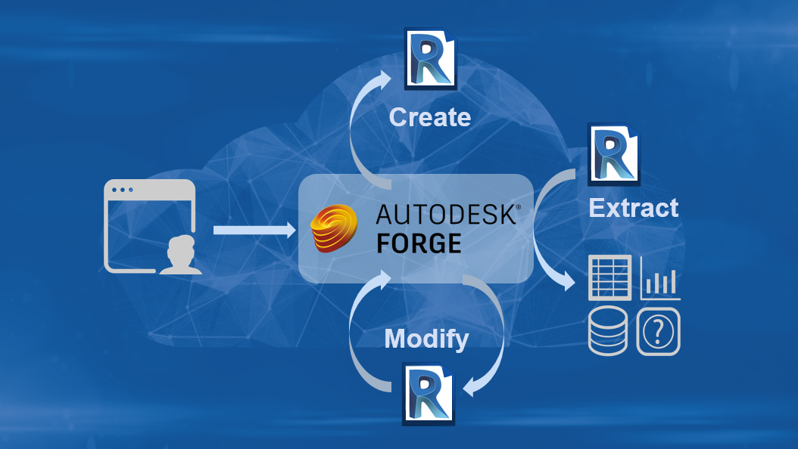

<head>
<meta http-equiv="Content-Type" content="text/html; charset=utf-8">
<link rel="stylesheet" type="text/css" href="bc.css">

</head>

<!---

twitter:

Revit API and Design Automation API Survey for the #RevitAPI @AutodeskForge @AutodeskRevit #bim #DynamoBim #ForgeDevCon http://bit.ly/rvtapisurvey

The Revit product team is conducting a survey to improve the functionality of the Revit services.
Please help them prioritise new features and upcoming enhancements to future releases of the Autodesk Revit API and the Forge Design Automation for Revit API by taking a brief survey...

linkedin:

Revit API and Design Automation API Survey for the #RevitAPI 

http://bit.ly/rvtapisurvey

The Revit product team is conducting a survey to improve the functionality of the Revit services.
Please help them prioritise new features and upcoming enhancements to future releases of the Autodesk Revit API and the Forge Design Automation for Revit API by taking a brief survey...

#bim #DynamoBim #ForgeDevCon #Revit #API #IFC #SDK #AI #VisualStudio #Autodesk #AEC #adsk

the [Revit API discussion forum](http://forums.autodesk.com/t5/revit-api-forum/bd-p/160) thread

Dynamo Zero Touch CS#Node Element Wrapper

-->

### Revit API and Design Automation API Survey

The Revit product team is conducting a survey to improve the functionality of the Revit services.

Please help them prioritise new features and upcoming enhancements to future releases of the Autodesk Revit API and the Forge Design Automation for Revit API by taking
a [brief survey](https://autodeskfeedback.az1.qualtrics.com/jfe/form/SV_0fFVmiYvIuqDAJT):

> We would like your help prioritizing API enhancements for future releases of the Autodesk Revit API and the Forge Design Automation for Revit API. Please answer the following 18 questions. It will take about 5-10 minutes to complete. Please help us help you by completing it. We appreciate your time and cooperation:

<blockquote>

<a href="https://autodeskfeedback.az1.qualtrics.com/jfe/form/SV_0fFVmiYvIuqDAJT">Revit API and Forge Design Automation for Revit API survey</a>

</blockquote>

The survey remains open until September 6th.

Thank you in advance!

