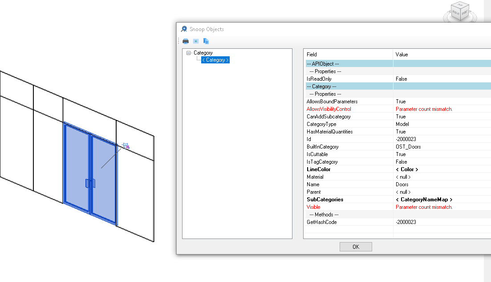
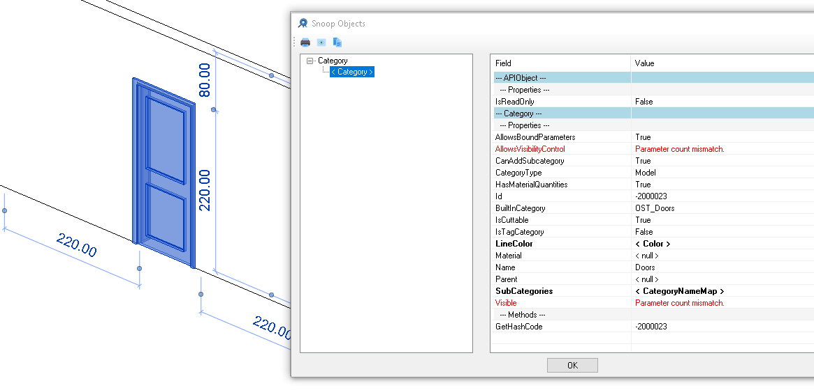
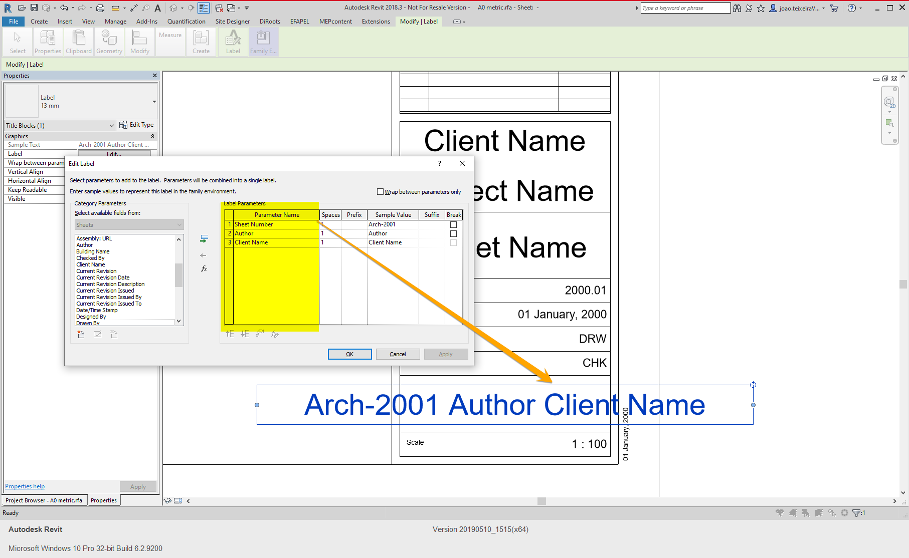

<head>
<meta http-equiv="Content-Type" content="text/html; charset=utf-8">
<link rel="stylesheet" type="text/css" href="bc.css">

</head>

<!---

- GetSimilarTypes to find door symbols that can be used in a curtain wall
  BuiltInCategory of Doors and curtain wall doors
  https://forums.autodesk.com/t5/revit-api-forum/builtincategory-of-doors-and-curtain-wall-doors/m-p/9002988
  door_category_1.png
  door_category_2.png

- SnappingService - What it actually does?
  https://forums.autodesk.com/t5/revit-api-forum/snappingservice-what-it-actually-does/m-p/8986801
  Q does anyone have any insight / experience. API Documentation doesn't say much :-(.
  A SnappingService provides snapping points and lines and is used for point clouds.

- 15711698 [Get Label Parameters]

twitter:

GetSimilarTypes filters for curtain wall door symbols, SnappingService explanation and title block label parameters in the #RevitAPI @AutodeskForge @AutodeskRevit #bim #DynamoBim #ForgeDevCon http://bit.ly/getsimilartypes

So many interesting discussions and inspiring solutions in the Revit API discussion forum!
Here are a few, plus one non-forum beginner case
&ndash; <code>GetSimilarTypes</code> filters for curtain wall door symbols
&ndash; <code>SnappingService</code> &ndash; what does it actually do?
&ndash; Get title block label parameters...

linkedin:

GetSimilarTypes, SnappingService and Title Labels in the #RevitAPI

http://bit.ly/getsimilartypes

So many interesting discussions and inspiring solutions in the Revit API discussion forum!

Here are two of them, plus one non-forum beginner case:

- GetSimilarTypes filters for curtain wall door symbols
- SnappingService -- what does it actually do?
- Get title block label parameters...

#bim #DynamoBim #ForgeDevCon #Revit #API #IFC #SDK #AI #VisualStudio #Autodesk #AEC #adsk

the [Revit API discussion forum](http://forums.autodesk.com/t5/revit-api-forum/bd-p/160) thread

-->

### GetSimilarTypes, SnappingService and Title Labels

So many interesting discussions and inspiring solutions in
the [Revit API discussion forum](http://forums.autodesk.com/t5/revit-api-forum/bd-p/160)!

Here are two of them, plus one non-forum beginner case:

- [`GetSimilarTypes` filters for curtain wall door symbols](#2)
- [`SnappingService` &ndash; what does it actually do?](#3)
- [Get title block label parameters](#4)

#### GetSimilarTypes Filters for Curtain Wall Door Symbols

Yet once again,
Frank [@Fair59](https://forums.autodesk.com/t5/user/viewprofilepage/user-id/2083518) Aarssen
comes to the rescue, answering
the [Revit API discussion forum](http://forums.autodesk.com/t5/revit-api-forum/bd-p/160) thread
on [`BuiltInCategory` of doors and curtain wall doors](https://forums.autodesk.com/t5/revit-api-forum/builtincategory-of-doors-and-curtain-wall-doors/m-p/9002988):

**Question:** I want to build a plugin that changes the curtain wall panel types.

When I select a curtain wall door, how can I filter for only curtain wall panel door symbols?

Is there any specific value for curtain panel door?

Snooping a curtain wall panel door in RevitLookup:

A door in a standard wall looks similar:

  
Since the category is the same for all doors, that cannot be used to tell them apart.

Another possible criterion might be to query the door for its host using
its [`Host` property](https://www.revitapidocs.com/2020/69f30141-bd3b-8bdd-7a63-6353d4d495f9.htm).
Using the host element properties, one ought to be able to differentiate curtain walls from others.
However, I am looking at family symbols that have not yet been placed, not instances, so the host is not defined yet.

The `Family` class provides an [IsCurtainPanelFamily property](https://www.revitapidocs.com/2020/da0becae-cb65-fffd-1e97-b4aab5533004.htm),
so I also tried checking

<pre>
  FamilyInstance.Symbol.Family.IsCurtainPanelFamily
</pre>

Unfortunately, `IsCurtainPanelFamily` always returns false, so that does not work either.

**Answer:** From the `FamilySymbol`, you can find similar types using `GetSimilarTypes`.

This returns all curtain wall panels that can be placed in a curtain wall.

Filter that list for the door category:

<pre class="code">
&nbsp;&nbsp;IEnumerable&lt;FamilySymbol&gt;&nbsp;CW_doors
&nbsp;&nbsp;&nbsp;&nbsp;=&nbsp;new&nbsp;FilteredElementCollector(
&nbsp;&nbsp;&nbsp;&nbsp;&nbsp;&nbsp;doc,&nbsp;symbol.GetSimilarTypes()&nbsp;)
&nbsp;&nbsp;&nbsp;&nbsp;&nbsp;&nbsp;&nbsp;&nbsp;.OfCategory(&nbsp;BuiltInCategory.OST_Doors&nbsp;)
&nbsp;&nbsp;&nbsp;&nbsp;&nbsp;&nbsp;&nbsp;&nbsp;.Cast&lt;FamilySymbol&gt;();
</pre>

Many thanks to Frank for solving this!

I added his suggestion 
to [The Building Coder samples](https://github.com/jeremytammik/the_building_coder_samples) in
a new method `GetDoorSymbolsForCurtainWall`
in [release 2020.0.147.7](https://github.com/jeremytammik/the_building_coder_samples/compare/2020.0.147.7...2020.0.147.7).

#### SnappingService &ndash; What Does it Actually Do?

From
the [Revit API discussion forum](http://forums.autodesk.com/t5/revit-api-forum/bd-p/160) thread
on [`SnappingService` &ndash; What it actually does?](https://forums.autodesk.com/t5/revit-api-forum/snappingservice-what-it-actually-does/m-p/8986801)

**Question:** Does anyone have any insight or experience? The API documentation doesn't say much &nbsp; :-(

**Answer:** According to the development team, `SnappingService` provides snapping points and lines and is used for point clouds.
They also expressed an intent to add some documentation for it, and maybe for a couple of other undocumented services as well.

#### Get Title Block Label Parameters

Let's wrap up for today with a beginner's question:

**Question:** I am trying to access these title block label parameters marked in yellow through the Revit API:

I could not find a proper way to access those values in the Revit API documentation.

I'd like to know if this actually possible to achieve or not.

**Answer:** Yes, this is easy to achieve.

In fact, you can probably find out for yourself how to access this data by
installing [RevitLookup](https://github.com/jeremytammik/RevitLookup) and
using that to explore the title block properties.

Are you aware of RevitLookup?
It is a really invaluable tool for Revit add-in development and understanding the structure and contents of the Revit database.

You may also find it out easily for yourself by searching the Internet for an existing solution, e.g., by searching for something
like [revit api title block label parameters](https://duckduckgo.com/?q=revit+api+title+block+label+parameters).

The Building Coder took a look at
the [title block of a sheet](https://thebuildingcoder.typepad.com/blog/2009/11/title-block-of-sheet.html) and
its parameters a long time ago, without providing a method to achieve what you are asking for.

Since I think it is time to take another look at this and it may be useful for others in future as well, I put together the following function that may or may not achieve what you are after:

<pre class="code">
&nbsp;&nbsp;///&nbsp;&lt;summary&gt;
&nbsp;&nbsp;///&nbsp;Read&nbsp;the&nbsp;title&nbsp;block&nbsp;parameters&nbsp;to&nbsp;retrieve&nbsp;the&nbsp;
&nbsp;&nbsp;///&nbsp;label&nbsp;parameters&nbsp;Sheet&nbsp;Number,&nbsp;Author&nbsp;and&nbsp;Client&nbsp;
&nbsp;&nbsp;///&nbsp;Name
&nbsp;&nbsp;///&nbsp;&lt;/summary&gt;
&nbsp;&nbsp;static&nbsp;void&nbsp;ReadTitleBlockLabelParameters(
&nbsp;&nbsp;&nbsp;&nbsp;Document&nbsp;doc&nbsp;)
&nbsp;&nbsp;{
&nbsp;&nbsp;&nbsp;&nbsp;FilteredElementCollector&nbsp;title_block_instances
&nbsp;&nbsp;&nbsp;&nbsp;&nbsp;&nbsp;=&nbsp;new&nbsp;FilteredElementCollector(&nbsp;doc&nbsp;)
&nbsp;&nbsp;&nbsp;&nbsp;&nbsp;&nbsp;&nbsp;&nbsp;.OfCategory(&nbsp;BuiltInCategory.OST_TitleBlocks&nbsp;)
&nbsp;&nbsp;&nbsp;&nbsp;&nbsp;&nbsp;&nbsp;&nbsp;.OfClass(&nbsp;typeof(&nbsp;FamilyInstance&nbsp;)&nbsp;);
 
&nbsp;&nbsp;&nbsp;&nbsp;Parameter&nbsp;p;
 
&nbsp;&nbsp;&nbsp;&nbsp;Debug.Print(&nbsp;&quot;Title&nbsp;block&nbsp;instances:&quot;&nbsp;);
 
&nbsp;&nbsp;&nbsp;&nbsp;foreach(&nbsp;FamilyInstance&nbsp;tb&nbsp;in&nbsp;title_block_instances&nbsp;)
&nbsp;&nbsp;&nbsp;&nbsp;{
&nbsp;&nbsp;&nbsp;&nbsp;&nbsp;&nbsp;ElementId&nbsp;typeId&nbsp;=&nbsp;tb.GetTypeId();
&nbsp;&nbsp;&nbsp;&nbsp;&nbsp;&nbsp;Element&nbsp;type&nbsp;=&nbsp;doc.GetElement(&nbsp;typeId&nbsp;);
 
&nbsp;&nbsp;&nbsp;&nbsp;&nbsp;&nbsp;p&nbsp;=&nbsp;tb.get_Parameter(
&nbsp;&nbsp;&nbsp;&nbsp;&nbsp;&nbsp;&nbsp;&nbsp;BuiltInParameter.SHEET_NUMBER&nbsp;);
 
&nbsp;&nbsp;&nbsp;&nbsp;&nbsp;&nbsp;Debug.Assert(&nbsp;null&nbsp;!=&nbsp;p,
&nbsp;&nbsp;&nbsp;&nbsp;&nbsp;&nbsp;&nbsp;&nbsp;&quot;expected&nbsp;valid&nbsp;sheet&nbsp;number&quot;&nbsp;);
 
&nbsp;&nbsp;&nbsp;&nbsp;&nbsp;&nbsp;string&nbsp;s_sheet_number&nbsp;=&nbsp;p.AsString();
 
&nbsp;&nbsp;&nbsp;&nbsp;&nbsp;&nbsp;p&nbsp;=&nbsp;tb.get_Parameter(
&nbsp;&nbsp;&nbsp;&nbsp;&nbsp;&nbsp;&nbsp;&nbsp;BuiltInParameter.PROJECT_AUTHOR&nbsp;);
 
&nbsp;&nbsp;&nbsp;&nbsp;&nbsp;&nbsp;Debug.Assert(&nbsp;null&nbsp;!=&nbsp;p,
&nbsp;&nbsp;&nbsp;&nbsp;&nbsp;&nbsp;&nbsp;&nbsp;&quot;expected&nbsp;valid&nbsp;project&nbsp;author&quot;&nbsp;);
 
&nbsp;&nbsp;&nbsp;&nbsp;&nbsp;&nbsp;string&nbsp;s_project_author&nbsp;=&nbsp;p.AsValueString();
 
&nbsp;&nbsp;&nbsp;&nbsp;&nbsp;&nbsp;p&nbsp;=&nbsp;tb.get_Parameter(
&nbsp;&nbsp;&nbsp;&nbsp;&nbsp;&nbsp;&nbsp;&nbsp;BuiltInParameter.CLIENT_NAME&nbsp;);
 
&nbsp;&nbsp;&nbsp;&nbsp;&nbsp;&nbsp;Debug.Assert(&nbsp;null&nbsp;!=&nbsp;p,
&nbsp;&nbsp;&nbsp;&nbsp;&nbsp;&nbsp;&nbsp;&nbsp;&quot;expected&nbsp;valid&nbsp;client&nbsp;name&quot;&nbsp;);
 
&nbsp;&nbsp;&nbsp;&nbsp;&nbsp;&nbsp;string&nbsp;s_client_name&nbsp;=&nbsp;p.AsValueString();
 
&nbsp;&nbsp;&nbsp;&nbsp;&nbsp;&nbsp;Debug.Print(
&nbsp;&nbsp;&nbsp;&nbsp;&nbsp;&nbsp;&nbsp;&nbsp;&quot;Title&nbsp;block&nbsp;{0}&nbsp;&lt;{1}&gt;&nbsp;of&nbsp;type&nbsp;{2}&nbsp;&lt;{3}&gt;:&nbsp;&quot;
&nbsp;&nbsp;&nbsp;&nbsp;&nbsp;&nbsp;&nbsp;&nbsp;+&nbsp;&quot;{4}&nbsp;project&nbsp;author&nbsp;{5}&nbsp;for&nbsp;client&nbsp;{6}&quot;,
&nbsp;&nbsp;&nbsp;&nbsp;&nbsp;&nbsp;&nbsp;&nbsp;tb.Name,&nbsp;tb.Id.IntegerValue,
&nbsp;&nbsp;&nbsp;&nbsp;&nbsp;&nbsp;&nbsp;&nbsp;type.Name,&nbsp;typeId.IntegerValue,
&nbsp;&nbsp;&nbsp;&nbsp;&nbsp;&nbsp;&nbsp;&nbsp;s_sheet_number,&nbsp;s_project_author,&nbsp;
&nbsp;&nbsp;&nbsp;&nbsp;&nbsp;&nbsp;&nbsp;&nbsp;s_client_name&nbsp;);
&nbsp;&nbsp;&nbsp;&nbsp;}
&nbsp;&nbsp;}
</pre>

I also added this code
to [The Building Coder samples](https://github.com/jeremytammik/the_building_coder_samples)
in [release 2020.0.147.6](https://github.com/jeremytammik/the_building_coder_samples/compare/2020.0.147.5...2020.0.147.6).

I hope this helps.

Please confirm whether this method does what you are after.

If not, please use RevitLookup to find out exactly what you need and fix it accordingly.
