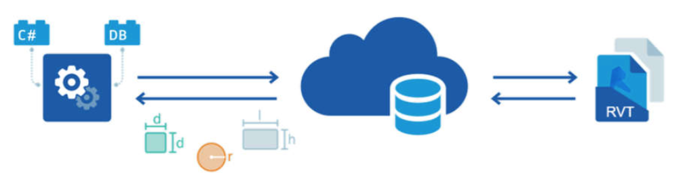
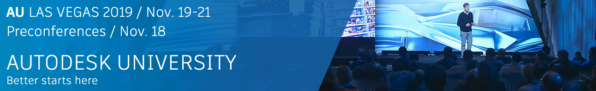

<head>
<meta http-equiv="Content-Type" content="text/html; charset=utf-8">
<link rel="stylesheet" type="text/css" href="bc.css">

</head>

<!---

twitter:

API Survey and Forge DevCon 2019 in Las Vegas and Darmstadt for the #RevitAPI @AutodeskForge @AutodeskRevit #bim #DynamoBim #ForgeDevCon http://bit.ly/apisurveydevcon

We repeat the call to participate in the Revit API survey, and heartily invite you to register for the Forge DevCon conferences in Europe and North America
&ndash; Revit API and Design Automation API Survey
&ndash; Forge DevCon 2019 at AU in Las Vegas
&ndash; Forge DevCon 2019 at AU in Darmstadt...

linkedin:

API Survey and Forge DevCon 2019 in Las Vegas and Darmstadt for the #RevitAPI

http://bit.ly/apisurveydevcon

We repeat the call to participate in the Revit API survey, and heartily invite you to register for the Forge DevCon conferences in Europe and North America:

- Revit API and Design Automation API Survey
- Forge DevCon 2019 at AU in Las Vegas
- Forge DevCon 2019 at AU in Darmstadt...

#bim #DynamoBim #ForgeDevCon #Revit #API #IFC #SDK #AI #VisualStudio #Autodesk #AEC #adsk

the [Revit API discussion forum](http://forums.autodesk.com/t5/revit-api-forum/bd-p/160) thread

-->

### API Survey and Forge DevCon

We repeat the call to participate in the Revit API survey, and heartily invite you to register for the Forge DevCon conferences in Europe and North America:

- [Revit API and Design Automation API Survey](#2)
- [Forge DevCon 2019 at AU in Las Vegas](#3)
- [Forge DevCon 2019 at AU in Darmstadt](#4)

#### Revit API and Design Automation API Survey

Please help prioritise new features and upcoming enhancements to future releases of the Revit API and the [Forge Design Automation for Revit API](https://forge.autodesk.com/en/docs/design-automation/v3/developers_guide/overview) by participating in
a [brief survey](https://autodeskfeedback.az1.qualtrics.com/jfe/form/SV_0fFVmiYvIuqDAJT):

<blockquote>

<a href="https://autodeskfeedback.az1.qualtrics.com/jfe/form/SV_0fFVmiYvIuqDAJT">Revit API and Forge Design Automation for Revit API survey</a>

</blockquote>

It consists of 18 questions and will take about 5-10 minutes to complete.

The survey deadline has been extended and it now remains open until September 15th.

Thank you in advance! We appreciate your time and cooperation.

#### Forge DevCon 2019 at AU in Las Vegas

The [Forge DevCon](https://forge.autodesk.com/devcon-2019) is returning
to [Autodesk University in Las Vegas](https://www.autodesk.com/autodesk-university/conference/las-vegas/overview),
on November 18th, and
the [registration is now open](https://forge.autodesk.com/devcon-2019)!
 
About the conferences:​

- Forge DevCon focuses on cloud-based tools that enhance Autodesk products and help to expand or streamline customer applications.  ​
- Autodesk University in Las Vegas is the annual flagship event for those who design and make the world around us.​
- Combined, they offer hundreds of focused sessions with over 10,000 professionals. Therefore, this experience can be customized in many ways, creating a focused and hugely beneficial learning and networking opportunity.​
 
What to Expect:​

- [Industry focused keynotes](https://autodeskuniversity.smarteventscloud.com/connect/sessionDetail.ww?SESSION_ID=332182) and
future plans for the Forge Platform​
- Classes and demos
on [data visualization](https://autodeskuniversity.smarteventscloud.com/connect/search.ww?pass=forgeDevCon#loadSearch-searchPhrase=&searchType=session&tc=0&sortBy=dayTime&i(77460)=720719&i(72466)=697601&p=),
[process automation](https://autodeskuniversity.smarteventscloud.com/connect/search.ww?pass=forgeDevCon#loadSearch-searchPhrase=&searchType=session&tc=0&sortBy=dayTime&i(77460)=720719&i(72466)=697582&p=),
and [cloud-based collaboration](https://autodeskuniversity.smarteventscloud.com/connect/search.ww?pass=forgeDevCon#loadSearch-searchPhrase=&searchType=session&tc=0&sortBy=dayTime&i(77460)=720719&i(72466)=697573&p=) for connecting teams and workflows​
- Expanded networking Village in partnership with Connect and Construct​
 
So how can you get involved?​

[Register today for Forge DevCon](https://autodeskuniversity.smarteventscloud.com/portal/registration.ww?pass=forgeDevCon) to
reserve your space, or select Forge DevCon when registering
for [Autodesk University](https://www.autodesk.com/autodesk-university/conference/las-vegas/overview?pass=forgeDevCon?utm_campaign=DevCon&utm_medium=Presentation&utm_source=SalesAsset&utm_content=Ent&utm_term=Forge)​.

If you are interested in sponsoring the event or would like more information, please reach out to [forge.devcon@autodesk.com​](mailto:forge.devcon@autodesk.com).
 
We hope to see you in November.

 
#### Forge DevCon 2019 at AU in Darmstadt

Closer to home &ndash; at least for me, in Switzerland &ndash; a similar constellation is coming up in Europe as well, albeit on a smaller scale.

Forge DevCon 2019 is also being held on October 14 at AU in Darmstadt, Germany.

[Register for Forge DevCon 2019 on October 14 in Darmstadt, Germany](https://www.rayseven.com/r7/runtime/autodesk/devcon2019/registration.visitor.php).

