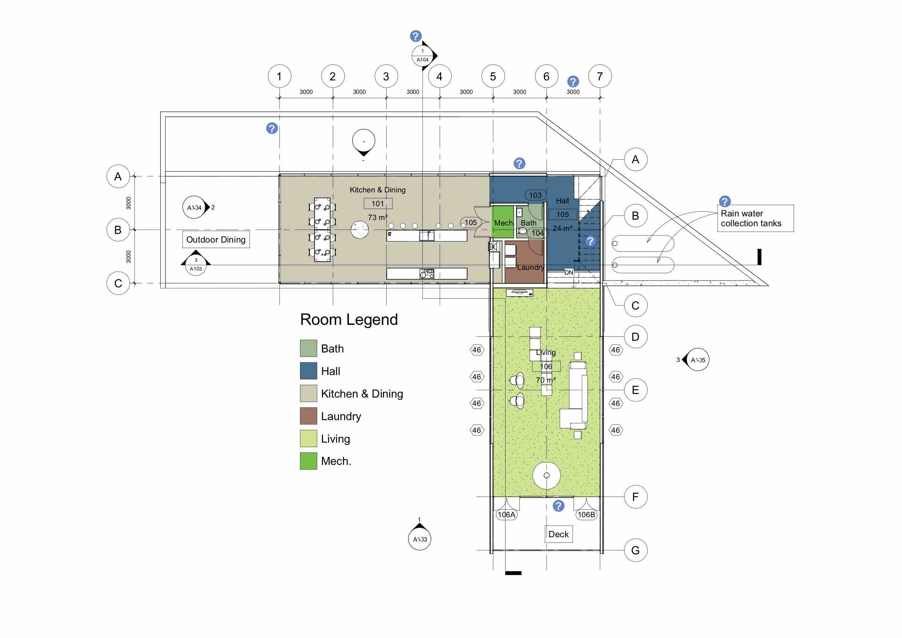
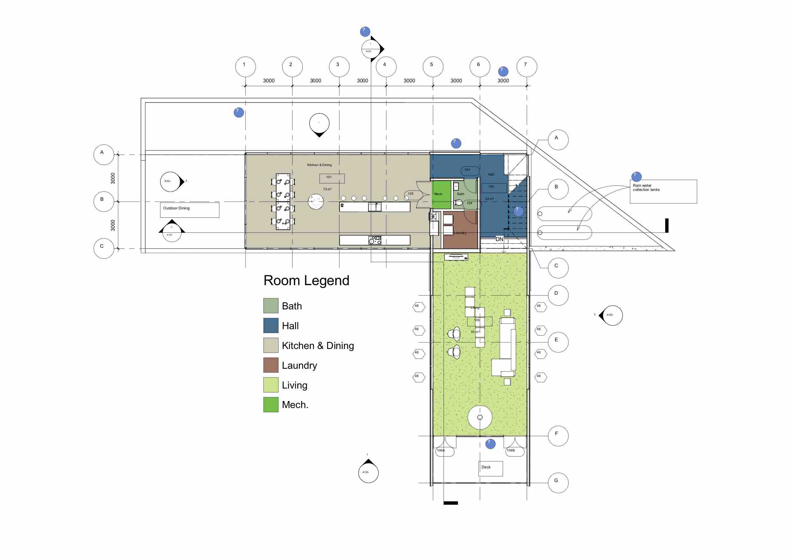

<head>
<meta http-equiv="Content-Type" content="text/html; charset=utf-8">
<link rel="stylesheet" type="text/css" href="bc.css">

</head>

<!---

twitter:

 for the #RevitAPI @AutodeskForge @AutodeskRevit #bim #DynamoBim #ForgeDevCon http://bit.ly/apidocscode

&ndash; 
...

linkedin:

#bim #DynamoBim #ForgeDevCon #Revit #API #IFC #SDK #AI #VisualStudio #Autodesk #AEC #adsk

the [Revit API discussion forum](http://forums.autodesk.com/t5/revit-api-forum/bd-p/160) thread

-->

### Scaling Add-In for 4K High Resolution Screen

An important question on handling add-in scaling for 4K high resolution screens:

####

Wednesday, 21 August 2019 at 15:19

We are in need of your help.  As you know we have been writing commercial Revit add-ins for many, many years (more than 10).  When we first started writing add-ins, we followed all of the examples from Autodesk, which were all done using WinForms.  We even built our add-in template code from these WinForms examples.  If I’m not mistaken, the sample code in the Revit SDK still uses WinForms for their examples.
 
However, we have been getting more and more complaints from our customers that our add-ins don’t work properly when they run 4K monitors because they have to scale up the monitors just to be able to read text on them (the native resolution is too high for the size of these desktop monitors to allow text to be readable at native scale).  For example, most users change the scale to 150% or even 200% in order to be able to read text.  When this happens, our WinForms user interfaces get kind of jumbled up.  Scrolling doesn’t work right, buttons get pushed off the edge of the window, etc.  At least some of our add-ins essentially become unusable.
 
A workaround to this problem for our add-ins is to have whichever monitor is the primary monitor be scaled to 100% zoom, then the add-ins work fine on any screen, but some customers are now balking at that.
 
In my research on this subject, you can get Winforms applications to work well on 4K monitors by changing some of the application properties.  For example:
 
using System.Runtime.InteropServices;

        [DllImport("Shcore.dll")]
 
        static extern int SetProcessDpiAwareness(int PROCESS_DPI_AWARENESS);
 
        private enum DpiAwareness { None = 0, SystemAware = 1, PerMonitorAware = 2 }
 
 
SetProcessDpiAwareness((int)DpiAwareness.PerMonitorAware);
 

While these things work well for standalone executables we write, I believe they must be done at the executable level, and as add-in creators for Revit we do not have control over Revit’s executable environment.  So very sadly, as nearly as I can tell these tricks don’t work for our Revit add-ins.
 
As you can imagine, we have a rather breathtaking amount of code in our suites for Revit, the significant majority of which is in our user interfaces.  To have to rewrite the user interfaces for all of our add-ins to use WPF would be devastatingly crippling, to say the least.
 
Can you please advise us on what we would need to do to modify our existing add-ins so they will scale and work correctly on scaled-up 4K monitors in a Revit environment?  For example, are there configuration settings for Revit which control the executable environment that we can advise our customers to change?   Or are there simple modifications to our code that we would need to implement in order for the WinForms engine on which they depend to run properly in a scaled-up 4K environment under Revit?
 
What have other long-term add-in creators done with their legacy code to solve this problem, short of a complete rewrite of their add-ins, which would not be feasible for us?
 
We really need your help with this!  Thank you very much for any advice you can offer.

[A]

Wednesday, 21 August 2019 at 21:11

In addition to setting dpi awareness in the code, it is also possible to use an application manifest. I think that this is worth investigating, although it may not be very straightforward for an addin dll.
 
Here are some links:
Application manifests: https://docs.microsoft.com/en-us/windows/win32/sbscs/application-manifests
DPI awareness (and manifests): https://docs.microsoft.com/en-us/previous-versions/windows/desktop/legacy/mt846517(v%3Dvs.85)
Registry key (for older Windows?): https://support.microsoft.com/en-us/help/912949/some-third-party-applications-that-use-external-manifest-files-stop-wo

[A]

Thursday, 22 August 2019 at 15:30

I am absolutely convinced that this can be solved without rewriting all your UI code.
 
For instance, if all else fails, simply disconnect your UI completely from your Revit add-in, run it in a separate process and use IPC to pass the information back and forth, as discussed and successfully implemented in these threads:
 
https://thebuildingcoder.typepad.com/blog/2019/04/set-floor-level-and-use-ipc-for-disentanglement.html
 
https://forums.autodesk.com/t5/revit-api-forum/using-a-geometry-viewer-in-a-revit-addin-to-preview-results/m-p/8868232
 
This assumes, of course, that you have not unnecessarily mixed up your UI code with Revit API stuff.

[R]

That is an EXTREMELY interesting idea!
 
I’m sure some of our oldest apps do embed the Revit code in with the UI.  So those would need some work to separate out.  But that would still be better and much faster than a whole rewrite.
 
Thank you so very much!!!!

**Solution:**

Wednesday, 28 August 2019 at 08:31

I did some testing, and we only have a few of our add-ins (or reusable components) that are in pretty bad shape as far as Winforms in Revit on 4K goes.  Very fortunately, most of our addins seem to work reasonably well!  Some work but require making their window large, so are awkward but functional, but a few things are downright unusable.  Of course, it’s the more complicated ones that have the worst problems, but I guess that is to be expected.  So the scope of the problem isn’t as big as we feared it might be.
 
However, we think we found at least a short-term workaround for our Winforms on 4K display problems in all of our addins!
 
It turns out you can instruct Windows itself how to handle the scaling on a per-application basis, by modifying the launch icon properties.
 
Attached is a document that describes these simple settings changes.

/a/doc/revit/tbc/git/a/zip/coderboy_Adjusting_Revit_for_4K_Displays.pdf
 
We are sending these instructions to a couple of customers to see if they would find this solution acceptable as at least a temporary workaround.

We haven’t observed any ill effects in Revit in our admittedly very limited testing, but if you know of a reason for a user NOT to make these changes to their Revit startup icon, please let us know.  I suppose one could copy their startup icon and modify the properties of the copy for when they want to use a problematic add-in if it came to that, though, then go back to the “regular” icon for normal use.

I don’t see why the 4K thoughts couldn’t be published.  We haven’t heard any complaints other than the text being small on PDF exports.  I ran a test, and it’s true, as seen in the first 2 attachments.  “Default” is with no scaling adjustment of Revit when it’s launched, “Adjusted” is with the scaling adjustment.  Much of the text is small.
 
But truthfully, one thing we’ve found is that if we tell actual Revit end users to just set their screen resolution to 1920 x 1080 at 100% scaling they are TOTALLY fine with that (happy, even) and that’s obviously the best solution to the issue.  But we do get some who say “we have 4K, we should use it at 4K” as well, who don’t want to do that.

We’ve updated our document (also attached) to suggest both methods, with the least impactful listed first.
 
Most of our apps are fine on 4K (80%?) but I’ve been spending some time trying to adjust our troublesome code to work better on 4K without a rewrite.  I’ve had a little success, but there are still some real stumpers too, simple designs that just don’t want to cooperate.  I’ll keep poking at that, as I have a couple more things to try.

I think you likely had it backwards.

The “Default” PDF was with no scaling adjustment on the icon definition for how Revit is launched.  It’s what would appear if you just installed Revit for the first time on your 4K display and launched it immediately with no changes.  The text size on the PDFs comes out correctly.
 
The “Adjusted” PDF was what was generated when following Method 2, and doing nothing else. 
 
If you look at the “Adjusted” PDF, the text in the bubbles is very small.  On screen the text looks correctly sized, but in a PDF it comes out small.  You might consider renaming the PDF from “Adjusted” to “Method 2”  ?
 

In the “Default” PDF the text in the bubbles is normal sized, and come out the same size as seen on-screen.
 

 
I don’t think it’s appropriate to suggest people change their text sizes so PDFs come out ok when running in Method 2 mode.  Likely the text will look much too big on screen by the time it looks ok on PDF anyway.
 
I think the better suggestion might be that, if using Method 2, to have two icons to launch Revit.  One for “normal” on-screen use (applying Method 2) and one just for generating PDFs, which has no special scaling applied in the icon properties.  (Yes, having 2 launch icons is rather lame)
 
Method 1 should obviously not incur any issues at all.

#### ApiDocs.co Code Search Sample Collection

Gui [@gtalarico](https://twitter.com/gtalarico) Talarico, the author of both 
the [online Revit API documentation revitapidocs.com](https://www.revitapidocs.com) and the more
general [Apidocs.co](https://apidocs.co) covering Grasshopper, Navisworks and Rhino as well,
[announced an expanded search functionality](https://twitter.com/gtalarico/status/1170473246275145729?ref_src=twsrc%5Etfw) in
the latter that provides code samples directly within its pages by searching a whole collection of samples hosted in the
new [ApiDocs.co code search sample repository](https://github.com/gtalarico/apidocs.samples).

<!--

<blockquote class="twitter-tweet">

Code samples are fetched this repo<a href="https://t.co/MxgdIuPlX3">https://t.co/MxgdIuPlX3</a> includes code from
<a href="https://twitter.com/jeremytammik?ref_src=twsrc%5Etfw">@jeremytammik</a>
<a href="https://twitter.com/a_dieckmann?ref_src=twsrc%5Etfw">@a_dieckmann</a>
<a href="https://twitter.com/arch_laboratory?ref_src=twsrc%5Etfw">@arch_laboratory</a>
<a href="https://twitter.com/5devene?ref_src=twsrc%5Etfw">@5devene</a>
<a href="https://twitter.com/teocomi?ref_src=twsrc%5Etfw">@teocomi</a> and others

&mdash; Gui Talarico (@gtalarico)
<a href="https://twitter.com/gtalarico/status/1170473246275145729?ref_src=twsrc%5Etfw">September 7, 2019</a>
</blockquote>

-->

##### How Does it Work?

[Apidocs.co](https://apidocs.co) uses the GitHub Code Search API against this repo to provide Code Samples directly within pages.

Because the GitHub Code Search API is limited to a single user or repo, this repository aggregates multiple relevant repos so they can all be searchable in a single request.

##### Limitations

- It's plain text search &ndash; some generic names like `Application` can trigger many false positives
- It's limited to certain entity types (e.g., `Class`, `Method`, `Property`, etc.)

##### How to Contribute

- Fork this repo
- Add a relevant repo to `repos.json`
- Run `python update.py`
- Send a [Pull Request](https://github.com/gtalarico/apidocs.samples/pulls)

##### RevitApiDocs and ApiDocs Comparison

**Question:** Could the new code sample search functionality be added to
both [apidocs.co](http://apidocs.co)
and [revitapidocs](https://www.revitapidocs.com)?
It is tricky to know when to use which...

**Answer:** Users can use whichever they prefer.
While [revitapidocs](https://www.revitapidocs.com) will likely continue to get new API versions, it will not get new features &ndash; the code base has not aged well and adding new features to it is no fun.
