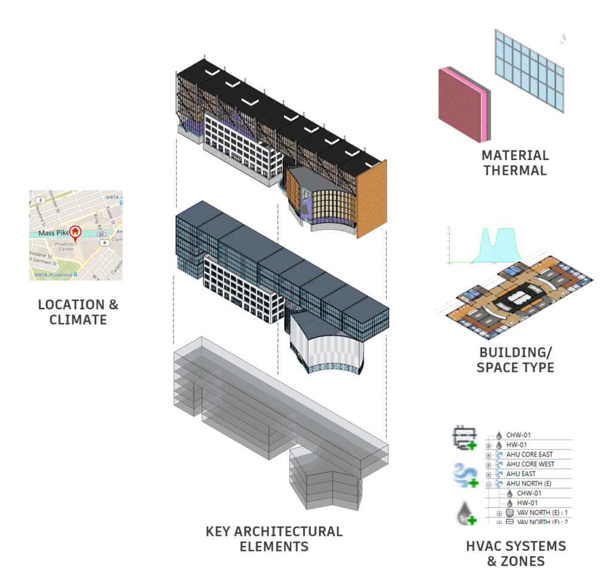

<head>
<meta http-equiv="Content-Type" content="text/html; charset=utf-8">
<link rel="stylesheet" type="text/css" href="bc.css">

</head>

<!---

twitter:

What's New, installation, compilation and RvtSamples setup in the Revit 2020.1 #RevitAPI @AutodeskForge @AutodeskRevit #bim #DynamoBim #ForgeDevCon http://bit.ly/rvt_2020_1_api

Revit 2020.1 was released and an updated Revit SDK has now been published for it
&ndash; Additions to the Revit 2020.1 API
&ndash; Systems analysis API additions
&ndash; Mechanical analytical systems
&ndash; Zone equipment
&ndash; System zones
&ndash; Systems analysis and analysis reports
&ndash; Export to gbXML
&ndash; View API additions
&ndash; Temporary view mode API
&ndash; Schedule API additions
&ndash; Striped rows
&ndash; Path of travel API additions
&ndash; Reveal obstacles mode for path of travel
&ndash; Options API additions
&ndash; Color options
&ndash; Rebar API additions
&ndash; Rebar constraints
&ndash; Installation and compilation
&ndash; RvtSamples Setup...

linkedin:

What's New, installation, compilation and RvtSamples setup in the Revit 2020.1 #RevitAPI

http://bit.ly/rvt_2020_1_api

Revit 2020.1 was released and an updated Revit SDK has now been published for it:

- Additions to the Revit 2020.1 API
  - Systems analysis API additions
    - Mechanical analytical systems
    - Zone equipment
    - System zones
    - Systems analysis and analysis reports
    - Export to gbXML
  - View API additions
    - Temporary view mode API
  - Schedule API additions
    - Striped rows
  - Path of travel API additions
    - Reveal obstacles mode for path of travel
  - Options API additions
    - Color options
  - Rebar API additions
    - Rebar constraints
- Installation and compilation
- RvtSamples Setup...

#bim #DynamoBim #ForgeDevCon #Revit #API #IFC #SDK #AI #VisualStudio #Autodesk #AEC #adsk

the [Revit API discussion forum](http://forums.autodesk.com/t5/revit-api-forum/bd-p/160) thread

-->

### What's New in the Revit 2020.1 API

Revit 2020.1 was released a month ago.

Harlan Brumm provides an overview of the new features in his article
on [What’s New in Revit 2020.1](https://blogs.autodesk.com/revit/2019/08/21/whats-new-in-revit-2020-1).

An updated Revit SDK for it has now been published in
the [Revit Developer Center](https://www.autodesk.com/developer-network/platform-technologies/revit).

I just recently created
the [RevitSdkSamples GitHub repository for the Revit SDK samples](https://github.com/jeremytammik/RevitSdkSamples),
to support the sample code text search
in [Gui Talarico's apidocs.co online .NET API documentation](https://apidocs.co).

Thanks to that, you can accompany me step by step as I install and adapt the SDK update for my system.

Before getting to that, however, let's look at what's new in the Revit 2020.1 API:

- [Major Additions to the Revit 2020.1 API](#2)
    - [Systems Analysis API additions](#2.1)
        - [Mechanical Analytical Systems](#2.1.1)
        - [Zone Equipment](#2.1.2)
        - [System Zones](#2.1.3)
        - [Systems Analysis and Analysis Reports](#2.1.4)
        - [Export to gbXML](#2.1.5)
    - [View API additions](#2.2)
        - [Temporary View Mode API](#2.2.1)
    - [Schedule API additions](#2.3)
        - [Striped rows](#2.3.1)
    - [Path of Travel API additions](#2.4)
        - [Reveal Obstacles Mode for Path of Travel](#2.4.1)
    - [Options API additions](#2.5)
        - [Color options](#2.5.1)
    - [Rebar API additions](#2.6)
        - [Rebar constraints](#2.6.1)
- [Installation and Compilation](#3)
- [RvtSamples Setup](#4)

#### Major Additions to the Revit 2020.1 API

##### Systems Analysis API additions

###### Mechanical Analytical Systems

The new class:

- Autodesk.Revit.DB.Mechanical.MEPAnalyticalSystem

represents an HVAC analytical system element where the air or water is circulated to satisfy building energy requirements.
Its AnalyticalSystemDomain property indicates whether the element represents a water loop or air system.  

The new class:

- Autodesk.Revit.DB.Mechanical.WaterLoopData

contains the data for a water loop system. It can be obtained from the MEPAnalyticalSystem.GetWaterLoopData() method. It offers the following properties:

- WaterLoopData.WaterLoopType
- WaterLoopData.ChillerType
- WaterLoopData.CondenserWaterLoopId

The new class:

- Autodesk.Revit.DB.Mechanical.AirSystemData

contains the data for an air system. It can be obtained from the MEPAnalyticalSystem.GetAirSystemData() method. It offers the following properties:

- AirSystemData.HeatExchangerType
- AirSystemData.PreheatCoilType
- AirSystemData.HeatingCoilType
- AirSystemData.AirSystemCoolingCoilType
- AirSystemData.AirFanType

###### Zone Equipment

The new class:

- Autodesk.Revit.DB.Mechanical.ZoneEquipment

represents a zone equipment element used for Mechanical Systems Analysis. Zone equipment is an early-stage equipment placeholder that provides heating or cooling to part of the air system or water loop. One zone equipment element may be mapped to multiple pieces of physical equipment depending on the zoning behavior type.

Analytical spaces may be associated to one or more zone equipment elements. The method:

- ZoneEquipment.MoveSpaceToEquipment() 

moves a set of spaces from the original zone equipment to the targeted zone equipment. Either zone equipment id may be InvalidElementId. If the original is InvalidElementId, the association is copied to the target zone equipment. If the target is InvalidElementId, the original association is removed.  The method:

- ZoneEquipment.GetAssociatedZoneEquipment() 

returns the set of zone equipment that is associated with the specified analytical space or spaces. 

The new class:

- Autodesk.Revit.DB.Mechanical.ZoneEquipmentData 

represents the data associated with a zone equipment. It can be obtained from the ZoneEquipment.GetZoneEquipmentData() method. It offers the following properties:

- ZoneEquipmentData.EquipmentType
- ZoneEquipmentData.EquipmentBehavior
- ZoneEquipmentData.HotWaterLoopId
- ZoneEquipmentData.ChilledWaterLoopId
- ZoneEquipmentData.AirSystemId

###### System Zones

A system zone in Revit is used to specify what parts of a building are served by specific equipment, air systems and water loops, without having to physically model them.  In the Revit API, a system-zone is represented as a GenericZone element with a domain data of type SystemZoneData.

The new class:

- Autodesk.Revit.DB.GenericZone

provides for a method of selecting elements that somehow come in contact with the zone object. A zone is a non-hierarchical structure of geometric information, area or volume definitions for the purpose of analysis.   A generic zone will contain specific domain requirements provided at creation of the element.  In Revit 2020.1, all GenericZones will represent system-zone elements used for MEP design.  Some relevant new members of GenericZones include:

- GenericZone.Create(Document doc, String name, GenericZoneDomainData domainData, ElementId levelId, IList&lt;CurveLoop&gt; curves) &ndash; supports creation of a zone using the specified domain data, level and curves to represent the intersection/outline of the related spaces.
- GenericZone.GetBoundaries() &ndash; Gets the boundaries for the given GenericZone.
- GenericZone.GetDomainData() &ndash; Returns the domain data for the given GenericZone.

For system-zone elements, the domain data will be an instance of the new class:

- Autodesk.Revit.DB.SystemZoneData

This data includes a reference to the zone equipment for the spaces in this system-zone:

- SystemZoneData.ZoneEquipmentId

###### Systems Analysis and Analysis Reports

The new class:

- Autodesk.Revit.DB.Analysis.ViewSystemsAnalysisReport

represents a view instance of the systems analysis report. In a typical API workflow, to run a systems analysis against a Revit project, create (via ViewSystemsAnalysisReport.Create()) a new view instance and request (via ViewSystemsAnalysisReport.RequestSystemsAnalysis()) the systems analysis from that view. The analysis will run in the background, and when the analysis is completed, the related views are automatically updated. The method RequestSystemsAnalysis.IsAnalysisCompleted indicates if the background systems analysis has completed or not.

It is possible for a project to contain multiple systems analysis reports. The method:

- ViewSystemsAnalysisReport.GetLatestSystemsAnalysisReport()

returns the latest report of systems analysis. The peak heating/cooling loads of all EnergyAnalysisSpace elements should be consistent with this latest report.

The new class:

- Autodesk.Revit.DB.Analysis.SystemsAnalysisOptions

contains some properties (e.g., WeatherFile, WorkflowFile, and OutputFolder) that affect the systems analysis. It is okay to leave some parameters empty. In those cases, the analysis will take the default value from the ViewSystemsAnalysisReport element. The weather file affects the results of energy simulation. The systems analysis will use the weather file at the current site location if SystemsAnalysisOptions.WeatherFile is empty. 

Three new Application methods allow access to name and path information for systems analysis workflows:

- Application.getSystemsAnalysisWorkflowNames() &ndash; Returns names for systems analysis workflows. The array that is returned contains the names of the systems analysis workflows, in the order they are specified in Options.
- Application.getSystemsAnalysisWorkflows() &ndash; Returns name and path information identifying systems analysis workflow files. The map that is returned contains a key that is the name of the systems analysis workflow, and the value is the path to the workflow file.
- Application.setSystemsAnalysisWorkflows() &ndash; Sets name and path information identifying systems analysis workflow files. The input map should be specified as a key that is the name of the systems analysis workflow, and a value that is the path to the workflow file.

###### Export to gbXML

The new property:

- GBXMLExportOptions.ExportAnalyticalSystems 

should be set to true to export the analytical system related items when exporting to gbXML. 

###### View API additions

###### Temporary View Mode API

The Revit API now allows customization to create "custom temporary view modes" applied to a view as a temporary view property.

For this release, the "Reveal Obstacles for Path of Travel" temporary mode is implemented this way. It uses the Analysis Visualization Framework (AVF) to display additional graphics on top of the view contents.

The new properties:

- TemporaryViewModes.CustomTitle
- TemporaryViewModes.CustomColor
- TemporaryViewModes.ResetCustomization()
- TemporaryViewModes.IsCustomized()

provide access to read and modify a custom temporary view mode.  CustomTitle should be set to cause the view to display the customized frame. The application is responsible to adjust the appearance of elements in the view related to the mode.

###### Schedule API additions

###### Striped rows

The new property:

- ViewSchedule.HasStripedRows

provides access to read or set if a given schedule is using a striped row display.

###### Path of Travel API additions

###### Reveal Obstacles Mode for Path of Travel

The Reveal Obstacles view mode highlights elements in the plan view when those elements will act as obstacles for the current Path of Travel calculation settings. The new methods:

- PathOfTravel.IsInRevealObstaclesMode()

- PathOfTravel.SetRevealObstaclesMode()

provide access to read or set if a view is displaying this mode.

###### Options API additions

###### Color options

The new class:

- Autodesk.Revit.DB.ColorOptions

provides access to color settings which affect the colors applied to specific views. 

The ColorOptions for the current session of Revit can be accessed via:

- static  ColorOptions.GetColorOptions()

It has the following properties: 

- BackgroundColor &ndash; The background color applied to views. 
- SelectionColor &ndash; The color used to highlight selected elements. 
- SelectionSemitransparent &ndash; Indicates whether or not selections will be shown in a semi-transparent manner. 
- PreselectionColor &ndash; The color used to highlight candidates for selection before they are selected. 
- AlertColor &ndash; The color used to highlight elements when a special alert is required. 
- CalculatingColor &ndash; The color used to render elements when some aspect of their properties is currently being recalculated. 
- EditingColor &ndash; The color used to render elements when editing. 

###### Rebar API additions

###### Rebar constraints

Several new RebarConstraint methods allow control over distances and spacing:

- RebarConstraint.GetDistanceToTargetRebar()
- RebarConstraint.SetDistanceToTargetRebar() 
- RebarConstraint.IsBindingHandleWithTarget() 
- RebarConstraint.SetToBindHandleWithTarget() 
- RebarConstraint.IsUsingClearBarSpacing()
- RebarConstraint.SetToUseClearBarSpacing() 
- RebarConstraint.FlipHandleOverTarget() 

Two new methods have been added to RebarConstraintsManager:

- RebarConstraintsManager.GetConstraintCandidatesForHandle(RebarConstrainedHandle, ElementId)
- RebarConstraintsManager.GetConstraintCandidatesForHandle(RebarConstrainedHandle, Reference) 

these methods return all possible RebarConstraints that could be used for a RebarConstrainedHandle related to the additional input. For free form rebar these will return an empty list. 

#### Installation and Compilation

The initial state after installing the SDK is captured
in [RevitSdkSamples release 2020.1.0.0](https://github.com/jeremytammik/RevitSdkSamples/releases/tag/2020.1.0.0).

Next, I opened `SDKSamples.sln` in Visual Studio and rebuilt all.

That generated [5 errors and 38 warnings](zip/revit_2020_1_sdk_samples_errors_warnings_1.txt),
because some projects were lacking documentation comments on certain methods, generating a warning, triggering an error.

Turning off the XML documentation file toggle for the RebarFreeForm and SampleCommandsSteelElements projects improved things and reduced the count
to [1 error and 39 warnings](zip/revit_2020_1_sdk_samples_errors_warnings_1.txt).

I set up the missing reference to *Massing/PointCurveCreation/CS/Microsoft.Office.Interop.Excel.dll*, reducing the error count to zero.

Most of the remaining 37 warnings are caused by the architecture mismatch and can be fixed by one single call
to [run `DisableMismatchWarning.exe` recursively](https://github.com/jeremytammik/DisableMismatchWarning) in
the main `Samples` folder.

Zero errors and five warnings remained.

I turned off XML documentation file toggle for AppearanceAssetEditing project, reducing them
to [zero errors and four warnings](zip/revit_2020_1_sdk_samples_errors_warnings_1.txt).

This state is captured
in in [RevitSdkSamples release 2020.1.0.1](https://github.com/jeremytammik/RevitSdkSamples/releases/tag/2020.1.0.1).

#### RvtSamples Setup

A more daunting task is setting up RvtSamples to load all the external commands implemented by the SDK samples.

This mainly involves editing `RvtSamples.txt` and setting correct paths to the sample DLLs.

Some of the VB.NET samples place their DLLs in the `bin` directory, not in `bin/Debug`.

Furthermore, the DatumsModification sample does not implement an external command named `Command`, as specified in the original version of RvtSamples.txt.

Instead, it implements three, named DatumStyleModification, DatumAlignment and DatumPropagation.

After [fixing those issues](zip/revit_2020_1_sdk_samples_errors_warnings_1.txt),
all samples listed in RvtSamples.txt load successfully.

This state is captured
in in [RevitSdkSamples release 2020.1.0.2](https://github.com/jeremytammik/RevitSdkSamples/releases/tag/2020.1.0.2).

I hope this saves you some time setting things up yourself.

For other examples of setting up RvtSamples, please refer to similar descriptions for previous releases.

