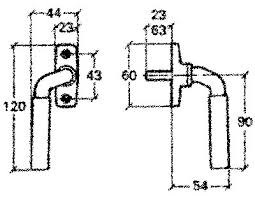

<head>
<meta http-equiv="Content-Type" content="text/html; charset=utf-8">
<link rel="stylesheet" type="text/css" href="bc.css">

</head>

<!---

- Modeless dialog - stays on top
  https://forums.autodesk.com/t5/revit-api-forum/modeless-dialog-stays-on-top/m-p/9042359

- buttons
  https://forums.autodesk.com/t5/revit-api-forum/how-to-modify-revit-button-picture/m-p/9034300#M41389
  https://thebuildingcoder.typepad.com/blog/2017/12/pipe-fitting-k-factor-archilab-and-installer.html#7
  https://archi-lab.net/create-your-own-tab-and-buttons-in-revit/
  https://thebuildingcoder.typepad.com/blog/2019/07/bim365-getting-started-visual-appearance-and-cpu-voltage.html#2
  https://www.bim365.tech/blog/programming-buttons-in-revit
  
- https://forums.autodesk.com/t5/revit-api-forum/external-application-with-web-ui/m-p/9036614

twitter:

UI window handles, top-most forms, add-in buttons, web interface, etc. in the #RevitAPI @AutodeskForge @AutodeskRevit #bim #DynamoBim #ForgeDevCon http://bit.ly/topmostform

Several user interface related topics are being discussed in the Revit API discussion forum
&ndash; Keep my form on top of Revit!
&ndash; Creating buttons and getting started with an add-in UI
&ndash; Integrating a web-based UI...

linkedin:

UI window handles, top-most forms, add-in buttons, web interface, etc. in the #RevitAPI

http://bit.ly/topmostform

Several user interface related topics are being discussed in the Revit API discussion forum:

- Keep my form on top of Revit!
- Creating buttons and getting started with an add-in UI
- Integrating a web-based UI...

#bim #DynamoBim #ForgeDevCon #Revit #API #IFC #SDK #AI #VisualStudio #Autodesk #AEC #adsk

the [Revit API discussion forum](http://forums.autodesk.com/t5/revit-api-forum/bd-p/160) thread

-->

### UI Top Forms, Buttons, Web, etc.

Several user interface related topics are being discussed in 
the [Revit API discussion forum](http://forums.autodesk.com/t5/revit-api-forum/bd-p/160):

- [Keep my form on top of Revit!](#2)
- [Creating buttons and getting started with an add-in UI](#3)
- [Integrating a web-based UI](#4)

#### Keep my Form on Top of Revit!

This topic came up twice in the past few days, in
the [Revit API discussion forum](http://forums.autodesk.com/t5/revit-api-forum/bd-p/160) thread
on [modeless dialog stays on top](https://forums.autodesk.com/t5/revit-api-forum/modeless-dialog-stays-on-top/m-p/9042359)
and [dialog / form visibility](https://forums.autodesk.com/t5/revit-api-forum/dialog-form-visiblity/m-p/9043308):

**Question:** I created an addon that runs along with the normal user use of Revit and allows the user to open certain views by displaying a modeless dialog.

This works well, but I've set the `TopMost` property of the dialog to `True`; otherwise, I keep losing the dialog behind other windows.

The issue is, that with this set, the dialog then stays on top and annoyingly covers other windows.

I'd like the window to follow Revit's window, minimise with it and stay the level with it, so when a window covers Revit, it covers the dialog too.

**Answer:** This can be easily fixed by making the Revit main window the owner window of your modeless dialogue, and your modeless dialogue a child of the Revit main window.

I implemented the `JtWindowHandle` class to help achieve this in the past, so you
can [search The Building Coder for `JtWindowHandle`](https://www.google.com/search?q=JtWindowHandle&as_sitesearch=thebuildingcoder.typepad.com) to
find a number of solutions.

Please note that the Revit API nowadays provides official access to the main Revit window via
the [UIApplication class MainWindowHandle property](https://www.revitapidocs.com/2020/e28d23a9-6814-1e70-9943-1ee852887dae.htm).

The `JtWindowHandle` class is defined like this:

<pre class="code">
  ///&nbsp;&lt;summary&gt;
  ///&nbsp;Wrapper&nbsp;class&nbsp;for&nbsp;converting&nbsp;
  ///&nbsp;IntPtr&nbsp;to&nbsp;IWin32Window.
  ///&nbsp;&lt;/summary&gt;
  public&nbsp;class&nbsp;JtWindowHandle&nbsp;:&nbsp;IWin32Window
  {
  &nbsp;&nbsp;IntPtr&nbsp;_hwnd;
   
  &nbsp;&nbsp;public&nbsp;JtWindowHandle(&nbsp;IntPtr&nbsp;h&nbsp;)
  &nbsp;&nbsp;{
  &nbsp;&nbsp;&nbsp;&nbsp;Debug.Assert(&nbsp;IntPtr.Zero&nbsp;!=&nbsp;h,
  &nbsp;&nbsp;&nbsp;&nbsp;&nbsp;&nbsp;&quot;expected&nbsp;non-null&nbsp;window&nbsp;handle&quot;&nbsp;);
   
  &nbsp;&nbsp;&nbsp;&nbsp;_hwnd&nbsp;=&nbsp;h;
  &nbsp;&nbsp;}
   
  &nbsp;&nbsp;public&nbsp;IntPtr&nbsp;Handle
  &nbsp;&nbsp;{
  &nbsp;&nbsp;&nbsp;&nbsp;get
  &nbsp;&nbsp;&nbsp;&nbsp;{
  &nbsp;&nbsp;&nbsp;&nbsp;&nbsp;&nbsp;return&nbsp;_hwnd;
  &nbsp;&nbsp;&nbsp;&nbsp;}
  &nbsp;&nbsp;}
  }
</pre>

You instantiate it from the Revit main window handle like this:

<pre class="code">
  JtWindowHandle&nbsp;owner_window_handle&nbsp;
    =&nbsp;new&nbsp;JtWindowHandle(&nbsp;
      uiapp.MainWindowHandle&nbsp;);
</pre>

Then, you can parent your form with it using either `Show` or `ShowDialog` for a modeless or modal form, respectively:

<pre class="code">
  MyForm&nbsp;form&nbsp;=&nbsp;new&nbsp;MyForm();
 
  DialogResult&nbsp;rslt&nbsp;=&nbsp;form.ShowDialog(&nbsp;
  &nbsp;&nbsp;owner_window_handle&nbsp;);
</pre>

#### Creating Buttons and Getting Started with an Add-In UI

Another thread was misunderstood and brought up a bunch of answers on how to get started creating buttons and a user interface in general, even though it was actually asking something completely different,
[how to modify Revit button picture?](https://forums.autodesk.com/t5/revit-api-forum/how-to-modify-revit-button-picture/m-p/9034300)

Here are the answers, once again, anyway:

- [BIM365](https://www.bim365.tech)
on [programming buttons in Revit](https://www.bim365.tech/blog/programming-buttons-in-revit)
- Good explanation by [archi+lab](http://archi-lab.net) on how
to [create your own tab and buttons in Revit](http://archi-lab.net/create-your-own-tab-and-buttons-in-revit)

#### Integrating a Web-Based UI

Next, Balint raised a discussion on the implementation of 
an [external application with web UI](https://forums.autodesk.com/t5/revit-api-forum/external-application-with-web-ui/m-p/9036614):

**Question:** I would like to create an external application which opens a dialog and do some stuff after it.
My dialog would be a WebView or something like that.
Is it possible?
Could someone recommend a good example?
Which direction is worth following?
I searched on the Autodesk AppStore and found BimObject or ProdLib plugins, which have really nice UIs.
Are they using WPF or some web framework?

**Answer:** We recently discussed [WPF versus Winforms](https://thebuildingcoder.typepad.com/blog/2019/09/scaling-an-add-in-for-a-4k-high-resolution-screen.html#9).

Even though most of the Revit SDK samples demonstrate use of WinForms, this is hardly recommended anymore nowadays.

The Revit SDK DockableDialogs example is WPF.  It's good in that it shows the various API's necessary to build an external app, but it was not designed to be a great WPF reference.

You can see some other samples [searching for 'Revit API WPF sample'](https://duckduckgo.com/?q=revit+api+wpf+sample).

The Building Coder also shares [some WPF related topics](https://thebuildingcoder.typepad.com/blog/wpf).

Have you checked
out [Ali Asad's Visual Studio WPF MVVM Revit add-in template](https://thebuildingcoder.typepad.com/blog/2019/01/room-boundaries-to-csv-and-wpf-template.html#3)?

This StackOverflow thread discusses how to [create a WPF Revit add-in starting with the DockableDialogs SDK sample](https://stackoverflow.com/questions/40096793/best-starting-point-for-wpf-revit-add-in).

Oh, and finally we must not forget the recent solution using
[IPC to disentangle and connect with CefSharp](https://thebuildingcoder.typepad.com/blog/2019/04/set-floor-level-and-use-ipc-for-disentanglement.html).

**Response:** I hope I found the solution.
Using [DotNetBrowser](https://www.teamdev.com/dotnetbrowser),
I can integrate a Chromium-based browser into Revit app. I tried it and it works fine.

Many thanks to Balint for sharing this!

