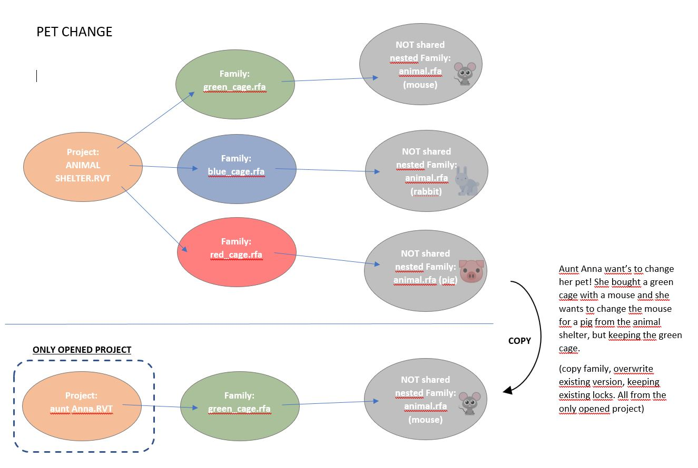
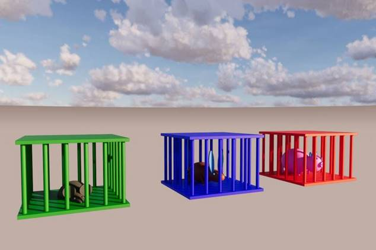

<head>
<meta http-equiv="Content-Type" content="text/html; charset=utf-8">
<link rel="stylesheet" type="text/css" href="bc.css">

</head>

<!---

twitter:

Pet Change using Python and Dynamo to swap nested families in the #RevitAPI @AutodeskForge @AutodeskRevit #bim #DynamoBim #ForgeDevCon http://bit.ly/petchange_py_dyn

Pieter Schipper worked hard at solving the task of swapping nested families using Python and Dynamo and very kindly shares his solution here with us today, including
his four Python scripts
&ndash; Task at hand
&ndash; Problems faced
&ndash; Solution and detailed implementation
&ndash; Collect all family instances in document
&ndash; Export families via <code>SaveAs</code>
&ndash; Update Nested Family Definitions
&ndash; Reload updated families...

linkedin:

Pet Change using Python and Dynamo to swap nested families in the #RevitAPI

http://bit.ly/petchange_py_dyn

Pieter Schipper worked hard at solving the task of swapping nested families using Python and Dynamo and very kindly shares his solution here with us today, including
his four Python scripts:

- Task at hand
- Problems faced
- Solution and detailed implementation
- Collect all family instances in document
- Export families via <code>SaveAs</code>
- Update Nested Family Definitions
- Reload updated families...

#bim #DynamoBim #ForgeDevCon #Revit #API #IFC #SDK #AI #VisualStudio #Autodesk #AEC #adsk

the [Revit API discussion forum](http://forums.autodesk.com/t5/revit-api-forum/bd-p/160) thread

-->

### Pet Change &ndash; Python + Dynamo Swap Nested Family

Pieter Schipper of [RoosRos Architecten](https://www.roosros.nl) in The Netherlands
worked hard at solving the task of swapping nested families using Python and Dynamo and very kindly shares his solution here with us today, including
his [four Python scripts](zip/ps_pet_change_python_scripts.txt).

Parts of the code can be used for several different purposes, so they might be helpful for others as well.

- [Task at hand](#2)
- [Problems faced](#3)
- [Solution and detailed implementation](#4)
- [Code 1 &ndash; Collect all family instances in document](#4.1)
- [Code 2 &ndash; Export families via `SaveAs`](#4.2)
- [Code 3 &ndash; Update Nested Family Definitions](#4.3)
- [Code 4 &ndash; Reload updated families](#4.4)
- [Initial conversation, questions and answers](#5)

#### Task at Hand

Swap out and overwrite a nested family instance to a different one with the same name, in one single background workflow.

I have a family instance placed in my current project. It contains a nested family instance. The nested family instance needs to be replaced by a different one of the same name. I would like this modification to be performed in the background, with only my current project open.
 
Below, I discuss this simplified example for illustration purposes.
We use the same approach for more complex things in our professional workflow:

Pet change task description

Pet change scenario rendering

 
#### Problems Faced

The main problem I encountered initially was that it didn’t work out correctly to copy one family into another family all in the background.
 
#### Solution and Detailed Implementation

The solution I found was to introduce an extra step (also all in the background):

- First: Create two directories (folders), one containing the families to modify, the other the nested not shared family placed into the package project.
- Second: Copy the families from the second folder into the first, overwriting the original families.
- Third: Load the families from the first folder into the current project.
 
I found some Python code on the Internet and adapted it for my needs.
This is the code I used in my Dynamo nodes:

- [Code 1 &ndash; Collect all family instances in document](#4.1)
- [Code 2 &ndash; Export families via `SaveAs`](#4.2)
- [Code 3 &ndash; Update Nested Family Definitions](#4.3)
- [Code 4 &ndash; Reload updated families](#4.4)
 
#### Code 1 &ndash; Collect all Family Instances in Document

<pre class="prettyprint">
import clr
import System
clr.AddReference("RevitServices")
import RevitServices
from RevitServices.Persistence import DocumentManager
doc = IN[0]

clr.AddReference("RevitAPI")
from Autodesk.Revit.DB import *

clr.AddReference("RevitNodes")
import Revit
clr.ImportExtensions(Revit.Elements)

familieCollector = FilteredElementCollector(doc).OfClass(FamilyInstance).ToElements()

families = list()
		
for d in familieCollector:
	#if d.IsTemplate != True:
		families.append(d)

#Assign your output to the OUT variable.
OUT = families
</pre>

#### Code 2 &ndash; Export Families via SaveAs

<pre class="prettyprint">
import clr
clr.AddReference('ProtoGeometry')
from Autodesk.DesignScript.Geometry import *

clr.AddReference('RevitAPI')
import Autodesk

clr.AddReference('RevitServices')
import RevitServices
from RevitServices.Persistence import DocumentManager
from RevitServices.Transactions import TransactionManager
doc = DocumentManager.Instance.CurrentDBDocument

#Close all transactions

trans = TransactionManager.Instance
trans.ForceCloseTransaction()

fams = IN[0]
paths = IN[1]

#unwrap the Dynamo elements

fams = map(UnwrapElement, fams)
for i in xrange(len(fams)):

    famDoc = doc.EditFamily(fams[i])
    famDoc.SaveAs(paths[i])
    famDoc.Close(False)

OUT = 0
</pre>

#### Code 3 &ndash; Update Nested Family Definitions

<pre class="prettyprint">
import clr
clr.AddReference('RevitAPI')
from Autodesk.Revit.DB import *
clr.AddReference('RevitServices')

# Revit and Dynamo modules
from Autodesk.Revit.DB import Document, FamilySource, IFamilyLoadOptions
from RevitServices.Persistence import DocumentManager
from RevitServices.Transactions import TransactionManager

uiapp = DocumentManager.Instance.CurrentUIApplication
app = uiapp.Application

#input assigned to IN variable
paths = IN[0]
docpaths = IN[1]

#wrap input inside a list if not a list.
if not isinstance(paths, list): 
	paths = [paths]
if not isinstance(docpaths, list): 
	docpaths = [docpaths]
	
#ensure loaded families can overwrite existing families.
class FamilyOption(IFamilyLoadOptions):
	def OnFamilyFound(self, familyInUse, overwriteParameterValues):
		overwriteParameterValues = True
		return True
		
	def OnSharedFamilyFound(self, sharedFamily, familyInUse, source, overwriteParameterValues):
		source = FamilySource.Family
		overwriteParameterValues = True
		return True		
		
#core data processing
documents = []
families = []
for docpath in docpaths:
	doc=app.OpenDocumentFile(docpath)
	documents.append(doc)
for path in paths:
	family_doc = app.OpenDocumentFile(path)
	families.append(family_doc)
	
for document in documents:
	map(lambda family: family.LoadFamily(document, FamilyOption()),
	families)

map(lambda x: x.Close(False), families)
map(lambda x: x.Close(True), documents)

# output assigned to the OUT variable
OUT = [paths, docpaths]
	
#core data processing
for path in paths:
	try:
		famDoc = app.OpenDocumentFile(path)
		famDoc.LoadFamily(doc, FamilyOption())
		famDoc.Close(False)
	except:
		pass

#output assigned the OUT variable
OUT = paths
</pre>

#### Code 4 &ndash; Load Updated Families

<pre class="prettyprint">
import clr
clr.AddReference('RevitAPI')
from Autodesk.Revit.DB import *

clr.AddReference('RevitServices')
import RevitServices
from RevitServices.Persistence import DocumentManager
from RevitServices.Transactions import TransactionManager
doc = DocumentManager.Instance.CurrentDBDocument
uiapp = DocumentManager.Instance.CurrentUIApplication
app = uiapp.Application

#input assigned the IN variable
paths = IN[0]

#wrap input inside a list (if not a list)
if not isinstance(paths, list): paths = [paths]

#ensure loaded families can overwrite existing families.
class FamilyOption(IFamilyLoadOptions):
	def OnFamilyFound(self, familyInUse, overwriteParameterValues):
		overwriteParameterValues = True
		return True

	def OnSharedFamilyFound(self, sharedFamily, familyInUse, source, overwriteParameterValues):
		source = FamilySource.Family
		overwriteParameterValues = True
		return True

#core data processing
for path in paths:
	try:
		famDoc = app.OpenDocumentFile(path)
		famDoc.LoadFamily(doc, FamilyOption())
		famDoc.Close(False)
	except:
		pass

#output assigned the OUT variable
OUT = paths
</pre>
 
#### Initial Conversation, Questions and Answers

The text above describes the final working solution.

Here is a summary of the preceding discussions clarifying the task before completing the solution.

**Question:** I want to overwrite one family with another.

I want to do this behind the screens with only one project open, as indicated in the overview image above describing the task.

I can’t solve it with my very basic Python knowledge.

I have solved 90% of the problem and hope you can help me out with the remaining most difficult 10%.
 
**Answer:** Your question is not yet clear to me.
 
You say, 'keeping the green cage'.
 
Keeping which green cage?
 
The green cage containing the mouse?
 
Or the green cage containing the pig?
 
But there is no green cage containing the pig to start with.
 
The pig is in a red cage. You want a mouse in the red cage?

**Response:** In project *Aunt Anna.rvt*, I have the same family green cage with mouse, as I have in the project *animal shelter.rvt*.
 
If I work in one project (Aunt Anna.rvt) I want to change the mouse into a pig or rabbit from the red or blue cage out of the animal shelter.rvt project. All animal.rfa families (mouse/rabbit/pig) are not shared and have the same name. So, I need to overwrite one animal.rfa with another animal.rfa. But the difficulty is that I want to do it all in the background.
 
Dynamo is a very nice program and I can go (in the background) to the (animal.rfa) families I need. But I am having trouble overwriting one with another.
 
In Dynamo, I can open a document in the background, and with a Python script, I get all family instances.
 
Then, there is a node that gets the family document from the family type that allows me to use the python script again to get the families one step deeper.
 
I think that this all will be possible in Python itself, but Dynamo works easy for non-programmers like me.
 
Background information:

In our company, we made our own window generator. The generators on the market are mostly not the ones we need at an architectural office.
We need the freedom to change windows in a late stage, without taking a lot of time.
Therefore, we made our own window generator.
This is a flexible window family which can change into aluminium, wood and plastic, and also includes possibilities to store a lot of other information.
I want to make it easy for our draftsman to change all windows of a project to another material.
That’s the reason behind the question.
 
**Answer:** If it is possible in Python, it is possible in Dynamo.
 
They are the same, under the hood.
 
If it is possible in C#, it is possible in Python.
 
They both make use of the same, one and only underlying Revit .NET API.
 
So, it can certainly be done.
 
**Response:** I think so too, only don’t know how to finish the last step (copy and overwrite).

Not with Dynamo (copy nodes won’t work) and not with Python.

I thought maybe you would have the solution in one minute, but I know that it takes often more time.

**Answer:** Yes, that may be possible. Unfortunately, I have done hardly any work at all in Python, and none whatsoever in Dynamo, yet.

**Response:** I just want to let you know that I found a solution.

I was able to solve this issue with a few extra actions.
 
I first let Dynamo create two temporary directories

Then Save with the first Python script family “1” and “2” (see picture) to the directories.

With the second python script I saved family “1” in family “2”.

With the third python script I Load the family “2” into current document.
 
So, it worked with only Project *aunt Anna* opened. I could not solve this without saving first the families to an actual directory.

With my knowledge I just search the Internet and copy/paste parts of code till it works. It can probably be done more efficiently, but I’m happy.
 
The only thing is that when I want to use run the script twice, I have to restart Revit. But that is not a big problem.
 
Many thanks to Pieter for documenting and sharing this!
