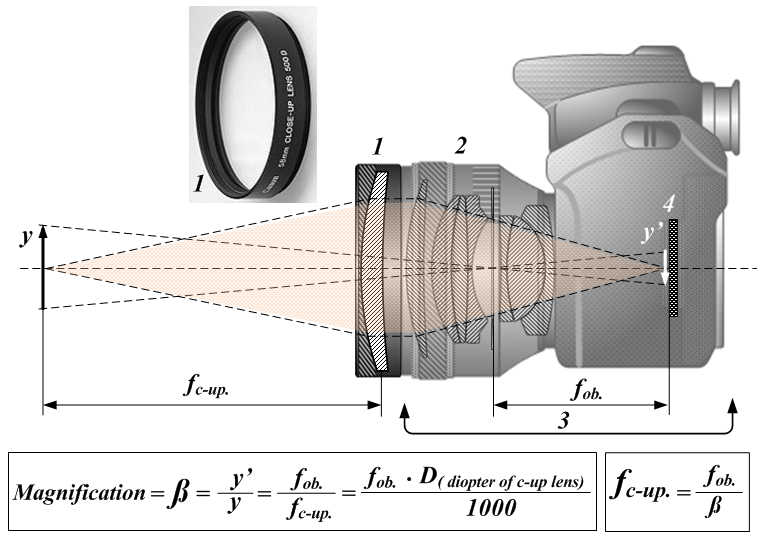

<head>
<meta http-equiv="Content-Type" content="text/html; charset=utf-8">
<link rel="stylesheet" type="text/css" href="bc.css">

</head>

<!---

- IUpdater in a project macro on startup
  https://forums.autodesk.com/t5/revit-api-forum/iupdater-in-a-project-macro-on-startup/m-p/9087481

twitter:

DMU or Dynamic Model Updater macro in the #RevitAPI @AutodeskForge @AutodeskRevit #bim #DynamoBim #ForgeDevCon http://bit.ly/dmumacro

Let's take a quick look at implementing a dynamic model updater in a macro
&ndash; Task
&ndash; Solution
&ndash; Drill up the filter...

linkedin:

DMU or Dynamic Model Updater macro in the #RevitAPI

http://bit.ly/dmumacro

Let's take a quick look at implementing a dynamic model updater in a macro:

- Task
- Solution
- Drill up the filter...

#bim #DynamoBim #ForgeDevCon #Revit #API #IFC #SDK #AI #VisualStudio #Autodesk #AEC #adsk

the [Revit API discussion forum](http://forums.autodesk.com/t5/revit-api-forum/bd-p/160) thread

-->

### Dynamic Model Updater Macro

Let's take a quick look at implementing a dynamic model updater in a macro:

- [Task](#2)
- [Solution](#3)
- [Drill up the filter](#4)

#### Task

Dave raised and solved an interesting issue concerning macros, an area that we have not discussed much here yet, in
his [Revit API discussion forum](http://forums.autodesk.com/t5/revit-api-forum/bd-p/160) thread
on [`IUpdater` in a project macro on startup](https://forums.autodesk.com/t5/revit-api-forum/iupdater-in-a-project-macro-on-startup/m-p/9087481):

I'm trying to use `IUpdater` in a macro that automatically starts when a project opens.
Is this possible?

So far, I used Macro Manager / Create to set up some boilerplate.

Then, I pasted in Autodesk's `WallUpdater` example code from the knowledge article
on [Implementing IUpdater](https://knowledge.autodesk.com/search-result/caas/CloudHelp/cloudhelp/2015/ENU/Revit-API/files/GUID-6D434229-0A2E-41FE-B29D-1BB2E6471F50-htm.html)
into my `public partial class ThisDocument`.

I figured out how to run the code on project startup by calling it from the boilerplate's `private void Module_Startup`.

But I haven't had any luck calling `WallUpdater`.

Here is my code:

<pre class="code">
using&nbsp;System;
using&nbsp;Autodesk.Revit;
using&nbsp;Autodesk.Revit.DB;
using&nbsp;Autodesk.Revit.UI.Selection;
using&nbsp;Autodesk.Revit.UI;
using&nbsp;Autodesk.Revit.Attributes;
using&nbsp;System.Collections.Generic;
using&nbsp;System.Linq;
 
namespace&nbsp;test
{
&nbsp;&nbsp;[Transaction(&nbsp;TransactionMode.Manual&nbsp;)]
&nbsp;&nbsp;[Autodesk.Revit.DB.Macros.AddInId(&nbsp;&quot;redacted&quot;&nbsp;)]
&nbsp;&nbsp;public&nbsp;partial&nbsp;class&nbsp;ThisDocument
&nbsp;&nbsp;{
&nbsp;&nbsp;&nbsp;&nbsp;private&nbsp;void&nbsp;Module_Startup(&nbsp;object&nbsp;sender,&nbsp;EventArgs&nbsp;e&nbsp;)
&nbsp;&nbsp;&nbsp;&nbsp;{
&nbsp;&nbsp;&nbsp;&nbsp;&nbsp;&nbsp;TaskDialog.Show(&nbsp;&quot;hello&quot;,
&nbsp;&nbsp;&nbsp;&nbsp;&nbsp;&nbsp;&nbsp;&nbsp;&quot;this&nbsp;pops&nbsp;up&nbsp;when&nbsp;you&nbsp;open&nbsp;the&nbsp;project&quot;&nbsp;);
&nbsp;&nbsp;&nbsp;&nbsp;}
 
&nbsp;&nbsp;&nbsp;&nbsp;private&nbsp;void&nbsp;Module_Shutdown(&nbsp;object&nbsp;sender,&nbsp;EventArgs&nbsp;e&nbsp;)
&nbsp;&nbsp;&nbsp;&nbsp;{
&nbsp;&nbsp;&nbsp;&nbsp;}
 
&nbsp;&nbsp;&nbsp;&nbsp;#region&nbsp;Revit&nbsp;Macros&nbsp;generated&nbsp;code
&nbsp;&nbsp;&nbsp;&nbsp;private&nbsp;void&nbsp;InternalStartup()
&nbsp;&nbsp;&nbsp;&nbsp;{
&nbsp;&nbsp;&nbsp;&nbsp;&nbsp;&nbsp;this.Startup&nbsp;+=&nbsp;new&nbsp;System.EventHandler(&nbsp;Module_Startup&nbsp;);
&nbsp;&nbsp;&nbsp;&nbsp;&nbsp;&nbsp;this.Shutdown&nbsp;+=&nbsp;new&nbsp;System.EventHandler(&nbsp;Module_Shutdown&nbsp;);
&nbsp;&nbsp;&nbsp;&nbsp;}
&nbsp;&nbsp;&nbsp;&nbsp;#endregion
 
&nbsp;&nbsp;&nbsp;&nbsp;public&nbsp;class&nbsp;WallUpdaterApplication&nbsp;:&nbsp;IExternalApplication
&nbsp;&nbsp;&nbsp;&nbsp;{
&nbsp;&nbsp;&nbsp;&nbsp;&nbsp;&nbsp;public&nbsp;Result&nbsp;OnStartup(&nbsp;UIControlledApplication&nbsp;a&nbsp;)
&nbsp;&nbsp;&nbsp;&nbsp;&nbsp;&nbsp;{
&nbsp;&nbsp;&nbsp;&nbsp;&nbsp;&nbsp;&nbsp;&nbsp;//&nbsp;Register&nbsp;wall&nbsp;updater&nbsp;with&nbsp;Revit
&nbsp;&nbsp;&nbsp;&nbsp;&nbsp;&nbsp;&nbsp;&nbsp;WallUpdater&nbsp;updater&nbsp;=&nbsp;new&nbsp;WallUpdater(
&nbsp;&nbsp;&nbsp;&nbsp;&nbsp;&nbsp;&nbsp;&nbsp;&nbsp;&nbsp;a.ActiveAddInId&nbsp;);
 
&nbsp;&nbsp;&nbsp;&nbsp;&nbsp;&nbsp;&nbsp;&nbsp;UpdaterRegistry.RegisterUpdater(&nbsp;updater&nbsp;);
 
&nbsp;&nbsp;&nbsp;&nbsp;&nbsp;&nbsp;&nbsp;&nbsp;//&nbsp;Change&nbsp;Scope&nbsp;=&nbsp;any&nbsp;Wall&nbsp;element
&nbsp;&nbsp;&nbsp;&nbsp;&nbsp;&nbsp;&nbsp;&nbsp;ElementClassFilter&nbsp;wallFilter
&nbsp;&nbsp;&nbsp;&nbsp;&nbsp;&nbsp;&nbsp;&nbsp;&nbsp;&nbsp;=&nbsp;new&nbsp;ElementClassFilter(
&nbsp;&nbsp;&nbsp;&nbsp;&nbsp;&nbsp;&nbsp;&nbsp;&nbsp;&nbsp;&nbsp;&nbsp;typeof(&nbsp;Wall&nbsp;)&nbsp;);
 
&nbsp;&nbsp;&nbsp;&nbsp;&nbsp;&nbsp;&nbsp;&nbsp;//&nbsp;Change&nbsp;type&nbsp;=&nbsp;element&nbsp;addition
&nbsp;&nbsp;&nbsp;&nbsp;&nbsp;&nbsp;&nbsp;&nbsp;UpdaterRegistry.AddTrigger(
&nbsp;&nbsp;&nbsp;&nbsp;&nbsp;&nbsp;&nbsp;&nbsp;&nbsp;&nbsp;updater.GetUpdaterId(),&nbsp;wallFilter,
&nbsp;&nbsp;&nbsp;&nbsp;&nbsp;&nbsp;&nbsp;&nbsp;&nbsp;&nbsp;Element.GetChangeTypeElementAddition()&nbsp;);
 
&nbsp;&nbsp;&nbsp;&nbsp;&nbsp;&nbsp;&nbsp;&nbsp;return&nbsp;Result.Succeeded;
&nbsp;&nbsp;&nbsp;&nbsp;&nbsp;&nbsp;}
 
&nbsp;&nbsp;&nbsp;&nbsp;&nbsp;&nbsp;public&nbsp;Result&nbsp;OnShutdown(&nbsp;UIControlledApplication&nbsp;a&nbsp;)
&nbsp;&nbsp;&nbsp;&nbsp;&nbsp;&nbsp;{
&nbsp;&nbsp;&nbsp;&nbsp;&nbsp;&nbsp;&nbsp;&nbsp;WallUpdater&nbsp;updater&nbsp;=&nbsp;new&nbsp;WallUpdater(&nbsp;a.ActiveAddInId&nbsp;);
&nbsp;&nbsp;&nbsp;&nbsp;&nbsp;&nbsp;&nbsp;&nbsp;UpdaterRegistry.UnregisterUpdater(&nbsp;updater.GetUpdaterId()&nbsp;);
&nbsp;&nbsp;&nbsp;&nbsp;&nbsp;&nbsp;&nbsp;&nbsp;return&nbsp;Result.Succeeded;
&nbsp;&nbsp;&nbsp;&nbsp;&nbsp;&nbsp;}
&nbsp;&nbsp;&nbsp;&nbsp;}
 
&nbsp;&nbsp;&nbsp;&nbsp;public&nbsp;class&nbsp;WallUpdater&nbsp;:&nbsp;IUpdater
&nbsp;&nbsp;&nbsp;&nbsp;{
&nbsp;&nbsp;&nbsp;&nbsp;&nbsp;&nbsp;static&nbsp;AddInId&nbsp;m_appId;
&nbsp;&nbsp;&nbsp;&nbsp;&nbsp;&nbsp;static&nbsp;UpdaterId&nbsp;m_updaterId;
&nbsp;&nbsp;&nbsp;&nbsp;&nbsp;&nbsp;WallType&nbsp;m_wallType&nbsp;=&nbsp;null;
 
&nbsp;&nbsp;&nbsp;&nbsp;&nbsp;&nbsp;//&nbsp;constructor&nbsp;takes&nbsp;the&nbsp;AddInId&nbsp;for&nbsp;the&nbsp;add-in
&nbsp;&nbsp;&nbsp;&nbsp;&nbsp;&nbsp;//&nbsp;associated&nbsp;with&nbsp;this&nbsp;updater
&nbsp;&nbsp;&nbsp;&nbsp;&nbsp;&nbsp;public&nbsp;WallUpdater(&nbsp;AddInId&nbsp;id&nbsp;)
&nbsp;&nbsp;&nbsp;&nbsp;&nbsp;&nbsp;{
&nbsp;&nbsp;&nbsp;&nbsp;&nbsp;&nbsp;&nbsp;&nbsp;m_appId&nbsp;=&nbsp;id;
&nbsp;&nbsp;&nbsp;&nbsp;&nbsp;&nbsp;&nbsp;&nbsp;m_updaterId&nbsp;=&nbsp;new&nbsp;UpdaterId(&nbsp;m_appId,&nbsp;new&nbsp;Guid(
&nbsp;&nbsp;&nbsp;&nbsp;&nbsp;&nbsp;&nbsp;&nbsp;&nbsp;&nbsp;&quot;FBFBF6B2-4C06-42d4-97C1-D1B4EB593EFF&quot;&nbsp;)&nbsp;);
&nbsp;&nbsp;&nbsp;&nbsp;&nbsp;&nbsp;}
 
&nbsp;&nbsp;&nbsp;&nbsp;&nbsp;&nbsp;public&nbsp;void&nbsp;Execute(&nbsp;UpdaterData&nbsp;data&nbsp;)
&nbsp;&nbsp;&nbsp;&nbsp;&nbsp;&nbsp;{
&nbsp;&nbsp;&nbsp;&nbsp;&nbsp;&nbsp;&nbsp;&nbsp;Document&nbsp;doc&nbsp;=&nbsp;data.GetDocument();
 
&nbsp;&nbsp;&nbsp;&nbsp;&nbsp;&nbsp;&nbsp;&nbsp;//&nbsp;Cache&nbsp;the&nbsp;wall&nbsp;type
&nbsp;&nbsp;&nbsp;&nbsp;&nbsp;&nbsp;&nbsp;&nbsp;if(&nbsp;m_wallType&nbsp;==&nbsp;null&nbsp;)
&nbsp;&nbsp;&nbsp;&nbsp;&nbsp;&nbsp;&nbsp;&nbsp;{
&nbsp;&nbsp;&nbsp;&nbsp;&nbsp;&nbsp;&nbsp;&nbsp;&nbsp;&nbsp;TaskDialog.Show(&nbsp;&quot;hello&quot;,&nbsp;&quot;world&quot;&nbsp;);
&nbsp;&nbsp;&nbsp;&nbsp;&nbsp;&nbsp;&nbsp;&nbsp;}
 
&nbsp;&nbsp;&nbsp;&nbsp;&nbsp;&nbsp;&nbsp;&nbsp;if(&nbsp;m_wallType&nbsp;!=&nbsp;null&nbsp;)
&nbsp;&nbsp;&nbsp;&nbsp;&nbsp;&nbsp;&nbsp;&nbsp;{
&nbsp;&nbsp;&nbsp;&nbsp;&nbsp;&nbsp;&nbsp;&nbsp;&nbsp;&nbsp;TaskDialog.Show(&nbsp;&quot;hello&quot;,&nbsp;&quot;world&quot;&nbsp;);
&nbsp;&nbsp;&nbsp;&nbsp;&nbsp;&nbsp;&nbsp;&nbsp;}
&nbsp;&nbsp;&nbsp;&nbsp;&nbsp;&nbsp;}
 
&nbsp;&nbsp;&nbsp;&nbsp;&nbsp;&nbsp;public&nbsp;string&nbsp;GetAdditionalInformation()
&nbsp;&nbsp;&nbsp;&nbsp;&nbsp;&nbsp;{
&nbsp;&nbsp;&nbsp;&nbsp;&nbsp;&nbsp;&nbsp;&nbsp;return&nbsp;&quot;Wall&nbsp;type&nbsp;updater&nbsp;example:&nbsp;updates&nbsp;all&nbsp;&quot;
&nbsp;&nbsp;&nbsp;&nbsp;&nbsp;&nbsp;&nbsp;&nbsp;&nbsp;&nbsp;+&nbsp;&quot;newly&nbsp;created&nbsp;walls&nbsp;to&nbsp;a&nbsp;special&nbsp;wall&quot;;
&nbsp;&nbsp;&nbsp;&nbsp;&nbsp;&nbsp;}
 
&nbsp;&nbsp;&nbsp;&nbsp;&nbsp;&nbsp;public&nbsp;ChangePriority&nbsp;GetChangePriority()
&nbsp;&nbsp;&nbsp;&nbsp;&nbsp;&nbsp;{
&nbsp;&nbsp;&nbsp;&nbsp;&nbsp;&nbsp;&nbsp;&nbsp;return&nbsp;ChangePriority.FloorsRoofsStructuralWalls;
&nbsp;&nbsp;&nbsp;&nbsp;&nbsp;&nbsp;}
 
&nbsp;&nbsp;&nbsp;&nbsp;&nbsp;&nbsp;public&nbsp;UpdaterId&nbsp;GetUpdaterId()
&nbsp;&nbsp;&nbsp;&nbsp;&nbsp;&nbsp;{
&nbsp;&nbsp;&nbsp;&nbsp;&nbsp;&nbsp;&nbsp;&nbsp;return&nbsp;m_updaterId;
&nbsp;&nbsp;&nbsp;&nbsp;&nbsp;&nbsp;}
 
&nbsp;&nbsp;&nbsp;&nbsp;&nbsp;&nbsp;public&nbsp;string&nbsp;GetUpdaterName()
&nbsp;&nbsp;&nbsp;&nbsp;&nbsp;&nbsp;{
&nbsp;&nbsp;&nbsp;&nbsp;&nbsp;&nbsp;&nbsp;&nbsp;return&nbsp;&quot;Wall&nbsp;Type&nbsp;Updater&quot;;
&nbsp;&nbsp;&nbsp;&nbsp;&nbsp;&nbsp;}
&nbsp;&nbsp;&nbsp;&nbsp;}
&nbsp;&nbsp;}
}
</pre>

All the samples I've found so far appear to be written as add-ins.

I found one single sample showing an `IUpdater` in a macro, 
for [wrangling revisions with Ruby](https://thebuildingcoder.typepad.com/blog/2014/02/wrangling-revisions-with-ruby.html).
Unfortunately, that's a bit too complex for me to follow at this point, especially in Ruby.

I was hoping to find an RVT with a vanilla C# `IUpdater` macro embedded, similar to the SDK *Revit_Macro_Samples.rvt*.

#### Solution

The Boost your BIM article
on [automatically running API code when your model changes](https://boostyourbim.wordpress.com/2012/12/17/automatically-run-api-code-when-your-model-changes) looks
promising...

Yes, I got it working!

Here are the steps I followed:

- Use MacroManager to create a new C# module.
- Edit the new module in SharpDevelop.
- Add `RegisterUpdater` to `Module_Startup` as follows:

<pre class="code">
&nbsp;&nbsp;private&nbsp;void&nbsp;Module_Startup(&nbsp;object&nbsp;sender,&nbsp;EventArgs&nbsp;e&nbsp;)
&nbsp;&nbsp;{
&nbsp;&nbsp;&nbsp;&nbsp;RegisterUpdater();
&nbsp;&nbsp;}
</pre>

- Add `UnregisterUpdater` to `Module_Shutdown` as above.

- Just below the boilerplate `#endregion`, add the boostyourbim code:

<pre class="code">
&nbsp;&nbsp;public&nbsp;class&nbsp;FamilyInstanceUpdater&nbsp;:&nbsp;IUpdater
&nbsp;&nbsp;{&nbsp;...&nbsp;}
&nbsp;&nbsp;public&nbsp;void&nbsp;RegisterUpdater()
&nbsp;&nbsp;{&nbsp;...&nbsp;}
&nbsp;&nbsp;public&nbsp;void&nbsp;UnregisterUpdater()
&nbsp;&nbsp;{&nbsp;...&nbsp;}
</pre>

Make sure `FamilyInstanceUpdater`, `RegisterUpdater`, and `UnregisterUpdater` are inside the scope of `ThisDocument`.

For testing, I found it handy to replace boostyourbim's `Execute` code with this:

<pre class="code">
&nbsp;&nbsp;public&nbsp;void&nbsp;Execute(&nbsp;UpdaterData&nbsp;data&nbsp;)
&nbsp;&nbsp;{
&nbsp;&nbsp;&nbsp;&nbsp;Document&nbsp;doc&nbsp;=&nbsp;data.GetDocument();
&nbsp;&nbsp;&nbsp;&nbsp;TaskDialog.Show(&nbsp;&quot;Revit&quot;,&nbsp;&quot;hello&quot;&nbsp;);
&nbsp;&nbsp;}
</pre>

- Save and hit F9 to build the macro.
Check the MacroManager to see if the build was successful.
For some reason, the build occasionally fails for me.
I've found that having AssemblyInfo.cs open in SharpDevelop helps.
No idea why.

At this point, the macro should be working.
Any time you draw an element, you'll get a little popup that says 'hello'.

If you close your project with a successfully built macro, the macro will run automatically the next time you open the project.

I'm sure lots of improvements can be made.
For instance, Jeremy recommended using DocumentOpened.
And my version currently works for columns and beams, but not for walls.
Any input would be appreciated.

Meanwhile, thanks very much to Jeremy for taking a look and to boostyourbim for their code.
Hope this helps someone.

Many thanks to Dave for his research and sharing the solution!

#### Drill Up the Filter

The initial version works for columns and beams, but not for walls.

This is due to the `FamilyInstanceUpdater`.

It defines a `familyInstanceFilter` variable as `new ElementClassFilter( typeof( FamilyInstance ) )`.

Beams and columns are family instances, and walls are not.

To expand the filter to include `Wall` objects as well as `FamilyInstance` objects, you can change its name and definition to something like this:

<pre class="code">
&nbsp;&nbsp;ElementFilter&nbsp;f&nbsp;=&nbsp;new&nbsp;LogicalOrFilter(
&nbsp;&nbsp;&nbsp;&nbsp;new&nbsp;ElementClassFilter(&nbsp;typeof(&nbsp;FamilyInstance&nbsp;)&nbsp;),
&nbsp;&nbsp;&nbsp;&nbsp;new&nbsp;ElementClassFilter(&nbsp;typeof(&nbsp;Wall&nbsp;)&nbsp;);
</pre>

 

