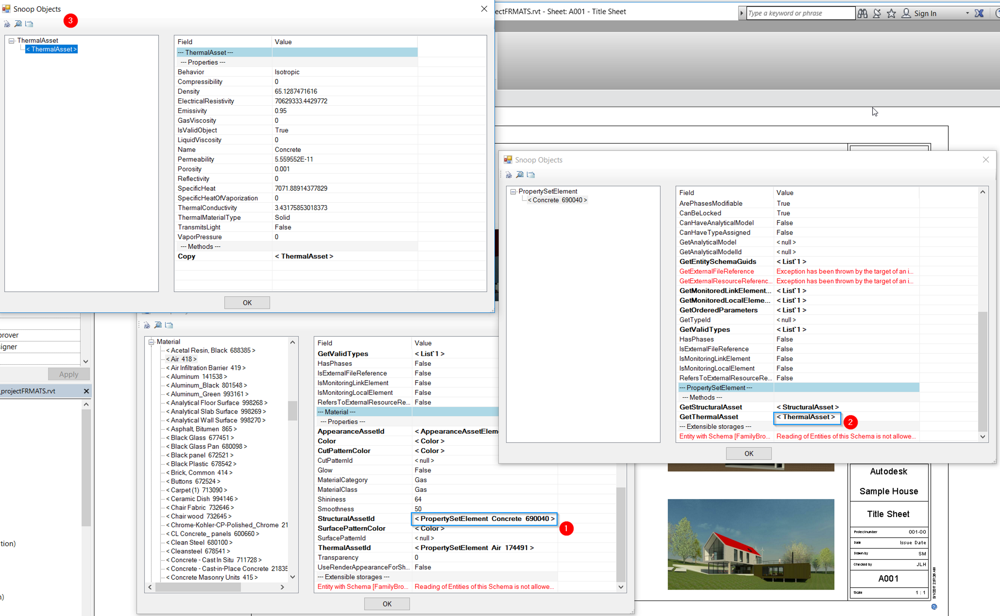

<head>
<meta http-equiv="Content-Type" content="text/html; charset=utf-8">
<link rel="stylesheet" type="text/css" href="bc.css">

</head>

<!---

- [Revit : Get All ViewSheet is very slow](https://stackoverflow.com/questions/58593436/revit-get-all-viewsheet-is-very-slow)

twitter:

Avoid generating graphics, thermal and physical assets, old add-in managers and compiling without Revit installed for the #RevitAPI @AutodeskForge @AutodeskRevit #bim #DynamoBim #ForgeDevCon http://bit.ly/graphicsassets

Here are some relevant topics for today
&ndash; Can you avoid generating graphics?
&ndash; Read all thermal and physical assets
&ndash; Collection of old add-in managers
&ndash; Compiling an add-in without Revit installed
&ndash; Xeokit 3D BIM and CAD viewer
&ndash; Software development manager job opportunity...

linkedin:

Avoid generating graphics, thermal and physical assets, old add-in managers and compiling without Revit installed for the #RevitAPI

http://bit.ly/graphicsassets

Here are some relevant topics for today:

- Can you avoid generating graphics?
- Read all thermal and physical assets
- Collection of old add-in managers
- Compiling an add-in without Revit installed
- Xeokit 3D BIM and CAD viewer
- Software development manager job opportunity...

#bim #DynamoBim #ForgeDevCon #Revit #API #IFC #SDK #AI #VisualStudio #Autodesk #AEC #adsk

the [Revit API discussion forum](http://forums.autodesk.com/t5/revit-api-forum/bd-p/160) thread

-->

### Generating Graphics and Collecting Assets

As always, many important ongoing issues are being presented and resolved in
the [Revit API discussion forum](http://forums.autodesk.com/t5/revit-api-forum/bd-p/160).

I continue struggling to create time to pick out and highlight the most relevant topics here.

I ended up with quite a number today:

- [Can you avoid generating graphics?](#2)
- [Read all thermal and physical assets](#3)
- [Collection of old add-in managers](#4)
- [Compiling an add-in without Revit installed](#5)
- [Xeokit 3D BIM and CAD viewer](#6)
- [Software development manager job opportunity](#7)

#### Can You Avoid Generating Graphics?

Several developers encountered performance problems filtering for elements based on the view containing them.

In order to determine which elements are displayed in a view, the view has to be regenerated.

The first time this happens, Revit may display a progress bar saying 'Generating graphics'.

This can be triggered by a filtered element collector as well.

In the following, I'll summarise a couple of discussions around this topic.

The most recent was is the StackOverflow question
on [Revit : get all ViewSheet is very slow](https://stackoverflow.com/questions/58593436/revit-get-all-viewsheet-is-very-slow):

**Question:** For a plugin, I need to get all the viewsheets in the RVT file and display information from them in a XAML dialog.
This process is very, very slow the first time I use it:
with the debugger, it takes 500 ms for 83 plan views, and it is very slow without the debugger too.
If I execute the code again, the execution is instantaneous.
This code is causing it:

<pre class="code">
protected&nbsp;IEnumerable&lt;Element&gt;&nbsp;GetAllEl(&nbsp;Document&nbsp;doc&nbsp;)
{
&nbsp;&nbsp;return&nbsp;new&nbsp;FilteredElementCollector(&nbsp;doc&nbsp;)
&nbsp;&nbsp;&nbsp;&nbsp;.OfCategory(&nbsp;BuiltInCategory.OST_Sheets&nbsp;)
&nbsp;&nbsp;&nbsp;&nbsp;.WhereElementIsNotElementType()
&nbsp;&nbsp;&nbsp;&nbsp;.OfClass(&nbsp;typeof(&nbsp;ViewSheet&nbsp;)&nbsp;);
}
</pre>

**Answer:** I do not think there is currently a known generic solution for that problem.

A similar issue was just discussed with the development team:

**Question:** For a given element id, we need to find the list of sheet ids displaying it.
Current solution: we loop through all the sheets and views and use `FilteredElementCollector( doc, sheet.Id )`.
With the results from that, we perform one more call to `FilteredElementCollector( doc, view.Id )` and look for the element id.
Issue: the current solution takes a lot of time and displays a Revit progress bar saying `Generating graphics`.
Is there any better way to know if a given element id is available in the sheet or not?
For example, some API methods like this would be very useful:

<pre class="code">
  getAllSheets(&nbsp;ElementId&nbsp;)&nbsp;//&nbsp;returns&nbsp;array&nbsp;of&nbsp;sheet&nbsp;id
  hasGuid(&nbsp;ElementId,&nbsp;sheetId&nbsp;)&nbsp;//&nbsp;return&nbsp;true/false
</pre>

Does the API provide any such methods, to check whether a given `ElementId` is available in the sheet?

**Answer:** So. the goal is to find a view that displays a particular element on a sheet?
Many model elements could be visible on multiple views, while most annotation elements are typically present only in one view.
What type of elements are you checking for?
And what will you do with that info?

**Response:** The goal is to find a view that displays a particular element on a sheet.
It can be any type of element.

**Answer:** Here are some previous related discussions:

- [Determining Views Showing an Element](https://thebuildingcoder.typepad.com/blog/2016/12/determining-views-showing-an-element.html)
- The inverse, [Retrieving Elements Visible in View](https://thebuildingcoder.typepad.com/blog/2017/05/retrieving-elements-visible-in-view.html)

**Response:** The problem is that the first call to `FilteredElementCollector( doc, viewId )` shows `generating graphics` in the progress bar.
Only the first-time search does so.
The second time, search on the same view has no issues with performance.

**Answer:** The first time is slow because in order to iterate on the elements visible in a view, the graphics for that view must be generated.
I can't think of a workaround to get a precise answer.
You might be able to skip sheets which don't have model views in their viewport list to save a bit of time.
Some sheets may only have drafting views and schedules and annotations.

The development team provided a very helpful suggestion which helped work around the `generating graphics` call by avoiding that specific filtering operation completely in another case,
to [loop through sheets generating graphics](https://forums.autodesk.com/t5/revit-api-forum/loop-through-sheets-generating-graphics/m-p/8719256).

The solution there consisted in analysing exactly what relationship you are trying to retrieve.
In that specific case, the Revit API provided direct support for the inverse relationship, so you can retrieve that and invert it to access the required elements.

Maybe you can optimise in a similar manner for your needs?

#### Read all Thermal and Physical Assets

**Question:** Is there a way to get the list of all Thermal and Physical assets using Revit 2019 API?

**Answer:** Those are used in Materials. I think you'd want to iterate over all materials in the document and look at each for its StructuralAssetId and ThermalAssetId.
You can then look at the PropertySetElements that use those ids.
You could probably also iterate PropertySetElements directly, which would be fine if you don't need to know what materials are using them.

**Response:** Thanks, just now got them as you suggested from the discussion 
on [material assets collector for appearance, structural (physical) and thermal](https://forums.autodesk.com/t5/revit-api-forum/material-assets-collector-appearance-structural-physical-amp/m-p/7269088):

We are trying to gather all the material assets loaded into a project file but ran into a roadblock.
We can successfully do this for the appearance assets, but for the other assets the approach does not work.

The only way that we can gather the structural and thermal assets is by starting with materials and cycle through the assets that are assigned.
This approach will omit assets that are not assigned to materials.

Please see C# code below for reference. Any insight into how this can be achieved will be much appreciated.

<pre class="code">
&nbsp;&nbsp;FilteredElementCollector&nbsp;collector&nbsp;
    =&nbsp;new&nbsp;FilteredElementCollector(&nbsp;doc&nbsp;);
&nbsp;&nbsp;//code&nbsp;works&nbsp;for&nbsp;appearance&nbsp;assets
&nbsp;&nbsp;ICollection&lt;Element&gt;&nbsp;appearanceAssets&nbsp;
    =&nbsp;collector.OfClass(&nbsp;typeof(&nbsp;AppearanceAssetElement&nbsp;)&nbsp;).ToElements();
&nbsp;&nbsp;//code&nbsp;throws&nbsp;an&nbsp;error
&nbsp;&nbsp;ICollection&lt;Element&gt;&nbsp;physicalAssets&nbsp;
    =&nbsp;collector.OfClass(&nbsp;typeof(&nbsp;StructuralAssetClass&nbsp;)&nbsp;).ToElements();
&nbsp;&nbsp;//code&nbsp;throws&nbsp;an&nbsp;error
&nbsp;&nbsp;ICollection&lt;Element&gt;&nbsp;physicalAssets2&nbsp;
    =&nbsp;collector.OfClass(&nbsp;typeof(&nbsp;StructuralAsset&nbsp;)&nbsp;).ToElements();
&nbsp;&nbsp;//code&nbsp;returns&nbsp;zero&nbsp;elements
&nbsp;&nbsp;ICollection&lt;Element&gt;&nbsp;propertySet&nbsp;
    =&nbsp;collector.OfClass(&nbsp;typeof(&nbsp;PropertySetElement&nbsp;)&nbsp;).ToElements();
&nbsp;&nbsp;//code&nbsp;throws&nbsp;an&nbsp;error
&nbsp;&nbsp;ICollection&lt;Element&gt;&nbsp;thermalAssets&nbsp;
    =&nbsp;collector.OfClass(&nbsp;typeof(&nbsp;ThermalAsset&nbsp;)&nbsp;).ToElements();
</pre>

Error:

- Autodesk.Revit.Exceptions.ArgumentException: Input type (Autodesk.Revit.DB.StructuralAssetClass) is not a recognized Revit API type
  
Other observations:

- The reason the Appearance Assets work might be because the `AppearanceAssetElement` class is called out.
- Appearance asset has the `AppearanceAsset` that seems analogous to the `StructuralAsset` and `ThermalAsset` classes.
- However, there are no `StructuralAssetElement` or `ThermalAssetElement` classes.

The appearance asset also has a built-in category `OST_AppearanceAsset`, while the structural and thermal assets do not have any corresponding built-in category.

The links below are our references to date:

- [Filtering for a non-native class](http://thebuildingcoder.typepad.com/blog/2010/08/filtering-for-a-nonnative-class.html)
- [`GetElement` method and get element type](http://thebuildingcoder.typepad.com/blog/2012/04/getelement-method-and-get-element-type.html)
- [Rendering assets](https://thebuildingcoder.typepad.com/blog/2016/05/roomedit3d-console-test-and-rendering-assets.html#3)
- [How to get asset properties of material I want?](https://adndevblog.typepad.com/aec/2015/03/revitapi-how-to-get-asset-properties-of-material-i-want.html)
- [General Material Information](https://knowledge.autodesk.com/search-result/caas/CloudHelp/cloudhelp/2016/ENU/Revit-API/files/GUID-F0C7BA6A-8C58-45B4-8639-1E08CBC6781D-htm.html)
- [`ElementCategoryFilter` class](http://www.revitapidocs.com/2016/b492ddf4-3058-8f9b-dfcc-8d5c4abb3605.htm)

**Answer:** Structural and Thermal Assets are contained in `PropertySetElement` objects.
So, the line you wrote filtering for that should work.
I checked in one of our templates and found 62 elements matching the filter.

**Response:** Yes, thank you for your direction.

The reason zero elements were collected in our previous code sample was because we used the same collector instance several times over, both for the appearance assets and the property set.

As soon as we defined a new one `collector2`, it worked.

The  propertySet element hosts thermal and structural assets.
However, there can be two property sets that have the same name (`Air`, for example), and one property set is dedicated to the structural, while the other to the thermal.
You cannot easily discern whether setting the property set element to a material will set the thermal or structural assets.
Essentially, the property set is either thermal or structural when applied to a material.

It seems like the Revit UI categorizes property sets further into thermal and structural categories, while API access is limited.

Below is an attempt to try to categorize the propertyset elements.
Some property sets return a null value when the thermal asset info is missing and vice-versa.

<pre class="code">
&nbsp;&nbsp;//&nbsp;property&nbsp;set:&nbsp;thermal&nbsp;and&nbsp;structural
&nbsp;&nbsp;FilteredElementCollector&nbsp;collector2&nbsp;
&nbsp;&nbsp;&nbsp;&nbsp;=&nbsp;new&nbsp;FilteredElementCollector(&nbsp;doc&nbsp;);
 
&nbsp;&nbsp;ICollection&lt;Element&gt;&nbsp;propertySet&nbsp;
&nbsp;&nbsp;&nbsp;&nbsp;=&nbsp;collector2.OfClass(&nbsp;typeof(&nbsp;PropertySetElement&nbsp;)&nbsp;)
&nbsp;&nbsp;&nbsp;&nbsp;&nbsp;&nbsp;.ToElements();
 
&nbsp;&nbsp;//&nbsp;loop&nbsp;through&nbsp;property&nbsp;sets&nbsp;to&nbsp;gather&nbsp;
&nbsp;&nbsp;//&nbsp;structural&nbsp;and&nbsp;thermal&nbsp;assets
&nbsp;&nbsp;foreach(&nbsp;PropertySetElement&nbsp;psEle&nbsp;in&nbsp;propertySet&nbsp;)
&nbsp;&nbsp;{
&nbsp;&nbsp;&nbsp;&nbsp;try
&nbsp;&nbsp;&nbsp;&nbsp;{
&nbsp;&nbsp;&nbsp;&nbsp;&nbsp;&nbsp;//&nbsp;gather
&nbsp;&nbsp;&nbsp;&nbsp;&nbsp;&nbsp;StructuralAsset&nbsp;structAsset&nbsp;=&nbsp;psEle.GetStructuralAsset();
 
&nbsp;&nbsp;&nbsp;&nbsp;&nbsp;&nbsp;//&nbsp;process&nbsp;-&nbsp;currently&nbsp;add&nbsp;both&nbsp;aspects&nbsp;of&nbsp;
&nbsp;&nbsp;&nbsp;&nbsp;&nbsp;&nbsp;//&nbsp;property&nbsp;set&nbsp;if&nbsp;they&nbsp;exist.&nbsp;this&nbsp;method&nbsp;can&nbsp;
&nbsp;&nbsp;&nbsp;&nbsp;&nbsp;&nbsp;//&nbsp;have&nbsp;same&nbsp;p-set&nbsp;element&nbsp;id&nbsp;in&nbsp;both&nbsp;thermal&nbsp;
&nbsp;&nbsp;&nbsp;&nbsp;&nbsp;&nbsp;//&nbsp;and&nbsp;structural
&nbsp;&nbsp;&nbsp;&nbsp;&nbsp;&nbsp;if(&nbsp;structAsset&nbsp;!=&nbsp;null&nbsp;)
&nbsp;&nbsp;&nbsp;&nbsp;&nbsp;&nbsp;{
&nbsp;&nbsp;&nbsp;&nbsp;&nbsp;&nbsp;&nbsp;&nbsp;structuralAssets.Add(&nbsp;psEle&nbsp;);
&nbsp;&nbsp;&nbsp;&nbsp;&nbsp;&nbsp;}
&nbsp;&nbsp;&nbsp;&nbsp;}
&nbsp;&nbsp;&nbsp;&nbsp;catch
&nbsp;&nbsp;&nbsp;&nbsp;{
&nbsp;&nbsp;&nbsp;&nbsp;&nbsp;&nbsp;//&nbsp;code
&nbsp;&nbsp;&nbsp;&nbsp;}
&nbsp;&nbsp;&nbsp;&nbsp;try
&nbsp;&nbsp;&nbsp;&nbsp;{
&nbsp;&nbsp;&nbsp;&nbsp;&nbsp;&nbsp;//&nbsp;gather
&nbsp;&nbsp;&nbsp;&nbsp;&nbsp;&nbsp;ThermalAsset&nbsp;thermAsset&nbsp;=&nbsp;psEle.GetThermalAsset();
 
&nbsp;&nbsp;&nbsp;&nbsp;&nbsp;&nbsp;//&nbsp;process&nbsp;-&nbsp;currently&nbsp;add&nbsp;both&nbsp;aspects&nbsp;of&nbsp;
&nbsp;&nbsp;&nbsp;&nbsp;&nbsp;&nbsp;//&nbsp;property&nbsp;set&nbsp;if&nbsp;they&nbsp;exist.&nbsp;this&nbsp;method&nbsp;can&nbsp;
&nbsp;&nbsp;&nbsp;&nbsp;&nbsp;&nbsp;//&nbsp;have&nbsp;same&nbsp;p-set&nbsp;element&nbsp;id&nbsp;in&nbsp;both&nbsp;thermal&nbsp;
&nbsp;&nbsp;&nbsp;&nbsp;&nbsp;&nbsp;//&nbsp;and&nbsp;structural
&nbsp;&nbsp;&nbsp;&nbsp;&nbsp;&nbsp;if(&nbsp;thermAsset&nbsp;!=&nbsp;null&nbsp;)
&nbsp;&nbsp;&nbsp;&nbsp;&nbsp;&nbsp;{
&nbsp;&nbsp;&nbsp;&nbsp;&nbsp;&nbsp;&nbsp;&nbsp;thermalAssets.Add(&nbsp;psEle&nbsp;);
&nbsp;&nbsp;&nbsp;&nbsp;&nbsp;&nbsp;}
&nbsp;&nbsp;&nbsp;&nbsp;}
&nbsp;&nbsp;&nbsp;&nbsp;catch
&nbsp;&nbsp;&nbsp;&nbsp;{
&nbsp;&nbsp;&nbsp;&nbsp;&nbsp;&nbsp;//&nbsp;code
&nbsp;&nbsp;&nbsp;&nbsp;}
&nbsp;&nbsp;}
</pre>

Here is the `ThermalAsset` data extracted from a propertySet originally assigned to a StructuralAssetID of a material:

 <!--2574-->

If the property set elements that host primarily the structural assets can be separated from the ones that host the thermal assets, then we would have to lists of property sets that we can work with.

Is there any way to get all the list directly instead of checking the PropertySetElements?

**Answer:** Sorry, checking the elements is the only way to get into the document's database for these items.

#### Collection of Old Add-In Managers

An old thread
requesting [Add-in Manager 2018 compiled version](https://forums.autodesk.com/t5/revit-api-forum/add-in-manager-2018-compiled-version/m-p/9040405) came
up again:

**Question:** Is there a place where I can find a compiled version of the Add-in Manager for Revit 2018?
Previous versions also, if possible.
In our company, we have administrator restriction rights, so we can't easily install the Revit SDK.

**Answer by Jim Jia:** Here is a zip file [add_in_manager_2015_2018.zip](zip/jj_add_in_manager_2015_2018.zip) containing
multiple versions of the Add-in Manager from the Revit SDK, for Revit 2015, 2016, 2017 and 2018.

Please also note that the Revit 2020 SDK was lacking the add-in manager,
but [the version from the Revit 2019 SDK still works in Revit 2020](https://thebuildingcoder.typepad.com/blog/2019/05/spatial-geometry-add-in-manager-and-show-reels.html#3) as
well.

#### Compiling an Add-In Without Revit Installed

[Question by Armand](https://thebuildingcoder.typepad.com/blog/2018/06/multi-targeting-revit-versions-cad-terms-texture-maps.html#comment-4668774970)
on [multi-targeting Revit versions using TargetFrameworks](https://thebuildingcoder.typepad.com/blog/2018/06/multi-targeting-revit-versions-cad-terms-texture-maps.html):

**Question:** Is it possible to write/compile Revit add-ins without having the specific version of Revit installed on your development machine?
I am currently supporting add-ins that I have written for Revit versions 2016 thru 2020.
I am setting up a new development machine and do not want to install 2016, 2017, & 2018.
Does this mean I can no longer maintain the code that targeted those versions?
Is there a way to just reference copies of those specific DLL files?

**Answer:** I have good news for you.
You do not need to install Revit on your development machine.
All you need are the Revit API .NET assemblies.
As a minimum, they include `RevitAPI.dll` and `RevitAPIUI.dll`.
There are many more that are optional.
You can even create a NuGet package to deploy them to your development machine, or possibly
use [an existing Revit API NuGet package](https://www.nuget.org/packages?q=revit+api).

#### Xeokit 3D BIM and CAD Viewer

The [xeokit](http://xeokit.io) is a software development kit from [xeolabs](http://xeolabs.com) for viewing high-detail 3D BIM and CAD models in the web browser.

Check out all the details in the [xeokit-sdk JavaScript SDK GitHub repository](https://github.com/xeokit/xeokit-sdk).

It can load multiple models into the same 3D scene, from source formats including glTF, OBJ, 3DXML, STL, 3DS and BIMServer.

#### Software Development Manager Job Opportunity

Let's close for today with a current job opportunity here in Switzerland that may be of interest, for
a [Software Development Manager in Rümligen, Bern, Switzerland, Job ID 19WD35458](https://rolp.co/EcSHh):

Position Overview

The Autodesk Construction Solutions group is seeking a Software Development Manager to lead one or more agile teams. You and your team will design, build and run full stack web, mobile and cloud applications. As the Software Development Manager, you have a critical role in setting direction and expectations for the team. You will oversee both process and technology and help teams to make the right decisions when needed.
You will be part of the Preconstruction organization working on new BIM 360 products that enable our customers to work more efficiently and collaboratively. If you are a leader that enjoys working with highly talented individuals, latest technologies and the best tools available, we would love to hear from you!

Responsibilities

- Lead one or more agile teams of local and remote software engineers working on full stack web, mobile and cloud applications and services. Oversee process and technology and influence the decision-making process
- Plan and manage your team's successful continuous delivery of cloud applications and services
- Work with product owners, scrum masters, software architects, and key stakeholders to build agile release plans to deliver software iteratively and incrementally by following agile principles
- Collaborate with other teams to accomplish cross-organizational project goals
- Be the spokesperson for the team and champion its accomplishments and causes with upper management and adjacent teams.
- Manage the performance of your team by communicating clear organizational goals and removing technical and organizational impediments
- Inspire and motivate team members to achieve maximum productivity and optimal creativity, Support individual training and career development
- Foster a culture of continuous improvement through ongoing feedback, coaching, training and tracking performance metrics.
- Partner with HR and other business partners to build and maintain a high performing team

Minimum Qualifications

- BS or MS in Computer Science or related technical field.
- Extensive experience working with software development teams delivering product or services to customers.
- Experience leading local and remote mid and senior level developers.
- Experience in managing complex software projects with dependencies to other development teams and timelines.
- Experience in fast-pace product delivery and agile practices.
- Big picture thinker who thrives in an ever-changing environment.
- Strong verbal and written communication skills.

Preferred Qualifications

- Agile certification is a plus
- German language skills are a plus

The Ideal Candidate

You are a strategic thinker with a strong desire to deliver results. You can see the big picture and help the team to deliver in a dynamic, agile environment with changing priorities. You are not afraid to ask critical questions and influence the decision-making process. You can work independently and manage multiple priorities.
You’re an effective communicator and easily build collaborative relationships. You are experienced in adapting language and content to the type of conversation. You enjoy the daily collaboration with your team, other disciplines and senior management. You build collaborative relationships through open feedback in an environment of trust.
You enjoy leading people. You have mastered various leadership styles and you enjoy leading talented people with diverse seniority in different project phases. You can sense unleashed potential and strive to work with individuals to maximize their performance and engagement.

How You’d Spend Your Day

- You will manage one or more teams of local and remote software engineers.
- In close collaboration with product owner and Scrum master, you will lead the development of web, mobile and cloud application and services for customers
- You will collaborate with other teams, disciplines and senior management to build and iterate on agile delivery plans, manage dependencies and align roadmaps
- You will report to senior management and provide the necessary information to plan and adjust product roadmaps and resource plans
- You will spend time with your direct reports to plan their individual career development

If you are interested in other jobs and other locations, please take a look at the possibilities listed at [www.autodesk.com/careers](https://www.autodesk.com/careers).

If you see an opportunity that you are interested in, you can send me the job id for it and I will provide you with a personal referral link for it.

Good luck!
