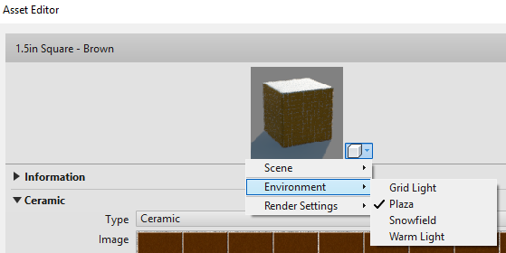
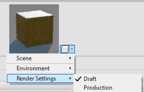

<head>
<meta http-equiv="Content-Type" content="text/html; charset=utf-8">
<link rel="stylesheet" type="text/css" href="bc.css">

</head>

<!---

- create material
  all material and asset properties are accessible except one -- https://autodesk.slack.com/archives/C0SR6NAP8/p1572546797032200
  https://stackoverflow.com/questions/58414284/revit-api-material-with-texture-from-filepath
  https://forums.autodesk.com/t5/revit-api-forum/create-new-material-and-add-new-physical-and-thermal-assets-with/m-p/7311468
  15089722 [Revit Material Library] implemented CreateMaterialAsset sample add-in, reanswered case
  1735_editscope_texture.md
  https://thebuildingcoder.typepad.com/blog/2016/10/list-material-asset-texture-and-forge-webinar-recordings.html#comment-4442686784
  14254618 [Changing material texture path with editScope] reanswered
  https://forums.autodesk.com/t5/revit-api-forum/changing-material-texture-path-with-editscope/m-p/8017578
  15041727 [Unable to get correct texture path from Revit API]
  14887363 [Obtain Uv-coordinates from texture]
  14348365 [Render Material Texture Image]
  https://forums.autodesk.com/t5/revit-api-forum/render-material-texture-image/m-p/8080636
  https://thebuildingcoder.typepad.com/blog/2016/10/list-material-asset-texture-and-forge-webinar-recordings.html#comment-4442686784
    [Q] Great tip, but how can we create the fullpath to the unifiedbitmap_Bitmap texture. I've tried using Application:: GetLibraryPaths but the material library is not listed in the dictionnary :(
    [A] If all else fails, you can try to use the operating system functionality to search globally for the given filename. You should cache the folders in which you find it. If the system is sensibly set up, you will only need to search for it globally once, or a very few times, since there should not be many different locations in which these files are stored.
    [R] Thank you for this tip, especially for the cache recommandation. Works like a charm. :)
  https://forums.autodesk.com/t5/revit-api-forum/create-new-material-and-add-new-physical-and-thermal-assets-with/m-p/7311468
  [Changing material texture path with editScope](https://forums.autodesk.com/t5/revit-api-forum/changing-material-texture-path-with-editscope/m-p/8017578)
  [Render Material Texture Image](https://forums.autodesk.com/t5/revit-api-forum/render-material-texture-image/m-p/8080636)

  [setting material texture path in `EditScope`](https://thebuildingcoder.typepad.com/blog/2019/04/set-material-texture-path-in-editscope.html)
  
- material and asset access
Liz Fortune Oct 31st at 7:33 PM
@conoves @t_arunb Balaji and I have been able to access each and every parameter of the material, appearance asset, thermal asset, and physical asset EXCEPT for one....one lonely parameter...I was wondering if you knew how to connect to the keywords parameter which lives on the Identity tab of the Material UI in Revit.  We can connect to the keywords for all of the assets above but would like to also connect to the keywords that live on the material itself.  Any help would be appreciated

Scott Conover  5 days ago
Looks to me that Material.getKeywords() is not exposed (it is not a BuiltInParameter either).  @zhangg can you confirm?

Guofeng Zhang  4 days ago
Yes, Keywords are not exposed to API until now.

Jeremy Tammik  4 days ago
@t_fortl @t_arunb thank you very much for confirming that you can access all the material and asset properties. can you possibly share the code that shows all the different paths you needed to take? many external add-in developers keep running into problems accessing this data, so a generic sample demonstrating how to access al  variations would be extremely helpful. thank you!

Balaji Arunachalam  4 days ago
Thanks for confirming @zhangg. Can you please confirm if there is any parameter to get Environment and Render Settings value too? Their values are common for all the Assets, kindly correct me if I am wrong. (edited) 

/a/doc/revit/tbc/git/a/img/assets_environment.png

/a/doc/revit/tbc/git/a/img/assets_render_settings.png

Balaji Arunachalam  4 days ago
@tammikj We have used the code snippets you have shared on your block, however now @t_fortl is in the process of recreating materials with the values we got. Hope we can share you that once we are successful in recreating it.

Liz Fortune  3 days ago
/a/doc/revit/tbc/git/a/zip/material_asset_properties.txt

Balaji @t_arunb  has been heads down working with the appearance assets but the code provided will get you everything for the thermal and structural assets and almost everything for the appearance asset.  The pdf on your blog was crucial in figuring out how to touch all the aspects of the appearance asset!  I have also attached a Snagit image I put together that will show mappings for the appearance asset (the google sheet in this image was an output of my code into a csv).  Hope this helps.  

/a/doc/revit/tbc/git/a/img/assets_air_appearance_properties.png

Guofeng Zhang  22 hours ago
@t_arunb Nope. As you said, they are common for all assets, so they are think as property or parameters, but UI config and saved into MaterialUIConfig.xml.

Jeremy Tammik  24 hours ago
@t_fortl @t_arunb thank you very much for the images and sample code accessing all the material and asset properties. have you made any attempts at modifying them, and creating new materials and assets? a number of external add-in developers are struggling a bit with this...

Jeremy Tammik  21 hours ago
@t_fortl you say, The pdf on your blog was crucial... what PDF is that, please? I would like to highlight it for others to find, and cannot find it myself.

i published what you shared so far; it would be great if you can also confirm that you can create new materials and successfully populate all these properties as well!

https://thebuildingcoder.typepad.com/blog/2019/11/material-physical-and-thermal-assets.html

Liz Fortune  10 hours ago
@tammikj Awesome!  Glad my work helped. :slightly_smiling_face:
I have successfully modified the values for the parameters. I attempted a handful. The trick I found was that I needed to identify the storage type of each so I could set the parameter accordingly. The pdf I was referring to is: https://thebuildingcoder.typepad.com/files/sd124625_visual_appearance_of_materials_api_boris_shafiro_handout.pdf

twitter:

Accessing and creating all material, physical and thermal assets, full path to texture bitmap, environment and render settings in the #RevitAPI @AutodeskForge @AutodeskRevit #bim #DynamoBim #ForgeDevCon http://bit.ly/material_assets

Today, we concentrate fully on material, physical and thermal assets
&ndash; Issues accessing and creating material assets
&ndash; Access to all material asset properties
&ndash; No access to material keywords
&ndash; Access to environment and render settings
&ndash; Determine full path to texture bitmap...

linkedin:

Accessing and creating all material, physical and thermal assets, full path to texture bitmap, environment and render settings in the #RevitAPI

http://bit.ly/material_assets

Today, we concentrate fully on material, physical and thermal assets:

- Issues accessing and creating material assets
- Access to all material asset properties
- No access to material keywords
- Access to environment and render settings
- Determine full path to texture bitmap...

#bim #DynamoBim #ForgeDevCon #Revit #API #IFC #SDK #AI #VisualStudio #Autodesk #AEC #adsk

the [Revit API discussion forum](http://forums.autodesk.com/t5/revit-api-forum/bd-p/160) thread

-->

### Material, Physical and Thermal Assets

Today, we concentrate fully on material, physical and thermal assets:

- [Issues accessing and creating material assets](#2)
- [Access to all material asset properties](#3)
- [No access to material keywords](#4)
- [Access to environment and render settings](#5)
- [Determine full path to texture bitmap](#6)
- [Addendum &ndash; Modifying Material Assets](#7)

#### Issues Accessing and Creating Material Assets

Quite a number of issues were discussed in the past few months involving issues accessing and creating material assets.

As far as I know, they can all be solved, [cf. below](#3).

Sometimes, though, the access is slightly convoluted and confusing.

Here is an overview over some recent issues:

- [Create new material and add texture from file path](https://stackoverflow.com/questions/58414284/revit-api-material-with-texture-from-filepath)
- [Create new material and add new physical and thermal assets with values](https://forums.autodesk.com/t5/revit-api-forum/create-new-material-and-add-new-physical-and-thermal-assets-with/m-p/7311468)
- [Setting material texture path in `EditScope`](https://thebuildingcoder.typepad.com/blog/2019/04/set-material-texture-path-in-editscope.html) &ndash; ([discussion forum thread](https://forums.autodesk.com/t5/revit-api-forum/changing-material-texture-path-with-editscope/m-p/8017578), case 14254618)

<!--

15089722 [Revit Material Library] implemented CreateMaterialAsset sample add-in 
15041727 [Unable to get correct texture path from Revit API]
14887363 [Obtain Uv-coordinates from texture]

- [Units on the elements, that conform the assets of materials](https://forums.autodesk.com/t5/revit-api-forum/units-on-the-elements-that-conform-the-assets-of-materials/m-p/8593252)
- [Material asset textures](https://thebuildingcoder.typepad.com/blog/2016/10/list-material-asset-texture-and-forge-webinar-recordings.html)
- [Render material texture image](https://forums.autodesk.com/t5/revit-api-forum/render-material-texture-image/m-p/8080636), case 14348365
- [AddMaterials GitHub repository](https://github.com/jeremytammik/AddMaterials) &ndash; add materials from a list of properties defined in Excel

-->

Older discussions are listed in the topic groups
on [material management and libraries](https://thebuildingcoder.typepad.com/blog/about-the-author.html#5.5)
and [texture bitmap and UV coordinate access](https://thebuildingcoder.typepad.com/blog/about-the-author.html#5.42).

#### Access to All Material Asset Properties

I am very glad to announce that my colleagues Liz Fortune and Balaji Arunachalam confirm that they can access each and every parameter of the materials, appearance assets, thermal assets, and physical assets (with one single exception, [cf. below](4)):

Balaji and I have been able to access each and every parameter of the material, appearance asset, thermal asset, and physical asset EXCEPT for the keywords parameter that lives on the Identity tab of the Material UI in Revit.  We can connect to the keywords for all of the assets above but would like to also connect to the keywords that live on the material itself. 

To access this data, we used code snippets shared on The Building Coder blog to implement the following:

<pre class="code">
void&nbsp;GetElementMaterialInfo(&nbsp;Document&nbsp;doc&nbsp;)
{
&nbsp;&nbsp;FilteredElementCollector&nbsp;collector
&nbsp;&nbsp;&nbsp;&nbsp;=&nbsp;new&nbsp;FilteredElementCollector(&nbsp;doc&nbsp;)
&nbsp;&nbsp;&nbsp;&nbsp;&nbsp;&nbsp;.WhereElementIsNotElementType()
&nbsp;&nbsp;&nbsp;&nbsp;&nbsp;&nbsp;.OfClass(&nbsp;typeof(&nbsp;Material&nbsp;)&nbsp;);
 
&nbsp;&nbsp;try
&nbsp;&nbsp;{
&nbsp;&nbsp;&nbsp;&nbsp;foreach(&nbsp;Material&nbsp;material&nbsp;in&nbsp;collector&nbsp;)
&nbsp;&nbsp;&nbsp;&nbsp;{
&nbsp;&nbsp;&nbsp;&nbsp;&nbsp;&nbsp;if(&nbsp;material.Name.Equals(&nbsp;&quot;Air&quot;&nbsp;)&nbsp;)
&nbsp;&nbsp;&nbsp;&nbsp;&nbsp;&nbsp;{
&nbsp;&nbsp;&nbsp;&nbsp;&nbsp;&nbsp;&nbsp;&nbsp;AppearanceAssetElement&nbsp;appearanceElement
&nbsp;&nbsp;&nbsp;&nbsp;&nbsp;&nbsp;&nbsp;&nbsp;&nbsp;&nbsp;=&nbsp;doc.GetElement(&nbsp;material.AppearanceAssetId&nbsp;)
&nbsp;&nbsp;&nbsp;&nbsp;&nbsp;&nbsp;&nbsp;&nbsp;&nbsp;&nbsp;&nbsp;&nbsp;as&nbsp;AppearanceAssetElement;
 
&nbsp;&nbsp;&nbsp;&nbsp;&nbsp;&nbsp;&nbsp;&nbsp;Asset&nbsp;appearanceAsset&nbsp;=&nbsp;appearanceElement
&nbsp;&nbsp;&nbsp;&nbsp;&nbsp;&nbsp;&nbsp;&nbsp;&nbsp;&nbsp;.GetRenderingAsset();
 
&nbsp;&nbsp;&nbsp;&nbsp;&nbsp;&nbsp;&nbsp;&nbsp;List&lt;AssetProperty&gt;&nbsp;assetProperties
&nbsp;&nbsp;&nbsp;&nbsp;&nbsp;&nbsp;&nbsp;&nbsp;&nbsp;&nbsp;=&nbsp;new&nbsp;List&lt;AssetProperty&gt;();
 
&nbsp;&nbsp;&nbsp;&nbsp;&nbsp;&nbsp;&nbsp;&nbsp;PropertySetElement&nbsp;physicalPropSet
&nbsp;&nbsp;&nbsp;&nbsp;&nbsp;&nbsp;&nbsp;&nbsp;&nbsp;&nbsp;=&nbsp;doc.GetElement(&nbsp;material.StructuralAssetId&nbsp;)
&nbsp;&nbsp;&nbsp;&nbsp;&nbsp;&nbsp;&nbsp;&nbsp;&nbsp;&nbsp;&nbsp;&nbsp;as&nbsp;PropertySetElement;
 
&nbsp;&nbsp;&nbsp;&nbsp;&nbsp;&nbsp;&nbsp;&nbsp;PropertySetElement&nbsp;thermalPropSet
&nbsp;&nbsp;&nbsp;&nbsp;&nbsp;&nbsp;&nbsp;&nbsp;&nbsp;&nbsp;=&nbsp;doc.GetElement(&nbsp;material.ThermalAssetId&nbsp;)
&nbsp;&nbsp;&nbsp;&nbsp;&nbsp;&nbsp;&nbsp;&nbsp;&nbsp;&nbsp;&nbsp;&nbsp;as&nbsp;PropertySetElement;
 
&nbsp;&nbsp;&nbsp;&nbsp;&nbsp;&nbsp;&nbsp;&nbsp;ThermalAsset&nbsp;thermalAsset&nbsp;=&nbsp;thermalPropSet
&nbsp;&nbsp;&nbsp;&nbsp;&nbsp;&nbsp;&nbsp;&nbsp;&nbsp;&nbsp;.GetThermalAsset();
 
&nbsp;&nbsp;&nbsp;&nbsp;&nbsp;&nbsp;&nbsp;&nbsp;StructuralAsset&nbsp;physicalAsset&nbsp;=&nbsp;physicalPropSet
&nbsp;&nbsp;&nbsp;&nbsp;&nbsp;&nbsp;&nbsp;&nbsp;&nbsp;&nbsp;.GetStructuralAsset();
 
&nbsp;&nbsp;&nbsp;&nbsp;&nbsp;&nbsp;&nbsp;&nbsp;ICollection&lt;Parameter&gt;&nbsp;physicalParameters
&nbsp;&nbsp;&nbsp;&nbsp;&nbsp;&nbsp;&nbsp;&nbsp;&nbsp;&nbsp;=&nbsp;physicalPropSet.GetOrderedParameters();
 
&nbsp;&nbsp;&nbsp;&nbsp;&nbsp;&nbsp;&nbsp;&nbsp;ICollection&lt;Parameter&gt;&nbsp;thermalParameters
&nbsp;&nbsp;&nbsp;&nbsp;&nbsp;&nbsp;&nbsp;&nbsp;&nbsp;&nbsp;=&nbsp;thermalPropSet.GetOrderedParameters();
 
&nbsp;&nbsp;&nbsp;&nbsp;&nbsp;&nbsp;&nbsp;&nbsp;//&nbsp;Appearance&nbsp;Asset
 
&nbsp;&nbsp;&nbsp;&nbsp;&nbsp;&nbsp;&nbsp;&nbsp;for(&nbsp;int&nbsp;i&nbsp;=&nbsp;0;&nbsp;i&nbsp;&lt;&nbsp;appearanceAsset.Size;&nbsp;i++&nbsp;)
&nbsp;&nbsp;&nbsp;&nbsp;&nbsp;&nbsp;&nbsp;&nbsp;{
&nbsp;&nbsp;&nbsp;&nbsp;&nbsp;&nbsp;&nbsp;&nbsp;&nbsp;&nbsp;AssetProperty&nbsp;property&nbsp;=&nbsp;appearanceAsset[&nbsp;i&nbsp;];
&nbsp;&nbsp;&nbsp;&nbsp;&nbsp;&nbsp;&nbsp;&nbsp;&nbsp;&nbsp;assetProperties.Add(&nbsp;property&nbsp;);
&nbsp;&nbsp;&nbsp;&nbsp;&nbsp;&nbsp;&nbsp;&nbsp;}
&nbsp;&nbsp;&nbsp;&nbsp;&nbsp;&nbsp;&nbsp;&nbsp;foreach(&nbsp;AssetProperty&nbsp;assetProp&nbsp;in&nbsp;assetProperties&nbsp;)
&nbsp;&nbsp;&nbsp;&nbsp;&nbsp;&nbsp;&nbsp;&nbsp;{
&nbsp;&nbsp;&nbsp;&nbsp;&nbsp;&nbsp;&nbsp;&nbsp;&nbsp;&nbsp;Type&nbsp;type&nbsp;=&nbsp;assetProp.GetType();
&nbsp;&nbsp;&nbsp;&nbsp;&nbsp;&nbsp;&nbsp;&nbsp;&nbsp;&nbsp;object&nbsp;assetPropValue&nbsp;=&nbsp;null;
&nbsp;&nbsp;&nbsp;&nbsp;&nbsp;&nbsp;&nbsp;&nbsp;&nbsp;&nbsp;var&nbsp;prop&nbsp;=&nbsp;type.GetProperty(&nbsp;&quot;Value&quot;&nbsp;);
&nbsp;&nbsp;&nbsp;&nbsp;&nbsp;&nbsp;&nbsp;&nbsp;&nbsp;&nbsp;if(&nbsp;prop&nbsp;!=&nbsp;null
&nbsp;&nbsp;&nbsp;&nbsp;&nbsp;&nbsp;&nbsp;&nbsp;&nbsp;&nbsp;&nbsp;&nbsp;&amp;&amp;&nbsp;prop.GetIndexParameters().Length&nbsp;==&nbsp;0&nbsp;)
&nbsp;&nbsp;&nbsp;&nbsp;&nbsp;&nbsp;&nbsp;&nbsp;&nbsp;&nbsp;{
&nbsp;&nbsp;&nbsp;&nbsp;&nbsp;&nbsp;&nbsp;&nbsp;&nbsp;&nbsp;&nbsp;&nbsp;assetPropValue&nbsp;=&nbsp;prop.GetValue(&nbsp;assetProp&nbsp;);
&nbsp;&nbsp;&nbsp;&nbsp;&nbsp;&nbsp;&nbsp;&nbsp;&nbsp;&nbsp;}
&nbsp;&nbsp;&nbsp;&nbsp;&nbsp;&nbsp;&nbsp;&nbsp;}
 
&nbsp;&nbsp;&nbsp;&nbsp;&nbsp;&nbsp;&nbsp;&nbsp;//&nbsp;Physical&nbsp;(Structural)&nbsp;Asset
 
&nbsp;&nbsp;&nbsp;&nbsp;&nbsp;&nbsp;&nbsp;&nbsp;foreach(&nbsp;Parameter&nbsp;p&nbsp;in&nbsp;physicalParameters&nbsp;)
&nbsp;&nbsp;&nbsp;&nbsp;&nbsp;&nbsp;&nbsp;&nbsp;{
&nbsp;&nbsp;&nbsp;&nbsp;&nbsp;&nbsp;&nbsp;&nbsp;&nbsp;&nbsp;//&nbsp;Work&nbsp;with&nbsp;parameters&nbsp;here
&nbsp;&nbsp;&nbsp;&nbsp;&nbsp;&nbsp;&nbsp;&nbsp;&nbsp;&nbsp;//&nbsp;The&nbsp;only&nbsp;parameter&nbsp;not&nbsp;in&nbsp;the&nbsp;orderedParameters&nbsp;
&nbsp;&nbsp;&nbsp;&nbsp;&nbsp;&nbsp;&nbsp;&nbsp;&nbsp;&nbsp;//&nbsp;that&nbsp;is&nbsp;needed&nbsp;is&nbsp;the&nbsp;Asset&nbsp;name,&nbsp;which&nbsp;you&nbsp;
&nbsp;&nbsp;&nbsp;&nbsp;&nbsp;&nbsp;&nbsp;&nbsp;&nbsp;&nbsp;//&nbsp;can&nbsp;get&nbsp;by&nbsp;&#39;physicalAsset.Name&#39;.
&nbsp;&nbsp;&nbsp;&nbsp;&nbsp;&nbsp;&nbsp;&nbsp;}
 
&nbsp;&nbsp;&nbsp;&nbsp;&nbsp;&nbsp;&nbsp;&nbsp;//&nbsp;Thermal&nbsp;Asset
 
&nbsp;&nbsp;&nbsp;&nbsp;&nbsp;&nbsp;&nbsp;&nbsp;foreach(&nbsp;Parameter&nbsp;p&nbsp;in&nbsp;thermalParameters&nbsp;)
&nbsp;&nbsp;&nbsp;&nbsp;&nbsp;&nbsp;&nbsp;&nbsp;{
&nbsp;&nbsp;&nbsp;&nbsp;&nbsp;&nbsp;&nbsp;&nbsp;&nbsp;&nbsp;// Work&nbsp;with&nbsp;parameters&nbsp;here
&nbsp;&nbsp;&nbsp;&nbsp;&nbsp;&nbsp;&nbsp;&nbsp;&nbsp;&nbsp;// The&nbsp;only&nbsp;parameter&nbsp;not&nbsp;in&nbsp;the&nbsp;orderedParameters&nbsp;
&nbsp;&nbsp;&nbsp;&nbsp;&nbsp;&nbsp;&nbsp;&nbsp;&nbsp;&nbsp;//&nbsp;that&nbsp;is&nbsp;needed&nbsp;is&nbsp;the&nbsp;Asset&nbsp;name,&nbsp;shich&nbsp;you&nbsp;
&nbsp;&nbsp;&nbsp;&nbsp;&nbsp;&nbsp;&nbsp;&nbsp;&nbsp;&nbsp;//&nbsp;can&nbsp;get&nbsp;by&nbsp;&#39;thermalAsset.Name&#39;.
&nbsp;&nbsp;&nbsp;&nbsp;&nbsp;&nbsp;&nbsp;&nbsp;}
&nbsp;&nbsp;&nbsp;&nbsp;&nbsp;&nbsp;}
&nbsp;&nbsp;&nbsp;&nbsp;}
&nbsp;&nbsp;}
&nbsp;&nbsp;catch(&nbsp;Exception&nbsp;e&nbsp;)
&nbsp;&nbsp;{
&nbsp;&nbsp;&nbsp;&nbsp;Console.WriteLine(&nbsp;e.ToString()&nbsp;);
&nbsp;&nbsp;}
}
</pre>

This code will get you everything for the thermal and structural assets and almost everything for the appearance asset.

[Boris Shafiro's PDF](zip/sd124625_visual_appearance_of_materials_api_boris_shafiro_handout.pdf) from his AU presentation
on [modifying material visual appearance](https://thebuildingcoder.typepad.com/blog/2017/11/modifying-material-visual-appearance.html)
was crucial in figuring out how to touch all the aspects of the appearance asset!

Here is an image I put together [showing mappings for the appearance asset](zip/assets_air_appearance_properties.png):

 <!--2152-->

The spreadsheet in this image was created from output of my code into a CSV.  Hope this helps.

Many thanks to Liz and Balaji for their research and sharing the results!

#### No Access to Material Keywords

As mentioned above, one single property is apparently still not accessible: the keywords parameter that lives on the Identity tab of the Material UI in Revit.

Apparently, the internal property `Material.getKeywords` is not exposed to the official Revit API, and there is no built-in parameter for it either.

#### Access to Environment and Render Settings

We also searched for the Environment and Render Settings values. They are common for all the Assets:

 <!--559-->

Environment assets

 <!---->

Render settings

They are common for all assets, so they look like the other properties or parameters, but are in fact part of the UI config and saved into `MaterialUIConfig.xml`.

#### Determine Full Path to Texture Bitmap

Finally, to round off this collection, here is a result from
a [comment](https://thebuildingcoder.typepad.com/blog/2016/10/list-material-asset-texture-and-forge-webinar-recordings.html#comment-4442686784)
on [material asset textures](https://thebuildingcoder.typepad.com/blog/2016/10/list-material-asset-texture-and-forge-webinar-recordings.html):

**Question:** Great tip, but how can we create the full path to the `unifiedbitmap_Bitmap` texture?
I tried using the `Application` `GetLibraryPaths` method, but the material library is not listed in the dictionary. &nbsp; :(

**Answer:** If all else fails, you can try to use the operating system functionality to search globally for the given filename.
You should cache the folders in which you find it.
If the system is sensibly set up, you will only need to search for it globally once, or a very few times, since there should not be many different locations in which these files are stored.

**Response:** Thank you for this tip, especially for the cache recommendation.

Works like a charm. &nbsp; :)

#### Addendum &ndash; Modifying Material Assets

**Question:** Can you also confirm that you can create new materials and successfully populate all these properties as well?

**Answer:** I have successfully modified the values for the parameters.

I attempted a handful.

The trick I found was that I needed to identify the storage type of each so I could set the parameter accordingly.
