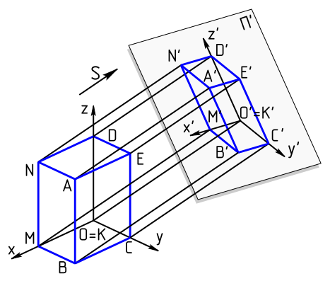

<head>
<meta http-equiv="Content-Type" content="text/html; charset=utf-8">
<link rel="stylesheet" type="text/css" href="bc.css">

</head>

<!---

- [Projection Transformation]
  https://forums.autodesk.com/t5/revit-api-forum/projection-transformation/m-p/9119247
  to project arbitrary curves onto a horizontal or vertical plane, you can use the suggestion by 
  
- sample zero touch videos
  https://forums.autodesk.com/t5/revit-api-forum/reivt-add-in-amp-dynamo-zero-touch-node/m-p/9137621

twitter:

Curve projection, detaching model and exporting FBX in DA4R and the #RevitAPI @AutodeskForge @AutodeskRevit #bim #DynamoBim #ForgeDevCon http://bit.ly/curveproject

Two little hints on Forge Design Automation for Revit or DA4R issues, projecting a curve onto a planar surface and an impressive list of add-in video samples
&ndash; DA4R supports FBX and IFC
&ndash; DA4R wrong user
&ndash; Projecting curves onto a plane
&ndash; Revit add-in versus Dynamo zero-touch node
&ndash; Revit add-in sample videos...

linkedin:

Curve projection, detaching model and exporting FBX in DA4R and the #RevitAPI

http://bit.ly/curveproject

Two little hints on Forge Design Automation for Revit or DA4R issues, projecting a curve onto a planar surface and an impressive list of add-in video samples:

- DA4R supports FBX and IFC
- DA4R wrong user
- Projecting curves onto a plane
- Revit add-in versus Dynamo zero-touch node
- Revit add-in sample videos...

#bim #DynamoBim #ForgeDevCon #Revit #API #IFC #SDK #AI #VisualStudio #Autodesk #AEC #adsk

the [Revit API discussion forum](http://forums.autodesk.com/t5/revit-api-forum/bd-p/160) thread

-->

### Curve Projection, Detach and FBX in DA4R

Two little hints on [Forge Design Automation for Revit or DA4R](https://thebuildingcoder.typepad.com/blog/about-the-author.html#5.55) issues, 
projecting a curve onto a planar surface and an impressive list of add-in sample videos:

- [DA4R supports FBX and IFC](#2)
- [DA4R wrong user](#3)
- [Projecting curves onto a plane](#4)
- [Revit add-in versus Dynamo zero-touch node](#5)
- [Revit add-in sample videos](#6)

#### DA4R Supports FBX and IFC

**Question:** A quick question: does Revit IO support exporting FBX? 
I would like to integrate Revit I/O into my AR automation pipeline.
I saw it's listed in the DB level API, but I'm not sure if it's something like the IFC format (not supported). 

**Answer:** Yes, we support FBX using the standard [Document.Export method](https://www.revitapidocs.com/2020/02b2efba-9d7c-88bc-b43e-a541e169d832.htm).

By the way, we also [added support for IFC in April](https://forge.autodesk.com/en/docs/design-automation/v3/change_history/revit_release_notes/#april-2019).

So, both are now supported.

#### DA4R Wrong User

**Question:** We are trying to open a central model file in DA4R.

When testing it locally it all runs ok (of course), as we can open the file with worksets, read-only, and run our plugin script.

Optionally, we can "detach from central" with `openOptions.DetachFromCentralOption` being set in the Revit API.
Unfortunately, we do not have this option in DA4R, as DA4R handles the `OpenDocumentFile` itself.

That causes this error:

<pre>
  Autodesk.Revit.Exceptions.WrongUserException:
  The local file is not owned by the current user, who therefore is not allowed to modify it.
  at Autodesk.Revit.ApplicationServices.Application.OpenDocumentFile(String fileName)
  at DesignAutomationFramework.DesignAutomationData..ctor(Application revitApp, String mainModelPath)
</pre>

**Answer:** We recently updated the documentation for this specific case.

Please look at
the [troubleshooting section in the developer's guide](https://forge.autodesk.com/en/docs/design-automation/v3/developers_guide/troubleshooting/#revit) and
let us know if you run into any issues with implementing the fix.

#### Projecting Curves onto a Plane

Two very differing approaches for projecting curves onto a plane are suggested in 
the [Revit API discussion forum](http://forums.autodesk.com/t5/revit-api-forum/bd-p/160) thread
on [projection transformation](https://forums.autodesk.com/t5/revit-api-forum/projection-transformation/m-p/9119247):

**Question:** I am relatively new to the Revit API and was looking into transformations, trying to use them to project geometry (a curve) onto a plane.
This should come out of the box, or so I thought.

I am applying the following transformation to a curve:

<pre>
  1,0,0,0
  0,1,0,0
  0,0,0,0
  0,0,0,1 // for completeness
</pre>

However, that causes a "transform is not conformal" error. 

Is there any way to do this in Revit, or do I need to reinvent the wheel and write the transformations for each curve type myself?

**Answer:** I guess I said most of what I have to say on this in my answers
to [your](https://thebuildingcoder.typepad.com/blog/2008/12/polygon-transformation.html#comment-4669997409)
[comments](https://thebuildingcoder.typepad.com/blog/2008/12/polygon-transformation.html#comment-4670106610) on The Building Coder:

Using such a projection is obviously a good idea, in principle.

However, Revit transformations are built for BIM purposes.

You cannot apply a non-conformal transformation to a door or window and still expect it to comply with the building codes and standards.

So, how to project your 3D curve to 2D depends on what you want to achieve and do with it.

If you can live with an approximation, I would suggest you tessellate the curve.

That produces a series of line segments, and those are easy to project any way you like.

If that is not an option and you need precise curve results, I am indeed afraid you might have to write the transformations for each curve type yourself.

Alternatively, you might be able to hook up with some external geometric library that can support you in that transformation.

I have researched that topic briefly multiple times, and all the 3D libraries that I looked at were rather large and complex for my immediate needs.

However, I think any good reliable powerful library that you can connect will do the job.

So, I have no specific preference in that area. There are a huge number of them out there, some are immensely powerful, some are good and relatively unknown. Several CAD vendors have open-sourced significant libraries.

**Response:** Well, I went the long way and wrote projection methods for all curve types (except CylindricalHelix).

For lines, it is straight forward, but I am not so sure with Hermite splines and nurbs splines; maybe there are problems I have missed...

I have tested it for some occasions, and two things that happened were:

- Projected curves where longer than edges of faces from which they were generated.
- Projected Hermite splines didn't rebuild correctly, which might be because you can only define start and end tangents, and not the complete list, when creating a curve.
- `Ellipse.Create` is a little too clever, since it will create an arc if the two radii are equal, which resulted in an endless loop.

<pre class="code">
&nbsp;&nbsp;static&nbsp;Curve&nbsp;Project(
&nbsp;&nbsp;&nbsp;&nbsp;Autodesk.Revit.DB.NurbSpline&nbsp;nurbsSpline,
&nbsp;&nbsp;&nbsp;&nbsp;Autodesk.Revit.DB.Plane&nbsp;plane&nbsp;)
&nbsp;&nbsp;{
&nbsp;&nbsp;&nbsp;&nbsp;XYZ[]&nbsp;controlPoints&nbsp;=&nbsp;GeometryHelper.ProjectPoint(
&nbsp;&nbsp;&nbsp;&nbsp;&nbsp;&nbsp;nurbsSpline.CtrlPoints,&nbsp;plane&nbsp;);
 
&nbsp;&nbsp;&nbsp;&nbsp;double[]&nbsp;knots&nbsp;=&nbsp;new&nbsp;double[&nbsp;nurbsSpline.Knots.Size&nbsp;];
&nbsp;&nbsp;&nbsp;&nbsp;for(&nbsp;int&nbsp;i&nbsp;=&nbsp;0;&nbsp;i&nbsp;&lt;&nbsp;knots.Length;&nbsp;i++&nbsp;)
&nbsp;&nbsp;&nbsp;&nbsp;{
&nbsp;&nbsp;&nbsp;&nbsp;&nbsp;&nbsp;knots[&nbsp;i&nbsp;]&nbsp;=&nbsp;nurbsSpline.Knots.get_Item(&nbsp;i&nbsp;);
&nbsp;&nbsp;&nbsp;&nbsp;}
&nbsp;&nbsp;&nbsp;&nbsp;double[]&nbsp;weights&nbsp;=&nbsp;new&nbsp;double[&nbsp;nurbsSpline.Weights.Size&nbsp;];
&nbsp;&nbsp;&nbsp;&nbsp;for(&nbsp;int&nbsp;i&nbsp;=&nbsp;0;&nbsp;i&nbsp;&lt;&nbsp;weights.Length;&nbsp;i++&nbsp;)
&nbsp;&nbsp;&nbsp;&nbsp;{
&nbsp;&nbsp;&nbsp;&nbsp;&nbsp;&nbsp;weights[&nbsp;i&nbsp;]&nbsp;=&nbsp;nurbsSpline.Weights.get_Item(&nbsp;i&nbsp;);
&nbsp;&nbsp;&nbsp;&nbsp;}
&nbsp;&nbsp;&nbsp;&nbsp;return&nbsp;NurbSpline.CreateCurve(&nbsp;nurbsSpline.Degree,
&nbsp;&nbsp;&nbsp;&nbsp;&nbsp;&nbsp;knots,&nbsp;controlPoints,&nbsp;weights&nbsp;);
&nbsp;&nbsp;}
 
&nbsp;&nbsp;static&nbsp;Curve&nbsp;Project(
&nbsp;&nbsp;&nbsp;&nbsp;Autodesk.Revit.DB.HermiteSpline&nbsp;hermiteSpline,
&nbsp;&nbsp;&nbsp;&nbsp;Autodesk.Revit.DB.Plane&nbsp;plane&nbsp;)
&nbsp;&nbsp;{
&nbsp;&nbsp;&nbsp;&nbsp;XYZ[]&nbsp;tangents&nbsp;=&nbsp;GeometryHelper.ProjectVector(
&nbsp;&nbsp;&nbsp;&nbsp;&nbsp;&nbsp;hermiteSpline.Tangents,&nbsp;plane&nbsp;);
 
&nbsp;&nbsp;&nbsp;&nbsp;XYZ[]&nbsp;controlPoints&nbsp;=&nbsp;GeometryHelper.ProjectPoint(
&nbsp;&nbsp;&nbsp;&nbsp;&nbsp;&nbsp;hermiteSpline.ControlPoints,&nbsp;plane&nbsp;);
 
&nbsp;&nbsp;&nbsp;&nbsp;HermiteSplineTangents&nbsp;hermiteSplineTangents
&nbsp;&nbsp;&nbsp;&nbsp;&nbsp;&nbsp;=&nbsp;new&nbsp;HermiteSplineTangents()
&nbsp;&nbsp;&nbsp;&nbsp;&nbsp;&nbsp;{
&nbsp;&nbsp;&nbsp;&nbsp;&nbsp;&nbsp;&nbsp;&nbsp;StartTangent&nbsp;=&nbsp;tangents[&nbsp;0&nbsp;].Normalize(),
&nbsp;&nbsp;&nbsp;&nbsp;&nbsp;&nbsp;&nbsp;&nbsp;EndTangent&nbsp;=&nbsp;tangents[&nbsp;tangents.Length&nbsp;-&nbsp;1&nbsp;].Normalize()
&nbsp;&nbsp;&nbsp;&nbsp;&nbsp;&nbsp;};
 
&nbsp;&nbsp;&nbsp;&nbsp;return&nbsp;HermiteSpline.Create(&nbsp;controlPoints,
&nbsp;&nbsp;&nbsp;&nbsp;&nbsp;&nbsp;hermiteSpline.IsPeriodic,&nbsp;hermiteSplineTangents&nbsp;);
&nbsp;&nbsp;}
</pre>

**Answer:** Well done! Sounds like pretty good progress.

Feedback so far from the development team:

Note that there are various complications &ndash; the curve may project to a self-intersecting curve, or one with singularities such as cusps, or to a degenerate curve (a point), and such curves may cause downstream problems.
For projecting a curve onto a surface, part of the curve may miss the surface when projected, and one might want to distinguish between projecting orthogonal to the surface and projecting along a given direction.

If Revit's public API does not include a function to project a curve to a plane (or more generally, to a surface), and it looks like it doesn't, you can request that such a function be added.

You could file a wish list item for this in the Revit Idea Station and ensure it gets many votes. However, it would take time to plan and implement, of course.

**Response:** Thanks for the effort; don't get me wrong when saying this, I doubt that anything is going to happen...  but I had a little conversation including a wish for Inventor a while ago.
It wasn't accepting surface generated from another program  (Rhino3d) for unrolling them, even though I got the feedback that the surface was perfectly developable.

So that didn't change...

**Answer:** Revitalizer suggests a workaround for the projection of curves to a plane:

From your curves, create ModelCurves.

Depending on context (project or family), you can create DetailCurves or SymbolicCurves in a given view.

- Document.ConvertModelToDetailCurves or
- Document.ConvertModelToSymbolicCurves

In the RevitAPI.chm, it says in the text:

> The lines are projected on the view plane.
If the lines are not parallel to the view plane, lines are foreshortened and arcs are converted to ellipses.
Splines are modified.

Get the `DetailCurve.GeometryCurve` from the resulting elements and you are done.

Since you cannot create (2D) views for arbitrary planes, but only for vertical or horizontal ones, this workaround is limited.

If you really want to work around the restriction to horizontal and vertical planes, you can add another twist (plus reverse twist) to the process as follows:

- Apply a suitable transformation to the curve before converting it to a model line
- Project the model line onto a horizontal or vertical plane
- Apply the reverse transformation to the horizontal or vertical planar result to get it positioned where you want it

Simple task, surprising workaround &ndash; that's Revit API at its best.

**Response:** Definitely a thing to try out.
I had some issues with precision and further Boolean operations with my projection algorithm, I am wondering if this is a more precise way to do so?

I might stick to my implementation; at least there, I know were the imprecision is...

**Answer:** As for precision, I think that there may be inaccuracies, due to the fact that we create elements (which react to other elements, views etc.).

Revit's built-in rules may adjust elements according to its will.

Also, further limitations are apparent.

There is a ShortCurveTolerance constant, "the enforced minimum length for any curve created by Revit", as the documentation says.

So, the conversion methods will fail if a projected result would contain such a curve.

Imagine a line in the plane's normal direction &ndash; it would result in a point on the plane.

You could project some control points to the plane (start point, end point) and check the projected curves' related points to get a tolerance value.

Here is a comment from the development team on your projection implementation:

In the second function, which projects a Hermite spline curve onto a plane, the user should not normalise the tangent vectors.
The lengths of the start and end tangent vectors (i.e., first derivatives) affect the shape of the spline curve.
The first function, which projects Nurbs spline curves onto a plane, looks correct.
The fact that the Ellipse constructor will create an Arc if the ellipse happens to be circular is intentional, because Revit expects curves and surfaces to be represented in the simplest possible form, with an arc being considered simpler than an ellipse.
 
More feedback from the development team on the other ideas discussed above:

Regarding `ConvertModelToDetailCurves` and `ConvertModelToSymbolicCurves`: the user should be aware that if they produce curves that Revit considers invalid, such as self-intersecting curves or zero-length curves, they may cause problems if they're used in creating Revit geometry (or in other contexts for that matter).
However, a quick look at the internal function those API functions call indicates that it does check if the projection curve (i.e., the result) would have singularities or self-intersections and does not return a result in such cases.
So, I would guess that the same is true for the two API functions.

Note, too, that there are cases when users might want to allow the projection curve to be self-intersecting.
For example, if a full circle lying in a vertical plane is projected to a horizontal plane, some users might want that operation to succeed and to return a line segment representing the "shadow" of the circle (as if the sun were directly overhead).
I don't believe the Revit API provides such a function.

#### Revit Add-In versus Dynamo Zero-Touch Node

Eric Luo, Documentation Project Leader at [marchesepartners](https://www.marchesepartners.com) asked a question
on [Revit add-in and dynamo zero-touch node](https://forums.autodesk.com/t5/revit-api-forum/reivt-add-in-amp-dynamo-zero-touch-node/m-p/9137621) that
he later completed with the [impressive list of samples videos below](#6):

**Question:** Should I build a Revit Add-in or a Dynamo Zero-Touch Node?

I am an architect.
I just started using Dynamo last year, then learned Python and C#.
I’ve been working on Dynamo Zero-Touch Node a lot now.
The reason I create Dynamo Zero-Touch Node is that it allows me to use C# to drive the Revit API, and the way I create Dynamo Zero-Touch Node is very similar to Revit add-in, combine all the methods, not like the normal way using Dynamo having a lot of nodes connecting one by one.
For instance, I built a Dynamo Zero-Touch Node to create window schedule; it’s not a simple task, a lot of things need to happen, but all inside one single node.

<!--

<iframe width="640" height="590" src="https://screencast.autodesk.com/Embed/Timeline/25d71b9d-1f7f-4b2b-be6e-07b8af5d66f0" frameborder="0" scrolling="no" allowfullscreen="allowfullscreen" webkitallowfullscreen="webkitallowfullscreen"></iframe> 

-->

**Answer:** Congratulations on getting to grips so well with both environments.

I would say it is a matter of taste.

As you may have noticed from The Building Coder blog, I build Revit add-ins only and am perfectly happy with that.

People say that Dynamo is easier for non-programmers.

If you know Python and C# and are happy with pure non-visual programming, the add-in path may be the cleaner approach.

I hope this helps.

Have you made any decision yet?

Would you like to share your further insights with us?

Well, see below: 

#### Revit Add-In Sample Videos

Lately, I spent some time with Revit add-ins.

I would like to share some videos with you:

- [Apartment type setup](https://marchesepartner-my.sharepoint.com/:v:/g/personal/eluo_marchesepartners_com_au/EZ9--IrT4zZGg0vRvuklqlABVe7XwgaFGCWV_KimT-r9-w?e=0dLJJX) 
- [Bathroom type setup](https://marchesepartner-my.sharepoint.com/:v:/g/personal/eluo_marchesepartners_com_au/EW3WPGkf_GtPlI4QMWUQ1KABSrkIs9DuVsbggLF2sk928g?e=dDggiW) 
- [Tag doors](https://marchesepartner-my.sharepoint.com/:v:/g/personal/eluo_marchesepartners_com_au/ETbK_LvL6bVFlFO3RZWDXCcBgIdyKkoyXz6oNYmPwuB0ng?e=RdJhLx) 
- [Create floor by room + nice threshold detail](https://marchesepartner-my.sharepoint.com/:v:/g/personal/eluo_marchesepartners_com_au/EVRbV3JVmpBOvnttsx0BhU8BKjquWaxrEDsvuJKCSQShBg?e=Jo2JLa) 
- [Dimension column to closest grid](https://marchesepartner-my.sharepoint.com/:v:/g/personal/eluo_marchesepartners_com_au/EVpKF3GKvLhHpjUGYQsORpcBsUd0qoDJQv4rASdvhtFNLw?e=iMvwsd) 
- [Check material name and mark](https://marchesepartner-my.sharepoint.com/:v:/g/personal/eluo_marchesepartners_com_au/EeWUAKQi8ARDkmSk0PnsqKsBu94mhqohrxYEFbts5z7Uyw?e=QVGbfh) 
- [Batch print](https://marchesepartner-my.sharepoint.com/:v:/g/personal/eluo_marchesepartners_com_au/EV847MDEzItJl1tGDKOIkaYBdg1Adnm1P7oBGDns0Yj47A?e=Bl2lgd) 

All credit to The Building Coder!

Many thanks to Eric for sharing these impressive results!

