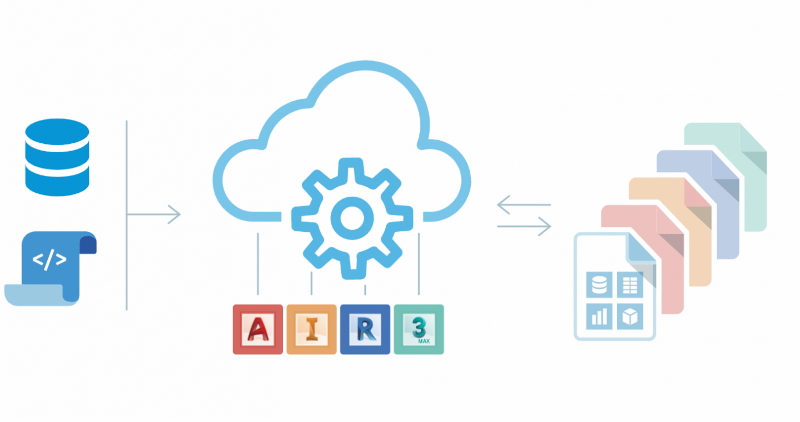

<head>
<meta http-equiv="Content-Type" content="text/html; charset=utf-8">
<link rel="stylesheet" type="text/css" href="bc.css">

</head>

<!---

twitter:

- post the news about Design Automation webinars
  https://forge.autodesk.com/blog/design-automation-api-webinar-series-register-now
  /a/doc/revit/tbc/git/a/img/da_for_air3.png
 
- Nice sample showing two stacked ribbon items versus 3:
  24x24 StackedItems
  https://forums.autodesk.com/t5/revit-api-forum/24x24-stackeditems/m-p/9168470

- Very important hint from Fair59 on reinitialising the filtered element collector
  https://forums.autodesk.com/t5/revit-api-forum/collection-of-elements-created-using-elementworksetfilter-giving/m-p/9164018
  This misunderstanding caused a similar problem in another recent case...

Painless introduction to Forge Design Automation API, creating two stacked ribbon items, reinitialising filtered element collectors and picking a face in a linked file using the #RevitAPI #DynamoBim @AutodeskForge @AutodeskRevit #bim #ForgeDevCon http://bit.ly/pickfaceinlink

The ultimatively painless introduction to the Forge Design Automation API, a solution for creating two stacked ribbon items, reinitialising filtered element collectors and picking a face in a linked file
&ndash; Forge Design Automation API webinars
&ndash; Stacking two 24x24 ribbon items
&ndash; Reinitialising the filtered element collector
&ndash; Use <code>CreateReferenceInLink</code> to select a face in a linked file...

linkedin:

Painless introduction to Forge Design Automation API, creating two stacked ribbon items, reinitialising filtered element collectors and picking a face in a linked file using the #RevitAPI

http://bit.ly/pickfaceinlink
 
- Forge Design Automation API webinars
- Stacking two 24x24 ribbon items
- Reinitialising the filtered element collector
- Use CreateReferenceInLink to select a face in a linked file...

#bim #DynamoBim #ForgeDevCon #Revit #API #IFC #SDK #AI #VisualStudio #Autodesk #AEC #adsk

the [Revit API discussion forum](http://forums.autodesk.com/t5/revit-api-forum/bd-p/160) thread

-->

### Design Automation API, Stacks, Collectors and Links

If you are looking for the ultimatively painless introduction to the Forge Design Automation API, you are in luck: the Design Automation webinars are coming up soon.

If you are more interested in the desktop Revit API, the solution for creating two stacked ribbon items instead of three might be more to your taste.

In either case, the tip on reinitialising a filtered element collector before reusing it is importantissimo in both contexts:

- [Forge Design Automation API webinars](#2)
- [Stacking two 24x24 ribbon items](#3)
- [Reinitialising the filtered element collector](#4)
- [Use `CreateReferenceInLink` to select a face in a linked file](#5)

 <!--800-->

#### Forge Design Automation API Webinars

A new series of webinars on
the [Forge Design Automation APIs for AutoCAD, Inventor, Revit and 3DS Max](https://forge.autodesk.com/en/docs/design-automation/v3/developers_guide/overview/) is
coming up.

You can register now to participate and also to gain access to the recordings that will be posted after the live events.

There is still time to get hands on with the new Design Automation APIs.
Four webinars are scheduled in December that will cover each of the Design Automation APIs in depth.
The recordings will be posted after so be sure to register to take advantage.

All webinars begin at 8:00 AM Pacific Standard Time.

- <u>AutoCAD</u> &ndash; December 5
 Design Automation API for AutoCAD on Forge &ndash; <u>Albert Szilvasy</u>, software Architect will share details about the new and updated API.
 This webinar discusses how the Design Automation for AutoCAD empowers customers and partners to get more work done more quickly, reliably and collaboratively using cloud-based web services.
We will demonstrate the ability to run scripts on your design files, leveraging the scale of the Forge Platform to automate repetitive tasks.
&ndash; [Register](https://autodesk.zoom.us/webinar/register/WN_n-yZWaSNSW-OIMJRDdJBZw)
- <u>Revit</u> &ndash; December 10
 Design Automation API for REVIT on Forge &ndash; <u>Sasha Crotty</u>, Senior Product Manager, Revit Platform & Services to share updates on this API.
 This webinar discusses how the Design Automation for Revit empowers customers and partners to get more work done more quickly, reliably and collaboratively using cloud-based web services.
We will demonstrate how you can automate your most common, manual, and error-prone work to improve responsiveness and free up your time so you can focus on more valuable work. 
&ndash; [Register](https://autodesk.zoom.us/webinar/register/WN_50PU3thnSfC8m-Rh2PE2Ag)
- <u>Inventor</u> &ndash; December 11
 Design Automation API for Inventor on Forge &ndash; <u>Andrew Akenson</u>, software Architect will shares details about the new and updated APIs added to the Design Automation for Inventor on Forge.
 This webinar discusses how the Design Automation for Inventor empowers customers and partners to get more work done more quickly, reliably and collaboratively using cloud-based web services.
We will demonstrate how you can automate your most common, manual, and error-prone work to improve responsiveness and free up your time so you can focus on more valuable work.
&ndash; [Register](https://autodesk.zoom.us/webinar/register/WN_8poFofy4QWCfq0ciL0AYjg)
- <u>3DS Max</u> &ndash; December 12
 Design Automation API for 3ds Max on Forge &ndash; <u>Kevin Vandecar</u>, Developer Advocate on the Forge Partner Development team will share details about the newly launched Design Automation API for 3ds Max on Forge.
 In this webinar, we will discuss how the Design Automation for 3ds Max empowers customers and partners to get more work done more quickly, reliably and collaboratively using cloud-based web services.
Using automation routines, you can build custom solutions using 3ds Max in the cloud.
No local resources are needed, so it could be a commercial website/configurator type webapp, or it could be a pipeline automation that run from your in-house tools.
The sky (or rather the cloud) is the limit.
We will demonstrate how you can easily automate common workflows in 3ds Max.
&ndash; [Register](https://autodesk.zoom.us/webinar/register/WN_7jTFtqz3Tte76LswrUACvw)

#### Stacking Two 24x24 Ribbon Items 

Jameson Nyp, BIM Manager and IS Director at [Telios Engineering](https://teliospc.com) in Dallas, Texas, shares a nice solution for stacking two ribbon items in
his [Revit API discussion forum](http://forums.autodesk.com/t5/revit-api-forum/bd-p/160) thread
on [24x24 StackedItems](https://forums.autodesk.com/t5/revit-api-forum/24x24-stackeditems/m-p/9168470):

**Question:** This may be an easy one, but so far I am struggling to find anything specific about it.

How do you make a `StackedItem` where the icons are 24x24 when there are only 2 in the stack?

It seems like it should be possible, as it is used multiple times in the modify tab:

 <!--246-->

I have been able to set the `ShowText` property to false to get the 3 stacked icons, but when I use the same methodology with the 2-icon stack, it remains 16x16, regardless of the icon resolution.

I tried to obtain and change the button's height and width, minWidth and minHeight through the Autodesk.Window.RibbonItem object to no avail.

Has anyone had any success in creating these icons?

**Answer:** I found a solution.

In order to display the button at the 24x24 size, the Autodesk.Windows.RibbonItem.Size needs to be manually set to Autodesk.Windows.RibbonItemSize.Large enum and a 24x24 icon needs to be set to the button's `LargeImage` property.

Here is a code sample:

<pre class="code">
using&nbsp;Autodesk.Revit.UI;
using&nbsp;Autodesk.Windows;
using&nbsp;System.Collections.Generic;
using&nbsp;System.IO;
using&nbsp;System.Reflection;
using&nbsp;System.Windows.Media.Imaging;
using&nbsp;YourCustomUtilityLibrary;
 
namespace&nbsp;ReallyCoolAddin
{
&nbsp;&nbsp;public&nbsp;class&nbsp;StackedButton
&nbsp;&nbsp;{
&nbsp;&nbsp;&nbsp;&nbsp;public&nbsp;IList&lt;Autodesk.Revit.RibbonItem&gt;&nbsp;
&nbsp;&nbsp;&nbsp;&nbsp;&nbsp;&nbsp;Create(&nbsp;RibbonPanel&nbsp;ribbonPanel&nbsp;)
&nbsp;&nbsp;&nbsp;&nbsp;{
&nbsp;&nbsp;&nbsp;&nbsp;&nbsp;&nbsp;//&nbsp;Get&nbsp;Assembly
&nbsp;&nbsp;&nbsp;&nbsp;&nbsp;&nbsp;Assembly&nbsp;assembly&nbsp;=&nbsp;Assembly.GetExecutingAssembly();
&nbsp;&nbsp;&nbsp;&nbsp;&nbsp;&nbsp;string&nbsp;assemblyLocation&nbsp;=&nbsp;assembly.Location;
 
&nbsp;&nbsp;&nbsp;&nbsp;&nbsp;&nbsp;//&nbsp;Get&nbsp;DLL&nbsp;Location
&nbsp;&nbsp;&nbsp;&nbsp;&nbsp;&nbsp;string&nbsp;executableLocation&nbsp;=&nbsp;Path.GetDirectoryName(&nbsp;
&nbsp;&nbsp;&nbsp;&nbsp;&nbsp;&nbsp;&nbsp;&nbsp;assemblyLocation&nbsp;);
 
&nbsp;&nbsp;&nbsp;&nbsp;&nbsp;&nbsp;string&nbsp;dllLocationTest&nbsp;=&nbsp;Path.Combine(&nbsp;
&nbsp;&nbsp;&nbsp;&nbsp;&nbsp;&nbsp;&nbsp;&nbsp;executableLocation,&nbsp;&quot;TestDLLName.dll&quot;&nbsp;);
 
&nbsp;&nbsp;&nbsp;&nbsp;&nbsp;&nbsp;//&nbsp;Set&nbsp;Image
&nbsp;&nbsp;&nbsp;&nbsp;&nbsp;&nbsp;BitmapSource&nbsp;pb1Image&nbsp;=&nbsp;UTILImage.GetEmbeddedImage(&nbsp;
&nbsp;&nbsp;&nbsp;&nbsp;&nbsp;&nbsp;&nbsp;&nbsp;assembly,&nbsp;&quot;Resources.16x16_Button1.ico&quot;&nbsp;);
 
&nbsp;&nbsp;&nbsp;&nbsp;&nbsp;&nbsp;BitmapSource&nbsp;pb2Image&nbsp;=&nbsp;UTILImage.GetEmbeddedImage(&nbsp;
&nbsp;&nbsp;&nbsp;&nbsp;&nbsp;&nbsp;&nbsp;&nbsp;assembly,&nbsp;&quot;Resources.16x16_Button2.ico&quot;&nbsp;);
 
&nbsp;&nbsp;&nbsp;&nbsp;&nbsp;&nbsp;BitmapSource&nbsp;pb1LargeImage&nbsp;=&nbsp;UTILImage.GetEmbeddedImage(&nbsp;
&nbsp;&nbsp;&nbsp;&nbsp;&nbsp;&nbsp;&nbsp;&nbsp;assembly,&nbsp;&quot;Resources.24x24_Button1.ico&quot;&nbsp;);
 
&nbsp;&nbsp;&nbsp;&nbsp;&nbsp;&nbsp;BitmapSource&nbsp;pb2LargeImage&nbsp;=&nbsp;UTILImage.GetEmbeddedImage(&nbsp;
&nbsp;&nbsp;&nbsp;&nbsp;&nbsp;&nbsp;&nbsp;&nbsp;assembly,&nbsp;&quot;Resources.24x24_Button2.ico&quot;&nbsp;);
 
&nbsp;&nbsp;&nbsp;&nbsp;&nbsp;&nbsp;//&nbsp;Set&nbsp;Button&nbsp;Name
&nbsp;&nbsp;&nbsp;&nbsp;&nbsp;&nbsp;string&nbsp;buttonName1&nbsp;=&nbsp;&quot;ButtonTest1&quot;;
&nbsp;&nbsp;&nbsp;&nbsp;&nbsp;&nbsp;string&nbsp;buttonName2&nbsp;=&nbsp;&quot;ButtonTest2&quot;;
 
&nbsp;&nbsp;&nbsp;&nbsp;&nbsp;&nbsp;//&nbsp;Create&nbsp;push&nbsp;buttons
&nbsp;&nbsp;&nbsp;&nbsp;&nbsp;&nbsp;PushButtonData&nbsp;buttondata1&nbsp;=&nbsp;new&nbsp;PushButtonData(&nbsp;
&nbsp;&nbsp;&nbsp;&nbsp;&nbsp;&nbsp;&nbsp;&nbsp;buttonName1,&nbsp;buttonTextTest,&nbsp;dllLocationTest,&nbsp;
&nbsp;&nbsp;&nbsp;&nbsp;&nbsp;&nbsp;&nbsp;&nbsp;&quot;Command1&quot;&nbsp;);
 
&nbsp;&nbsp;&nbsp;&nbsp;&nbsp;&nbsp;buttondata1.Image&nbsp;=&nbsp;pb1Image;
&nbsp;&nbsp;&nbsp;&nbsp;&nbsp;&nbsp;buttondata1.LargeImage&nbsp;=&nbsp;pb1LargeImage;
 
&nbsp;&nbsp;&nbsp;&nbsp;&nbsp;&nbsp;PushButtonData&nbsp;buttondata2&nbsp;=&nbsp;new&nbsp;PushButtonData(&nbsp;
&nbsp;&nbsp;&nbsp;&nbsp;&nbsp;&nbsp;&nbsp;&nbsp;buttonName2,&nbsp;buttonTextTest,&nbsp;dllLocationTest,&nbsp;
&nbsp;&nbsp;&nbsp;&nbsp;&nbsp;&nbsp;&nbsp;&nbsp;&quot;Command2&quot;&nbsp;);
 
&nbsp;&nbsp;&nbsp;&nbsp;&nbsp;&nbsp;buttondata2.Image&nbsp;=&nbsp;pb2Image;
&nbsp;&nbsp;&nbsp;&nbsp;&nbsp;&nbsp;buttondata2.LargeImage&nbsp;=&nbsp;pb2LargeImage;
 
&nbsp;&nbsp;&nbsp;&nbsp;&nbsp;&nbsp;//&nbsp;Create&nbsp;StackedItem
&nbsp;&nbsp;&nbsp;&nbsp;&nbsp;&nbsp;IList&lt;Autodesk.Revit.RibbonItem&gt;&nbsp;ribbonItem&nbsp;
&nbsp;&nbsp;&nbsp;&nbsp;&nbsp;&nbsp;&nbsp;&nbsp;=&nbsp;ribbonPanel.AddStackedItems(&nbsp;buttondata1,
&nbsp;&nbsp;&nbsp;&nbsp;&nbsp;&nbsp;&nbsp;&nbsp;&nbsp;&nbsp;buttondata2&nbsp;);
 
&nbsp;&nbsp;&nbsp;&nbsp;&nbsp;&nbsp;//&nbsp;Find&nbsp;Autodes.Windows.RibbonItems
&nbsp;&nbsp;&nbsp;&nbsp;&nbsp;&nbsp;UTILRibbonItem&nbsp;utilRibbon&nbsp;=&nbsp;new&nbsp;UTILRibbonItem();
 
&nbsp;&nbsp;&nbsp;&nbsp;&nbsp;&nbsp;var&nbsp;btnTest1&nbsp;=&nbsp;utilRibbon.getButton(&nbsp;&quot;Tab&quot;,&nbsp;
&nbsp;&nbsp;&nbsp;&nbsp;&nbsp;&nbsp;&nbsp;&nbsp;&quot;Panel&quot;,&nbsp;buttonName1&nbsp;);
 
&nbsp;&nbsp;&nbsp;&nbsp;&nbsp;&nbsp;var&nbsp;btnTest2&nbsp;=&nbsp;utilRibbon.getButton(&nbsp;&quot;Tab&quot;,&nbsp;
&nbsp;&nbsp;&nbsp;&nbsp;&nbsp;&nbsp;&nbsp;&nbsp;&quot;Panel&quot;,&nbsp;buttonName2&nbsp;);
 
&nbsp;&nbsp;&nbsp;&nbsp;&nbsp;&nbsp;//&nbsp;Set&nbsp;Size&nbsp;and&nbsp;Text&nbsp;Visibility
&nbsp;&nbsp;&nbsp;&nbsp;&nbsp;&nbsp;btnTest1.Size&nbsp;=&nbsp;RibbonItemSize.Large;
&nbsp;&nbsp;&nbsp;&nbsp;&nbsp;&nbsp;btnTest1.ShowText&nbsp;=&nbsp;false;
&nbsp;&nbsp;&nbsp;&nbsp;&nbsp;&nbsp;btnTest2.Size&nbsp;=&nbsp;RibbonItemSize.Large;
&nbsp;&nbsp;&nbsp;&nbsp;&nbsp;&nbsp;btnTest2.ShowText&nbsp;=&nbsp;false;
 
&nbsp;&nbsp;&nbsp;&nbsp;&nbsp;&nbsp;//&nbsp;Return&nbsp;StackedItem
&nbsp;&nbsp;&nbsp;&nbsp;&nbsp;&nbsp;return&nbsp;ribbonItem;
&nbsp;&nbsp;&nbsp;&nbsp;}
&nbsp;&nbsp;}
}
</pre>

Many thanks to Jameson for raising and solving this issue.

#### Reinitialising the Filtered Element Collector

Yet another important hint
from Frank [@Fair59](https://forums.autodesk.com/t5/user/viewprofilepage/user-id/2083518) Aarssen
on reinitialising the filtered element collector
for [collection of elements created using `ElementWorksetFilter` giving incorrect count](https://forums.autodesk.com/t5/revit-api-forum/collection-of-elements-created-using-elementworksetfilter-giving/m-p/9164018):

You need to reinitialise a filtered element collector before reusing it.
All the filters that you add to it are accumulated.
If they are mutually exclusive, you will get zero results.

**Question:** I'm trying to retrieve empty worksets, but the count method of the collection of elements in a particular workset is not giving correct results.
Here is my code:

<pre class="code">
&nbsp;&nbsp;FilteredElementCollector&nbsp;fec&nbsp;
&nbsp;&nbsp;&nbsp;&nbsp;=&nbsp;new&nbsp;FilteredElementCollector(&nbsp;doc&nbsp;);
 
&nbsp;&nbsp;FilteredWorksetCollector&nbsp;fwc&nbsp;
&nbsp;&nbsp;&nbsp;&nbsp;=&nbsp;new&nbsp;FilteredWorksetCollector(&nbsp;doc&nbsp;);
 
&nbsp;&nbsp;fwc.OfKind(&nbsp;WorksetKind.UserWorkset&nbsp;);
 
&nbsp;&nbsp;try
&nbsp;&nbsp;{
&nbsp;&nbsp;&nbsp;&nbsp;string&nbsp;msg&nbsp;=&nbsp;&quot;&quot;;
&nbsp;&nbsp;&nbsp;&nbsp;int&nbsp;count&nbsp;=&nbsp;0;
&nbsp;&nbsp;&nbsp;&nbsp;Transaction&nbsp;t&nbsp;=&nbsp;new&nbsp;Transaction(&nbsp;doc&nbsp;);
&nbsp;&nbsp;&nbsp;&nbsp;t.Start(&nbsp;&quot;Check&nbsp;Empty&nbsp;Worksets&quot;&nbsp;);
&nbsp;&nbsp;&nbsp;&nbsp;foreach(&nbsp;Workset&nbsp;w&nbsp;in&nbsp;fwc&nbsp;)
&nbsp;&nbsp;&nbsp;&nbsp;{
&nbsp;&nbsp;&nbsp;&nbsp;&nbsp;&nbsp;ElementWorksetFilter&nbsp;ewf&nbsp;=&nbsp;new&nbsp;ElementWorksetFilter(&nbsp;
&nbsp;&nbsp;&nbsp;&nbsp;&nbsp;&nbsp;&nbsp;&nbsp;w.Id,&nbsp;false&nbsp;);
 
&nbsp;&nbsp;&nbsp;&nbsp;&nbsp;&nbsp;ICollection&lt;ElementId&gt;&nbsp;elemIds&nbsp;=&nbsp;fec.WherePasses(&nbsp;
&nbsp;&nbsp;&nbsp;&nbsp;&nbsp;&nbsp;&nbsp;&nbsp;ewf&nbsp;).ToElementIds();
 
&nbsp;&nbsp;&nbsp;&nbsp;&nbsp;&nbsp;int&nbsp;foundElems&nbsp;=&nbsp;elemIds.Count;
 
&nbsp;&nbsp;&nbsp;&nbsp;&nbsp;&nbsp;TaskDialog.Show(&nbsp;&quot;Elements:&quot;,&nbsp;w.Name&nbsp;
&nbsp;&nbsp;&nbsp;&nbsp;&nbsp;&nbsp;&nbsp;&nbsp;+&nbsp;&quot;:&nbsp;&quot;&nbsp;+&nbsp;foundElems.ToString()&nbsp;);
 
&nbsp;&nbsp;&nbsp;&nbsp;&nbsp;&nbsp;if(&nbsp;foundElems&nbsp;==&nbsp;0&nbsp;)
&nbsp;&nbsp;&nbsp;&nbsp;&nbsp;&nbsp;{
&nbsp;&nbsp;&nbsp;&nbsp;&nbsp;&nbsp;&nbsp;&nbsp;count++;
&nbsp;&nbsp;&nbsp;&nbsp;&nbsp;&nbsp;&nbsp;&nbsp;msg&nbsp;+=&nbsp;count.ToString()&nbsp;+&nbsp;&quot;.&nbsp;&quot;&nbsp;+&nbsp;w.Name&nbsp;+&nbsp;&quot;\n&quot;;
&nbsp;&nbsp;&nbsp;&nbsp;&nbsp;&nbsp;}
&nbsp;&nbsp;&nbsp;&nbsp;}
&nbsp;&nbsp;&nbsp;&nbsp;if(&nbsp;count&nbsp;==&nbsp;0&nbsp;)
&nbsp;&nbsp;&nbsp;&nbsp;&nbsp;&nbsp;msg&nbsp;=&nbsp;&quot;None&quot;;
&nbsp;&nbsp;&nbsp;&nbsp;TaskDialog.Show(&nbsp;&quot;Empty&nbsp;Worksets:&nbsp;&quot;,&nbsp;msg&nbsp;);
 
&nbsp;&nbsp;&nbsp;&nbsp;t.Commit();
&nbsp;&nbsp;&nbsp;&nbsp;t.Dispose();
&nbsp;&nbsp;}
&nbsp;&nbsp;catch(&nbsp;Exception&nbsp;e&nbsp;)
&nbsp;&nbsp;{
&nbsp;&nbsp;&nbsp;&nbsp;TaskDialog.Show(&nbsp;&quot;Error&quot;,&nbsp;e.ToString()&nbsp;);
&nbsp;&nbsp;}
</pre>

**Answer:** A `FilteredElementCollector` isn't a static variable, but a dynamic collection.

Every time you apply a filter, the elements that don't pass the filter are removed from the collection.

So, after the first pass of the `foreach` loop, the collector only contains the elements belonging to the first workset.

All those elements aren't part of the second workset (2nd pass) and therefore the collector is empty after the second pass. 

Solution: reinitialize the collector in every pass:

<pre class="code">
&nbsp;&nbsp;foreach(&nbsp;Workset&nbsp;w&nbsp;in&nbsp;fwc&nbsp;)
&nbsp;&nbsp;{
&nbsp;&nbsp;&nbsp;&nbsp;ElementWorksetFilter&nbsp;ewf&nbsp;=&nbsp;new&nbsp;ElementWorksetFilter(
&nbsp;&nbsp;&nbsp;&nbsp;&nbsp;&nbsp;w.Id,&nbsp;false&nbsp;);
 
&nbsp;&nbsp;&nbsp;&nbsp;ICollection&lt;ElementId&gt;&nbsp;elemIds&nbsp;
&nbsp;&nbsp;&nbsp;&nbsp;&nbsp;&nbsp;=&nbsp;new&nbsp;FilteredElementCollector(&nbsp;doc&nbsp;)
&nbsp;&nbsp;&nbsp;&nbsp;&nbsp;&nbsp;&nbsp;&nbsp;.WherePasses(&nbsp;ewf&nbsp;)
&nbsp;&nbsp;&nbsp;&nbsp;&nbsp;&nbsp;&nbsp;&nbsp;.ToElementIds();
 
&nbsp;&nbsp;&nbsp;&nbsp;int&nbsp;foundElems&nbsp;=&nbsp;elemIds.Count;
 
&nbsp;&nbsp;&nbsp;&nbsp;count++;
 
&nbsp;&nbsp;&nbsp;&nbsp;msg&nbsp;+=&nbsp;foundElems.ToString()&nbsp;+&nbsp;&quot;.&nbsp;&quot;&nbsp;+&nbsp;w.Name&nbsp;+&nbsp;&quot;\n&quot;;
&nbsp;&nbsp;}
</pre>

Many thanks to Fair59 for yet another invaluable hint.

By the way, you might also want
to [simplify your transaction handling by wrapping it in a `using` statement](https://thebuildingcoder.typepad.com/blog/2012/04/using-using-automagically-disposes-and-rolls-back.html).
However, I also wonder whether you need any transaction at all for this read-only operation.

This misunderstanding caused a similar initial problem in another recent case involving 
a [material assets collector for appearance, structural (physical) and thermal](https://forums.autodesk.com/t5/revit-api-forum/material-assets-collector-appearance-structural-physical-amp/m-p/7256944).

#### Use CreateReferenceInLink to Select a Face in a Linked File

Back in 2012, we discussed a pretty convoluted solution 
for [selecting a face in a linked file](https://thebuildingcoder.typepad.com/blog/2012/05/selecting-a-face-in-a-linked-file.html#comment-4704876157).

Joshua Lumley added a [comment](https://thebuildingcoder.typepad.com/blog/2012/05/selecting-a-face-in-a-linked-file.html#comment-4704877758) to
that old post, pointing out that:

> The `CreateReferenceInLink` was added after that discussion, in Revit 2014.

> To select any face anywhere, all you need is this:

<pre class="code">
public&nbsp;static&nbsp;Face&nbsp;SelectFace(&nbsp;UIApplication&nbsp;uiapp&nbsp;)
{
&nbsp;&nbsp;Document&nbsp;doc&nbsp;=&nbsp;uiapp.ActiveUIDocument.Document;
 
&nbsp;&nbsp;IEnumerable&lt;Document&gt;&nbsp;doc2&nbsp;=&nbsp;GetLinkedDocuments(&nbsp;
&nbsp;&nbsp;&nbsp;&nbsp;doc&nbsp;);
 
&nbsp;&nbsp;Autodesk.Revit.UI.Selection.Selection&nbsp;sel&nbsp;
&nbsp;&nbsp;&nbsp;&nbsp;=&nbsp;uiapp.ActiveUIDocument.Selection;
 
&nbsp;&nbsp;Reference&nbsp;pickedRef&nbsp;=&nbsp;sel.PickObject(&nbsp;
&nbsp;&nbsp;&nbsp;&nbsp;Autodesk.Revit.UI.Selection.ObjectType.PointOnElement,&nbsp;
&nbsp;&nbsp;&nbsp;&nbsp;&quot;Please&nbsp;select&nbsp;a&nbsp;Face&quot;&nbsp;);
 
&nbsp;&nbsp;Element&nbsp;elem&nbsp;=&nbsp;doc.GetElement(&nbsp;pickedRef.ElementId&nbsp;);
 
&nbsp;&nbsp;Type&nbsp;et&nbsp;=&nbsp;elem.GetType();
 
&nbsp;&nbsp;if(&nbsp;typeof(&nbsp;RevitLinkType&nbsp;)&nbsp;==&nbsp;et&nbsp;
&nbsp;&nbsp;&nbsp;&nbsp;||&nbsp;typeof(&nbsp;RevitLinkInstance&nbsp;)&nbsp;==&nbsp;et&nbsp;
&nbsp;&nbsp;&nbsp;&nbsp;||&nbsp;typeof(&nbsp;Instance&nbsp;)&nbsp;==&nbsp;et&nbsp;)
&nbsp;&nbsp;{
&nbsp;&nbsp;&nbsp;&nbsp;foreach(&nbsp;Document&nbsp;d&nbsp;in&nbsp;doc2&nbsp;)
&nbsp;&nbsp;&nbsp;&nbsp;{
&nbsp;&nbsp;&nbsp;&nbsp;&nbsp;&nbsp;if(&nbsp;elem.Name.Contains(&nbsp;d.Title&nbsp;)&nbsp;)
&nbsp;&nbsp;&nbsp;&nbsp;&nbsp;&nbsp;{
&nbsp;&nbsp;&nbsp;&nbsp;&nbsp;&nbsp;&nbsp;&nbsp;Reference&nbsp;pickedRefInLink&nbsp;=&nbsp;pickedRef
&nbsp;&nbsp;&nbsp;&nbsp;&nbsp;&nbsp;&nbsp;&nbsp;&nbsp;&nbsp;.CreateReferenceInLink();
 
&nbsp;&nbsp;&nbsp;&nbsp;&nbsp;&nbsp;&nbsp;&nbsp;Element&nbsp;myElement&nbsp;=&nbsp;d.GetElement(&nbsp;
&nbsp;&nbsp;&nbsp;&nbsp;&nbsp;&nbsp;&nbsp;&nbsp;&nbsp;&nbsp;pickedRefInLink.ElementId&nbsp;);
 
&nbsp;&nbsp;&nbsp;&nbsp;&nbsp;&nbsp;&nbsp;&nbsp;Face&nbsp;myGeometryObject&nbsp;=&nbsp;myElement
&nbsp;&nbsp;&nbsp;&nbsp;&nbsp;&nbsp;&nbsp;&nbsp;&nbsp;&nbsp;.GetGeometryObjectFromReference(&nbsp;
&nbsp;&nbsp;&nbsp;&nbsp;&nbsp;&nbsp;&nbsp;&nbsp;&nbsp;&nbsp;&nbsp;&nbsp;pickedRefInLink&nbsp;)&nbsp;as&nbsp;Face;
 
&nbsp;&nbsp;&nbsp;&nbsp;&nbsp;&nbsp;&nbsp;&nbsp;return&nbsp;myGeometryObject;
&nbsp;&nbsp;&nbsp;&nbsp;&nbsp;&nbsp;}
&nbsp;&nbsp;&nbsp;&nbsp;}
&nbsp;&nbsp;}
&nbsp;&nbsp;else
&nbsp;&nbsp;{
&nbsp;&nbsp;&nbsp;&nbsp;Element&nbsp;myElement&nbsp;=&nbsp;doc.GetElement(&nbsp;
&nbsp;&nbsp;&nbsp;&nbsp;&nbsp;&nbsp;pickedRef.ElementId&nbsp;);
 
&nbsp;&nbsp;&nbsp;&nbsp;Face&nbsp;myGeometryObject&nbsp;=&nbsp;myElement
&nbsp;&nbsp;&nbsp;&nbsp;&nbsp;&nbsp;.GetGeometryObjectFromReference(&nbsp;pickedRef&nbsp;)&nbsp;
&nbsp;&nbsp;&nbsp;&nbsp;&nbsp;&nbsp;&nbsp;&nbsp;as&nbsp;Face;
 
&nbsp;&nbsp;&nbsp;&nbsp;return&nbsp;myGeometryObject;
&nbsp;&nbsp;}
&nbsp;&nbsp;return&nbsp;null;
}
</pre>

Many thanks to Joshua for this important update.
