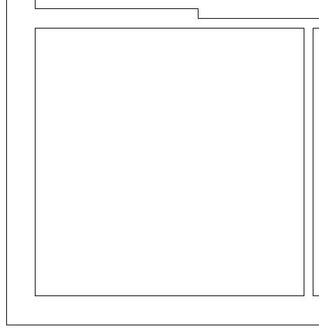
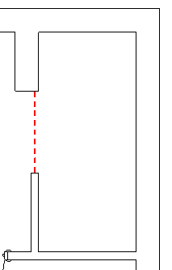
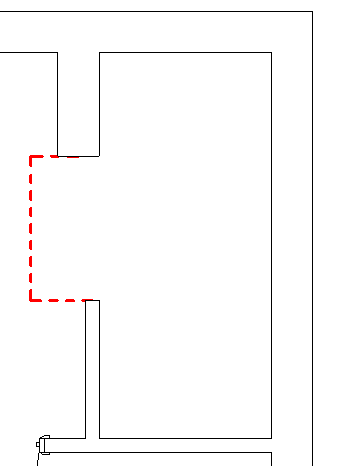
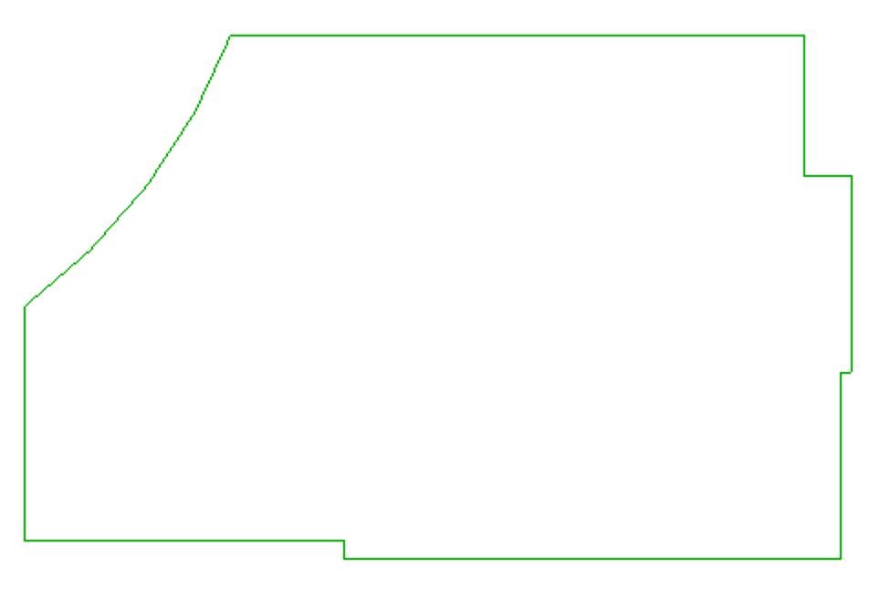

<head>
<meta http-equiv="Content-Type" content="text/html; charset=utf-8">
<link rel="stylesheet" type="text/css" href="bc.css">

</head>

<!---

- https://autodesk.slack.com/archives/C0SR6NAP8/p1576232650000100?thread_ts=1576185616.111700&cid=C0SR6NAP8

- Room boundary polygons
  https://forums.autodesk.com/t5/revit-api-forum/room-boundary-polygons/m-p/9157379
  CreateViaOffset to offset room boundary inwards or outwards
  https://forums.autodesk.com/t5/revit-api-forum/createviaoffset/m-p/9159500
  CreateViaOffset(CurveLoop original,IList<double> offsetDists,XYZ normal)
  https://forums.autodesk.com/t5/revit-api-forum/createviaoffset-curveloop-original-ilist-lt-double-gt/m-p/9196659  

twitter:

 in the #RevitAPI #DynamoBim @AutodeskForge @AutodeskRevit #bim #ForgeDevCon 

&ndash; 
...

linkedin:

#bim #DynamoBim #ForgeDevCon #Revit #API #IFC #SDK #AI #VisualStudio #Autodesk #AEC #adsk

the [Revit API discussion forum](http://forums.autodesk.com/t5/revit-api-forum/bd-p/160) thread

-->

### Dashboards and CreateViaOffset

#### Extracting Data for Project Dashboard

**Question:**

We are having a few discussions with an engineering firm who are investigating whether or not some parts of their project management procedures can be automated. Today they provide an overview using PowerBI on project progression by combining data from financials, project controlling (hours, job packages etc.) and the likes. However, progress on the content and completion of design tasks is done manually with input  from the project manager, making it difficult to track progress directly.
 
The assumption is that many of their graphic files such as .dwg contains data that describes how many documents that have been created or how many tasks have been completed. If they are able to extract these data somehow it could be build into some tool that could provide a overview. 
 
Let’s imagine they are preparing a renovation of a building and they know they have to complete a set number of PI diagrams, as part of the overall design, if they can easily extract this information from the .dwg files they are able to add this to the PowerBi datasets to be included in the overall reporting.
 
Today many projects are running smoothly due to experienced project leaders. They would like to create smooth systems to support the process as well as mitigate the risk of being able to attract senior or skilled enough people to handle the project.
 
Me and my colleagues have tried to investigate whether or not information/lists/drawing overviews from Revit and AutoCad can be exported into something like .csv .xlsx or similar user/human friendly format. Until now we have not been able to answer the questions. We have talked with 3 different people from AutoDesk chat support and read several of your blog post answers.
 
Could you somehow simplify this for me? Is it at all possible to generally export overview of the content of a dwg file in a simple format readable for other applications?
 
**Answer:**

I am not currently very involved with AutoCAD and DWG development, more with Revit RVT.
 
It is certainly both possible and easy to extract all the data you can possibly want from both of them.
 
You can do that using AutoCAD and Revit add-ins making use of the desktop .NET APIs.
 
If you are making use of any cloud-based workflows and storage, you can also do so online in the web, e.g., making use of the Forge APIs.
 
In fact, several people have already done so to create a number of different so-called dashboards that implement exactly what you are asking for.
 
Here are two in-depth demonstrations of such technology from Autodesk University 2018, a year ago:
 
Using Forge to Revolutionize Coordinated Project Information
https://www.autodesk.com/autodesk-university/class/Using-Forge-Revolutionize-Coordinated-Project-Information-2018

How to Use Forge and BIM 360 to Get Insight and Improve the BIM Management of Your Project
https://www.autodesk.com/autodesk-university/class/How-Use-Forge-and-BIM-360-Get-Insight-and-Improve-BIM-Management-Your-Project-2018
 
By the way, the latter also mentions PowerBI.
 
These are just two random hits that popped up in my first quick Internet search
for [autodesk forge project overview](https://duckduckgo.com/?q=autodesk+forge+project+overview).

Maybe you should try it yourself with 'dashboard' and other such terms.

There are probably much more advanced samples available today, a year later.

Here is a [link to view all Forge samples](https://forge.autodesk.com/categories/code-samples).

You might also want to search for 'dashboard' on the Forge blog site using the Google search
string [dashboard site:forge.autodesk.com/blog](https://www.google.com/search?q=dashboard+site%3Aforge.autodesk.com%2Fblog).

#### Specifying a List of Offsets to CreateViaOffset

Stephen Harrison has been valiantly and persistantly working on a solution to crop views to rooms, as discussed in
the [Revit API discussion forum](http://forums.autodesk.com/t5/revit-api-forum/bd-p/160) threads
on [room boundary polygons](https://forums.autodesk.com/t5/revit-api-forum/room-boundary-polygons/m-p/9157379),
[CreateViaOffset to offset room boundary inwards or outwards](https://forums.autodesk.com/t5/revit-api-forum/createviaoffset/m-p/9159500) and
[CreateViaOffset taking a list of offset distances](https://forums.autodesk.com/t5/revit-api-forum/createviaoffset-curveloop-original-ilist-lt-double-gt/m-p/9196659).

I set up
the [CropViewToRoom GitHub repository](https://github.com/jeremytammik/CropViewToRoom) to
play around with vartious approaches.

I now received some useful guidance from the development on the latest question in this series:

**Question:** I have raised a previous post regarding generating views from rooms but feel that has probably run its course.

The problem I now face is how to follow the outer face of the wall where the wall changes thickness over its length and when room separators are utilised.

When the walls step back like this, there is an error “Curve loop couldn't be properly trimmed”:

 <!--458-->

Walls with differing thicknesses

Regarding room separators, another problem occurs with a separator like this, Error “Curve loop couldn't be properly trimmed”:

 <!--213-->

Walls with room separator

There have been no errors so far in situations like this:

 <!--342-->

Walls with room separator

I am working in C# with Revit 2020 and utilising the following to create the offset:

<pre>
  CreateViaOffset(
    CurveLoop original,
    IList&lt;double&gt; offsetDists,
    XYZ normal)
</pre>

`offsetDists` is set to the thicknesses of the surrounding walls plus a standard set offset for the room separator.

**Answer:** I integrated and cleaned up your code
in [CropViewToRoom release 2020.0.0.2](https://github.com/jeremytammik/CropViewToRoom/releases/tag/2020.0.0.2) for
further analysis.

I have not solved it yet, but at least uncovered one definite problem.

In the room separator model, the curve loop that you assemble has 11 elements, whereas the wall thickness list only has 10. That obviously causes a problem.

I implemented a new method `CreateModelCurves` that creates a set of model curves to display the curve loop:

<pre class="code">
  void&nbsp;CreateModelCurves(
  &nbsp;&nbsp;View&nbsp;view,
  &nbsp;&nbsp;CurveLoop&nbsp;loop&nbsp;)
  {
  &nbsp;&nbsp;Document&nbsp;doc&nbsp;=&nbsp;view.Document;
  &nbsp;&nbsp;SketchPlane&nbsp;sp&nbsp;=&nbsp;view.SketchPlane;
   
  &nbsp;&nbsp;foreach(&nbsp;Curve&nbsp;curve&nbsp;in&nbsp;loop&nbsp;)
  &nbsp;&nbsp;{
  &nbsp;&nbsp;&nbsp;&nbsp;doc.Create.NewModelCurve(&nbsp;curve,&nbsp;sp&nbsp;);
  &nbsp;&nbsp;}
  }
</pre>

The result for the room separator model looks like this:

 <!--964-->

Room separator boundary model curve loop

I leave it up to you to figure out where that extra segment is coming from, what it represents, and how to deal with the wall thickness for that one.

Maybe that will help sort out the other issue as well.

I also reproduced the exception you mentioned creating the offset loop for the wall thickness sample model RVT.

I sent the following question to the development team for a usage example of the method to see what we might be doing wrong.

I am having trouble using
the [CreateViaOffset method taking a list of doubles for different offsets](https://www.revitapidocs.com/2020/3097f423-9b0e-5496-bae2-3a82b6875414.htm):

Can you provide a simple sample showing how to use this method?

I tested it passing in five curves representing the following five walls:

 <!--846-->

Rectangular room with five walls

Starting with the bottom horizontal wall and moving counterclockwise to the right, top two and left, I pass in five straight line segment curves and curves and the corresponding five offset distances:

</pre>
  5 curves with lengths 9.19,9.51,3.61,5.58,9.51
  and 5 thicknesses 1.08,.43,.43,.76,1.08
</pre>

This call throws an `Autodesk.Revit.Exceptions.InvalidOperationException` saying 'Curve loop couldn't be properly trimmed.'

**Answer from the development team:** 
In the customer's example, it looks like one of the walls is split in two and meet in the middle.
Perhaps the curves he has are not colinear to start?
That, it would seem, could easily result in a disconnected loop.

This is a sample from our add-in code:

<pre class="code">
  //&nbsp;previously&nbsp;filled&nbsp;list&nbsp;with&nbsp;simple&nbsp;double&nbsp;
  //&nbsp;values&nbsp;that&nbsp;represent&nbsp;the&nbsp;distance&nbsp;to&nbsp;offset;&nbsp;
  //&nbsp;that&nbsp;distance&nbsp;is&nbsp;calculated&nbsp;as&nbsp;the&nbsp;length&nbsp;of&nbsp;
  //&nbsp;a&nbsp;segment&nbsp;that&nbsp;is&nbsp;perpendicular&nbsp;on&nbsp;the&nbsp;curve&nbsp;
  //&nbsp;to&nbsp;be&nbsp;offset
   
  List&lt;double&gt;&nbsp;offsetArray;
  IList&lt;Curve&gt;&nbsp;polyCurves&nbsp;=&nbsp;new&nbsp;List&lt;Curve&gt;();
   
  foreach(&nbsp;var&nbsp;curve&nbsp;in&nbsp;contour3D.curves&nbsp;)
  {
  &nbsp;&nbsp;polyCurves.Add(&nbsp;curve.asRevitCurve(&nbsp;
  &nbsp;&nbsp;&nbsp;&nbsp;doc.Application&nbsp;)&nbsp;);
  }
   
  if(&nbsp;polyCurves.none()&nbsp;)
  &nbsp;&nbsp;return&nbsp;false;
   
  CurveLoop&nbsp;curveLoop&nbsp;=&nbsp;CurveLoop.Create(
  &nbsp;&nbsp;polyCurves&nbsp;);
   
  if(&nbsp;curveLoop&nbsp;!=&nbsp;null&nbsp;)
  {
  &nbsp;&nbsp;XYZ&nbsp;normal&nbsp;=&nbsp;XYZ.BasisZ;
   
  &nbsp;&nbsp;if(&nbsp;curveLoop.HasPlane()&nbsp;)
  &nbsp;&nbsp;&nbsp;&nbsp;normal&nbsp;=&nbsp;curveLoop.GetPlane().Normal;
   
  &nbsp;&nbsp;curveLoop&nbsp;=&nbsp;CurveLoop.CreateViaOffset(&nbsp;
  &nbsp;&nbsp;&nbsp;&nbsp;curveLoop,&nbsp;offsetArray,&nbsp;normal&nbsp;);
   
  &nbsp;&nbsp;if(&nbsp;curveLoop&nbsp;!=&nbsp;null&nbsp;)
  &nbsp;&nbsp;{
  &nbsp;&nbsp;&nbsp;&nbsp;//&nbsp;do&nbsp;stuff&nbsp;with&nbsp;curve
  &nbsp;&nbsp;}
  }
</pre>

It's nothing special. BUT... 

I suspect the problem stems from the little vertical segment where the different width walls meet.
We had problems with this method treating small segments from a structural contour, so the code above is put in a big try/catch and if it fails, we go to another offset algorithm that is far worse in general but treats small segments/self-intersections slightly better (Revit's offset seems more skeptical to prolong segments when it's the case, and I couldn't find code for self-intersections).
L.E. Edited testing assumptions that are invalid since offset is positive, not negative.

I tested on our code the drawing provided as follows: the contour line is based on the exterior contour of the wall; the first curve in loop is the small one, contour being parsed clockwise; based on your/their code, the offset array is:

<pre>
  [0]	0.75616799999999995	double
  [1]	0.42808400000000002	double
  [2]	0.42808400000000002	double
  [3]	1.0842520000000000	double
  [4]	1.0842520000000000	double
  [5]	0.75616799999999995	double
</pre>

I tried both positive and negative offsets, and here is the result:

 <!--1044-->

Successful result

No exceptions, everything worked.

I still stand on my original assumption that it has to do with the small segment, depending on the epsilon set by the add-in; instead of using wall thickness + 0.1 (which is in imperial feet, if not converted), you may try with a fixed percentage based on the wall thickness instead, e.g., 5-10%? &ndash; that may reduce problems with peculiar situations like teeny weeny tiny segments after offset that can't be handled properly.

