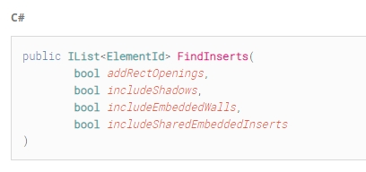
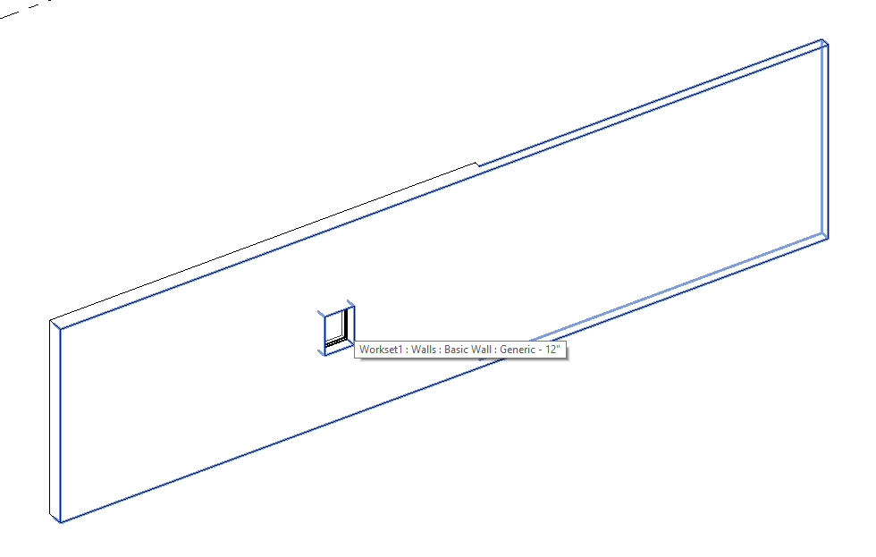
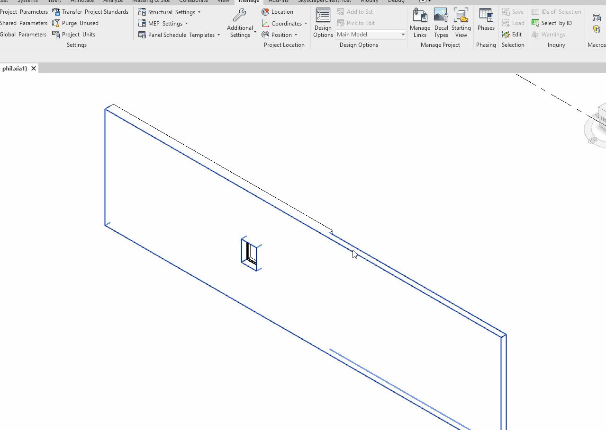

<head>
<meta http-equiv="Content-Type" content="text/html; charset=utf-8">
<link rel="stylesheet" type="text/css" href="bc.css">
<script src="https://cdn.rawgit.com/google/code-prettify/master/loader/run_prettify.js" type="text/javascript"></script>
<script async src="https://platform.twitter.com/widgets.js" charset="utf-8"></script>
</head>

<!---

- Thank you for registering/attending for Design Automation for Revit on Forge.
  You can view the recording at: https://youtu.be/PkdBM0cFrN4

- da4r ifc support
  [Q] In Revit Design Automation, is import IFC and Export IFC available? Customer Volker Wessels also uses Tekla and LargeIFC models (1GB) for Concrete pre-construction. importing these IFC models take a long time and Volker Wessels is looking at Design Automation to speed this up.
  [A] Yes, Design Automation for Revit supports IFC.
  Revit 2018 supports Open IFC and Export IFC functionality.
  Revit 2019-2020 supports Open IFC , Export IFC and Link IFC functionality.
  https://forge.autodesk.com/en/docs/design-automation/v3/tutorials/revit/step7-post-workitem/ (bottom of the page)

- FindInserts what does includeShadows flag do?
  https://forums.autodesk.com/t5/revit-api-forum/findinserts-what-does-includeshadows-flag-do/m-p/9206586

- https://forums.autodesk.com/t5/revit-api-forum/easiest-solution-to-deploy-addin-in-offcie/td-p/9191933

- Always show the same button on SplitButton
  https://forums.autodesk.com/t5/revit-api-forum/always-show-the-same-button-on-splitbutton/m-p/9206967
  SplitButton.IsSynchronizedWithCurrentItem property
  https://www.revitapidocs.com/2020/0691fcf0-aa3e-6f9e-7ca8-aaebe21bc6f7.htm
  Indicates whether the top PushButton on the SplitButton changes based on the CurrentButton property.
  If this property is true the SplitButton uses the current PushButton's properties to display the image, text, tooltip, etc. and executes the current item when clicked. If it is false the first listed PushButton in the GetItems() return is shown, and executes this PushButton when clicked. If it is false the items in drop down list can only be executed by opening the drop down list and clicking an item in the list. The default value is true.

- 16057481 [Always show the same button on SplitButton]
  https://forums.autodesk.com/t5/revit-api-forum/always-show-the-same-button-on-splitbutton/m-p/9200837	

twitter:

DA4R recording, FindInserts shadows, add-in deployment and main SplitButton in the #RevitAPI #DynamoBim @AutodeskForge @AutodeskRevit #bim #ForgeDevCon http://bit.ly/shadowandsplit

So many interesting things going on in the Revit API discussion forum.
Also, the newest DA4R recording is now available online
&ndash; Forge Design Automation API for Revit recording
&ndash; Design Automation for Revit supports IFC
&ndash; What does the <code>FindInserts</code> <code>includeShadows</code> flag do?
&ndash; Easiest solution to deploy add-in
&ndash; Always show the same button in <code>SplitButton</code>...

linkedin:

DA4R recording, FindInserts shadows, add-in deployment and main SplitButton in the #RevitAPI

http://bit.ly/shadowandsplit

So many interesting things going on in the Revit API discussion forum.

Also, the newest DA4R recording is now available online:

- Forge Design Automation API for Revit recording
- Design Automation for Revit supports IFC
- What does the <code>FindInserts</code> <code>includeShadows</code> flag do?
- Easiest solution to deploy add-in
- Always show the same button in <code>SplitButton</code>...

#bim #DynamoBim #ForgeDevCon #Revit #API #IFC #SDK #AI #VisualStudio #Autodesk #AEC #adsk

the [Revit API discussion forum](http://forums.autodesk.com/t5/revit-api-forum/bd-p/160) thread

<p style="font-size: 80%; font-style:italic"></p>

-->

### DA4R, FindInserts, Deployment and SplitButton

As usual, I am all too busy on the Revit API discussion forum.
So many interesting things going on there.
Also, the newest DA4R recording is now available online:

- [Forge Design Automation API for Revit recording](#2)
- [Design Automation for Revit supports IFC](#3)
- [What does the `FindInserts` `includeShadows` flag do?](#4)
- [Easiest solution to deploy add-in](#5)
- [Always show the same button in `SplitButton`](#6)

####<a name="2"></a> Forge Design Automation API for Revit Recording

Sasha Crotty, Senior Product Manager, Revit Platform & Services, gives a 77-minute overview and demos of
the [Design Automation API for Revit on Forge](https://youtu.be/PkdBM0cFrN4):

<center>
<iframe width="480" height="270" src="https://www.youtube.com/embed/PkdBM0cFrN4" frameborder="0" allow="accelerometer; autoplay; encrypted-media; gyroscope; picture-in-picture" allowfullscreen></iframe>
</center>

To learn more on this topic, visit 
the [Forge Design Automation API docs](https://forge.autodesk.com/en/docs/design-automation/v3/developers_guide/overview)
and [The Building Coder DA4R topic group](https://thebuildingcoder.typepad.com/blog/about-the-author.html#5.55).


####<a name="3"></a> Design Automation for Revit Supports IFC

As we already mentioned briefly last month,
[DA4R now supports both FBX and IFC](https://thebuildingcoder.typepad.com/blog/2019/11/curve-projection-add-in-videos-da4r-detach-and-fbx.html#2).
Once again:

**Question:** Does Revit Design Automation support IFC import and export?

We also use Tekla and LargeIFC models (1GB) for concrete pre-construction.
Importing these IFC models takes a long time, and we are looking at Design Automation to speed this up.

**Answer:** Yes, Design Automation for Revit supports IFC.

Revit 2018 supports Open IFC and Export IFC functionality.

Revit 2019-2020 supports Open IFC, Export IFC and Link IFC functionality.
  
You can check it out for yourself in
the [design automation tutorial task 7, submit a workitem](https://forge.autodesk.com/en/docs/design-automation/v3/tutorials/revit/step7-post-workitem),
towards the bottom of the page.

####<a name="4"></a> What Does the FindInserts IncludeShadows Flag Do?

A quick clarification prompted by
the [Revit API discussion forum](http://forums.autodesk.com/t5/revit-api-forum/bd-p/160) thread
on [FindInserts and what does includeShadows flag do](https://forums.autodesk.com/t5/revit-api-forum/findinserts-what-does-includeshadows-flag-do/m-p/9206586):

**Question:** Curious what does the `includeShadows` flag do in THE `FindInserts` method of the `HostObject` class.

<center>
 <!--408-->
</center>

The documentation says "True if shadows should be included in the return." But this doesn't make any sense to me.

Could anyone possibly shine some light on this?

**Answer:** Good question. I see two more of the same in
the [revitapidocs page on FindInserts](https://www.revitapidocs.com/2020/58990230-38cb-3af7-fd25-96ed3215a43d.htm).

- Albano Gheller (8 months ago): What are shadows and shared embedded?
- Александр Пекшев (2 years ago): what is Shadows??

I asked the development team and they replied:

An internal `WallShadowCutoutGStep` is created when 2 walls are joined, e.g., by Modify &rarr; Geometry &rarr; Join, and then a window is placed on one wall.

In that case, Revit will cut an opening on the other joined wall, as you can see in this picture:

<center>
 <!--980-->
</center>

For this API &ndash; `FindInserts`, here is
a [short demo recording](https://thebuildingcoder.typepad.com/files/findinserts_include_shadow.gif) &ndash;
i try to find the inserts on the joined wall but not the wall with the window:

<center>
 <!--1279-->
</center>

The window instance  with element id 354965 is returned if `includeShadows` is true, and nothing returned for false.

Many thanks to Phil Xia for this detailed explanation!

**Response:** Thank you for bringing light into the shadow &nbsp; :-)

Makes much sense now.
 
####<a name="4.1"></a> Addendum &ndash; Meaning of includeSharedEmbeddedInserts

**Question:** What's the meaning of the fourth argument, `includeSharedEmbeddedInserts`?

I tried to create window, door, embeded walls, curtain walls, but couldn't find its effect on models.

**Answer:** From the code, it looks as if `includeSharedEmbededInserts` finds the inserts whose host is a `HostObj` that is embedded in the current wall.

For instance, given a wall A with an embedded wall B, a door instance D hosted by B will be found in A if `includeSharedEmbededInsertsz is set.

<!---
Here is an example: In this model (see attached below), the wall (id=143992) has a wall (id=141718) embeded, and the door instance (id=226688) on it will be found by 

Shengxi Zhang  3 days ago
Attached a model with a macro in it.
Binary 
findInsertsSample.rvt
5 MB Binary— Click to download

/a/rvt/embedded_wall_instance.rvt

```
    [Window Title]
    Revit
    
    [Main Instruction]
    The file embedded_wall_instance.rvt was saved in a later version of Revit and cannot be retrieved in this version.
    
    [Close]
```
--->

####<a name="5"></a> Easiest Solution to Deploy Add-In

A simple deployment of Revit add-ins is sought in
the [Revit API discussion forum](http://forums.autodesk.com/t5/revit-api-forum/bd-p/160) thread
on [easiest solution to deploy add-in in office](https://forums.autodesk.com/t5/revit-api-forum/easiest-solution-to-deploy-addin-in-offcie/td-p/9191933):

**Question:** I'm kind of new to this whole API but I have prepared some small codes to be used throughout office.

I know this question has been asked previously but I didn't see any easy solution.
I just want to ask if there is an easy way to push an add-in to the other users at my office.
Considering possible updates that might need to be implemented later, is it better to have them on network?

Could it be easier to change the code for a macro and push that to individual projects or each user's Revit?

How are you deploying them in your office?

We have a small office size with around 12 Revit users.

So, I have 10+ machines, each with 3 versions of Revit, and the fact that I don't want to copy files for each of them manually.
I don't know in the long run how I will be able to update the code for these machines ,and I can't rely on individuals to do it themselves.
This part is important, since I'm not a professional coder.


**Answer:** All you need to deploy an add-in is to copy the add-in manifest `.ADDIN` file and the .NET assembly `.DLL` to a specific location on the target machine.

To deploy a macro, all you need is to copy an `RVT`. For an application macro, I imagine it would be a handful of files.

You could also consider deploying your code as a Dynamo package or
a [RevitPythonShell script](https://github.com/architecture-building-systems/revitpythonshell).

The RevitPythonShell installer is available as source code and demonstrates how you can deploy an add-in to any machine with a single click.

**Response:** Macro seems a good idea if I can import them into our template file or just open each ongoing project and copy it in the project.
Still, I will need to rewrite the add-in code for macro.

Dynamo would be great! But I'm writing code in C# as add-in.
Is there an easy way to convert them to Dynamo nodes?
As I have heard, there are some differences between code for Dynamo node and add-in.

**Answer:** I'm facing the same problem as you.
As said, you need to copy compiled files (.dll, .addin and maybe .pbd) to the target machine.

I found a fairly easy way to achieve this using a batch file. It copies these file from a server to user's Revit addin directory:

<pre class="prettyprint">
@echo off
rem --------------------------------------------COPY FILE TO TARGET MACHINE-------------------------------------------
rem /i option is needed to avoid the batch file asking you whether destination folder is a file or a folder
rem /e option is needed to copy also all folders and subfolders
rem /y option is needed to overwrite existing files without prompt 
if not exist "%USERPROFILE%\AppData\Roaming\Autodesk\Revit\Addins\2019\" mkdir "%USERPROFILE%\AppData\Roaming\Autodesk\Revit\Addins\2019\"
DEL /F/Q/S "%USERPROFILE%\AppData\Roaming\Autodesk\Revit\Addins\2019\" > NUl   
xcopy "YOUR ADDIN DIRECTORY" "%USERPROFILE%\AppData\Roaming\Autodesk\Revit\Addins\2019" /i /e /y
pause

del %SCRIPT%
</pre>

In my case, it does require the individual user to click on the batch file to download/update, but I reckon you could modify the code so that it copies to everyone's machine by one click from you.
 
**Response:** I am also interested in this.

What I have done in my office is to put the .dll in a read-only location in the server and I created a BATCH file to copy the .addin to each person's computer.
This way, I just need to go to their computer and click on the BATCH file.
And if I want to make changes to the tools, I just have to overwrite the .dll in the server and everybody gets the update.

However, I am not sure if this a good practice as many people are reading the same dll.

**Answer:** Why not also copy the .dll file?
I copy my .addin and .dll files from a location on our server to all BIM modellers' workstations using Group Policy, so I know that everyone will get an updated version if I just change the file on the server.

**Response:** That is, in fact, a good idea.
When I started my strategy I was new in the office and didn't know about the group policy.

I will have a chat with the IT managers and ask them to do this.

Thanks!


####<a name="6"></a> Always Show the same Button in SplitButton

Rikard Nilsson, Solution Architect at [Cadcraft](https://www.cadcraft.com), read the manuals more carefully than I did and suggests a much simpler and better solution in his thread on how
to [always show the same button on `SplitButton`](https://forums.autodesk.com/t5/revit-api-forum/always-show-the-same-button-on-splitbutton/m-p/9206967):

**Question:** I created some buttons and placed them inside a `SplitButton`.

The problem I have is that I want have the same effect that Revit has in their buttons.

I want to show the same button always, even if I choose one further down in a `SplitButton`.

When I choose a button below in `mySplitButton`, it will always become the new default that shows on the `SplitButton`.

**Answer:** That is easy to achieve.

I show you how in my [HoloLens Escape Path Waypoint JSON Exporter](https://thebuildingcoder.typepad.com/blog/2016/09/hololens-escape-path-waypoint-json-exporter.html).

The add-in displays the following ribbon panel:

<center>
 <!--378-->
</center>

You can either click the main button, which is always displayed at the top as the current option, to trigger the main command, or drop down the rest of the stacked button contents to display the option button:

<center>
 <!--139-->
</center>

You can grab the entire Visual Studio solution and project from
the [ExportWaypointsJson GitHub repository](https://github.com/jeremytammik/ExportWaypointsJson).

**Response:** This was my simple solution, using
the [SplitButton.IsSynchronizedWithCurrentItem property](https://www.revitapidocs.com/2020/0691fcf0-aa3e-6f9e-7ca8-aaebe21bc6f7.htm):

> Indicates whether the top PushButton on the SplitButton changes based on the CurrentButton property.

> If this property is true the SplitButton uses the current PushButton's properties to display the image, text, tooltip, etc. and executes the current item when clicked. If it is false the first listed PushButton in the GetItems() return is shown, and executes this PushButton when clicked. If it is false the items in drop down list can only be executed by opening the drop down list and clicking an item in the list. The default value is true.

<pre class="code">
  splitButtonClearLoads.IsSynchronizedWithCurrentItem = false;
</pre>

Many thanks to Rikard for pointing out this obvious solution, and happy advent to all!

