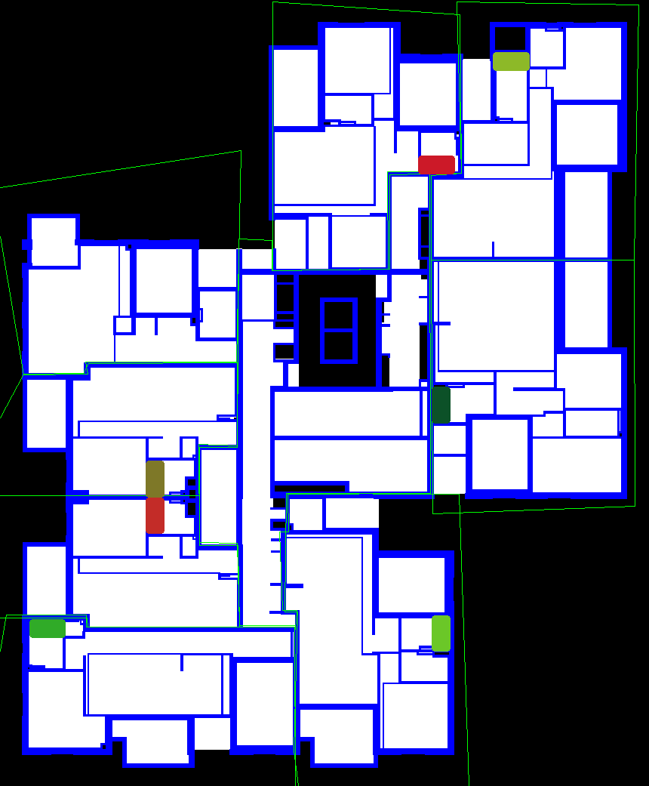
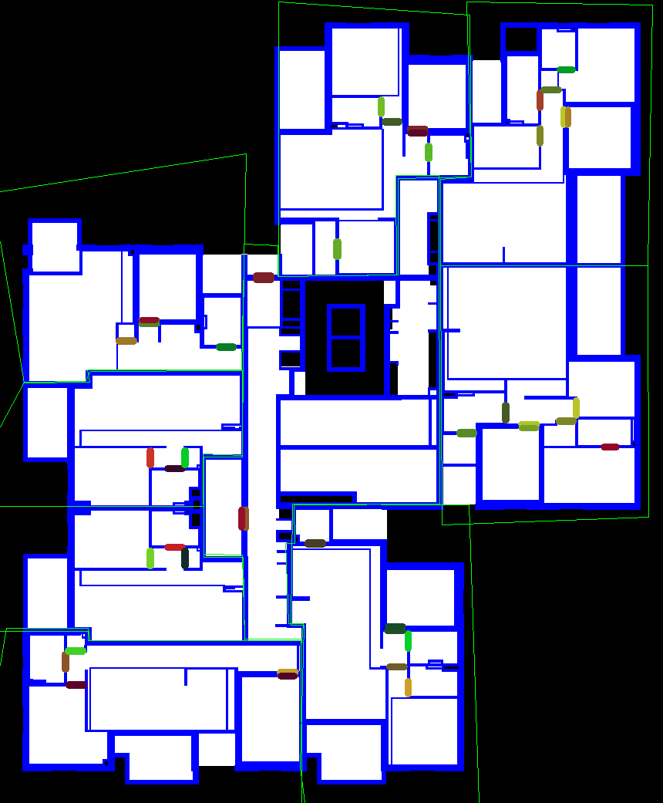
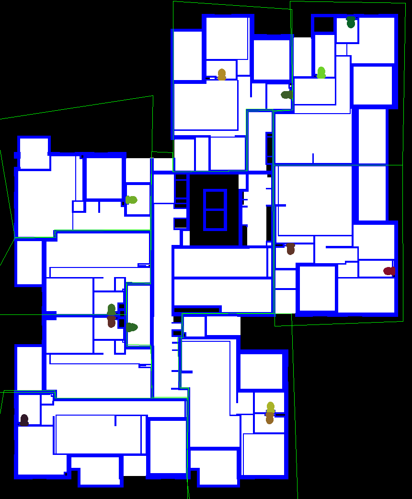
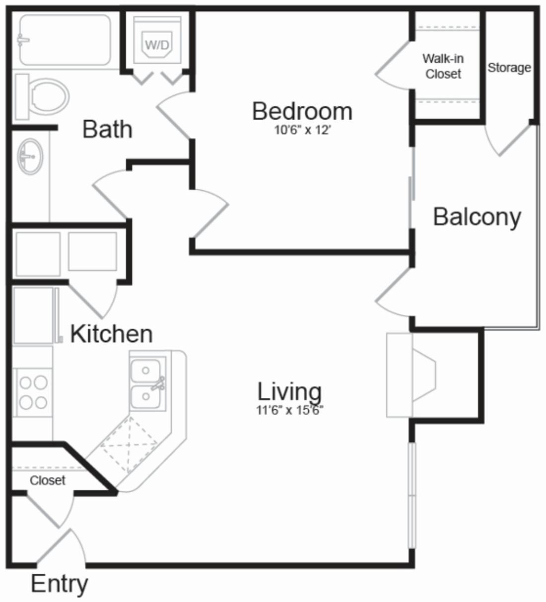
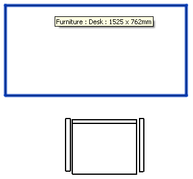
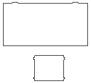
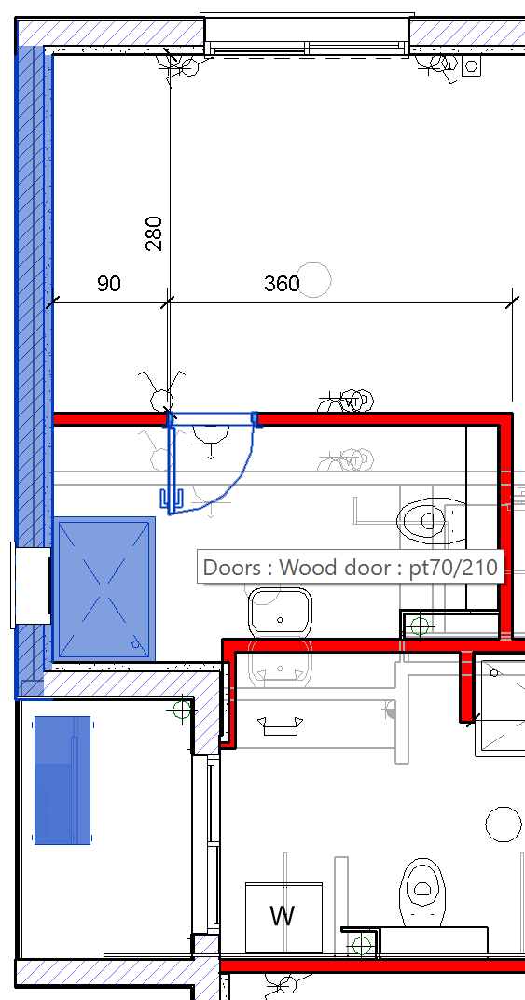
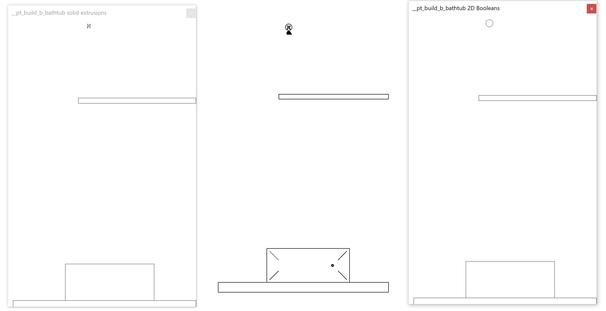
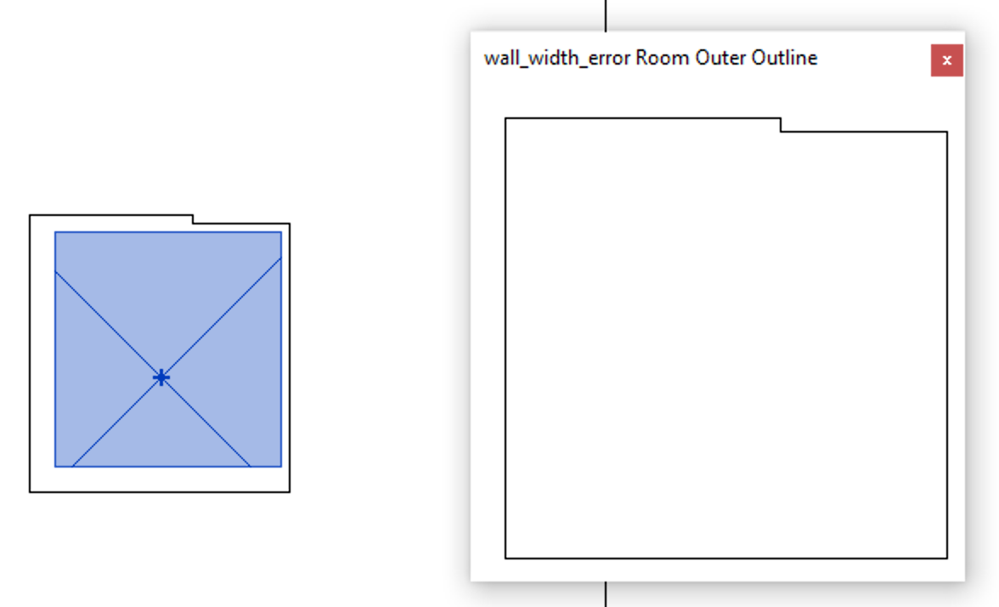
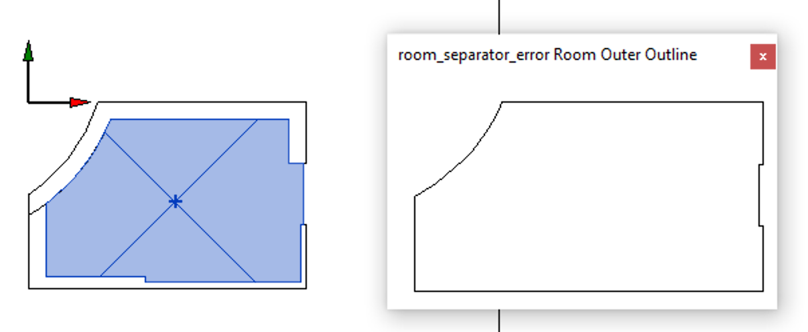

<head>
<meta http-equiv="Content-Type" content="text/html; charset=utf-8">
<link rel="stylesheet" type="text/css" href="bc.css">

</head>

<!---

twitter:

Happy New Year to the Revit add-in developer community! 

Determine 2D plan view outer boundary of a room in XY including all bounding element geometry, ExtrusionAnalyzer versus Clipper 2D Booleans for birds-eye element view polygons in the #RevitAPI #DynamoBim @AutodeskForge @AutodeskRevit #bim #ForgeDevCon http://bit.ly/elementoutline

Happy New Year to the Revit add-in developer community!
My main holiday project was the implementation of an external command to determine the 2D plan view outer boundary of a room in the XY plane, including all its bounding elements' geometry
&ndash; How to generate a 2D polygon representing the birds-eye view of an element
&ndash; <code>CmdExtrusionAnalyzer</code> element outline using <code>ExtrusionAnalyzer</code>
&ndash; <code>Cmd2dBoolean</code> element outline using 2D Booleans
&ndash; <code>CmdRoomOuterOutline</code> outer room outline using 2D Booleans...

linkedin:

Happy New Year to the Revit add-in developer community! 

Determine 2D plan view outer boundary of a room in XY  including all bounding element geometry.

ExtrusionAnalyzer versus Clipper 2D Booleans for birds-eye element view polygons in the #RevitAPI

http://bit.ly/elementoutline

My main holiday project was the implementation of an external command to determine the 2D plan view outer boundary of a room in the XY plane, including all its bounding elements' geometry

- How to generate a 2D polygon representing the birds-eye view of an element
- CmdExtrusionAnalyzer element outline using ExtrusionAnalyzer
- Cmd2dBoolean element outline using 2D Booleans
- CmdRoomOuterOutline outer room outline using 2D Booleans...

#bim #DynamoBim #ForgeDevCon #Revit #API #IFC #SDK #AI #VisualStudio #Autodesk #AEC #adsk

the [Revit API discussion forum](http://forums.autodesk.com/t5/revit-api-forum/bd-p/160) thread

-->

### Extrusion Analyser and 2D Boolean Element Outline

Happy New Year to the Revit add-in developer community!

My main holiday project was the addition of a new external command `CmdRoomOuterOutline` to
the [ElementOutline add-in](https://github.com/jeremytammik/ElementOutline).

`CmdRoomOuterOutline` determines the 2D plan view outer boundary of a room in the XY plane, including all its bounding elements' geometry.

The idea for this was prompted by
the [Revit API discussion forum](http://forums.autodesk.com/t5/revit-api-forum/bd-p/160) threads
on [room boundary polygons](https://forums.autodesk.com/t5/revit-api-forum/room-boundary-polygons/m-p/9157379),
[CreateViaOffset to offset room boundary inwards or outwards](https://forums.autodesk.com/t5/revit-api-forum/createviaoffset/m-p/9159500) and
[CreateViaOffset taking a list of offset distances](https://forums.autodesk.com/t5/revit-api-forum/createviaoffset-curveloop-original-ilist-lt-double-gt/m-p/9196659).

Before we get to the new command, though, let's discuss some other more basic aspects and functionality of this add-in:

- [Task &ndash; 2D polygon representing birds-eye view of an element](#2)
- [CmdExtrusionAnalyzer](#3)
- [Alternative approaches to determine 2D element outline](#4)
- [Cmd2dBoolean](#5)
- [CmdRoomOuterOutline](#6)

The add-in implements three external commands:

- [CmdExtrusionAnalyzer](#3) &ndash; generate element outline using `ExtrusionAnalyzer`
- [Cmd2dBoolean](#5) &ndash; generate element outline using 2D Booleans
- [CmdRoomOuterOutline](#6) &ndash; outer room outline using 2D Booleans

All three generate element outlines of various types in various ways.

The first uses the Revit API and 
the [`ExtrusionAnalyzer` class](https://www.revitapidocs.com/2020/ba9e3283-6868-8834-e8bf-2ea9e7358930.htm).

The other two make use of
the [Clipper integer coordinate based 2D Boolean operations library](http://angusj.com/delphi/clipper.php).

The add-in also implements a bunch of utilities for converting Revit coordinates to 2D data in millimetre units and displaying the resulting element outlines in a Windows form.

#### Task &ndash; 2D Polygon Representing Birds-Eye View of an Element

The goal is to export the 2D outlines of Revit `Element` instances, i.e., for each element, associate its element id or unique id with the list of X,Y coordinates describing a polygon representing the visual birds-eye view look of its outline.

Additional requirements:

- Address family instances as well as elements that might be built as part of the construction, including wall, floor, railing, ceiling, mechanical duct, panel, plumbing pipe.
- Generate a separate outline in place for each element, directly in its appropriate location and orientation.
- Output the result in a simple text file.

There is no need for a rendered view, just coordinates defining a 2D polygon around the element.

The goal is: given an element id, retrieve a list of X,Y coordinates describing the birds-eye view look of an element.

<!--
For instance, here are three sample images highlighting the bathtubs, doors and toilets, respectively, in a given floor of a building:

Bathtubs:

Doors:

Toilets:

-->

For instance, here is an apartment layout showing a birdseye view of bathtubs, doors, toilets and other accessories:

 <!-- 1100 -->

In end effect, we generate a dictionary mapping an element id or unique id to a list of space delimited pairs of X Y vertex coordinates in millimetres.

#### CmdExtrusionAnalyzer

This code was originally implemented as part of (and later extracted from)
the [RoomEditorApp project](https://github.com/jeremytammik/RoomEditorApp).

The approach implemented for the room editor is not based on the 2D view, but on the element geometry solids in the 3D view and the result of applying
the [`ExtrusionAnalyzer` class](https://www.revitapidocs.com/2020/ba9e3283-6868-8834-e8bf-2ea9e7358930.htm) to them,
creating a vertical projection of the 3D element shape onto the 2D XY plane.
This approach is described in detail in the discussion on
the [extrusion analyser and plan view boundaries](https://thebuildingcoder.typepad.com/blog/2013/04/extrusion-analyser-and-plan-view-boundaries.html).

The [GeoSnoop .NET boundary curve loop visualisation](https://thebuildingcoder.typepad.com/blog/2013/04/geosnoop-net-boundary-curve-loop-visualisation.html) provides
some example images of the resulting outlines.

As you can see there, the outline generated is more precise and detailed than the standard 2D Revit representation.

The standard plan view of the default desk and chair components look like this in Revit:

The loops exported by the RoomEditorApp add-in for the same desk and chair look like this instead:

E.g., for the desk, you notice the little bulges for the desk drawer handles sticking out a little bit beyond the desktop surface.

For the chair, the arm rests are missing, because the solids used to model them do not make it through the extrusion analyser, or maybe because the code ignores multiple disjunct loops.

Here is a sample model with four elements highlighted in blue:

For them, the CmdExtrusionAnalyzer command generates the following JSON file defining their outline polygon in SVG format:

<pre>
{"name":"pt2+20+7", "id":"576786", "uid":"bc43ed2e-7e23-4f0e-9588-ab3c43f3d388-0008cd12", "svg_path":"M-56862 -9150 L-56572 -9150 -56572 -14186 -56862 -14186Z"}
{"name":"pt70/210", "id":"576925", "uid":"bc43ed2e-7e23-4f0e-9588-ab3c43f3d388-0008cd9d", "svg_path":"M-55672 -11390 L-55672 -11290 -55656 -11290 -55656 -11278 -55087 -11278 -55087 -11270 -55076 -11270 -55076 -11242 -55182 -11242 -55182 -11214 -55048 -11214 -55048 -11270 -55037 -11270 -55037 -11278 -54988 -11278 -54988 -11290 -54972 -11290 -54972 -11390Z"}
{"name":"pt80/115", "id":"576949", "uid":"bc43ed2e-7e23-4f0e-9588-ab3c43f3d388-0008cdb5", "svg_path":"M-56572 -10580 L-56572 -9430 -55772 -9430 -55772 -10580Z"}
{"name":"מנוע מזגן מפוצל", "id":"576972", "uid":"bc43ed2e-7e23-4f0e-9588-ab3c43f3d388-0008cdcc", "svg_path":"M-56753 -8031 L-56713 -8031 -56713 -8018 -56276 -8018 -56276 -8031 -56265 -8031 -56265 -8109 -56276 -8109 -56276 -8911 -56252 -8911 -56252 -8989 -56276 -8989 -56276 -9020 -56277 -9020 -56278 -9020 -56711 -9020 -56713 -9020 -56713 -8989 -56753 -8989 -56753 -8911 -56713 -8911 -56713 -8109 -56753 -8109Z"}
</pre>

`M`, `L` and `Z` stand for `moveto`, `lineto` and `close`, respectively. Repetitions of `L` can be omitted. Nice and succinct.

However, the extrusion analyser approach obviously fails for all elements that do not define any solids, e.g., 2D elements represented only by curves and meshes.

Hence the continued research to find an alternative approach and the implementation of `Cmd2dBoolean` described below making use of the Clipper library and 2D Booleans instead.

In July 2019, I checked with the development team and asked whether they could suggest a better way to retrieve the 2D outline of an element.

They responded that my `ExtrusionAnalyzer` approach seems like the best (and maybe only) way to achieve this right now.

Considering Cmd2dBoolean, I might add the caveat 'using the Revit API' to the last statement.

#### Alternative Approaches to Determine 2D Element Outline

The `ExtrusionAnalyzer` approach based on element solids does not successfully address the task of generating the 2D birds-eye view outline for all Revit elements.

I therefore explored other avenues.

Concave hull: 

- http://ubicomp.algoritmi.uminho.pt/local/concavehull.html
- https://towardsdatascience.com/the-concave-hull-c649795c0f0f
- https://github.com/kubkon/powercrust
- https://adared.ch/concaveman-cpp-a-very-fast-2d-concave-hull-maybe-even-faster-with-c-and-python/
- https://www.codeproject.com/Articles/1201438/The-Concave-Hull-of-a-Set-of-Points
- http://www.cs.ubc.ca/research/flann/
  
2D outline:

- https://github.com/eppz/Unity.Library.eppz.Geometry
- https://github.com/eppz/Clipper
- https://github.com/eppz/Triangle.NET
- https://en.wikipedia.org/wiki/Sweep_line_algorithm
- https://stackoverflow.com/questions/4213117/the-generalization-of-bentley-ottmann-algorithm
- https://ggolikov.github.io/bentley-ottman/
- Joining unordered line segments &ndash; https://stackoverflow.com/questions/1436091/joining-unordered-line-segments
- http://www3.cs.stonybrook.edu/~algorith/implement/sweep/implement.shtml
- https://github.com/mikhaildubov/Computational-geometry/blob/master/2)%20Any%20segments%20intersection/src/ru/dubov/anysegmentsintersect/SegmentsIntersect.java
- https://github.com/jeremytammik/wykobi/blob/master/wykobi_naive_group_intersections.inl

Alpha shape:

- https://en.wikipedia.org/wiki/Alpha_shape
- https://pypi.org/project/alphashape/
- https://alphashape.readthedocs.io/

I determined that some elements have no solids, just meshes, hence the extrusion analyser approach cannot be used.

Looked at the [alpha shape implementation here](https://pypi.org/project/alphashape).

I worked on a 2D contour outline following algorithm, but it turned out quite complex.

I had another idea for a much simpler approach using 2D Boolean operations, uniting all the solid faces and mesh faces into one single 2D polygon set.

- Join all line segments into closed polygons
- Union all the polygons using Clipper

That seems to return robust results.

#### Cmd2dBoolean

I completed a new poly2d implementation using 2D Booleans instead of the solids and extrusion analyser.
I expect it is significantly faster.

The ElementOutline release 2020.0.0.10 exports outlines from both solids and 2D Booleans and generates identical results for both, so that is a good sign.

Maybe meshes and solids cover all requirements.
I am still experimenting and testing.
What is missing besides meshes and solids?

I tested successfully on an intercom element.
It is not a mesh, just a circle, represented by a full closed arc.
I implemented support to include circles as well as solids and meshes in the Boolean operation.

I also implemented a utility `GeoSnoop` to display the loops generated in a temporary Windows form.

Here is an image showing part of a sample Revit model in the middle including a wall, bathtub and intercom element and two GeoSnoop windows:

The left GeoSnoop window shows the outline loops retrieved from the solids using the extrusion analyser.
The right one shows the loops retrieved from the 2D Booleans, including closed arcs.
Note the differences in the intercom and the bathtub drain.

My target is to continue enhancing the 2D Booleans until they include all the solid loop information, so that we can then get rid of the solid and extrusion analyser code.

Maybe all I need to do is to use LevelOfDetail = Fine?

<pre class="code">
  Options opt = new Options
  {
    IncludeNonVisibleObjects = true,
    DetailLevel = ViewDetailLevel.Fine
  };
  GeometryElement geomElem = element.get_Geometry(opt);
</pre>

I might try again with fine detail level.
However, the circle already looks pretty good to me.
In fact, right now, I think all I need is there, in the combination of the two approaches. 

The first image was generated by capturing data from a 2D view.
Capturing the 2D Booleans from a 3D view gives us all we need, I think.

Tested a few use-cases and it seems to be working fine.

Currently, the production pipeline uses an implementation in Python based on
the [Shapely library](https://github.com/Toblerity/Shapely) for
manipulation and analysis of geometric objects to `union()` the triangles. 

Since it is slower, it would be better to switch to Clipper.

#### CmdRoomOuterOutline

I implemented the third command `CmdRoomOuterOutline` after an unsuccessful attempt at generating the outer outline of a room including its bounding elements
by [specifying a list of offsets to `CreateViaOffset`](https://thebuildingcoder.typepad.com/blog/2019/12/dashboards-createviaoffset-and-room-outline-algorithms.html#3).

After that failure, I suggested a number of alternative approaches 
to [determine the room outline including surrounding walls](https://thebuildingcoder.typepad.com/blog/2019/12/dashboards-createviaoffset-and-room-outline-algorithms.html#4).

**Question:** I started to look at the possibility of tracing the outside of the walls several weeks ago, when I was at a loss utilising `CreateViaOffset`.

I was finding it difficult to create the closed loop necessary, and particularly how I would achieve this were the wall thickness changes across its length.

Could you point me in the right direction, possibly some sample code that I could examine and see if I could get it to work to my requirements.

**Answer:** I see several possible alternative approaches avoiding the use of `CreateViaOffset`, based on:

- Room boundary curves and wall thicknesses
- Room boundary curves and wall bottom face edges
- Projection of 3D union of room and wall solids
- 2D union of room and wall footprints

The most immediate and pure Revit API approach would be to get the curves representing the room boundaries, determine the wall thicknesses, offset the wall boundary curves outwards by wall thickness plus minimum offset, and ensure that everything is well connected by adding small connecting segments in the gaps where the offset jumps.

Several slightly more complex pure Revit API approaches could be designed by using the wall solids instead of just offsetting the room boundary curves based on the wall thickness. For instance, we could query the wall bottom face for its edges, determine and patch together all the bits of edge segments required to go around the outside of the wall instead of the inside.

Slightly more complex still, and still pure Revit API: determine the room closed shell solid, unite it with all the wall solids, and make use of the extrusion analyser to project this union vertically onto the XY plane and grab its outside edge.

Finally, making use of a minimalistic yet powerful 2D Boolean operation library, perform the projection onto the XY plane first, and unite the room footprint with all its surrounding wall footprints in 2D instead. Note that the 2D Booleans are integer based. To make use of those, I convert the geometry from imperial feet units using real numbers to integer-based millimetres.

The two latter approaches are both implemented in
my [ElementOutline add-in](https://github.com/jeremytammik/ElementOutline).

I mentioned it here in two previous threads:

- [Question regarding SVG data](https://forums.autodesk.com/t5/revit-api-forum/question-regarding-svg-data-from-revit/m-p/9106146)
- [How do I get the outline and stakeout path of a built-in loft family](https://forums.autodesk.com/t5/revit-api-forum/how-do-i-get-the-outline-and-stakeout-path-of-a-built-in-loft/m-p/9148138)

Probably all the pure Revit API approaches will run into various problematic exceptional cases, whereas the 2D Booleans seem fast, reliable and robust and may well be able to handle all the exceptional cases that can possibly occur, so I would recommend trying that out first.

I ended up implementing my suggestion in the new external command `CmdRoomOuterOutline`.

It makes use of the 2D Boolean outline generation functionality implemented for Cmd2dBoolean, adding code to generate a polygon for the room boundary and unite it with all the bounding elements.

It successfully handles the wall width sample model:

It also gracefully handles the room separator situation:

#### Conclusion

As you can see, the 2D Boolean approach provides a highly robust and flexible method to solve almost any kind of element outlining task.

I look forward to hearing your feedback and suggestions for improvements.

Please submit them as pull requests to 
the [ElementOutline GitHub repository](https://github.com/jeremytammik/ElementOutline).

Thank you!

Happy continuation of 2020 to all!

