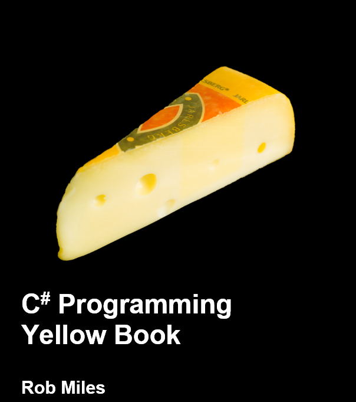
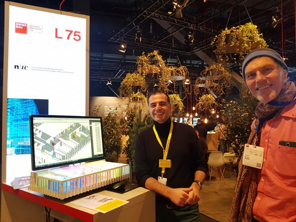

<head>
<meta http-equiv="Content-Type" content="text/html; charset=utf-8">
<link rel="stylesheet" type="text/css" href="bc.css">

</head>

<!---

- What Programming Language?
  https://forums.autodesk.com/t5/revit-api-forum/what-programming-language/m-p/9244502
  stever66 recommended an intersting book on C#
  /j/doc/book/cs_programming_yellow_book/csharp_book_2019_refresh.pdf
  [C# Programming Yellow Book](https://www.robmiles.com/c-yellow-book)
  by [Rob Miles](https://www.robmiles.com)
  questions such as 'what is a computer?' and 'what is a programmer?'
  includes a huge amount of very good advice
  worth browsing even for experienced programmers

- insight
Links to learning materials, including 2020.1 added features, to get an idea about shat is going on in this area
No officially supported API for Insight 360.
[Q] Our MEP design team is really interested in the Insight.
Can you provide a demonstration about it?
[A] Which Insight?
The one in BIM 360? 
http://help.autodesk.com/view/BIM360D/ENU/?guid=GUID-EC46253E-130E-4CE9-B0C1-2FB8333E1116
or Insight 360? 
https://insight.autodesk.com/oneenergy
Are you asking about a product feature demo?
Currently, there is no API for either.
But, depending on what you are trying to do, certain things might be possible, e.g., by writing a Revit add-in.
[R] I meant Insight 360, an add-in Revit.
Yes, I was asking about the product feature demo.
Later, we would also like to know about the API and customization.
As the basic preference, we would like to know the capability of Insight 360 on Revit like the lighting calculation/simulation, and Mechanical Load calculation/Analysis.
Our engineers are mainly using Revit, so we have basic knowledge of that.
Regarding the API, is it possible to customize it according to our preferences?
[A] I would suggest the following webinar recordings:
- For Insight (Energy and Lighting, but more about the Energy side)
Learn everything about Autodesk Insight – Episodes 1-3
http://blogs.autodesk.com/revit/2018/07/06/autodesk-insight-webinar-series/
- For Insight Lighting – This is a little old but a good introduction esp under the hood
Lighting Analysis in Revit
https://www.youtube.com/watch?v=mtZXEAYNd00
- For Mechanical / Load Analysis check see the following about new features in Revit 2020.1+
Webinar - An Introduction to Revit Systems Analysis with Revit 2020.1
https://www.youtube.com/watch?v=8kvSB5abVH4
- AU Class Recording - Revit Systems Analysis Features and Framework - An Introduction
https://www.autodesk.com/autodesk-university/class/Revit-Systems-Analysis-Features-and-Framework-Introduction-2019

twitter:

The C# Yellow Book, a Chinese Revit API tutorial and insight into Insight in the #RevitAPI #DynamoBim @AutodeskForge @AutodeskRevit #bim #ForgeDevCon http://bit.ly/csbookrvtapitutor

I very much enjoyed my quick visit to Swissbau Basel yesterday and meeting so many wonderful people there.
Here are some recent getting started tips on various areas: programming in general, C#, the Revit API and Insight
&ndash; The C&#35; Yellow Book
&ndash; Chinese Revit API tutorial
&ndash; Insight into Insight...

linkedin:

The C# Yellow Book, a Chinese Revit API tutorial and insight into Insight with the #RevitAPI

http://bit.ly/csbookrvtapitutor

I very much enjoyed my quick visit to Swissbau Basel yesterday and meeting so many wonderful people there.

Here are some recent getting started tips on various areas: programming in general, C#, the Revit API and Insight:

- The C# Yellow Book
- Chinese Revit API tutorial
- Insight into Insight...

#bim #DynamoBim #ForgeDevCon #Revit #API #IFC #SDK #AI #VisualStudio #Autodesk #AEC #adsk

the [Revit API discussion forum](http://forums.autodesk.com/t5/revit-api-forum/bd-p/160) thread

-->

### C&#35; Book, Chinese Revit API Tutorial and Insight

I very much enjoyed my quick visit
to [Swissbau Basel](https://www.swissbau.ch) yesterday and meeting so many wonderful people there.
Kean shares details and photos of the event in his post
on [Swissbau 2020](https://www.keanw.com/2020/01/swissbau-2020.html).
Thanks to Kean for animating me to go!

Meanwhile, exciting topics keep piling in from
the [Revit API discussion forum](http://forums.autodesk.com/t5/revit-api-forum/bd-p/160) and
elsewhere.

Here are some recent getting started tips on various areas: programming in general, C#, the Revit API and Insight:

- [The C&#35; Yellow Book](#2)
- [Chinese Revit API tutorial](#3)
- [Insight into Insight](#4)

#### The C&#35; Yellow Book

Steve R recommends a very comprehensive tutorial book on C# in his answer
to [what programming language](https://forums.autodesk.com/t5/revit-api-forum/what-programming-language/m-p/9244502):

The [C# Programming Yellow Book](https://www.robmiles.com/c-yellow-book)
([^](/j/doc/book/cs_programming_yellow_book/csharp_book_2019_refresh.pdf))
by [Rob Miles](https://www.robmiles.com).

It addresses just about everything you will ever need to know about C#, including questions such as 'what is a computer?' and 'what is a programmer?', a huge amount of other very good general programming advice, and is well worth browsing even for experienced programmers.

Many thanks to Steve for this nice pointer!

 <!-- 604 -->

#### Chinese Revit API Tutorial

HeiYe DeQiShi announced
a [Revit API tutorial &ndash; Revit二次开发教学视频](https://forums.autodesk.com/t5/revit-api-forum/revit-api-tutorial-revit-er-ci-kai-fa-jiao-xue-shi-pin/m-p/9253875),
the 26-minute video presentation [Revit之C#二次开发01vs的认识](https://youtu.be/upYNPAkw2Xg):

> 黑夜de骑士
本系列课程，由黑夜de骑士创作, qq交流群：711844216。主要是针对零基础的工程人员的revit二次开发课程，主要分为基础知识C#模块，和revit二次开发两个模块。
contact me: 1056291511@qq.com
&ndash; A course created by Knight de Knight, qq exchange group: 711844216, teaching basic knowledge of C# and the Revit API beginners.

<iframe width="480" height="270" src="https://www.youtube.com/embed/upYNPAkw2Xg" frameborder="0" allow="accelerometer; autoplay; encrypted-media; gyroscope; picture-in-picture" allowfullscreen></iframe>

#### Insight into Insight

An email conversation with a colleague of mine provides some insight on Insight, including links to learning materials and new features added in 2020.1 to get an idea about what is going on in this area:

**Question:** Our MEP design team is really interested in Insight.
Can you provide a demonstration of it?

**Answer:** Which Insight?

The [one in BIM 360](http://help.autodesk.com/view/BIM360D/ENU/?guid=GUID-EC46253E-130E-4CE9-B0C1-2FB8333E1116)?

Or [Insight 360](https://insight.autodesk.com/oneenergy)?

Are you asking about a product feature demo?

Currently, there is no API for either.

But, depending on what you are trying to do, certain things might be possible, e.g., by writing a Revit add-in.

**Response:** I meant Insight 360, an add-in Revit.

Yes, I was asking about the product feature demo.

Later, we would also like to know about the API and customization.

Mostly we would like to know the capability of Insight 360 on Revit, like lighting and mechanical load calculation, simulation and analysis.

Our engineers are mainly using Revit, so we have basic knowledge of that.

Regarding the API, is it possible to customize it according to our preferences?

**Answer:**  I would suggest looking at the following webinar recordings:

- For Insight (Energy and Lighting, mostly about the Energy side): 
[Learn everything about Autodesk Insight – Episodes 1-3](http://blogs.autodesk.com/revit/2018/07/06/autodesk-insight-webinar-series)
- For Insight Lighting, this is a little old but a good introduction, especially under the hood: 
[Lighting Analysis in Revit](https://www.youtube.com/watch?v=mtZXEAYNd00)
- For Mechanical and Load Analysis, check out the following about new features in Revit 2020.1+:
[Webinar &ndash; An Introduction to Revit Systems Analysis with Revit 2020.1](https://www.youtube.com/watch?v=8kvSB5abVH4)
- [AU Class Recording &ndash; Revit Systems Analysis Features and Framework Introduction](https://www.autodesk.com/autodesk-university/class/Revit-Systems-Analysis-Features-and-Framework-Introduction-2019)

 <!-- 500 -->

Dr. Wissam Wahbeh of FHNW showing Kean and me his digital and physical twin model at Swissbau 2020

