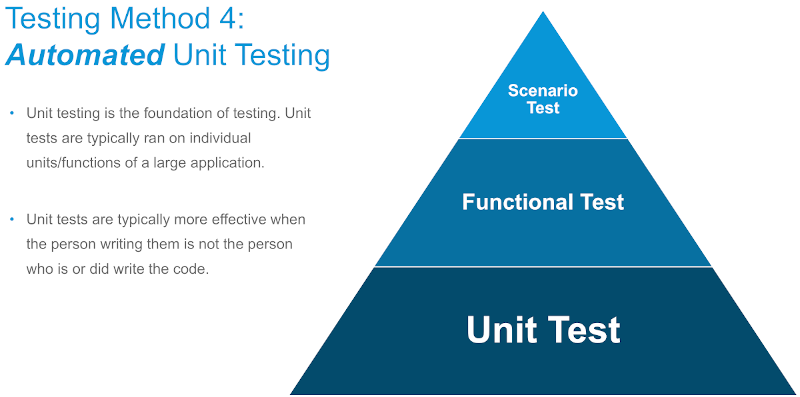

<head>
<meta http-equiv="Content-Type" content="text/html; charset=utf-8">
<link rel="stylesheet" type="text/css" href="bc.css">

</head>

<!---

- Unit Testing
  https://thebuildingcoder.typepad.com/blog/about-the-author.html#5.16
  [Unit Test for Revit Addin]
  https://forums.autodesk.com/t5/revit-api-forum/unit-test-for-revit-addin/m-p/9195660#M43235
  [Automate Your Revit Add-In Testing with Unit Testing]
  https://www.autodesk.com/autodesk-university/class/Automate-Your-Revit-Add-Testing-Unit-Testing-2019
  [RevitTestFramework](https://github.com/DynamoDS/RevitTestFramework)
  evolved out ouf
  [The Dynamo Revit Unit Test Framework](https://thebuildingcoder.typepad.com/blog/2013/10/the-dynamo-revit-unit-test-framework.html)
  and improvements
  [Revit Unit Test Framework Improvements](http://thebuildingcoder.typepad.com/blog/2018/08/revit-unit-test-framework-improvements.html)

  /a/doc/revit/tbc/git/a/zip/AU_SD322279_unit_testing_handout.pdf
  /a/doc/revit/tbc/git/a/zip/AU_SD322279_unit_testing_slides.pdf

twitter:

Unit testing add-ins and the UsesInstanceGeometry IFC utility method in the #RevitAPI #DynamoBim @AutodeskForge @AutodeskRevit #bim #ForgeDevCon http://bit.ly/rvtunittesting

Quick notes on two recent interesting Revit API discussion forum threads
&ndash; Unit testing
&ndash; <code>UsesInstanceGeometry</code> IFC utility method...

linkedin:

Unit testing add-ins and the UsesInstanceGeometry IFC utility method in the #RevitAPI

http://bit.ly/rvtunittesting

Quick notes on two recent interesting Revit API discussion forum threads:

- Unit testing
- UsesInstanceGeometry IFC utility method...

#bim #DynamoBim #ForgeDevCon #Revit #API #IFC #SDK #AI #VisualStudio #Autodesk #AEC #adsk

the [Revit API discussion forum](http://forums.autodesk.com/t5/revit-api-forum/bd-p/160) thread

-->

### Unit Testing and the UsesInstanceGeometry Method

Quick notes on two recent interesting [Revit API discussion forum](http://forums.autodesk.com/t5/revit-api-forum/bd-p/160) threads:

- [Unit testing](#2)
- [`UsesInstanceGeometry` IFC utility method](#3)

#### Unit Testing

We discussed unit testing here a number of times in the past, cf.,
the [topic group on unit testing](https://thebuildingcoder.typepad.com/blog/about-the-author.html#5.16).

The [Revit API discussion forum](http://forums.autodesk.com/t5/revit-api-forum/bd-p/160) thread
on [unit test for Revit add-in](https://forums.autodesk.com/t5/revit-api-forum/unit-test-for-revit-addin/m-p/9195660) brought
it up once again.

In his answer, Kade Major points out the Autodesk University class by Patrick Fernbach and Corey Smith from last November explaining how 
to [automate your Revit add-in testing with unit testing](https://www.autodesk.com/autodesk-university/class/Automate-Your-Revit-Add-Testing-Unit-Testing-2019).

Its unit testing is based on
the [RevitTestFramework](https://github.com/DynamoDS/RevitTestFramework) that evolved out
of [the Dynamo Revit unit test framework](https://thebuildingcoder.typepad.com/blog/2013/10/the-dynamo-revit-unit-test-framework.html)
an many [subsequent improvements](http://thebuildingcoder.typepad.com/blog/2018/08/revit-unit-test-framework-improvements.html).

Here are the handout and slides:

- [Handout](https://thebuildingcoder.typepad.com/au/2019/AU_SD322279_unit_testing_handout.pdf) ([^](zip/AU_SD322279_unit_testing_handout.pdf))
- [Slide deck](https://thebuildingcoder.typepad.com/au/2019/AU_SD322279_unit_testing_slides.pdf) ([^](zip/AU_SD322279_unit_testing_slides.pdf))

Please refer to the [Autodesk University class material](https://www.autodesk.com/autodesk-university/class/Automate-Your-Revit-Add-Testing-Unit-Testing-2019) for the full video recording.

 <!-- 800 -->

Many thanks to Corey, Kade and Patrick for their work and bringing this to my attention!

#### UsesInstanceGeometry IFC Utility Method

Once again, a useful piece of Revit API utility class functionality that I was previously unaware of popped up in
a [Revit API discussion forum](http://forums.autodesk.com/t5/revit-api-forum/bd-p/160) thread,
on [FamilyInstance.UsesInstanceGeometry deprecated but not documented](https://forums.autodesk.com/t5/revit-api-forum/familyinstance-usesinstancegeometry-depreciated-but-not/m-p/9207162).

The question prompted me to take a look at
the [UsesInstanceGeometry method](https://www.revitapidocs.com/2020/0c4dff47-2150-0615-9d65-7b8f9422861a.htm) on 
the [Autodesk.Revit.DB.IFC.ExporterIFCUtils utility class](https://www.revitapidocs.com/2020/e0e78d67-739c-0cd6-9e3d-359e42758c93.htm):

> Identifies whether the family instance has its own geometry or uses the symbol's geometry with a transform.

That seems like very useful thing to be aware of.

As Rudi the Revitalizer keeps pointing out,
[the Revit API util classes are often overlooked](https://thebuildingcoder.typepad.com/blog/about-the-author.html#5.52).

I am always amazed at the  number of unexpected gems hidden in there.

