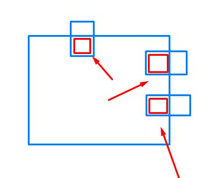

<head>
<meta http-equiv="Content-Type" content="text/html; charset=utf-8">
<link rel="stylesheet" type="text/css" href="bc.css">

</head>

<!---

- 2D Booleans in Revit
[Retrieve common geometry of all participants](
https://forums.autodesk.com/t5/revit-api-forum/retrieve-common-geometry-of-all-participants/m-p/9306367/highlight/false#M44496

- https://youtu.be/mBPskauS86o
<iframe width="560" height="315" src="https://www.youtube.com/embed/mBPskauS86o" frameborder="0" allow="accelerometer; autoplay; encrypted-media; gyroscope; picture-in-picture" allowfullscreen></iframe>
3-minute
Mesh Import from OBJ Files – Revit App – Demonstration
A demonstration of Version 2.0, which has Revit Materials available for the imported meshes.
[Mesh Import from OBJ files](https://apps.autodesk.com/RVT/en/Detail/Index?id=7847254631022872970&appLang=en&os=Win64)

- search for yourself using sensible keywords!

- getting started with macros
  https://thebuildingcoder.typepad.com/blog/2018/09/five-secrets-of-revit-api-coding.html#comment-4790311450
  https://thebuildingcoder.typepad.com/blog/2018/09/five-secrets-of-revit-api-coding.html#comment-4790311788

- https://forums.autodesk.com/t5/revit-api-forum/my-first-basic-script/m-p/9292581

twitter:

Marko's plugin development playlist and other getting started videos and tutorials for the #RevitAPI #DynamoBim @AutodeskForge @AutodeskRevit #bim #ForgeDevCon http://bit.ly/apitutorialvideos

Getting started material and questions galore.
Please search before asking, and work through the available material before trying to shoot yourself in your feet, knees, and elsewhere
&ndash; Marko's plugin development playlist
&ndash; Overview
&ndash; Table of contents
&ndash; Getting started with an API script
&ndash; Getting started with a macro
&ndash; OBJ mesh import with materials
&ndash; 2D Booleans in the Revit API...

linkedin:

Marko's plugin development playlist and other getting started videos and tutorials for the #RevitAPI

http://bit.ly/apitutorialvideos

Getting started material and questions galore.

Please search before asking, and work through the available material before trying to shoot yourself in your feet, knees, and elsewhere:

- Marko's plugin development playlist
- Overview
- Table of contents
- Getting started with an API script
- Getting started with a macro
- OBJ mesh import with materials
- 2D Booleans in the Revit API...

#bim #DynamoBim #ForgeDevCon #Revit #API #IFC #SDK #AI #VisualStudio #Autodesk #AEC #adsk

the [Revit API discussion forum](http://forums.autodesk.com/t5/revit-api-forum/bd-p/160) thread

-->

### Search for Getting Started Videos and Tutorials!

Getting started material and questions galore.

Please, newbies, <u>search before asking</u>, and work through the available material before trying to shoot yourself in your feet, knees, and elsewhere:

- [Marko's plugin development playlist](#2)
- [Plugin development playlist &ndash; overview](#3)
- [Plugin development playlist &ndash; table of contents](#4)
- [Getting started with an API script](#5)
- [Getting started with a macro](#6)
- [OBJ mesh import with materials](#7)
- [2D Booleans in the Revit API](#8)

#### Marko's Plugin Development Playlist

[Marko Koljancic](https://www.linkedin.com/in/marko87),
Digital Technology Manager at [DiRoots](https://diroots.com),
published a series of tutorial videos on Revit add-in development
in [Circle's Bim Blog](https://bitbucket.org/cbb_team/circles-bim-blog/src/master) and the
YouTube channel [Revit API - Plugin Development](https://www.youtube.com/playlist?list=PL7mg6Q0pUAfn8Pa7cyfRxTERRML964bUE):

> In this video series, we discuss how to develop your own C# .NET plugin for Autodesk Revit.
Based on simple examples, I present essential concepts of programming additional functionality for Revit.
On [my LinkedIn profile](https://www.linkedin.com/in/marko87), you can find articles for this series.

Thanks to Micah [@kraftwerk_15](https://twitter.com/kraftwerk_15) Gray for bringing it to my attention:

> Oh, BTW, to all in this thread and in the future and @jeremytammik.
Another good resource I've been tearing apart while looking at MVVM Navigation in the Revit context.
Again, not mine. :)
But also, there are videos on YouTube.

Here is Marko's description of his playlist:

#### Plugin Development Playlist &ndash; Overview

This is the full  [Revit API - Plugin Development Playlist](https://www.youtube.com/watch?v=rv6L0jH5e9I&list=PL7mg6Q0pUAfn8Pa7cyfRxTERRML964bUE) on
YouTube.
It contains two projects.
One essential for beginners and one more involved with WPF MVVM pattern and DockablePane control.

The first project targets beginner audience to Revit API.
The idea is to create a super simple tool that can add text note elements containing wall layer information.
I picked this because it I think it is a good project to showcase a common workflow for creating simple tools in Revit. 

On top of the previous project I recorded the series for more medium to advanced users.
The idea is to have a dockable pane type of add-in that is used to show family files from external directories and provide some commands through the right click context menu. 

The idea behind this series is to start involving more community into using WPF, XAML and MVVM pattern of programming.
I covered a lot of topics for styling, animations for hovering effects, animated transitions between pages in DockablePane, for example fading and sliding animation, things like that.
I followed the MVVM pattern completely in this series (from my best understanding): data bindings, value conversions, ViewModel classes, etc.

The majority of the videos are covered with links in the description to written articles on my LinkedIn page.
Some things are easier to write than record.
Here is one example of such an article:

- [13 - Revit API - Family Manager - Item Type and Visual Indicator](https://www.linkedin.com/pulse/13-revit-api-family-manager-item-type-visual-marko-koljancic)

I didn’t record audio, but I heavily documented the code and cover them with the LinkedIn articles.
The playlist is live and I plan to continue it.

I’m an architect and self-taught C# developer.
I struggled in the beginning to figure out all these concepts on my own, still learning.
This video series is my humble contribution to the wonderful Revit API community.

Ever so many thanks to Marko for all his hard work and kind sharing!

#### Plugin Development Playlist &ndash; Table of Contents

Short table of contents of the 18 videos in
the [Revit API - Plugin Development Playlist](https://www.youtube.com/watch?v=rv6L0jH5e9I&list=PL7mg6Q0pUAfn8Pa7cyfRxTERRML964bUE):

1. Plugin Essentials &ndash; First steps, basic plugin setup (24:03)
2. Plugin Essentials &ndash; Manage image resources and multiple project setup (39:08)
3. Plugin Essentials &ndash; Tag Wall Layers Command and create Text Note Element (35:30)
4. Plugin Essentials &ndash; Show Dialog Box and create SketchPlane (46:44)
5. Plugin Essentials &ndash; Convert Imperial to Metric Units (26:21)
6. Family Manager Plugin &ndash; Dockable Pane, Revit and WPF (35:57)
7. Family Manager Plugin &ndash; WPF ViewModel, Buttons and Commands (22:59)
8. Family Manager Plugin &ndash; Page Switcher Mechanism and Value Converters (19:22)
9. Family Manager Plugin &ndash; Populate List of Family Items (43:18)
10. Family Manager Plugin &ndash; Implement Page Transition Animation (20:11)
11. Family Manager Plugin &ndash; Dark Theme and Styling (28:34)
12. Family Manager &ndash; Custom Button Style (22:27)
13. Family Manager &ndash; Item Type and Visual Indicator (20:14)
14. Family Manager &ndash; Style Family Item in List View (19:19)
15. Family Manager &ndash; Create and style right click context menu for items in list view (14:51)
16. Family Manager &ndash; Preferences and Repository Locations (1:14:44)
17. Family Manager &ndash; Repository Context Menu Functionality (33:31)
18. Family Manager &ndash; Create Application Installer Executable File (11:48)

#### Getting Started with an API Script

Another beginners question came up in
the [Revit API discussion forum](http://forums.autodesk.com/t5/revit-api-forum/bd-p/160) thread
on [my first basic script](https://forums.autodesk.com/t5/revit-api-forum/my-first-basic-script/m-p/9292581):

**Question:** I have a probably simple problem.
I want to select many elements and add to the parameter "Comments" the value "Something".
I don't know where the problem is ;/.

**Answer:** Welcome to the Revit API!

Looking at your code, I would suggest that you simplify it significantly.

Then the error will probably go away by itself.

The BIM element has one single comment field that you wish to set a value on, so there is no need to maintain a list of different parameters named "Comment" and loop through all of them with the call to `Set`.

Pick the one single parameter you need instead.

The best way to do so is to not use the "Comment" display name, but the built-in parameter enumeration value.

It may or may not be the `BuiltInParameter` `ALL_MODEL_MARK`.

To find out what it is, you should first of all
install [RevitLookup](https://github.com/jeremytammik/RevitLookup) and
explore the element that you wish to set the comment on to find the built-in parameter enumeration value corresponding to the parameter you wish to modify.

Let's say its value is B.

Then you can simply say:

<pre class="code">
  elemm.get_Parameter(B).Set("Something");
</pre>

By the way, I would suggest that you make it simple for yourself: before doing anything else, work through
the [standard Revit API getting started material](https://thebuildingcoder.typepad.com/blog/about-the-author.html#2), the training videos, and the initial walkthroughs in the developer guide.

That will explain all the fundamentals and get you up and running smoothly with less hassle.

Once you have done that read about how to [research to solve a Revit API programming task](https://thebuildingcoder.typepad.com/blog/2017/01/virtues-of-reproduction-research-mep-settings-ontology.html#3).

Good luck and have fun!

#### Getting Started with a Macro

Similar beginners questions cropped up on Revit macros as well,
in [two](https://thebuildingcoder.typepad.com/blog/2018/09/five-secrets-of-revit-api-coding.html#comment-4790311450)
[comments](https://thebuildingcoder.typepad.com/blog/2018/09/five-secrets-of-revit-api-coding.html#comment-4790311788
)
on the [Five Secrets of Revit API Coding](https://thebuildingcoder.typepad.com/blog/2018/09/five-secrets-of-revit-api-coding.html).

The answer is always the same:

- Search for tutorials on the Internet. There are hundreds, at least.
- Search for [YouTube video tutorials](https://www.youtube.com/results?search_query=revit+macros+tutorial). Hundreds of those as well.

I challenge you to come up with any beginners question that has not already been answered in depth, repeatedly and well!

#### OBJ Mesh Import with Materials

My friend Eric Boehlke is not a programmer and still created a Revit add-in selling in the AppStore,
[Mesh Import from OBJ files](https://apps.autodesk.com/RVT/en/Detail/Index?id=7847254631022872970&appLang=en&os=Win64).

Here is a [3-minute demonstration of version 2.0](https://youtu.be/mBPskauS86o) that
makes Revit Materials available for the imported meshes:

<iframe width="480" height="270" src="https://www.youtube.com/embed/mBPskauS86o" frameborder="0" allow="accelerometer; autoplay; encrypted-media; gyroscope; picture-in-picture" allowfullscreen></iframe>

#### 2D Booleans in the Revit API

Finally, let's end this beginner's business with one final more interesting and geometrical question from
the [Revit API discussion forum](http://forums.autodesk.com/t5/revit-api-forum/bd-p/160) thread
on how to [retrieve common geometry of all participants](https://forums.autodesk.com/t5/revit-api-forum/retrieve-common-geometry-of-all-participants/m-p/9306367):

**Question:** I have faces intersecting.
I want to retrieve the common geometry of all participants.
How can I solve this?

**Answer:** It sounds as if you are looking for a 2D Boolean intersection operation.

Revit does not provide this functionality.

However, you can easily make use of other .NET libraries implementing it and reference those in your Revit add-in.

I have repeatedly made use of the [Clipper library](http://angusj.com/delphi/clipper.php) for such purposes:

- [Room and Wall Adjacent Area](http://thebuildingcoder.typepad.com/blog/2009/01/room-and-wall-adjacent-area.html)
- [Boolean Operations for 2D Polygons](http://thebuildingcoder.typepad.com/blog/2009/02/boolean-operations-for-2d-polygons.html)
- [GetPolygon Extension Methods](http://thebuildingcoder.typepad.com/blog/2010/02/getpolygon-extension-methods.html)
- [Boolean Operations for 2D Polygons](http://thebuildingcoder.typepad.com/blog/2013/09/boolean-operations-for-2d-polygons.html)
- [Saving a Solid to a SAT File Implementation](http://thebuildingcoder.typepad.com/blog/2013/09/saving-a-solid-to-a-sat-file-implementation.html)
- [Creating Topography Contours and Building Masses](http://thebuildingcoder.typepad.com/blog/2014/11/creating-topography-contours-and-building-masses.html)
- [More on Wall Opening Areas per Room](http://thebuildingcoder.typepad.com/blog/2016/04/more-on-wall-opening-areas-per-room.html)
- [Fire Rating Zone Intersection](https://thebuildingcoder.typepad.com/blog/2018/12/fire-rating-zone-intersection.html)
- [Automated PDF Report and 2D Sketch Booleans](https://thebuildingcoder.typepad.com/blog/2019/11/automated-pdf-report-and-2d-sketch-booleans.html)
- [Extrusion Analyser and 2D Boolean Element Outline](https://thebuildingcoder.typepad.com/blog/2020/01/extrusion-analyser-and-2d-boolean-element-outline.html)

The last pointer highlights the most interesting and up-to-date sample using it so far,
the [ElementOutline add-in](https://github.com/jeremytammik/ElementOutline).

You should also check out the discussions in the topic group
on [2D Booleans and Adjacent Areas](https://thebuildingcoder.typepad.com/blog/about-the-author.html#5.2).
