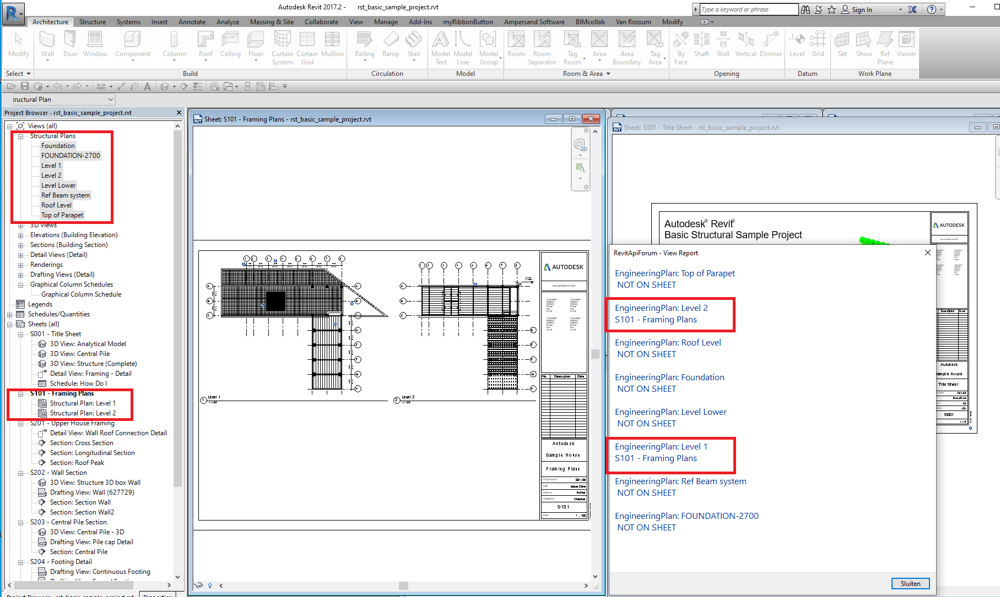
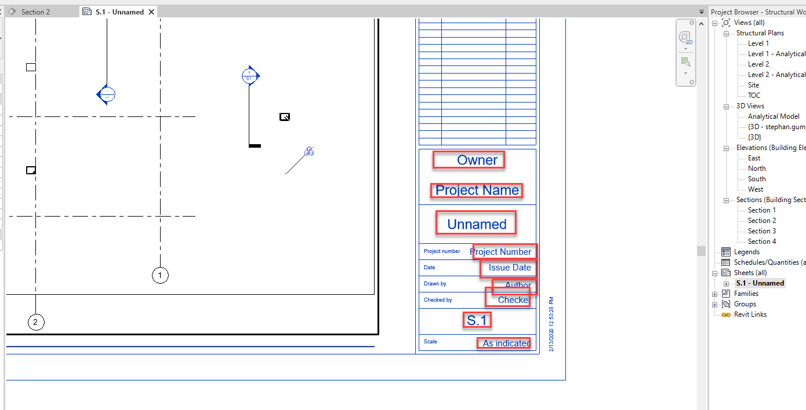

<head>
<meta http-equiv="Content-Type" content="text/html; charset=utf-8">
<link rel="stylesheet" type="text/css" href="bc.css">

</head>

<!---

- get sheet from view 
  12966349 [Get ViewSheet from View]
  https://forums.autodesk.com/t5/revit-api-forum/get-viewsheet-from-view/m-p/7075550

twitter:

Getting title block data and ViewSheet from View in the #RevitAPI #DynamoBim @AutodeskForge @AutodeskRevit #bim #ForgeDevCon http://bit.ly/titleblockdata

Today, let's highlight two view related data access topics
&ndash; Get ViewSheet from View
&ndash; Title block data access...

linkedin:

Getting title block data and ViewSheet from View in the #RevitAPI

http://bit.ly/titleblockdata

Today, let's highlight two view related data access topics:

- Get ViewSheet from View
- Title block data access...

#bim #DynamoBim #ForgeDevCon #Revit #API #IFC #SDK #AI #VisualStudio #Autodesk #AEC #adsk

the [Revit API discussion forum](http://forums.autodesk.com/t5/revit-api-forum/bd-p/160) thread

-->

### Getting Title Block Data and ViewSheet from View

Today, let's highlight two view related data access topics:

- [Get ViewSheet from View](#2)
- [Title block data access](#3)

#### Get ViewSheet from View

An interesting in-depth conversation in 
the [Revit API discussion forum](http://forums.autodesk.com/t5/revit-api-forum/bd-p/160) thread
on how to [get ViewSheet from View](https://forums.autodesk.com/t5/revit-api-forum/get-viewsheet-from-view/m-p/7075550) presents
two different approaches to determine relationships between sheets and the views they host:

**Question:** Is there a way to get the `ViewSheet` or `ElementId` of the `ViewSheet` from a `View` that is placed on that sheet?

I can get the sheet name and sheet number from the provided parameters but do not see one for the actual ViewSheet.
Am I missing something?
The only thing I can think of to do without this info is to loop through all ViewSheets to match the one with the same sheet number (since sheet number is required to be unique).   

**Answer:** Have you looked at the sample code provided in the [description of the ViewSheet class](http://www.revitapidocs.com/2017/af2ee879-173d-df3a-9793-8d5750a17b49.htm)?

<pre class="code">
&nbsp;&nbsp;ICollection&lt;ElementId&gt;&nbsp;views&nbsp;=&nbsp;viewSheet.GetAllPlacedViews();
&nbsp;&nbsp;message&nbsp;+=&nbsp;&quot;\nNumber&nbsp;of&nbsp;views&nbsp;in&nbsp;the&nbsp;sheet&nbsp;:&nbsp;&quot;&nbsp;+&nbsp;views.Count;
</pre>

If all else fails, you could use this relationship and invert it, just as you suggest.
 
The [View.Title property](http://www.revitapidocs.com/2017/bfa96650-310e-5385-3a9d-1a1248b623ce.htm) also
generally consists of the view name plus other modifiers, such as the view type, sheet number, area scheme, and/or assembly type, depending on the specifics of the view:
 
**Response:** You must have misunderstood my question.  I don't have the ViewSheet in order to use the method to get its placed views.  I have a view, that I know is on a sheet (because its sheet number parameter is not null), but I want to get a direct reference to that sheet that it is placed on.  It seems to me that you are still suggesting that I must loop through all ViewSheets to get the View that I'm concerned with.  Thanks.

**Answer:** Yes, indeed, that is exactly what I am suggesting.

Get all the view sheets, keep track of them and the views they host, and invert that relationship, as described in one of the very early discussions by The Building Coder back in 2008 on a [relationship inverter](http://thebuildingcoder.typepad.com/blog/2008/10/relationship-in.html).

That gives you a complete dictionary lookup both ways: you can look up the sheet hosting any view and you can look up all the views hosted by any sheet, instantaneously.

It takes a moment to set up the relationships; after that, all data is available and lookup is very fast.

**Other answer:** I maybe have a workaround for this question, something similar I assume.

Select some views in the Project Browser to know if the views are placed on sheet(s).

Then, run a macro or external command to execute something like code below.

If the view is placed on a sheet, it shows the sheet number, sheet name and whatever data you are interested in from the ViewSheet referenced by the views selected in the Project Browser:

<pre class="code">
&nbsp;&nbsp;public&nbsp;void&nbsp;GetViewSheetFromView(&nbsp;UIDocument&nbsp;uidoc&nbsp;)
&nbsp;&nbsp;{
&nbsp;&nbsp;&nbsp;&nbsp;Document&nbsp;doc&nbsp;=&nbsp;uidoc.Document;
&nbsp;&nbsp;&nbsp;&nbsp;string&nbsp;data&nbsp;=&nbsp;&quot;&quot;;
 
&nbsp;&nbsp;&nbsp;&nbsp;ICollection&lt;ElementId&gt;&nbsp;selectedIds&nbsp;
&nbsp;&nbsp;&nbsp;&nbsp;&nbsp;&nbsp;=&nbsp;uidoc.Selection.GetElementIds();
 
&nbsp;&nbsp;&nbsp;&nbsp;foreach(&nbsp;ElementId&nbsp;selectedid&nbsp;in&nbsp;selectedIds&nbsp;)
&nbsp;&nbsp;&nbsp;&nbsp;{
&nbsp;&nbsp;&nbsp;&nbsp;&nbsp;&nbsp;View&nbsp;e&nbsp;=&nbsp;doc.GetElement(&nbsp;selectedid&nbsp;)&nbsp;as&nbsp;View;
 
&nbsp;&nbsp;&nbsp;&nbsp;&nbsp;&nbsp;foreach(&nbsp;View&nbsp;v&nbsp;in&nbsp;new&nbsp;FilteredElementCollector(&nbsp;doc&nbsp;)
&nbsp;&nbsp;&nbsp;&nbsp;&nbsp;&nbsp;&nbsp;&nbsp;.OfClass(&nbsp;typeof(&nbsp;View&nbsp;)&nbsp;)
&nbsp;&nbsp;&nbsp;&nbsp;&nbsp;&nbsp;&nbsp;&nbsp;.Cast&lt;View&gt;()
&nbsp;&nbsp;&nbsp;&nbsp;&nbsp;&nbsp;&nbsp;&nbsp;.Where(&nbsp;q&nbsp;=&gt;&nbsp;q.Id.Equals(&nbsp;e.Id&nbsp;)&nbsp;)&nbsp;)
&nbsp;&nbsp;&nbsp;&nbsp;&nbsp;&nbsp;{
&nbsp;&nbsp;&nbsp;&nbsp;&nbsp;&nbsp;&nbsp;&nbsp;string&nbsp;thisSheet&nbsp;=&nbsp;&quot;&quot;;
&nbsp;&nbsp;&nbsp;&nbsp;&nbsp;&nbsp;&nbsp;&nbsp;foreach(&nbsp;ViewSheet&nbsp;vs&nbsp;in&nbsp;new&nbsp;FilteredElementCollector(&nbsp;doc&nbsp;)
&nbsp;&nbsp;&nbsp;&nbsp;&nbsp;&nbsp;&nbsp;&nbsp;&nbsp;&nbsp;.OfClass(&nbsp;typeof(&nbsp;ViewSheet&nbsp;)&nbsp;)
&nbsp;&nbsp;&nbsp;&nbsp;&nbsp;&nbsp;&nbsp;&nbsp;&nbsp;&nbsp;.Cast&lt;ViewSheet&gt;()&nbsp;)
&nbsp;&nbsp;&nbsp;&nbsp;&nbsp;&nbsp;&nbsp;&nbsp;{
&nbsp;&nbsp;&nbsp;&nbsp;&nbsp;&nbsp;&nbsp;&nbsp;&nbsp;&nbsp;foreach(&nbsp;ElementId&nbsp;eid&nbsp;in&nbsp;vs.GetAllPlacedViews()&nbsp;)
&nbsp;&nbsp;&nbsp;&nbsp;&nbsp;&nbsp;&nbsp;&nbsp;&nbsp;&nbsp;{
&nbsp;&nbsp;&nbsp;&nbsp;&nbsp;&nbsp;&nbsp;&nbsp;&nbsp;&nbsp;&nbsp;&nbsp;View&nbsp;ev&nbsp;=&nbsp;doc.GetElement(&nbsp;eid&nbsp;)&nbsp;as&nbsp;View;
&nbsp;&nbsp;&nbsp;&nbsp;&nbsp;&nbsp;&nbsp;&nbsp;&nbsp;&nbsp;&nbsp;&nbsp;if(&nbsp;ev.Id&nbsp;==&nbsp;v.Id&nbsp;)
&nbsp;&nbsp;&nbsp;&nbsp;&nbsp;&nbsp;&nbsp;&nbsp;&nbsp;&nbsp;&nbsp;&nbsp;{
&nbsp;&nbsp;&nbsp;&nbsp;&nbsp;&nbsp;&nbsp;&nbsp;&nbsp;&nbsp;&nbsp;&nbsp;&nbsp;&nbsp;thisSheet&nbsp;+=&nbsp;vs.SheetNumber&nbsp;
&nbsp;&nbsp;&nbsp;&nbsp;&nbsp;&nbsp;&nbsp;&nbsp;&nbsp;&nbsp;&nbsp;&nbsp;&nbsp;&nbsp;&nbsp;&nbsp;+&nbsp;&quot;&nbsp;-&nbsp;&quot;&nbsp;+&nbsp;vs.Name&nbsp;+&nbsp;Environment.NewLine;
&nbsp;&nbsp;&nbsp;&nbsp;&nbsp;&nbsp;&nbsp;&nbsp;&nbsp;&nbsp;&nbsp;&nbsp;&nbsp;&nbsp;break;
&nbsp;&nbsp;&nbsp;&nbsp;&nbsp;&nbsp;&nbsp;&nbsp;&nbsp;&nbsp;&nbsp;&nbsp;}
&nbsp;&nbsp;&nbsp;&nbsp;&nbsp;&nbsp;&nbsp;&nbsp;&nbsp;&nbsp;}
&nbsp;&nbsp;&nbsp;&nbsp;&nbsp;&nbsp;&nbsp;&nbsp;}
 
&nbsp;&nbsp;&nbsp;&nbsp;&nbsp;&nbsp;&nbsp;&nbsp;if(&nbsp;thisSheet&nbsp;!=&nbsp;&quot;&quot;&nbsp;)
&nbsp;&nbsp;&nbsp;&nbsp;&nbsp;&nbsp;&nbsp;&nbsp;{
&nbsp;&nbsp;&nbsp;&nbsp;&nbsp;&nbsp;&nbsp;&nbsp;&nbsp;&nbsp;data&nbsp;+=&nbsp;v.ViewType&nbsp;+&nbsp;&quot;:&nbsp;&quot;&nbsp;+&nbsp;v.Name&nbsp;+&nbsp;&quot;&nbsp;&quot;&nbsp;+&nbsp;Environment.NewLine&nbsp;
&nbsp;&nbsp;&nbsp;&nbsp;&nbsp;&nbsp;&nbsp;&nbsp;&nbsp;&nbsp;&nbsp;&nbsp;+&nbsp;thisSheet.TrimEnd(&nbsp;&#39;&nbsp;&#39;,&nbsp;&#39;,&#39;&nbsp;)&nbsp;+&nbsp;Environment.NewLine;
&nbsp;&nbsp;&nbsp;&nbsp;&nbsp;&nbsp;&nbsp;&nbsp;}
 
&nbsp;&nbsp;&nbsp;&nbsp;&nbsp;&nbsp;&nbsp;&nbsp;else
&nbsp;&nbsp;&nbsp;&nbsp;&nbsp;&nbsp;&nbsp;&nbsp;{
&nbsp;&nbsp;&nbsp;&nbsp;&nbsp;&nbsp;&nbsp;&nbsp;&nbsp;&nbsp;data&nbsp;+=&nbsp;v.ViewType&nbsp;+&nbsp;&quot;:&nbsp;&quot;&nbsp;+&nbsp;v.Name&nbsp;+&nbsp;&quot;&nbsp;&quot;&nbsp;+&nbsp;Environment.NewLine&nbsp;
&nbsp;&nbsp;&nbsp;&nbsp;&nbsp;&nbsp;&nbsp;&nbsp;&nbsp;&nbsp;&nbsp;&nbsp;+&nbsp;thisSheet.TrimEnd(&nbsp;&#39;&nbsp;&#39;,&nbsp;&#39;,&#39;&nbsp;);
&nbsp;&nbsp;&nbsp;&nbsp;&nbsp;&nbsp;&nbsp;&nbsp;&nbsp;&nbsp;data&nbsp;+=&nbsp;&quot;&nbsp;NOT&nbsp;ON&nbsp;SHEET&nbsp;&quot;&nbsp;+&nbsp;Environment.NewLine&nbsp;+&nbsp;&quot;\n&quot;;
&nbsp;&nbsp;&nbsp;&nbsp;&nbsp;&nbsp;&nbsp;&nbsp;}
&nbsp;&nbsp;&nbsp;&nbsp;&nbsp;&nbsp;}
&nbsp;&nbsp;&nbsp;&nbsp;}
&nbsp;&nbsp;&nbsp;&nbsp;TaskDialog.Show(&nbsp;&quot;View&nbsp;Report&quot;,&nbsp;data&nbsp;);
&nbsp;&nbsp;}
</pre>

 <!-- 1815 -->

**Yet another answer:** You can perhaps get VIEWPORT_SHEET_NUMBER from Parameters.

**Yet another answer:** As suggested above, using the BIP for viewport sheet number with an ElementParameterFilter is probably the best approach.
Sheet numbers are unique in each Revit model, so it is safe to search by them and get the right result.

<pre class="code">
&nbsp;&nbsp;Public&nbsp;Function&nbsp;TObj43(ByVal&nbsp;commandData&nbsp;As&nbsp;ExternalCommandData,
&nbsp;&nbsp;&nbsp;&nbsp;ByRef&nbsp;message&nbsp;As&nbsp;String,&nbsp;ByVal&nbsp;elements&nbsp;As&nbsp;ElementSet)&nbsp;As&nbsp;Result
 
&nbsp;&nbsp;&nbsp;&nbsp;If&nbsp;commandData.Application.ActiveUIDocument&nbsp;Is&nbsp;Nothing&nbsp;Then&nbsp;Return&nbsp;Result.Cancelled&nbsp;Else
&nbsp;&nbsp;&nbsp;&nbsp;Dim&nbsp;AcView&nbsp;As&nbsp;View&nbsp;=&nbsp;commandData.Application.ActiveUIDocument.ActiveGraphicalView
 
&nbsp;&nbsp;&nbsp;&nbsp;Dim&nbsp;P_Ns&nbsp;As&nbsp;Parameter&nbsp;=&nbsp;AcView.Parameter(BuiltInParameter.VIEWPORT_SHEET_NUMBER)
&nbsp;&nbsp;&nbsp;&nbsp;If&nbsp;P_Ns&nbsp;Is&nbsp;Nothing&nbsp;Then
&nbsp;&nbsp;&nbsp;&nbsp;&nbsp;&nbsp;GoTo&nbsp;Monday
&nbsp;&nbsp;&nbsp;&nbsp;End&nbsp;If
 
&nbsp;&nbsp;&nbsp;&nbsp;Dim&nbsp;Txt&nbsp;As&nbsp;String&nbsp;=&nbsp;P_Ns.AsString
&nbsp;&nbsp;&nbsp;&nbsp;If&nbsp;String.IsNullOrEmpty(Txt)&nbsp;Then&nbsp;GoTo&nbsp;Monday&nbsp;Else
&nbsp;&nbsp;&nbsp;&nbsp;Dim&nbsp;SeFR&nbsp;As&nbsp;FilterRule&nbsp;=&nbsp;ParameterFilterRuleFactory.CreateEqualsRule(
&nbsp;&nbsp;&nbsp;&nbsp;&nbsp;&nbsp;New&nbsp;ElementId(BuiltInParameter.SHEET_NUMBER),&nbsp;Txt,&nbsp;True)
&nbsp;&nbsp;&nbsp;&nbsp;Dim&nbsp;PFilt&nbsp;As&nbsp;New&nbsp;ElementParameterFilter(SeFR,&nbsp;False)
 
&nbsp;&nbsp;&nbsp;&nbsp;Dim&nbsp;FEC&nbsp;As&nbsp;New&nbsp;FilteredElementCollector(AcView.Document)
&nbsp;&nbsp;&nbsp;&nbsp;Dim&nbsp;ECF&nbsp;As&nbsp;New&nbsp;ElementClassFilter(GetType(ViewSheet))
&nbsp;&nbsp;&nbsp;&nbsp;Dim&nbsp;LandF&nbsp;As&nbsp;New&nbsp;LogicalAndFilter(ECF,&nbsp;PFilt)
&nbsp;&nbsp;&nbsp;&nbsp;Dim&nbsp;Els&nbsp;As&nbsp;List(Of&nbsp;Element)&nbsp;=&nbsp;FEC.WherePasses(LandF).ToElements
 
&nbsp;&nbsp;&nbsp;&nbsp;If&nbsp;Els.Count&nbsp;&lt;&gt;&nbsp;1&nbsp;Then
&nbsp;&nbsp;&nbsp;&nbsp;&nbsp;&nbsp;GoTo&nbsp;Monday
&nbsp;&nbsp;&nbsp;&nbsp;Else
&nbsp;&nbsp;&nbsp;&nbsp;&nbsp;&nbsp;Dim&nbsp;TD&nbsp;As&nbsp;New&nbsp;TaskDialog(&quot;Was&nbsp;this&nbsp;your&nbsp;sheet...&quot;)
&nbsp;&nbsp;&nbsp;&nbsp;&nbsp;&nbsp;TD.MainInstruction&nbsp;=&nbsp;Txt&nbsp;&amp;&nbsp;&quot;-&quot;&nbsp;&amp;&nbsp;Els(0).Name
&nbsp;&nbsp;&nbsp;&nbsp;&nbsp;&nbsp;TD.MainContent&nbsp;=&nbsp;&quot;Note&nbsp;that&nbsp;view&nbsp;types&nbsp;that&nbsp;can&nbsp;appear&nbsp;on&nbsp;&quot;&nbsp;_
&nbsp;&nbsp;&nbsp;&nbsp;&nbsp;&nbsp;&nbsp;&nbsp;+&nbsp;&quot;multiple&nbsp;sheets&nbsp;(Legends,&nbsp;Images,&nbsp;Schedules&nbsp;etc.)&nbsp;will&nbsp;&quot;&nbsp;_
&nbsp;&nbsp;&nbsp;&nbsp;&nbsp;&nbsp;&nbsp;&nbsp;+&nbsp;&quot;&nbsp;not&nbsp;be&nbsp;returned&nbsp;by&nbsp;this&nbsp;method.&quot;
&nbsp;&nbsp;&nbsp;&nbsp;&nbsp;&nbsp;TD.Show()
&nbsp;&nbsp;&nbsp;&nbsp;&nbsp;&nbsp;GoTo&nbsp;Friday
&nbsp;&nbsp;&nbsp;&nbsp;End&nbsp;If
Monday:
&nbsp;&nbsp;&nbsp;&nbsp;TaskDialog.Show(&quot;Something&nbsp;went&nbsp;amiss...&quot;,
&nbsp;&nbsp;&nbsp;&nbsp;&nbsp;&nbsp;&quot;We&nbsp;looked&nbsp;hard&nbsp;in&nbsp;many&nbsp;places&nbsp;but&nbsp;were&nbsp;unable&nbsp;to&nbsp;&quot;&nbsp;_
&nbsp;&nbsp;&nbsp;&nbsp;&nbsp;&nbsp;+&nbsp;&quot;find&nbsp;your&nbsp;sheet&nbsp;on&nbsp;this&nbsp;occasion.&quot;)
&nbsp;&nbsp;&nbsp;&nbsp;Return&nbsp;Result.Failed
Friday:
&nbsp;&nbsp;&nbsp;&nbsp;Return&nbsp;Result.Succeeded
&nbsp;&nbsp;End&nbsp;Function
</pre>

**Yet another answer:** Here is a pretty quick way of checking for a specific sheet:

<pre class="code">
&nbsp;&nbsp;private&nbsp;ViewSheet&nbsp;CheckSheet(&nbsp;string&nbsp;_sheetNumber&nbsp;)
&nbsp;&nbsp;{
&nbsp;&nbsp;&nbsp;&nbsp;ParameterValueProvider&nbsp;pvp&nbsp;=&nbsp;new&nbsp;ParameterValueProvider(&nbsp;
&nbsp;&nbsp;&nbsp;&nbsp;&nbsp;&nbsp;new&nbsp;ElementId(&nbsp;BuiltInParameter.SHEET_NUMBER&nbsp;)&nbsp;);
&nbsp;&nbsp;&nbsp;&nbsp;FilterStringRuleEvaluator&nbsp;fsr&nbsp;=&nbsp;new&nbsp;FilterStringEquals();
&nbsp;&nbsp;&nbsp;&nbsp;FilterRule&nbsp;fRule&nbsp;=&nbsp;new&nbsp;FilterStringRule(&nbsp;
&nbsp;&nbsp;&nbsp;&nbsp;&nbsp;&nbsp;pvp,&nbsp;fsr,&nbsp;_sheetNumber,&nbsp;true&nbsp;);
&nbsp;&nbsp;&nbsp;&nbsp;ElementParameterFilter&nbsp;filter&nbsp;=&nbsp;new&nbsp;ElementParameterFilter(&nbsp;fRule&nbsp;);
 
&nbsp;&nbsp;&nbsp;&nbsp;if(&nbsp;new&nbsp;FilteredElementCollector(&nbsp;doc&nbsp;)
&nbsp;&nbsp;&nbsp;&nbsp;&nbsp;&nbsp;.OfCategory(&nbsp;BuiltInCategory.OST_Sheets&nbsp;)
&nbsp;&nbsp;&nbsp;&nbsp;&nbsp;&nbsp;.WherePasses(&nbsp;filter&nbsp;)
&nbsp;&nbsp;&nbsp;&nbsp;&nbsp;&nbsp;.FirstOrDefault()&nbsp;is&nbsp;ViewSheet&nbsp;vs&nbsp;)
&nbsp;&nbsp;&nbsp;&nbsp;{
&nbsp;&nbsp;&nbsp;&nbsp;&nbsp;&nbsp;return&nbsp;vs;
&nbsp;&nbsp;&nbsp;&nbsp;}
&nbsp;&nbsp;&nbsp;&nbsp;else
&nbsp;&nbsp;&nbsp;&nbsp;{
&nbsp;&nbsp;&nbsp;&nbsp;&nbsp;&nbsp;return&nbsp;null;
&nbsp;&nbsp;&nbsp;&nbsp;}
&nbsp;&nbsp;}
</pre>

**Summary:** I believe this last solution is unbeatable if you are interested in one single lookup.

It uses a parameter filter and the `SHEET_NUMBER` built-in parameter.

Probably, the VB function `TObj43` above is similarly efficient.

`GetViewSheetFromView` demonstrates the lookup of the inverted relationship I described, but just for one single view.

That code could be used to store the entire relationships mapping sheet to hosted views and the inverted one mapping each view to hosting sheets for all views and sheets. That might possibly be more efficient if you frequently need to look up several different view to sheet relationships.

Thank you all for the very illuminating and helpful answers!

#### Title Block Data Access

**Question:** I am searching for some sample code for use in a Design Automation API project.
 
Rather than reinvent to wheel, I thought you might have a snippet handy showing how to read Revit drawing title block attributes like these:

 <!-- 1390 -->

**Answer:** I discussed accessing
the [title block of a sheet](https://thebuildingcoder.typepad.com/blog/2009/11/title-block-of-sheet.html) myself
back in 2009, but that information is rather antiquated now.

The question was also raised and answered in 
the [Revit API discussion forum](http://forums.autodesk.com/t5/revit-api-forum/bd-p/160) thread
on [TitleBlock](https://forums.autodesk.com/t5/revit-api-forum/titleblock/td-p/3802588),
and that information is perfectly valid.

Ah, I now found a more recent and useful article on how
to [determine sheet size](https://thebuildingcoder.typepad.com/blog/2010/05/determine-sheet-size.html) that
should provide all you need.

The code is included in
[The Building Coder samples](https://github.com/jeremytammik/the_building_coder_samples)
[module CmdSheetSize.cs](https://github.com/jeremytammik/the_building_coder_samples/blob/master/BuildingCoder/BuildingCoder/CmdSheetSize.cs).

The title block instances are family instance elements.
You can access the title block element using a filtered element collector, e.g.:

<pre class="code">
&nbsp;&nbsp;FilteredElementCollector&nbsp;title_block_instances
&nbsp;&nbsp;&nbsp;&nbsp;=&nbsp;new&nbsp;FilteredElementCollector(&nbsp;doc&nbsp;)
&nbsp;&nbsp;&nbsp;&nbsp;&nbsp;&nbsp;.OfCategory(&nbsp;BuiltInCategory.OST_TitleBlocks&nbsp;)
&nbsp;&nbsp;&nbsp;&nbsp;&nbsp;&nbsp;.OfClass(&nbsp;typeof(&nbsp;FamilyInstance&nbsp;)&nbsp;);
</pre>

You can loop through these elements and retrieve the required data from their built-in parameters, such as SHEET_NAME, SHEET_NUMBER, SHEET_DRAWN_BY, SHEET_CHECKED_BY etc., like this:

<pre class="code">
  foreach(&nbsp;FamilyInstance&nbsp;e&nbsp;in&nbsp;a&nbsp;)
  {
  &nbsp;&nbsp;p&nbsp;=&nbsp;e.get_Parameter(
  &nbsp;&nbsp;&nbsp;&nbsp;BuiltInParameter.SHEET_NUMBER&nbsp;);
   
  &nbsp;&nbsp;Debug.Assert(&nbsp;null&nbsp;!=&nbsp;p,
  &nbsp;&nbsp;&nbsp;&nbsp;&quot;expected&nbsp;valid&nbsp;sheet&nbsp;number&quot;&nbsp;);
   
  &nbsp;&nbsp;string&nbsp;sheet_number&nbsp;=&nbsp;p.AsString();
   
  &nbsp;&nbsp;p&nbsp;=&nbsp;e.get_Parameter(
  &nbsp;&nbsp;&nbsp;&nbsp;BuiltInParameter.SHEET_WIDTH&nbsp;);
   
  &nbsp;&nbsp;Debug.Assert(&nbsp;null&nbsp;!=&nbsp;p,
  &nbsp;&nbsp;&nbsp;&nbsp;&quot;expected&nbsp;valid&nbsp;sheet&nbsp;width&quot;&nbsp;);
   
  &nbsp;&nbsp;string&nbsp;swidth&nbsp;=&nbsp;p.AsValueString();
  &nbsp;&nbsp;double&nbsp;width&nbsp;=&nbsp;p.AsDouble();

    . . . 
  }
</pre>

Als always, you can use [RevitLookup](https://github.com/jeremytammik/RevitLookup) to explore this data interactively yourself in your own model to see which properties are available where and what other title block information may be of interest to your application.

