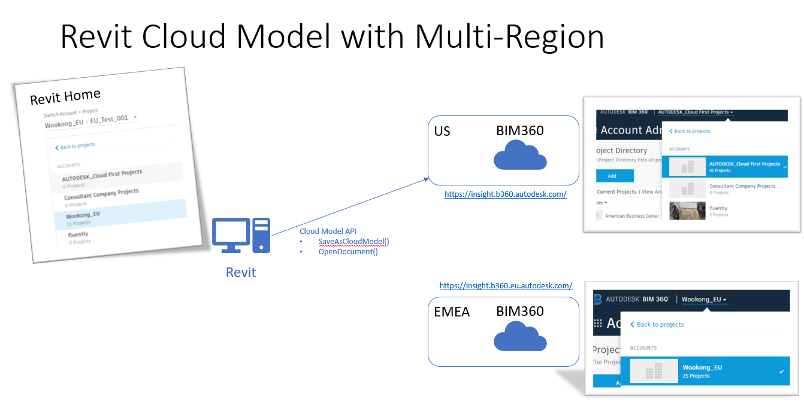
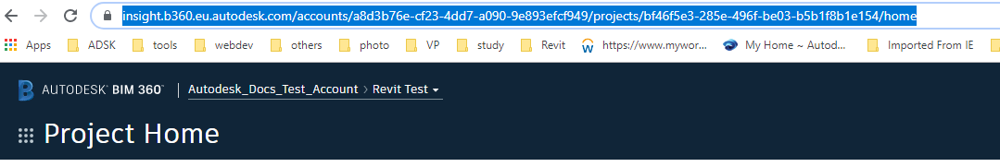
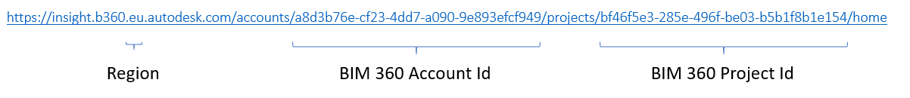
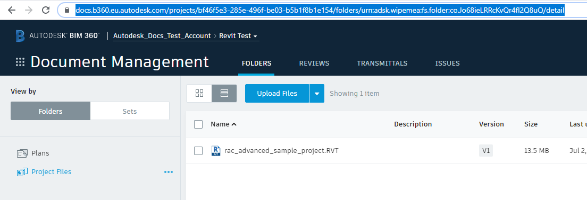
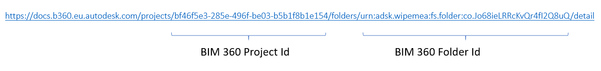

<head>
<meta http-equiv="Content-Type" content="text/html; charset=utf-8">
<link rel="stylesheet" type="text/css" href="bc.css">

</head>

<!---

Phil Xia 
In Revit 2021, our team updated the Revit API to support multi-region, including US and Europe, and also changed the SaveAsCloudModel interface, which accept more arguments from ForgeDM. I am wondering if you can add a new page in your blog to explain the new Cloud Model API and its changes to support Multi-Region in 2021?
I wrote one here, and maybe we can refine it to fit the public standard.
https://wiki.autodesk.com/pages/viewpage.action?pageId=629756479

- BIM 360 Docs - Folder Permission API 
  The blog is published. Tiny tuning and a table is for those six permissions.
  https://forge.autodesk.com/blog/folder-permission-api-bim-360-released

- version 2021 is now available for Design Automation for Revit as well.
 
- Revit 2021 SDK (Update April 6, 2020)
  https://www.autodesk.com/developer-network/platform-technologies/revit
  REVIT_2021_SDK.msi (369348608 bytes)

twitter:

Happy Easter with Revit 2021 and its SDK, an new BIM 360 Docs folder permissions API and powerful new cloud model API functionality in the #RevitAPI #DynamoBim @AutodeskForge @AutodeskRevit #bim #ForgeDevCon https://bit.ly/cloudmodelapi

A nice big egg has been laid just in time for Easter, with the beautiful springtime in full bloom
&ndash; Revit 2021
&ndash; BIM 360 Docs folder permission API
&ndash; Revit 2021 multi-region cloud model API
&ndash; Cloud model API changes
&ndash; How to open a cloud model
&ndash; How to save a local file to a non-workshared cloud model
&ndash; <code>SaveAsCloudModel</code> information in web browser and via the Forge DM API...

linkedin:

Happy Easter with Revit 2021 and its SDK, an new BIM 360 Docs folder permissions API and powerful new cloud model API functionality in the #RevitAPI

https://bit.ly/cloudmodelapi

A nice big egg has been laid just in time for Easter, with the beautiful springtime in full bloom:

- Revit 2021
- BIM 360 Docs folder permission API
- Revit 2021 multi-region cloud model API
- Cloud model API changes
- How to open a cloud model
- How to save a local file to a non-workshared cloud model
- SaveAsCloudModel information in web browser and via the Forge DM API...

#bim #DynamoBim #ForgeDevCon #Revit #API #IFC #SDK #AI #VisualStudio #Autodesk #AEC #adsk

the [Revit API discussion forum](http://forums.autodesk.com/t5/revit-api-forum/bd-p/160) thread

-->

### Revit 2021 Cloud Model API

A nice big egg has been laid just in time for Easter, with the beautiful springtime in full bloom:

- [Revit 2021](#2)
- [BIM 360 Docs folder permission API](#3)
- [Revit 2021 multi-region cloud model API](#4)
    - [Cloud model API changes](#4.3)
    - [How to open a cloud model](#4.4)
    - [How to save a local file to a non-workshared cloud model](#4.5)
    - [`SaveAsCloudModel` information in web browser](#4.6)
    - [`SaveAsCloudModel` information with Forge DM API](#4.7)

#### Revit 2021

Revit 2021 has now been released
with [numerous powerful new features](https://www.autodesk.com/products/revit/new-features).

The corresponding Revit 2021 SDK is available from
the [Revit Developer Centre](https://www.autodesk.com/developer-network/platform-technologies/revit):

- Revit 2021 SDK (Update April 6, 2020)
   REVIT_2021_SDK.msi (369348608 bytes)

#### BIM 360 Docs Folder Permission API

Before we dive into one of the important Revit 2021 API enhancements, here is a brief note to point out that
the [BIM 360 Docs Folder Permission API has been released](https://forge.autodesk.com/blog/folder-permission-api-bim-360-released).

#### Revit 2021 Multi-Region Cloud Model API

I am honoured and grateful to present the following explanation of how to use the updated Revit 2021 Cloud Model API with multi-region projects and models by Phil Xia, Team Manager, Autodesk.

<!-- #### Background &ndash; Revit Multi-Region Cloud Model -->

Revit 2021 includes support for multi-region cloud models.

Autodesk provides two different BIM 360 web portals and regions with different URLs for that:

- [BIM 360 US, at insight.b360.autodesk.com](https://insight.b360.autodesk.com)
- [BIM 360 EU, at insight.b360.eu.autodesk.com](https://insight.b360.eu.autodesk.com)

Now you can save your Revit cloud models to either of these two.

 <!-- 1342 -->

Revit 2021 combines the BIM 360 accounts of the current login user from different regions together in all cloud models entrances:

- Revit Home
- Save as Cloud Model dialog
- Cloud model initialize dialog
- Manage cloud model dialog

So, Revit users can create (upload and saveas) cloud models, authoring models from different regions in one Revit session.

<!--

#### Identifying the Region

No access is provided to determine which region the BIM 360 accounts/projects/models belongs to.
This decision was taken based on user research, interviews and analytic data.

- BIM managers can set up naming conventions for their BIM 360 accounts and projects to indicate the region.
- Only a small percentage of BIM 360 users have both EU and US region BIM 360 accounts.

-->

#### Cloud Model API Changes

The new `ModelPath` property `Region` returns the region of the BIM 360 account and project which contains this model.

Cloud Model API changes:

- ModelPathUtils.ConvertCloudGUIDsToCloudPath( Guid projectGuid, Guid modelGuid ) is replaced
  by ModelPathUtils.ConvertCloudGUIDsToCloudPath( string region, Guid projectGuid, Guid modelGuid )
  &ndash; The new method provides an extra argument to indicate the region of the model to open.
- Document.SaveAsCloudModel( string folderId, string modelName ) is replaced
  by Document.SaveAsCloudModel( Guid accountId, Guid projectId, string folderId, string modelName )
  &ndash; The new method provides two extra arguments to identify the cloud location more efficient and reliable.
  
#### How to Open a Cloud Model

The region argument for ConvertCloudGUIDsToCloudPath is a string type and should be either "US" or "EMEA", depending on which BIM 360 region  account and project the model is stored in.

- US &ndash; [insight.b360.autodesk.com](https://insight.b360.autodesk.com) &ndash; ModelPathUtils.CloudRegionUS
- EU &ndash; [insight.b360.eu.autodesk.com](https://insight.b360.eu.autodesk.com) &ndash; ModelPathUtils.CloudRegionEMEA

Depending on where the cloud model is stored, provide the appropriate region argument "US" or "EMEA", respectively.

<!--
Question: Why not provide the region as an ENUM type, like `Region` {`US`, `EMEA`}?

We may on-board a new region in the middle of Revit release cycle, this is one AC for Revit Cloud Model Multi-Region Support Project. Revit since 2021 has the ability to fetch the supported region from cloud and automatically supports new region when the cloud infrastructure was ready.
-->

To convert a valid CloudPath with the Revit API call *ModelPathUtils.ConvertCloudGUIDsToCloudPath*, you need to register a Forge application and use the Forge Data Management API to get the project Guid and model Guid as the two other arguments.

The [Forge DM API reference on `GET` hubs](https://forge.autodesk.com/en/docs/data/v2/reference/http/hubs-GET) shows how to list the hubs your Forge application can access.

Here is the response body of the list hubs API:

<pre class="prettyprint">
  {
    "type": "hubs",
    "id": "b.6bdabd18-6096-492b-966e-86492a4bb660",
    "attributes": {
      "name": "Wookong_EU",
      "extension": {
        "type": "hubs:autodesk.bim360:Account",
        "version": "1.0",
        "schema": {
          "href": "https://developer.api.autodesk.com/schema/v1/versions/hubs:autodesk.bim360:Account-1.0"
        },
        "data": {}
      },
      "region": "EMEA"
    },
    "links": {
      "self": {
        "href": "https://developer.api.autodesk.com/project/v1/hubs/b.6bdabd18-6096-492b-966e-86492a4bb660"
      }
    },
    "relationships": {
      "projects": {
        "links": {
          "related": {
            "href": "http://developer.api.autodesk.com/dm/v1/hubs/b.6bdabd18-6096-492b-966e-86492a4bb660/projects"
          }
        }
      }
    }
  }
</pre>

You can filter out the BIM 360 accounts of interest using the *data.attributes.name* field.
You can also get the region information here; "EMEA" in this case.  

The [Forge DM API reference on `GET` project folder contents](https://forge.autodesk.com/en/docs/data/v2/reference/http/projects-project_id-folders-folder_id-contents-GET) shows how to list the folder contents you plan to open.

The response body looks like this:

<pre class="prettyprint">
  "included": [
    {
      "type": "versions",
      "id": "urn:adsk.wipbimemeastg:fs.file:vf.VFlOMhozRMac61hJ1JB_Nw?version=1",
      "attributes": {
        "name": "C4R_12_11_2019_10_01_14 AM_28.rvt",
        "displayName": "C4R_12_11_2019_10_01_14 AM_28.rvt",
        "createTime": "2019-12-11T10:01:44.0000000Z",
        "createUserId": "YZVYJQWWAJ89",
        "createUserName": "Phil Xia",
        "lastModifiedTime": "2019-12-11T10:01:47.0000000Z",
        "lastModifiedUserId": "YZVYJQWWAJ89",
        "lastModifiedUserName": "Phil Xia",
        "versionNumber": 1,
        "mimeType": "application/vnd.autodesk.r360",
        "extension": {
          "type": "versions:autodesk.bim360:C4RModel",
          "version": "1.1.0",
          "schema": {
            "href": "https://developer.api.autodesk.com/schema/v1/versions/versions:autodesk.bim360:C4RModel-1.1.0"
          },
          "data": {
            "modelVersion": 3,
            "projectGuid": "fd1335eb-733b-480c-9d16-1a22e742ef70",
            "modelType": "singleuser",
            "latestEpisodeGuid": "11da0d90-e1bb-492a-b90e-f3759ca6ab39",
            "mimeType": "application/vnd.autodesk.r360",
            "modelGuid": "e5a59497-0d79-4df0-879d-396310288bb0",
            "processState": "PROCESSING_COMPLETE",
            "extractionState": "SKIPPED",
            "splittingState": "NOT_SPLIT",
            "revisionDisplayLabel": "1",
            "sourceFileName": "C4R_12_11_2019_10_01_14 AM_28.rvt"
          }
        }
      },
</pre>

You can filter out the relevant cloud model using the *included.attributes.name* field;
the project Guid and model Guid information is provided in the *included.attributes.extension.data* field.

With these three pieces of information &ndash; region, project guid and model guid &ndash; you can convert a valid cloud path with the new ModelPathUtils.ConvertCloudGUIDsToCloudPath method and then open the model with the OpenDocument or OpenAndActivateDocument methods.

#### How to Save a Local File to a Non-Workshared Cloud Model

To save a local Revit file to the cloud as a non-workshared cloud model, you need to get the BIM 360 account id, BIM 360 project id, BIM 360 folder id, and a model name. There are two ways to retrieve this information:

1. From the web browser
2. Using the Forge DM API

#### SaveAsCloudModel Information in Web Browser

Open a web browser, navigate to your BIM 360 project home page and copy the highlighted URL:

 <!-- 1079 -->

The BIM 360 account id and project id are both GUID strings.

They can be extracted from the URL like this:

 <!-- 1202 -->

Navigate to your target BIM 360 Docs folder in the web browser and copy the highlighted URL:

 <!-- 1104 -->

The BIM 360 folder id is embedded in this URL; in this example, it is "urn:adsk.wipemea:fs.folder:co.Jo68ieLRRcKvQr4fI2Q8uQ":

 <!-- 1274 -->

With this information, you can save a local file which is opened in Revit to BIM 360 document management as a cloud model with a call like this:

<pre class="prettyprint">
  Guid account = new Guid("a8d3b76e-cf23-4dd7-a090-9e893efcf949");
  Guid project = new Guid("bf46f5e3-285e-496f-be03-b5b1f8b1e154");
  string folder_id = "urn:adsk.wipemea:fs.folder:co.Jo68ieLRRcKvQr4fI2Q8uQ";
  string model_name = "rac_advanced_sample_project.rvt";
  
  currentDocument.SaveAsCloudModel(
    account, // BIM 360 account id
    project, // BIM 360 project id
    folder_id, // BIM 360 folder id
    model_name // model name
);
</pre>

#### SaveAsCloudModel Information with Forge DM API

With your Forge application, you can:

- List hubs with the [GET hubs API](https://forge.autodesk.com/en/docs/data/v2/reference/http/hubs-GET) to retrieve the region and account ids.
- List projects the [GET projects API](https://forge.autodesk.com/en/docs/data/v2/reference/http/hubs-hub_id-projects-GET) to get all the projects of the given hub and their project ids.
- List the top folders with the [GET top folders API](https://forge.autodesk.com/en/docs/data/v2/reference/http/hubs-hub_id-projects-project_id-topFolders-GET) to get all accessible top folders (depending on permission) and you their valid folder ids, or continue to get the nested folders with the [list folder content API](https://forge.autodesk.com/en/docs/data/v2/reference/http/projects-project_id-folders-folder_id-contents-GET) until the target folder and its folder id is found and can be stored for later use.

With this information, you can save a local file opened in Revit to BIM 360 document management as a cloud model using the same Revit API call as above.

Many thanks to the BIM 360 and Revit development teams for all their work on this and to Phil for putting together the valuable overview!

 <!-- 336 -->

