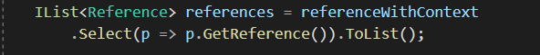

<head>
<meta http-equiv="Content-Type" content="text/html; charset=utf-8">
<link rel="stylesheet" type="text/css" href="bc.css">

</head>

<!---

- The “What is Forge” introduction video is now live on YouTube!

- Using ReferenceIntersector in Linked Files
  https://forums.autodesk.com/t5/revit-api-forum/using-referenceintersector-in-linked-files/m-p/9516302/thread-id/47142

- programming for Robobat
  email Pawel Czepiec <Pawel.Czepiec@autodesk.com> RE: 16540602 : Robot Structural Analysis Professional 2020 Generic

- open RVT file managed by BIM360

twitter:

Forge in 90 seconds, locally opening an RVT file managed by BIM360, programming tools for Robobat and using ReferenceIntersector in linked files in the #RevitAPI @AutodeskForge @AutodeskRevit #bim #DynamoBim #ForgeDevCon https://bit.ly/raytracelinked

Here are our topics for today
&ndash; What is Forge in 90 seconds
&ndash; Locally opening RVT file managed by BIM360
&ndash; Programming tools for Robobat
&ndash; Using <code>ReferenceIntersector</code> in linked files...

linkedin:

Forge in 90 seconds, locally opening an RVT file managed by BIM360, programming tools for Robobat and using ReferenceIntersector in linked files in the #RevitAPI 

https://bit.ly/raytracelinked

Here are our topics for today:

- What is Forge in 90 seconds
- Locally opening RVT file managed by BIM360
- Programming tools for Robobat
- Using <code>ReferenceIntersector</code> in linked files...

#bim #DynamoBim #ForgeDevCon #Revit #API #IFC #SDK #AI #VisualStudio #Autodesk #AEC #adsk

the [Revit API discussion forum](http://forums.autodesk.com/t5/revit-api-forum/bd-p/160) thread

-->

### Using ReferenceIntersector with a Linked File

Here are our topics for today:

- [What is Forge in 90 seconds](#2)
- [Locally opening RVT file managed by BIM360](#3)
- [Programming tools for Robobat](#5)
- [Using `ReferenceIntersector` in linked files](#5)

#### What is Forge in 90 Seconds

A new quick, high-level, non-technical overview of [Autodesk Forge](https://forge.autodesk.com) is
now available on YouTube, the 90-second [*What is Forge* introduction video](https://youtu.be/LvtwXf0AgME).
This short introduction showcases the endless possibilities and some innovative solutions and workflows built with it.
Featured footage includes demos from Moicon, CADshare, Xinaps, Project Frog, and InsiteVR.

#### Locally Opening RVT File Managed by BIM360

**Question:** How can I open an RVT file managed by BIM360 locally using the Revit API, e.g., using `OpenAndActivateDocument`?

**Answer:** What exactly do you mean by *RVT file managed by BIM 360 locally*?

Is the file stored in *%localappdata%\autodesk\revit\CollboarationCache*, coming from RCM?

**Response:** I am using BIM360 to manage the RVT file.
I would now like to add some local processing using full Revit plus my custom add-in.
Of course, I could use the [Forge Data Management API](https://forge.autodesk.com/api/data-management-cover-page/) to
download it, but I hope there is some way to achieve this directly using the Revit API.

**Answer:** Currently, Revit only supports opening RCM-based cloud models.
Revit doesn’t yet support opening files directly uploaded to BIM360.

**Response:** What if the file was uploaded to BIM360 via RCW?

Does the Revit API provide access to it then?

**Answer:** If the file was uploaded to BIM360 via RCW, officially termed as Initiate, and only accessible through the Revit UI and API, then yes, it can be opened via `OpenAndActivateDocument`.

Here is a documentation on [opening a BIM360 file in Design Automation](https://stackoverflow.com/questions/61098804/autodesk-forge-design-automation-error-opening-a-model-how-to-bypass-dialog/61101203#61101203); note that this file is an eTransmitted Workshared file.

If DA is not an option here, the right overload of to use in the Revit API is the `UIApplication` method `OpenAndActivateDocument` taking the arguments `ModelPath`, `OpenOptions`, `Boolean` and `IOpenFromCloudCallback`.

You will also have to call the `ModelPathUtils` method `ConvertCloudGUIDsToCloudPath` taking `String`, `Guid`, `Guid` first.
The two guids are the project id and model id used by RCM to identify the project and model.
For an example, please refer to the discussion
on [how to get project Guid and model Guid from `PathName`](https://stackoverflow.com/questions/51370445/how-to-get-project-guid-and-model-guid-from-pathname). 

#### Programming Tools for Robobat

**Question:** I would like to program using the Robobat API.

The documentation in RSA 2020 suggests using Visual Studio 2008.
The current version of Visual Studio is 2020.

Can you confirm what version of Visual Studio I can use for programming the Robobat API?

**Answer:** The Robot SDK can be installed from any version the standard Robot Structural Analysis installer.

Select *Tools and Utilities* followed by *Autodesk Robot Structural Analysis Professional SDK*.

The SDK includes the document *Getting Started Guide Robot API.pdf* with  information about Visual Studio.
 
The statement about VS 2008 should be more precise and should in fact suggest VS2008 and all later versions.
 
A few other things worth knowing:

- Starting from RSA 2012 all projects need to be compiled in x64 version
- You can use any programming language you like that supports .NET 
- RSA 2020 uses the .NET Framework 4.7
- RSA 2021 uses the .NET Framework 4.8

#### Using ReferenceIntersector in Linked Files

Diving in a bit deeper into the Revit API,
[Ilia Ivanov](https://www.linkedin.com/in/ilya-ivanov-298997161/?locale=en_US) shares a nice example
of [using `ReferenceIntersector` in linked files](https://forums.autodesk.com/t5/revit-api-forum/using-referenceintersector-in-linked-files/m-p/9516302):

I faced the problem of how to use a `ReferenceIntersector` with `RevitLinkInstance` elements.

I achieved a solution using filters etc. that works rather well and I would like to share with the community.

My task was to add opening family instances to each wall intersected by a crossing pipe.
I decided to implement that using `IUpdater`.
My solution worked well with non-linked walls, using filters to make the `ReferenceIntersector` find only walls.
However, when I started preparing the solution for linked walls, I faced a problem: references from the list `ReferenceWithContext` contain the id of a `RevitLinkInstance` and not the id of the target wall, so I couldn't gather the linked walls. 

I looked through the post
on [using `ReferenceIntersector` in linked files](https://thebuildingcoder.typepad.com/blog/2015/07/using-referenceintersector-in-linked-files.html) and
found that we can't get the references from a linked file.

Debugging my code further, I realized a solution.
The `Reference` class has a property `LinkedElementId`.
Given a `RevitLinkInstance` and the property of the element in the linked file we can retrieve the element in the linked file.
But, when my pipe crosses the linked wall, the `ReferenceWithContext` list  contains some amount of elements with the same ids (LinkedElementId, Id), maybe because it also gathers geometry like faces etc.
To distinguish the values in this list, I had to create a custom `EqualityCompare`.

Finally, the code worked perfectly.

Below is the method to gather count of intersected walls.

Note that you need to run it in a 3D view without section boxes achieve good results.

<pre class="code">
public&nbsp;void&nbsp;GetWalls(&nbsp;UIDocument&nbsp;uidoc&nbsp;)
{
&nbsp;&nbsp;Document&nbsp;doc&nbsp;=&nbsp;uidoc.Document;
 
&nbsp;&nbsp;Reference&nbsp;pipeRef&nbsp;=&nbsp;uidoc.Selection.PickObject(&nbsp;
&nbsp;&nbsp;&nbsp;&nbsp;ObjectType.Element&nbsp;);
 
&nbsp;&nbsp;Element&nbsp;pipeElem&nbsp;=&nbsp;doc.GetElement(&nbsp;pipeRef&nbsp;);
 
&nbsp;&nbsp;LocationCurve&nbsp;lc&nbsp;=&nbsp;pipeElem.Location&nbsp;as&nbsp;LocationCurve;
&nbsp;&nbsp;Curve&nbsp;curve&nbsp;=&nbsp;lc.Curve;
 
&nbsp;&nbsp;ReferenceComparer&nbsp;reference1&nbsp;=&nbsp;new&nbsp;ReferenceComparer();
 
&nbsp;&nbsp;ElementFilter&nbsp;filter&nbsp;=&nbsp;new&nbsp;ElementCategoryFilter(&nbsp;
&nbsp;&nbsp;&nbsp;&nbsp;BuiltInCategory.OST_Walls&nbsp;);
 
&nbsp;&nbsp;FilteredElementCollector&nbsp;collector&nbsp;
&nbsp;&nbsp;&nbsp;&nbsp;=&nbsp;new&nbsp;FilteredElementCollector(&nbsp;doc&nbsp;);
 
&nbsp;&nbsp;Func&lt;View3D,&nbsp;bool&gt;&nbsp;isNotTemplate&nbsp;=&nbsp;v3&nbsp;=&gt;&nbsp;!(v3.IsTemplate);
&nbsp;&nbsp;View3D&nbsp;view3D&nbsp;=&nbsp;collector
&nbsp;&nbsp;&nbsp;&nbsp;.OfClass(&nbsp;typeof(&nbsp;View3D&nbsp;)&nbsp;)
&nbsp;&nbsp;&nbsp;&nbsp;.Cast&lt;View3D&gt;()
&nbsp;&nbsp;&nbsp;&nbsp;.First&lt;View3D&gt;(&nbsp;isNotTemplate&nbsp;);
 
&nbsp;&nbsp;ReferenceIntersector&nbsp;refIntersector&nbsp;
&nbsp;&nbsp;&nbsp;&nbsp;=&nbsp;new&nbsp;ReferenceIntersector(&nbsp;
&nbsp;&nbsp;&nbsp;&nbsp;&nbsp;&nbsp;filter,&nbsp;FindReferenceTarget.Element,&nbsp;view3D&nbsp;);
 
&nbsp;&nbsp;refIntersector.FindReferencesInRevitLinks&nbsp;=&nbsp;true;
&nbsp;&nbsp;IList&lt;ReferenceWithContext&gt;&nbsp;referenceWithContext&nbsp;
&nbsp;&nbsp;&nbsp;&nbsp;=&nbsp;refIntersector.Find(&nbsp;
&nbsp;&nbsp;&nbsp;&nbsp;&nbsp;&nbsp;curve.GetEndPoint(&nbsp;0&nbsp;),&nbsp;
&nbsp;&nbsp;&nbsp;&nbsp;&nbsp;&nbsp;(curve&nbsp;as&nbsp;Line).Direction&nbsp;);
 
&nbsp;&nbsp;IList&lt;Reference&gt;&nbsp;references&nbsp;
&nbsp;&nbsp;&nbsp;&nbsp;=&nbsp;referenceWithContext
&nbsp;&nbsp;&nbsp;&nbsp;&nbsp;&nbsp;.Select(&nbsp;p&nbsp;=&gt;&nbsp;p.GetReference()&nbsp;)
&nbsp;&nbsp;&nbsp;&nbsp;&nbsp;&nbsp;.Distinct(&nbsp;reference1&nbsp;)
&nbsp;&nbsp;&nbsp;&nbsp;&nbsp;&nbsp;.Where(&nbsp;p&nbsp;=&gt;&nbsp;p.GlobalPoint.DistanceTo(&nbsp;
&nbsp;&nbsp;&nbsp;&nbsp;&nbsp;&nbsp;&nbsp;&nbsp;curve.GetEndPoint(&nbsp;0&nbsp;)&nbsp;)&nbsp;&lt;&nbsp;curve.Length&nbsp;)
&nbsp;&nbsp;&nbsp;&nbsp;&nbsp;&nbsp;.ToList();
 
&nbsp;&nbsp;IList&lt;Element&gt;&nbsp;walls&nbsp;=&nbsp;new&nbsp;List&lt;Element&gt;();
&nbsp;&nbsp;foreach(&nbsp;Reference&nbsp;reference&nbsp;in&nbsp;references&nbsp;)
&nbsp;&nbsp;{
&nbsp;&nbsp;&nbsp;&nbsp;RevitLinkInstance&nbsp;instance&nbsp;=&nbsp;doc.GetElement(&nbsp;reference&nbsp;)
&nbsp;&nbsp;&nbsp;&nbsp;as&nbsp;RevitLinkInstance;
&nbsp;&nbsp;&nbsp;&nbsp;Document&nbsp;linkDoc&nbsp;=&nbsp;instance.GetLinkDocument();
&nbsp;&nbsp;&nbsp;&nbsp;Element&nbsp;element&nbsp;=&nbsp;linkDoc.GetElement(&nbsp;reference.LinkedElementId&nbsp;);
&nbsp;&nbsp;&nbsp;&nbsp;walls.Add(&nbsp;element&nbsp;);
&nbsp;&nbsp;}
&nbsp;&nbsp;TaskDialog.Show(&nbsp;&quot;Count&nbsp;of&nbsp;wall&quot;,&nbsp;walls.Count.ToString()&nbsp;);
}
 
public&nbsp;class&nbsp;ReferenceComparer&nbsp;:&nbsp;IEqualityComparer&lt;Reference&gt;
{
&nbsp;&nbsp;public&nbsp;bool&nbsp;Equals(&nbsp;Reference&nbsp;x,&nbsp;Reference&nbsp;y&nbsp;)
&nbsp;&nbsp;{
&nbsp;&nbsp;&nbsp;&nbsp;if(&nbsp;x.ElementId&nbsp;==&nbsp;y.ElementId&nbsp;)
&nbsp;&nbsp;&nbsp;&nbsp;{
&nbsp;&nbsp;&nbsp;&nbsp;&nbsp;&nbsp;if(&nbsp;x.LinkedElementId&nbsp;==&nbsp;y.LinkedElementId&nbsp;)
&nbsp;&nbsp;&nbsp;&nbsp;&nbsp;&nbsp;{
&nbsp;&nbsp;&nbsp;&nbsp;&nbsp;&nbsp;&nbsp;&nbsp;return&nbsp;true;
&nbsp;&nbsp;&nbsp;&nbsp;&nbsp;&nbsp;}
&nbsp;&nbsp;&nbsp;&nbsp;&nbsp;&nbsp;return&nbsp;false;
&nbsp;&nbsp;&nbsp;&nbsp;}
&nbsp;&nbsp;&nbsp;&nbsp;return&nbsp;false;
&nbsp;&nbsp;}
 
&nbsp;&nbsp;public&nbsp;int&nbsp;GetHashCode(&nbsp;Reference&nbsp;obj&nbsp;)
&nbsp;&nbsp;{
&nbsp;&nbsp;&nbsp;&nbsp;int&nbsp;hashName&nbsp;=&nbsp;obj.ElementId.GetHashCode();
&nbsp;&nbsp;&nbsp;&nbsp;int&nbsp;hashId&nbsp;=&nbsp;obj.LinkedElementId.GetHashCode();
&nbsp;&nbsp;&nbsp;&nbsp;return&nbsp;hashId&nbsp;^&nbsp;hashId;
&nbsp;&nbsp;}
}
</pre>

Unfortunately, no time to add comments to the code.

Hope it may help somebody.

Here is [reference_intersector_in_linked_files.zip](zip/reference_intersector_in_linked_files.zip) containing
a sample project with a macro to test.

It includes two Revit files:

- Architectural link.rvt
- CountOfLinkedWalls.rvt

The latter hosts the former as a linked file and contains a macro module named `CountOfIntersectedWalls` defining the method `GetWalls` listed above:

In case of need, here is also a code snippet to get a `StableRepresentation` for a linked wall's exterior face:

<pre class="code">
public&nbsp;string&nbsp;GetFaceRefRepresentation(&nbsp;
&nbsp;&nbsp;Wall&nbsp;wall,&nbsp;
&nbsp;&nbsp;Document&nbsp;doc,&nbsp;
&nbsp;&nbsp;RevitLinkInstance&nbsp;instance&nbsp;)
{
&nbsp;&nbsp;Reference&nbsp;faceRef&nbsp;=&nbsp;HostObjectUtils.GetSideFaces(&nbsp;
&nbsp;&nbsp;&nbsp;&nbsp;wall,&nbsp;ShellLayerType.Exterior&nbsp;).FirstOrDefault();
&nbsp;&nbsp;Reference&nbsp;stRef&nbsp;=&nbsp;faceRef.CreateLinkReference(&nbsp;instance&nbsp;);
&nbsp;&nbsp;string&nbsp;stable&nbsp;=&nbsp;stRef.ConvertToStableRepresentation(&nbsp;doc&nbsp;);
&nbsp;&nbsp;return&nbsp;stable;
}
</pre>

Many thanks to Ilia for this nice solution and very helpful explanation!

Added to [The Building Coder samples](https://github.com/jeremytammik/the_building_coder_samples) 
[release 2021.0.148.2](https://github.com/jeremytammik/the_building_coder_samples/releases/tag/2021.0.148.2).
