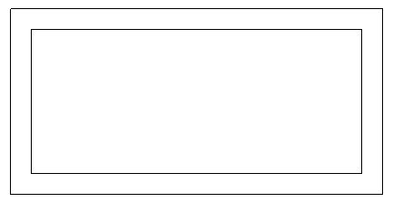
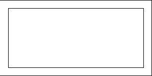
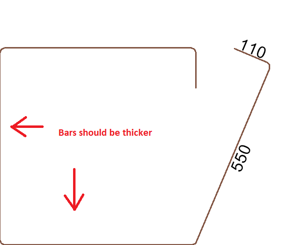
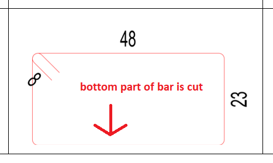

<head>
<meta http-equiv="Content-Type" content="text/html; charset=utf-8">
<link rel="stylesheet" type="text/css" href="bc.css">

</head>

<!---

- Creating a material with texture in Autodesk Revit Forge Design Automation
  https://stackoverflow.com/questions/62297851/creating-a-material-with-texture-in-autodesk-revit-forge-design-automation

- cutting off pixels exporting image
  https://forums.autodesk.com/t5/revit-api-forum/export-image-cutting-off-edge-pixels/m-p/9578304
  https://forums.autodesk.com/t5/revit-api-forum/export-image-is-cutting-few-pixels-from-image-corners/m-p/9346019

- change level of element
  https://thebuildingcoder.typepad.com/blog/2014/03/creating-a-sloped-floor.html#comment-4952460602

- Physics is cool
  https://www.reddit.com/r/BeAmazed/comments/gxrq8p/physics_is_cool/?utm_source=share&utm_medium=web2x

<blockquote class="reddit-card" data-card-created="1591995928"><a href="https://www.reddit.com/r/BeAmazed/comments/gxrq8p/physics_is_cool/">Physics is cool</a> from <a href="http://www.reddit.com/r/BeAmazed">r/BeAmazed</a></blockquote>

- Forge job openings:
  As you consider your network, here are some ways to think about the qualifications for Forge open roles:
  Experience in a cloud environment such as AWS technologies
  Critical thinkers, problem solvers, story tellers, goal oriented, smart, curiosity, empathy 
  Get started with sharing these roles today:
  20WD39627 – Senior Vendor Manager – San Francisco
  20WD38934 – Localization Software Engineer – Singapore
  20WD37407 – Senior Product Manager, Data – Montreal
  20WD40315 – Senior Data Engineer/Architect – Novi https://autodesk.rolepoint.com/?shorturl=xcqfd#job/ahBzfnJvbGVwb2ludC1wcm9kchALEgNKb2IYgIDItNTSsAoM

twitter:

Creating a material with texture in Revit and Forge, exporting image without cutting off pixels, changing level of existing element and Forge job openings with the #RevitAPI @AutodeskForge @AutodeskRevit #bim #DynamoBim #ForgeDevCon https://bit.ly/creatematerialtexture

A bunch of interesting discussions on creating material with texture, modifying element level, cutting off image pixels and other things
&ndash; Creating a material with texture in Revit and Forge
&ndash; Export image cutting off pixels
&ndash; Change level of existing element
&ndash; Physics is cool
&ndash; Forge job openings...

linkedin:

Creating a material with texture in Revit and Forge, exporting image without cutting off pixels, changing level of existing element and Forge job openings with the #RevitAPI 

https://bit.ly/creatematerialtexture

A bunch of interesting discussions on creating material with texture, modifying element level, cutting off image pixels and other things:

- Creating a material with texture in Revit and Forge
- Export image cutting off pixels
- Change level of existing element
- Physics is cool
- Forge job openings...

#bim #DynamoBim #ForgeDevCon #Revit #API #IFC #SDK #AI #VisualStudio #Autodesk #AEC #adsk

the [Revit API discussion forum](http://forums.autodesk.com/t5/revit-api-forum/bd-p/160) thread

-->

### Creating Material Texture and Retaining Pixels

I have been quiet now for a while in shock and grieving about violence and racism in the world.

Meanwhile, a bunch of interesting discussions on creating material with texture, modifying element level, cutting off image pixels and other things:

- [Creating a material with texture in Revit and Forge](#2)
- [Export image cutting off pixels](#3)
- [Change level of existing element](#4)
- [Physics is cool](#5)
- [Forge job openings](#6)

#### Creating a Material with Texture in Revit and Forge

This topic has been very much en vogue lately.
It came up again in the context of Forge in the StackOverflow question
on [creating a material with texture in Autodesk Revit Forge Design Automation](https://stackoverflow.com/questions/62297851/creating-a-material-with-texture-in-autodesk-revit-forge-design-automation),
where [maleficca](https://stackoverflow.com/users/12469767/maleficca) very kindly shares a complete solution for both environments:

**Question:** I'm currently working on some Revit API code which is running in the **Autodesk Forge Design Automation cloud solution**.

Basically, I'm trying to **create a material and attach a texture to it** via the following code:

<pre class="code">
&nbsp;&nbsp;private&nbsp;void&nbsp;AddTexturePath(&nbsp;
&nbsp;&nbsp;&nbsp;&nbsp;AssetProperty&nbsp;asset,
&nbsp;&nbsp;&nbsp;&nbsp;string&nbsp;texturePath&nbsp;)
&nbsp;&nbsp;{
&nbsp;&nbsp;&nbsp;&nbsp;Asset&nbsp;connectedAsset&nbsp;=&nbsp;null;
 
&nbsp;&nbsp;&nbsp;&nbsp;if(&nbsp;asset.NumberOfConnectedProperties&nbsp;==&nbsp;0&nbsp;)
&nbsp;&nbsp;&nbsp;&nbsp;&nbsp;&nbsp;asset.AddConnectedAsset(&nbsp;&quot;UnifiedBitmapSchema&quot;&nbsp;);
 
&nbsp;&nbsp;&nbsp;&nbsp;connectedAsset&nbsp;=&nbsp;(Asset)&nbsp;asset.GetConnectedProperty(&nbsp;0&nbsp;);
 
&nbsp;&nbsp;&nbsp;&nbsp;AssetPropertyString&nbsp;path&nbsp;
&nbsp;&nbsp;&nbsp;&nbsp;&nbsp;&nbsp;=&nbsp;(AssetPropertyString)&nbsp;connectedAsset.FindByName(
&nbsp;&nbsp;&nbsp;&nbsp;&nbsp;&nbsp;&nbsp;&nbsp;UnifiedBitmap.UnifiedbitmapBitmap&nbsp;);
 
&nbsp;&nbsp;&nbsp;&nbsp;if(&nbsp;!path.IsValidValue(&nbsp;texturePath&nbsp;)&nbsp;)
&nbsp;&nbsp;&nbsp;&nbsp;{
&nbsp;&nbsp;&nbsp;&nbsp;&nbsp;&nbsp;File.Create(&nbsp;&quot;texture.png&quot;&nbsp;);
&nbsp;&nbsp;&nbsp;&nbsp;&nbsp;&nbsp;texturePath&nbsp;=&nbsp;Path.GetFullPath(&nbsp;&quot;texture.png&quot;&nbsp;);
&nbsp;&nbsp;&nbsp;&nbsp;}
&nbsp;&nbsp;&nbsp;&nbsp;path.Value&nbsp;=&nbsp;texturePath;
&nbsp;&nbsp;}
</pre>

This is actually working well, as the value for the texture path:

<pre class="code">
  path.Value = texturePath;
</pre>

Needs to be a reference to an existing file. I do not have this file on the cloud instance of Forge, because the path to the texture name is specified by the user when he sends the request for the Workitem.

The problem is that this sets the texture path for the material as something like this:

<pre class="code">
  T:\Aces\Jobs\<workitem_id>\texture.png
</pre>

Which is basically the working folder for the Workitem instance. This path is useless, because a material with texture path like this needs to be manually re-linked in Revit. 

The perfect outcome for me would be if I could somehow map the material texture path to some user-friendly directory like `C:\Textures\texture.png` and it seems that the Forge instance has a `C:\` drive present (being probably a Windows instance of some sorts), but my code runs on low privileges, so it cannot create any kind of directories or files outside the working directory.

Does somebody have any idea how this could be resolved?
Any help would be greatly appreciated!

**Answer:** Congratulations on getting to this point.
Would you like to share the code you use to create the material and attach the texture for the Revit API add-in developer community to enjoy, either here or in a new thread in the Revit API discussion forum?
People keep asking for such samples... Thank you!

**Response:** Here is my own answer and code sample:

After a whole day of research, I pretty much arrived at a satisfying solution. Just for clarity &ndash; I am going to reference to **Autodesk Forge Design Automation API for Revit**, simply as **"Forge"**.

Basically, the code provided above is correct.
I did not find any possible way to create a file on Forge instance, in a directory different than the Workitem working directory which is:

<pre class="code">
  T:\Aces\Jobs\<workitem_id>\texture.png
</pre>

Interestingly, there is a `C:\` drive on the Forge instance, which contains Windows, Revit and .NET Framework installations (as Forge instance is basically some sort of Windows instance with Revit installed). It is possible to enumerate a lot of these directories, but none of the ones I've tried (and I've tried a lot &ndash; mostly the most obvious, public access Windows directories like `C:\Users\Public`, `C:\Program Files`, etc.) allow for creation of directories or files. This corresponds to what is stated in "Restrictions" area of the Forge documentation:

> Your application is run with low privileges, and will not be able to freely interact with the Windows OS:

> - Write access is typically restricted to the job’s working folder.
> - Registry access is mostly restricted, writing to the registry should be avoided.
> - Any sub-process will also be executed with low privileges.

So, after trying to save the "dummy" texture file somewhere on the Forge `C:\` drive, I've found another solution &ndash; **the texture path for your texture actually does not matter.**

This is because Revit offers an alternative for re-linking your textures.
If you fire up Revit, you can go to File &gt; Options &gt; Rendering, and under "Additional render appearance paths" field, you can specify the directories on your local machine, that Revit can use to look for missing textures.
With these, you can do the following operations in order to have full control on creating materials on Forge:

1. Send Workitem to Forge, create the materials.
2. Create a dummy texture in working directory, with the correct file name.
3. Attach the dummy texture file to the material.
4. Output the resulting file (.rvt or .rfa, depending on what you're creating on Forge).
5. Place all textures into one folder (or multiple, this doesn't matter that much).
6. Add the directories with the textures to the Additional render appearance paths.
7. Revit will successfully re-link all the textures to new paths.

I hope someone will find this useful!

Additionally, as per Jeremy's request, I post a code sample for creating material with texture and modifying different Appearance properties in Revit by using Revit API (in C#):

<pre class="code">
&nbsp;&nbsp;private&nbsp;void&nbsp;SetAppearanceParameters(
&nbsp;&nbsp;&nbsp;&nbsp;Document&nbsp;project,
&nbsp;&nbsp;&nbsp;&nbsp;Material&nbsp;mat,&nbsp;
&nbsp;&nbsp;&nbsp;&nbsp;MaterialData&nbsp;data&nbsp;)
&nbsp;&nbsp;{
&nbsp;&nbsp;&nbsp;&nbsp;using(&nbsp;Transaction&nbsp;setParameters&nbsp;=&nbsp;new&nbsp;Transaction(&nbsp;
&nbsp;&nbsp;&nbsp;&nbsp;&nbsp;&nbsp;project,&nbsp;&quot;Set&nbsp;material&nbsp;parameters&quot;&nbsp;)&nbsp;)
&nbsp;&nbsp;&nbsp;&nbsp;{
&nbsp;&nbsp;&nbsp;&nbsp;&nbsp;&nbsp;setParameters.Start();
 
&nbsp;&nbsp;&nbsp;&nbsp;&nbsp;&nbsp;AppearanceAssetElement&nbsp;genericAsset&nbsp;
&nbsp;&nbsp;&nbsp;&nbsp;&nbsp;&nbsp;&nbsp;&nbsp;=&nbsp;new&nbsp;FilteredElementCollector(&nbsp;project&nbsp;)
&nbsp;&nbsp;&nbsp;&nbsp;&nbsp;&nbsp;&nbsp;&nbsp;&nbsp;&nbsp;.OfClass(&nbsp;typeof(&nbsp;AppearanceAssetElement&nbsp;)&nbsp;)
&nbsp;&nbsp;&nbsp;&nbsp;&nbsp;&nbsp;&nbsp;&nbsp;&nbsp;&nbsp;.ToElements()
&nbsp;&nbsp;&nbsp;&nbsp;&nbsp;&nbsp;&nbsp;&nbsp;&nbsp;&nbsp;.Cast&lt;AppearanceAssetElement&gt;().Where(&nbsp;i
&nbsp;&nbsp;&nbsp;&nbsp;&nbsp;&nbsp;&nbsp;&nbsp;&nbsp;&nbsp;&nbsp;&nbsp;=&gt;&nbsp;i.Name.Contains(&nbsp;&quot;Generic&quot;&nbsp;)&nbsp;)
&nbsp;&nbsp;&nbsp;&nbsp;&nbsp;&nbsp;&nbsp;&nbsp;&nbsp;&nbsp;.FirstOrDefault();
 
&nbsp;&nbsp;&nbsp;&nbsp;&nbsp;&nbsp;AppearanceAssetElement&nbsp;newAsset&nbsp;
&nbsp;&nbsp;&nbsp;&nbsp;&nbsp;&nbsp;&nbsp;&nbsp;=&nbsp;genericAsset.Duplicate(&nbsp;data.Name&nbsp;);
 
&nbsp;&nbsp;&nbsp;&nbsp;&nbsp;&nbsp;mat.AppearanceAssetId&nbsp;=&nbsp;newAsset.Id;
 
&nbsp;&nbsp;&nbsp;&nbsp;&nbsp;&nbsp;using(&nbsp;AppearanceAssetEditScope&nbsp;editAsset&nbsp;
&nbsp;&nbsp;&nbsp;&nbsp;&nbsp;&nbsp;&nbsp;&nbsp;=&nbsp;new&nbsp;AppearanceAssetEditScope(&nbsp;project&nbsp;)&nbsp;)
&nbsp;&nbsp;&nbsp;&nbsp;&nbsp;&nbsp;{
&nbsp;&nbsp;&nbsp;&nbsp;&nbsp;&nbsp;&nbsp;&nbsp;Asset&nbsp;editableAsset&nbsp;=&nbsp;editAsset.Start(&nbsp;newAsset.Id&nbsp;);
 
&nbsp;&nbsp;&nbsp;&nbsp;&nbsp;&nbsp;&nbsp;&nbsp;AssetProperty&nbsp;assetProperty&nbsp;
&nbsp;&nbsp;&nbsp;&nbsp;&nbsp;&nbsp;&nbsp;&nbsp;&nbsp;&nbsp;=&nbsp;editableAsset[&nbsp;&quot;generic_diffuse&quot;&nbsp;];
 
&nbsp;&nbsp;&nbsp;&nbsp;&nbsp;&nbsp;&nbsp;&nbsp;SetColor(&nbsp;editableAsset,&nbsp;data.MaterialAppearance.Color&nbsp;);
&nbsp;&nbsp;&nbsp;&nbsp;&nbsp;&nbsp;&nbsp;&nbsp;SetGlossiness(&nbsp;editableAsset,&nbsp;data.MaterialAppearance.Gloss&nbsp;);
&nbsp;&nbsp;&nbsp;&nbsp;&nbsp;&nbsp;&nbsp;&nbsp;SetReflectivity(&nbsp;editableAsset,&nbsp;data.MaterialAppearance.Reflectivity&nbsp;);
&nbsp;&nbsp;&nbsp;&nbsp;&nbsp;&nbsp;&nbsp;&nbsp;SetTransparency(&nbsp;editableAsset,&nbsp;data.MaterialAppearance.Transparency&nbsp;);
 
&nbsp;&nbsp;&nbsp;&nbsp;&nbsp;&nbsp;&nbsp;&nbsp;if(&nbsp;data.MaterialAppearance.Texture&nbsp;!=&nbsp;null
&nbsp;&nbsp;&nbsp;&nbsp;&nbsp;&nbsp;&nbsp;&nbsp;&nbsp;&nbsp;&amp;&amp;&nbsp;data.MaterialAppearance.Texture.Length&nbsp;!=&nbsp;0&nbsp;)
&nbsp;&nbsp;&nbsp;&nbsp;&nbsp;&nbsp;&nbsp;&nbsp;{
&nbsp;&nbsp;&nbsp;&nbsp;&nbsp;&nbsp;&nbsp;&nbsp;&nbsp;&nbsp;AddTexturePath(&nbsp;assetProperty,&nbsp;
&nbsp;&nbsp;&nbsp;&nbsp;&nbsp;&nbsp;&nbsp;&nbsp;&nbsp;&nbsp;&nbsp;&nbsp;$@&quot;C:\{data.MaterialIdentity.Manufacturer}\textures\{data.MaterialAppearance.Texture}&quot;&nbsp;);
&nbsp;&nbsp;&nbsp;&nbsp;&nbsp;&nbsp;&nbsp;&nbsp;}
&nbsp;&nbsp;&nbsp;&nbsp;&nbsp;&nbsp;&nbsp;&nbsp;editAsset.Commit(&nbsp;true&nbsp;);
&nbsp;&nbsp;&nbsp;&nbsp;&nbsp;&nbsp;}
&nbsp;&nbsp;&nbsp;&nbsp;&nbsp;&nbsp;setParameters.Commit();
&nbsp;&nbsp;&nbsp;&nbsp;}
&nbsp;&nbsp;}
 
&nbsp;&nbsp;private&nbsp;void&nbsp;SetTransparency(
&nbsp;&nbsp;&nbsp;&nbsp;Asset&nbsp;editableAsset,
&nbsp;&nbsp;&nbsp;&nbsp;int&nbsp;transparency&nbsp;)
&nbsp;&nbsp;{
&nbsp;&nbsp;&nbsp;&nbsp;AssetPropertyDouble&nbsp;genericTransparency&nbsp;
&nbsp;&nbsp;&nbsp;&nbsp;&nbsp;&nbsp;=&nbsp;editableAsset[&nbsp;&quot;generic_transparency&quot;&nbsp;]
&nbsp;&nbsp;&nbsp;&nbsp;&nbsp;&nbsp;&nbsp;&nbsp;as&nbsp;AssetPropertyDouble;
 
&nbsp;&nbsp;&nbsp;&nbsp;genericTransparency.Value&nbsp;=&nbsp;Convert.ToDouble(&nbsp;
&nbsp;&nbsp;&nbsp;&nbsp;&nbsp;&nbsp;transparency&nbsp;);
&nbsp;&nbsp;}
 
&nbsp;&nbsp;private&nbsp;void&nbsp;SetReflectivity(&nbsp;
&nbsp;&nbsp;&nbsp;&nbsp;Asset&nbsp;editableAsset,
&nbsp;&nbsp;&nbsp;&nbsp;int&nbsp;reflectivity&nbsp;)
&nbsp;&nbsp;{
&nbsp;&nbsp;&nbsp;&nbsp;AssetPropertyDouble&nbsp;genericReflectivityZero
&nbsp;&nbsp;&nbsp;&nbsp;&nbsp;&nbsp;=&nbsp;(AssetPropertyDouble)&nbsp;editableAsset[&nbsp;
&nbsp;&nbsp;&nbsp;&nbsp;&nbsp;&nbsp;&nbsp;&nbsp;&quot;generic_reflectivity_at_0deg&quot;&nbsp;];
 
&nbsp;&nbsp;&nbsp;&nbsp;genericReflectivityZero.Value&nbsp;=&nbsp;Convert.ToDouble(&nbsp;
&nbsp;&nbsp;&nbsp;&nbsp;&nbsp;&nbsp;reflectivity&nbsp;)&nbsp;/&nbsp;100;
 
&nbsp;&nbsp;&nbsp;&nbsp;AssetPropertyDouble&nbsp;genericReflectivityAngle
&nbsp;&nbsp;&nbsp;&nbsp;&nbsp;&nbsp;=&nbsp;(AssetPropertyDouble)&nbsp;editableAsset[
&nbsp;&nbsp;&nbsp;&nbsp;&nbsp;&nbsp;&nbsp;&nbsp;&quot;generic_reflectivity_at_90deg&quot;&nbsp;];
 
&nbsp;&nbsp;&nbsp;&nbsp;genericReflectivityAngle.Value&nbsp;=&nbsp;Convert.ToDouble(&nbsp;
&nbsp;&nbsp;&nbsp;&nbsp;&nbsp;&nbsp;reflectivity&nbsp;)&nbsp;/&nbsp;100;
&nbsp;&nbsp;}
 
&nbsp;&nbsp;private&nbsp;void&nbsp;SetGlossiness(&nbsp;
&nbsp;&nbsp;&nbsp;&nbsp;Asset&nbsp;editableAsset,&nbsp;
&nbsp;&nbsp;&nbsp;&nbsp;int&nbsp;gloss&nbsp;)
&nbsp;&nbsp;{
&nbsp;&nbsp;&nbsp;&nbsp;AssetPropertyDouble&nbsp;glossProperty&nbsp;
&nbsp;&nbsp;&nbsp;&nbsp;&nbsp;&nbsp;=&nbsp;(AssetPropertyDouble)&nbsp;editableAsset[&nbsp;
&nbsp;&nbsp;&nbsp;&nbsp;&nbsp;&nbsp;&nbsp;&nbsp;&quot;generic_glossiness&quot;&nbsp;];
 
&nbsp;&nbsp;&nbsp;&nbsp;glossProperty.Value&nbsp;=&nbsp;Convert.ToDouble(&nbsp;
&nbsp;&nbsp;&nbsp;&nbsp;&nbsp;&nbsp;gloss&nbsp;)&nbsp;/&nbsp;100;
&nbsp;&nbsp;}
 
&nbsp;&nbsp;private&nbsp;void&nbsp;SetColor(
&nbsp;&nbsp;&nbsp;&nbsp;Asset&nbsp;editableAsset,
&nbsp;&nbsp;&nbsp;&nbsp;int[]&nbsp;color&nbsp;)
&nbsp;&nbsp;{
&nbsp;&nbsp;&nbsp;&nbsp;AssetPropertyDoubleArray4d&nbsp;genericDiffuseColor&nbsp;
&nbsp;&nbsp;&nbsp;&nbsp;&nbsp;&nbsp;=&nbsp;(AssetPropertyDoubleArray4d)&nbsp;editableAsset[&nbsp;
&nbsp;&nbsp;&nbsp;&nbsp;&nbsp;&nbsp;&nbsp;&nbsp;&quot;generic_diffuse&quot;&nbsp;];
 
&nbsp;&nbsp;&nbsp;&nbsp;Color&nbsp;newColor&nbsp;=&nbsp;new&nbsp;Color(&nbsp;(byte)&nbsp;color[&nbsp;0&nbsp;],&nbsp;
&nbsp;&nbsp;&nbsp;&nbsp;&nbsp;&nbsp;(byte)&nbsp;color[&nbsp;1&nbsp;],&nbsp;(byte)&nbsp;color[&nbsp;2&nbsp;]&nbsp;);
 
&nbsp;&nbsp;&nbsp;&nbsp;genericDiffuseColor.SetValueAsColor(&nbsp;newColor&nbsp;);
&nbsp;&nbsp;}
 
&nbsp;&nbsp;private&nbsp;void&nbsp;AddTexturePath(&nbsp;
&nbsp;&nbsp;&nbsp;&nbsp;AssetProperty&nbsp;asset,&nbsp;
&nbsp;&nbsp;&nbsp;&nbsp;string&nbsp;texturePath&nbsp;)
&nbsp;&nbsp;{
&nbsp;&nbsp;&nbsp;&nbsp;Asset&nbsp;connectedAsset&nbsp;=&nbsp;null;
&nbsp;&nbsp;&nbsp;&nbsp;if(&nbsp;asset.NumberOfConnectedProperties&nbsp;==&nbsp;0&nbsp;)
&nbsp;&nbsp;&nbsp;&nbsp;&nbsp;&nbsp;asset.AddConnectedAsset(&nbsp;&quot;UnifiedBitmapSchema&quot;&nbsp;);
 
&nbsp;&nbsp;&nbsp;&nbsp;connectedAsset&nbsp;=&nbsp;(Asset)&nbsp;asset.GetConnectedProperty(&nbsp;0&nbsp;);
 
&nbsp;&nbsp;&nbsp;&nbsp;AssetProperty&nbsp;prop&nbsp;=&nbsp;connectedAsset.FindByName(&nbsp;
&nbsp;&nbsp;&nbsp;&nbsp;&nbsp;&nbsp;UnifiedBitmap.UnifiedbitmapBitmap&nbsp;);
 
&nbsp;&nbsp;&nbsp;&nbsp;AssetPropertyString&nbsp;path&nbsp;
&nbsp;&nbsp;&nbsp;&nbsp;&nbsp;&nbsp;=&nbsp;(AssetPropertyString)&nbsp;connectedAsset.FindByName(&nbsp;
&nbsp;&nbsp;&nbsp;&nbsp;&nbsp;&nbsp;&nbsp;&nbsp;UnifiedBitmap.UnifiedbitmapBitmap&nbsp;);
 
&nbsp;&nbsp;&nbsp;&nbsp;string&nbsp;fileName&nbsp;=&nbsp;Path.GetFileName(&nbsp;texturePath&nbsp;);
&nbsp;&nbsp;&nbsp;&nbsp;File.Create(&nbsp;fileName&nbsp;);
&nbsp;&nbsp;&nbsp;&nbsp;texturePath&nbsp;=&nbsp;Path.GetFullPath(&nbsp;fileName&nbsp;);
 
&nbsp;&nbsp;&nbsp;&nbsp;path.Value&nbsp;=&nbsp;texturePath;
&nbsp;&nbsp;}
</pre>

Hopefully it will come in handy to someone in the future!

Also, a huge thanks for The Building Coder; it has saved me a lot of hassle in my work with Revit API and enabled to create a lot of cool stuff!

A great thanks back to maleficca for kindly sharing the two solutions, both for Forge and the Revit desktop API!

#### Export Image Cutting off Pixels

This query just came up again in 
the [Revit API discussion forum](http://forums.autodesk.com/t5/revit-api-forum/bd-p/160) thread
on [export image cutting off edge pixels](https://forums.autodesk.com/t5/revit-api-forum/export-image-cutting-off-edge-pixels/m-p/9578304):

**Question:** I'm trying to export family type images from a family, but I'm getting the edge pixels cut off in my exported images.

Here is the original image:

 <!-- 223 -->

This is what comes out:

 <!-- 150 -->

This is what I currently have for my export image options

<pre class="code">
&nbsp;&nbsp;img&nbsp;=&nbsp;ImageExportOptions()
&nbsp;&nbsp;img.ZoomType&nbsp;=&nbsp;ZoomFitType.FitToPage
&nbsp;&nbsp;img.PixelSize&nbsp;=&nbsp;size
&nbsp;&nbsp;img.ImageResolution&nbsp;=&nbsp;ImageResolution.DPI_150
&nbsp;&nbsp;img.FitDirection&nbsp;=&nbsp;FitDirectionType.Vertical
&nbsp;&nbsp;img.ExportRange&nbsp;=&nbsp;ExportRange.SetOfViews
&nbsp;&nbsp;img.SetViewsAndSheets(&nbsp;viewIds&nbsp;)
&nbsp;&nbsp;img.HLRandWFViewsFileType&nbsp;=&nbsp;ImageFileType.PNG
&nbsp;&nbsp;img.FilePath&nbsp;=&nbsp;filepath
&nbsp;&nbsp;img.ShadowViewsFileType&nbsp;=&nbsp;ImageFileType.PNG
</pre>

A solution was provided by [alexpaduroiu](https://forums.autodesk.com/t5/user/viewprofilepage/user-id/7761409) in a previous conversation
on why [export image is cutting a few pixels from image corners](https://forums.autodesk.com/t5/revit-api-forum/export-image-is-cutting-few-pixels-from-image-corners/m-p/9346019):

**Question:** I have a small problem regarding `Decoument.ExportImage(ImageExportOptions options)`.

I am trying to export a set of drafting views, but somehow the generated images cut the views edges.

A sample image:

 <!-- 500 -->

This image has the bottom part not visible at all:

 <!-- 279 -->

The cut is very small but very frustrating because I can't make it a whole or even offset the element to fit the images.

Image Export Options used:

<pre class="code">
&nbsp;&nbsp;ImageExportOptions&nbsp;imgExportOpts&nbsp;
&nbsp;&nbsp;&nbsp;&nbsp;=&nbsp;new&nbsp;ImageExportOptions()
&nbsp;&nbsp;&nbsp;&nbsp;{
&nbsp;&nbsp;&nbsp;&nbsp;&nbsp;&nbsp;ZoomType&nbsp;=&nbsp;ZoomFitType.FitToPage,
&nbsp;&nbsp;&nbsp;&nbsp;&nbsp;&nbsp;PixelSize&nbsp;=&nbsp;500,
&nbsp;&nbsp;&nbsp;&nbsp;&nbsp;&nbsp;FilePath&nbsp;=&nbsp;rbrImagesDirectory&nbsp;+&nbsp;@&quot;\&quot;,
&nbsp;&nbsp;&nbsp;&nbsp;&nbsp;&nbsp;FitDirection&nbsp;=&nbsp;FitDirectionType.Vertical,
&nbsp;&nbsp;&nbsp;&nbsp;&nbsp;&nbsp;HLRandWFViewsFileType&nbsp;=&nbsp;ImageFileType.PNG,
&nbsp;&nbsp;&nbsp;&nbsp;&nbsp;&nbsp;ShadowViewsFileType&nbsp;=&nbsp;ImageFileType.PNG,
&nbsp;&nbsp;&nbsp;&nbsp;&nbsp;&nbsp;ImageResolution&nbsp;=&nbsp;ImageResolution.DPI_72,
&nbsp;&nbsp;&nbsp;&nbsp;&nbsp;&nbsp;ShouldCreateWebSite&nbsp;=&nbsp;false,
&nbsp;&nbsp;&nbsp;&nbsp;};
 
  imgExportOpts.ExportRange&nbsp;=&nbsp;ExportRange.SetOfViews;
</pre>

I have tried to modify `FitDirectionType.Horizontal` and this makes it worse than it is now by cutting the bottom portion even more; in that case, for the first image, the bottom part of the bar is not visible at all.

The image doesn't have such a big cut in the edges but it will be nice to have some spaces there or at least to see the parts &nbsp; :-)

Is there any way to zoom out the element or move it in order to be arranged better in image?

**Answer:** Well, I have solved the problem!

The problem was with the drafting view I was trying to export. After creating a group of details in the drafting view, somehow the outline of the view wasn't big enough to include my details. don't know for sure why, but what I have done to resolve the problem was the following:

<pre class="code">
&nbsp;&nbsp;drafting.CropBoxActive&nbsp;=&nbsp;true;
&nbsp;&nbsp;drafting.CropBoxVisible&nbsp;=&nbsp;true;

private&nbsp;static&nbsp;void&nbsp;ExtendViewCrop(
&nbsp;&nbsp;View&nbsp;drafting,
&nbsp;&nbsp;Group&nbsp;detail&nbsp;)
{
&nbsp;&nbsp;BoundingBoxXYZ&nbsp;crop&nbsp;=&nbsp;(drafting&nbsp;!=&nbsp;null
&nbsp;&nbsp;&nbsp;&nbsp;?&nbsp;drafting.CropBox
&nbsp;&nbsp;&nbsp;&nbsp;:&nbsp;null);
 
&nbsp;&nbsp;if(&nbsp;crop&nbsp;==&nbsp;null&nbsp;||&nbsp;crop.Max&nbsp;==&nbsp;null&nbsp;||&nbsp;crop.Min&nbsp;==&nbsp;null
&nbsp;&nbsp;&nbsp;&nbsp;||&nbsp;crop.Transform&nbsp;==&nbsp;null&nbsp;||&nbsp;detail&nbsp;==&nbsp;null&nbsp;)
&nbsp;&nbsp;{
&nbsp;&nbsp;&nbsp;&nbsp;return;
&nbsp;&nbsp;}
&nbsp;&nbsp;BoundingBoxXYZ&nbsp;detailBox&nbsp;=&nbsp;detail.get_BoundingBox(&nbsp;drafting&nbsp;);
&nbsp;&nbsp;BoundingBoxXYZ&nbsp;extendedCrop&nbsp;=&nbsp;new&nbsp;BoundingBoxXYZ();
&nbsp;&nbsp;extendedCrop.Transform&nbsp;=&nbsp;crop.Transform;
 
&nbsp;&nbsp;if(&nbsp;detailBox&nbsp;==&nbsp;null&nbsp;||&nbsp;detailBox.Max&nbsp;==&nbsp;null
&nbsp;&nbsp;&nbsp;&nbsp;||&nbsp;detailBox.Min&nbsp;==&nbsp;null&nbsp;)
&nbsp;&nbsp;{
&nbsp;&nbsp;&nbsp;&nbsp;return;
&nbsp;&nbsp;}
&nbsp;&nbsp;extendedCrop.Max&nbsp;=&nbsp;detailBox.Max
&nbsp;&nbsp;&nbsp;&nbsp;&nbsp;&nbsp;+&nbsp;(extendedCrop.Transform.BasisX
&nbsp;&nbsp;&nbsp;&nbsp;&nbsp;&nbsp;+&nbsp;extendedCrop.Transform.BasisY&nbsp;/&nbsp;2)&nbsp;*&nbsp;0.03;
 
&nbsp;&nbsp;extendedCrop.Min&nbsp;=&nbsp;detailBox.Min
&nbsp;&nbsp;&nbsp;&nbsp;&nbsp;&nbsp;+&nbsp;(-extendedCrop.Transform.BasisX
&nbsp;&nbsp;&nbsp;&nbsp;&nbsp;&nbsp;+&nbsp;-extendedCrop.Transform.BasisY&nbsp;/&nbsp;2)&nbsp;*&nbsp;0.03;
 
&nbsp;&nbsp;drafting.CropBox&nbsp;=&nbsp;extendedCrop;
}
</pre>

So basically, extending the view crops max and min on their direction with a small value so the detail will fit in my drafting.

I am sure that there are lots of other better options doing this, but for now it did the trick.

Of course I am open to more solutions &nbsp; :-)

Many thanks to alexpaduroiu for this clear solution.

#### Change Level of Existing Element

Angelo Mastroberardino brought up this question in
his [comment](https://thebuildingcoder.typepad.com/blog/2014/03/creating-a-sloped-floor.html#comment-4952460602)
on [creating a sloped floor](https://thebuildingcoder.typepad.com/blog/2014/03/creating-a-sloped-floor.html):

**Question:** Is it possible to re-set the reference Level of a Floor, once it is created ?

**Answer:**  In general, the `Level` property is read-only and thus cannot be set after an element has been created.
It is specified during creation only and cannot be modified later.

Here are some posts on levels, both general level handling issues and workarounds to set the level property on certain specific element types:

- [Retrieve levels sorted by elevation](https://thebuildingcoder.typepad.com/blog/2014/11/webgl-goes-mobile-and-sorted-level-retrieval.html#3)
- [Family instances lacking or with invalid level property](https://thebuildingcoder.typepad.com/blog/2011/01/family-instance-missing-level-property.html)
- [Changing the level of a floor](https://thebuildingcoder.typepad.com/blog/2019/04/set-floor-level-and-use-ipc-for-disentanglement.html#3)
- [Calculate a level for an element lacking the property](https://thebuildingcoder.typepad.com/blog/2019/03/assigning-a-level-to-an-element-missing-it.html)
- A solution to [change the level of an existing room](https://thebuildingcoder.typepad.com/blog/2020/03/panel-schedule-slots-and-change-room-level.html)

#### Physics is Cool

A very nice and surprising [physics experiment to try out at home](https://www.reddit.com/r/BeAmazed/comments/gxrq8p/physics_is_cool):

<!--
<blockquote class="reddit-card">
<a href="https://www.reddit.com/r/BeAmazed/comments/gxrq8p/physics_is_cool/">Physics is cool</a> 
</blockquote>

-->

<a href="https://www.reddit.com/r/BeAmazed/comments/gxrq8p/physics_is_cool">
 <!-- 125 -->
</a>

#### Forge Job Openings

Are you a critical thinker, problem solver, story teller, goal oriented, smart, curios, empathic, with experience in a cloud environment such as AWS?

If so, would you like to consider applying for a job in the Forge team?

- [20WD39627 – Senior Vendor Manager – San Francisco](https://rolp.co/SS7ji)
- [20WD38934 &ndash; Localization Software Engineer &ndash; Singapore](https://rolp.co/4Obwi)
- [20WD37407 &ndash; Senior Product Manager, Data &ndash; Montreal](https://rolp.co/Q6cUi)
- [20WD40315 &ndash; Senior Data Engineer/Architect &ndash; Novi ](https://rolp.co/pVKii)

Good luck applying for one of these or the many other opportunities that you can find all over the world in
the [Autodesk career site](https://www.autodesk.com/careers)!

