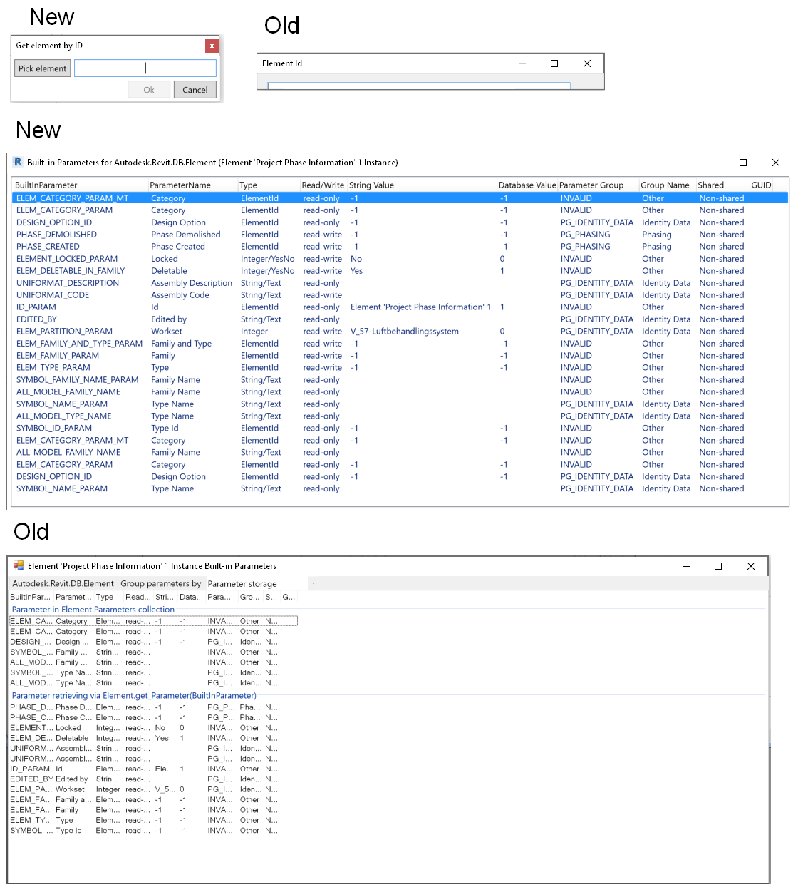
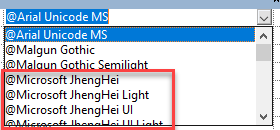
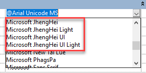
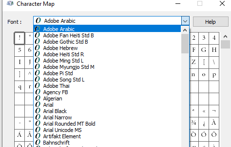
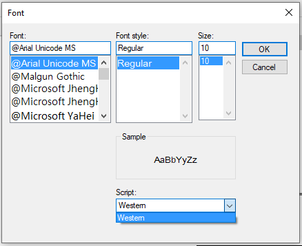

<head>
<meta http-equiv="Content-Type" content="text/html; charset=utf-8">
<link rel="stylesheet" type="text/css" href="bc.css">

</head>

<!---

- get duct shape:
  https://autodesk.slack.com/archives/C2F55JKC6/p1544635935006700

- find out changes between version of .NET assembly DLL
  Q: How can I identify recent additions to the public API? Is there a better way than manually looking at changed files in the commit history?
  A: You can compare the public interfaces in two different versions of the DLL:
  [Free tools to compare .net assemblies](http://patelshailesh.com/index.php/free-tools-to-compare-net-assemblies)

- I gave Jeremys BIP checker a facelift
  https://forums.autodesk.com/t5/revit-api-forum/i-gave-jeremys-bip-checker-a-facelift/m-p/9566362/highlight/false#M47645
  BipCheckerWpf.png

- Fonts starting with "@"
  https://adndevblog.typepad.com/aec/2012/09/fonts-starting-with-.html
  Fonts that begin with '@' 
  https://forums.autodesk.com/t5/revit-api-forum/fonts-that-begin-with/m-p/9566993

twitter:

Get MEP duct shape, determining differences between DLL versions, BipChecker facelift and retrieving fonts with '@' prefix in the #RevitAPI @AutodeskForge @AutodeskRevit #bim #DynamoBim #ForgeDevCon https://bit.ly/bicheckerfacelift

I begin this week with a rather mixed bag of interesting issues from the last
&ndash; Get MEP duct shape update
&ndash; Determining differences between DLL versions
&ndash; BipChecker facelift
&ndash; Fonts with '@' prefix...

linkedin:

Get MEP duct shape, determining differences between DLL versions, BipChecker facelift and retrieving fonts with '@' prefix in the #RevitAPI

https://bit.ly/bicheckerfacelift

I begin this week with a rather mixed bag of interesting issues from the last:

- Get MEP duct shape update
- Determining differences between DLL versions
- BipChecker facelift
- Fonts with '@' prefix...

#bim #DynamoBim #ForgeDevCon #Revit #API #IFC #SDK #AI #VisualStudio #Autodesk #AEC #adsk

the [Revit API discussion forum](http://forums.autodesk.com/t5/revit-api-forum/bd-p/160) thread

-->

### Duct Shape, BipChecker Facelift and @ Fonts

I begin this week with a rather mixed bag of interesting issues from the last:

- [Get MEP duct shape update](#2)
- [Determining differences between DLL versions](#3)
- [BipChecker facelift](#4)
- [Fonts with '@' prefix](#5)

#### Get MEP Duct Shape Update

We have looked at how to determine the MEP duct shape repeatedly in the past, e.g., in the articles on:

- [Distinguishing MEP element shape](http://thebuildingcoder.typepad.com/blog/2011/03/distinguishing-mep-element-shape.html)
- [Improved MEP Element Shape](http://thebuildingcoder.typepad.com/blog/2011/05/improved-mep-element-shape-and-mount-ararat.html)
- [IFC Import Levels and MEP Element Shapes](http://thebuildingcoder.typepad.com/blog/2016/02/ifc-import-levels-and-mep-element-shapes.html)

The question came up again in the following discussion, and the solution is now &ndash; and has been for some time now &ndash; at hand:

**Question:** How can I figure out the duct shape (oval, rectangular or round) from `DuctType` independently of its `FamilyName`? The FamilyName is a localized string, so cannot get the shape info out from it.

**Answer:** You can get the shape based on the connectors. 

**Response:** Does `DuctType` have connector?

**Answer:** I'm not sure..... are you using FabricationParts or generics? Check to see if your element has a connector manager, then check the shape property on your connectors.

<pre class="code">
&nbsp;&nbsp;var&nbsp;fabPart&nbsp;=&nbsp;myElement&nbsp;as&nbsp;FabricationPart;
&nbsp;&nbsp;foreach(&nbsp;Connector&nbsp;conn
&nbsp;&nbsp;&nbsp;&nbsp;in&nbsp;fabPart.ConnectorManager.Connectors&nbsp;)
&nbsp;&nbsp;{
&nbsp;&nbsp;&nbsp;&nbsp;var&nbsp;shape&nbsp;=&nbsp;conn.Shape;
&nbsp;&nbsp;}
</pre>

**Response:** I am using generic ducts, not `FabricationParts`.

I looked at The Building Coder posts listed above, but they don't work.

**Answer:** Perhaps you could take some of the code found in here?

<pre class="code">
DuctType&nbsp;dt&nbsp;=&nbsp;doc.GetElement(&nbsp;tid&nbsp;)
&nbsp;&nbsp;as&nbsp;DuctType;
 
if(&nbsp;null&nbsp;!=&nbsp;dt&nbsp;)
{
&nbsp;&nbsp;if(&nbsp;HasInvalidElementIdValue(&nbsp;e,&nbsp;BuiltInParameter
&nbsp;&nbsp;&nbsp;&nbsp;.RBS_CURVETYPE_MULTISHAPE_TRANSITION_OVALROUND_PARAM&nbsp;)&nbsp;)
&nbsp;&nbsp;{
&nbsp;&nbsp;&nbsp;&nbsp;shape&nbsp;=&nbsp;&quot;rectangular&quot;;
&nbsp;&nbsp;}
&nbsp;&nbsp;else&nbsp;if(&nbsp;HasInvalidElementIdValue(&nbsp;e,&nbsp;BuiltInParameter
&nbsp;&nbsp;&nbsp;&nbsp;.RBS_CURVETYPE_MULTISHAPE_TRANSITION_RECTOVAL_PARAM&nbsp;)&nbsp;)
&nbsp;&nbsp;{
&nbsp;&nbsp;&nbsp;&nbsp;shape&nbsp;=&nbsp;&quot;round&quot;;
&nbsp;&nbsp;}
&nbsp;&nbsp;else&nbsp;if(&nbsp;HasInvalidElementIdValue(&nbsp;e,&nbsp;BuiltInParameter
&nbsp;&nbsp;&nbsp;&nbsp;.RBS_CURVETYPE_MULTISHAPE_TRANSITION_PARAM&nbsp;)&nbsp;)
&nbsp;&nbsp;{
&nbsp;&nbsp;&nbsp;&nbsp;shape&nbsp;=&nbsp;&quot;oval&quot;;
&nbsp;&nbsp;}
}
</pre>

**Response:** This is the same code I found in the link above; it fails when opening a new project not using the mechanical template.

**Answer:** You should be able to call `getProfileType` that is defined in the base class of the type to get the shape. If that doesn't work, you can use first code snippet above; if you replace the `FabricationPart` with `Duct` or `FamilyInstance` (for fittings), you can get the profile shape from the connectors.
The profile type is an enum, so there should be no string related issues.

**Response:** The old version of the Revit API that I am using cannot find `getProfileType` in the `DuctType` base class. The example code above only works when opening a new project using the mechanical template.

**Answer:** It should be defined in the `MEPCurveType` class; it was exposed to the API in 2019.

**Response:** Thanks, we are switching to 2019 soon, I will use it after that, finding a workaround for now.
On Revit 2018, I found that if I create a new project file using the Architectural Template, its three `DuctType` elements only have `Default` on each. In this case, the sample code above does not work. Which API function can create duct types just as when I create a new project using the Mechanical Template? 

**Answer:** I don't think using the duct type will work for what you are trying to do unless you are using 2019 or later. If you access the duct or duct fitting (family instance) and get the connectors from the connector manager from the element you should be able to get the shape. That shape is the same for both.

**Response:** Our plugin is trying to recreate duct type from the data stored externally before drawing a duct instance. For example, if the plugin stores an oval duct type externally called `newDuctType1`, in order to insert this duct instance into the model, it needs to create this duct type in Oval Duct first. The plugin can hard code the "Oval" string to find FamilyName "Oval Duct" in the English version of Revit, but it will not work in other languages. This is why I am looking for a solution or workaround in 2018 to determine the shape from duct type.

Later: I have not found any solution for 2018. We decide to use the sample routine (see above) you created but it works only if all three duct types (oval, rectangular and round) have real duct type in them. The workaround on 2018:

If none of the three parameters in the sample routine return a valid element id, it means the drawing does not have any real duct types except the ones called “Default”; then it displays a warning to the user, asks her to transfer duct types from some other model and delete the ones called “Default”.

**Answer:** I am sure the workaround can be improved, and that a reliable algorithm to distinguish MEP element shapes can be devised. For instance, you could look at the number, geometrical location and direction of the connectors. That will provide a lot of information. You can look at the geometry.

Later: Did you ever resolve this?

**Response:** For Revit 2019 and newer, there is a new `DuctType` property for this, `DuctType.Shape`.

For Revit 2018 and older, we get the value from the RoutingPreferenceRuleGroupType enumeration values
TransitionsRectangularToRound, TransitionsRectangularToOval and TransitionsOvalToRound, then check whether the returned list has count 0.

#### Determining Differences Between DLL Versions

**Question:** How can I find out changes between different versions of a .NET assembly DLL?

For instance, how can I identify recent additions to the public API?

Is there a better way than manually looking at changed files in the commit history?
  
**Answer:** You can easily automate the comparison of public interfaces in two different versions of the DLL, e.g., using [free tools to compare .NET assemblies](http://patelshailesh.com/index.php/free-tools-to-compare-net-assemblies).

#### BipChecker Facelift

[Mathias Ottosson](https://github.com/ottosson)
of [WSP](https://www.wsp.com) very kindly shares an important UI enhancement of
the venerable [BipChecker, the Revit built-in parameter checker](https://thebuildingcoder.typepad.com/blog/about-the-author.html#5.34),
in his [Revit API discussion forum](http://forums.autodesk.com/t5/revit-api-forum/bd-p/160) thread
on [I gave Jeremys BIP checker a facelift](https://forums.autodesk.com/t5/revit-api-forum/i-gave-jeremys-bip-checker-a-facelift/m-p/9566362),
explaining:

I really enjoy the nifty tools that Jeremy has created or maintains, like
the [BipChecker](https://thebuildingcoder.typepad.com/blog/about-the-author.html#5.34)
and [RevitLookup](https://github.com/jeremytammik/Revitlookup).
Truly useful tools that I use more or less daily when I develop for Revit.

But when I use them a lot, I feel some pain points that makes them a little bit less fun to use.

I was using BIP-checker the other day and felt it was a bit annoying to have to expand the columns every time I opened it for a new element, or the fact that it doesn't scale very well on higher DPI monitors, making the select element dialog look weird.
So, I decided to improve it a little and rewrote the UI in WPF instead of winforms to be able to fix those minor issues and to have the ability to maybe add more functionality like copying values and such.

I put it up
on [my BipChecker-WPF GitHub](https://github.com/ottosson/BipChecker-WPF) for everyone to benefit and give feedback.

It's about 98% done as I haven't implemented grouping yet (WPF is truly not easy to work with...), but I hope to get to it soon.

I haven't tested it in all versions of Revit (just 2018).
Since I haven't made any changes to the Revit logic parts, it should work just as well in all versions that Jeremy's version supports.

Improvements:

- Close with Escape key
- Better support for high DPI monitors
- Expanded columns on startup
- Input validation (unable to click ok on invalid id) on manual id input
- Start in active monitor (on multi monitor setups)

 <!-- 1127 -->

As said, I haven't made any logic changes in the Revit code, and all credit still goes to Jeremy for his work.

I just felt this could benefit others and wanted to share with the community.

Ever so many thanks to Mathias for this useful enhancement!

Now I just need to figure out how to also get it into the main master codestream...

#### Fonts with '@' Prefix

Another question from 
the [Revit API discussion forum](http://forums.autodesk.com/t5/revit-api-forum/bd-p/160) thread
that has come up in the past is how to retrieve 
the [fonts that begin with '@'](https://forums.autodesk.com/t5/revit-api-forum/fonts-that-begin-with/m-p/9566993):

This issue was discussed back in 2012 in the article
on [fonts starting with "@"](https://adndevblog.typepad.com/aec/2012/09/fonts-starting-with-.html) by Mikako Harada.

The new thread digs a bit deeper, though, and the solution once again provided
by Richard [RPThomas108](https://forums.autodesk.com/t5/user/viewprofilepage/user-id/1035859) Thomas:

**Question:** I'm doing research on getting Fonts from various elements and assessing whether they are installed on the system.
I've come across an issue with fonts that are available in Revit's list that begin with `@`.
These are not installed on the system and are duplicates of a font without the `@`.
As far as I can tell, these
are [fonts that are used in vertical typefaces](https://knowledge.autodesk.com/support/autocad/learn-explore/caas/CloudHelp/cloudhelp/2016/ENU/AutoCAD-Core/files/GUID-32786109-F454-47DD-AA4C-FB8C37F4430D-htm.html).

 

Fonts that start with '@'

 

Duplicate fonts

 

System fonts

- Why does Revit show these as a duplicate font?
- How can I get these fonts that are listed since they are not installed on the system and may not be in use by an element in Revit?

This is indeed Revit API specific.
I can get the value of the fonts in use by text types, dimension types, etc., by reading the `TEXT_FONT` parameter.
I can also get the fonts on the system by using
the [`InstalledFontCollection` class](https://docs.microsoft.com/en-us/dotnet/api/system.drawing.text.installedfontcollection?view=dotnet-plat-ext-3.1).
It requires a reference to `System.Drawing`.
But neither of these can return the `@Name` fonts that appear in the UI for picking a font.
So, the question is, how can I get the list of fonts that Revit lists for my application?

Code to get system fonts:

<pre class="code">
&nbsp;&nbsp;public&nbsp;void&nbsp;GetAllInstalledFonts()
&nbsp;&nbsp;{
&nbsp;&nbsp;&nbsp;&nbsp;System.Drawing.Text.InstalledFontCollection&nbsp;ifc
&nbsp;&nbsp;&nbsp;&nbsp;&nbsp;&nbsp;=&nbsp;new&nbsp;System.Drawing.Text.InstalledFontCollection();
 
&nbsp;&nbsp;&nbsp;&nbsp;List&lt;string&gt;&nbsp;fontList&nbsp;=&nbsp;new&nbsp;List&lt;string&gt;();
&nbsp;&nbsp;&nbsp;&nbsp;//list&nbsp;of&nbsp;all&nbsp;font&nbsp;family&nbsp;names
&nbsp;&nbsp;&nbsp;&nbsp;foreach(&nbsp;var&nbsp;font&nbsp;in&nbsp;ifc.Families&nbsp;)
&nbsp;&nbsp;&nbsp;&nbsp;&nbsp;&nbsp;fontList.Add(&nbsp;font.Name&nbsp;);
&nbsp;&nbsp;&nbsp;&nbsp;fontList.Sort();
 
&nbsp;&nbsp;&nbsp;&nbsp;TaskDialog.Show(&nbsp;&quot;Installed&nbsp;Fonts&quot;,
&nbsp;&nbsp;&nbsp;&nbsp;&nbsp;&nbsp;string.Join(&nbsp;Environment.NewLine,&nbsp;fontList&nbsp;)&nbsp;);
&nbsp;&nbsp;}
</pre>

**Answer:** Mikako's article
on [fonts starting with "@"](https://adndevblog.typepad.com/aec/2012/09/fonts-starting-with-.html) might help.

I don't know if IT was written for 64bit or 32bit so might need adjustment, also I don't know that it works at all.

There is also the `FontDialog` that you can call up from windows.Forms, even in WPF:

<pre class="code">
Private&nbsp;Function&nbsp;TObj70(
&nbsp;&nbsp;ByVal&nbsp;commandData&nbsp;As&nbsp;Autodesk.Revit.UI.ExternalCommandData,
&nbsp;&nbsp;ByRef&nbsp;message&nbsp;As&nbsp;String,
&nbsp;&nbsp;ByVal&nbsp;elements&nbsp;As&nbsp;Autodesk.Revit.DB.ElementSet)&nbsp;As&nbsp;Result
 
&nbsp;&nbsp;Dim&nbsp;FD&nbsp;As&nbsp;New&nbsp;Windows.Forms.FontDialog
&nbsp;&nbsp;FD.ShowColor&nbsp;=&nbsp;False&nbsp;&#39;or&nbsp;True&nbsp;if&nbsp;you&nbsp;like
&nbsp;&nbsp;FD.ShowEffects&nbsp;=&nbsp;False
&nbsp;&nbsp;FD.MinSize&nbsp;=&nbsp;10
&nbsp;&nbsp;FD.MaxSize&nbsp;=&nbsp;10
&nbsp;&nbsp;FD.ShowEffects&nbsp;=&nbsp;False
&nbsp;&nbsp;FD.AllowScriptChange&nbsp;=&nbsp;False
&nbsp;&nbsp;FD.AllowSimulations&nbsp;=&nbsp;False
 
&nbsp;&nbsp;FD.ShowDialog()
 
&nbsp;&nbsp;Dim&nbsp;Nme&nbsp;As&nbsp;String&nbsp;=&nbsp;&quot;&quot;
&nbsp;&nbsp;If&nbsp;FD.Font.GdiVerticalFont&nbsp;Then
&nbsp;&nbsp;&nbsp;&nbsp;Nme&nbsp;=&nbsp;&quot;@&quot;&nbsp;&amp;&nbsp;FD.Font.Name
&nbsp;&nbsp;Else
&nbsp;&nbsp;&nbsp;&nbsp;Nme&nbsp;=&nbsp;FD.Font.Name
&nbsp;&nbsp;End&nbsp;If
&nbsp;&nbsp;TaskDialog.Show(&quot;Font&quot;,&nbsp;Nme)
 
&nbsp;&nbsp;Return&nbsp;Result.Succeeded
End&nbsp;Function
</pre>

 

Although it lists with the `@` prefix, the name is without it, so you have to add it manually.

From this topic I assume `.GdiVerticalFont` is the appropriate property to determine the '@ness'.

**Response:** The method used in the link you sent to AEC DevBlog helped.
It gives more fonts than are shown by Revit but I think I can work with it.

Many thanks to Richard for the crucial answer.

