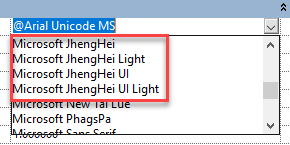

<head>
<meta http-equiv="Content-Type" content="text/html; charset=utf-8">
<link rel="stylesheet" type="text/css" href="bc.css">

</head>

<!---

- get duct shape:
https://autodesk.slack.com/archives/C2F55JKC6/p1544635935006700
https://autodesk.slack.com/archives/C2F55JKC6/p1592411013057400?thread_ts=1544635935.006700&cid=C2F55JKC6
Q: Hi, does anyone know how can I figure out the duct shape (oval, rectangular or round) from DuctType and not depending on its FamilyName? The FamilyName is a localized string so cannot get the shape info out from it.
A: You can get the shape based on the connectors. Let me see if i can dig some code out.
R: does DuctType have connector?
A: I'm not sure..... are you using FabricationParts or generics? Check to see if your element has a connector manager, then check the shape property on your connectors.
A:
var fabPart = myElement as FabricationPart;
foreach (Connector conn in fabPart.ConnectorManager.Connectors)
{
    var shape = conn.Shape;
}
R: I am using generics duct, not FabricationParts, in this case
I found this link (by @tammikj) has sample to get shape from DuctType. But, if I open a projet file using construction template then that function failed.
https://github.com/jeremytammik/the_building_coder_samples/blob/master/BuildingCoder/BuildingCoder/CmdMepElementShape.cs
A: perhaps you could take some of the code found in here?
DuctType dt = doc.GetElement( tid )
            as DuctType;

          if( null != dt )
          {
            if( HasInvalidElementIdValue( e, BuiltInParameter
              .RBS_CURVETYPE_MULTISHAPE_TRANSITION_OVALROUND_PARAM ) )
            {
              shape = "rectangular";
            }
            else if( HasInvalidElementIdValue( e, BuiltInParameter
              .RBS_CURVETYPE_MULTISHAPE_TRANSITION_RECTOVAL_PARAM ) )
            {
              shape = "round";
            }
            else if( HasInvalidElementIdValue( e, BuiltInParameter
              .RBS_CURVETYPE_MULTISHAPE_TRANSITION_PARAM ) )
            {
              shape = "oval";
            }
R: this is the same code I found on the link above, it failed when open a new project not using mechanical template
A: You should be able to call getProfileType that is defined in the base class from the type to get the shape. If for some reason that doesn't work you can use Jaz's example if you replace the FabricationPart with Duct  or FamilyInstance  (for fittings) you can get the profile shape from the connectors.
The profile type is an enum so there should be no string related issues.
R: old version of revit api
- cannot find getProfileType in base class of DuctType.
- the example code above only works when opening a new project using mechanical template
A: It should be defined in the MEPCurveType class, it was exposed to the API in 2019.
R: Thanks, we are switching to 2019 soon, I will use it after that, finding a workaround for now.
on Revit 2018, I found that if I create a new project file using Architectural Template, its three DuctType only have "Default" on each. In this case the sample code above does not work. Which API function can create duct types just as like I create new project using Mechanical Template? (edited) 
A: I don't think using the duct type will work for what you are trying to do (unless you are using 2019). If you access the duct or duct fitting (familyInstance) and get the connectors from the connector manager from the element you should be able to get the shape. That shape is the same for both.
R: our plugin is trying to recreate duct type from the data stored in hfdm before draw duct instance. for example if plugin stores an oval duct type in hfdm called newDuctType1, for plugin to insert this duct instance into drawing, it needs to create this duct type in Oval Duct first. The plugin can hard code "Oval" string to find FamilyName "Oval Duct" In English version Revit, but our client in French using other language Revit shows localized FamilyName "Oval Duct" string so hard code "Oval" in English will not work. This is why I am looking for a solution/workaround in 2018 to determine the shape from duct type.
I have not found any solution for 2018. We decide to use the sample routine (see above) you created but it works only if all three duct types (oval, rectangular and round) have real duct type in them. The workaround on 2018,
1. When the all three parameters in sample routine does not return valid element id which means the drawing does not have real duct type except the one called “Default”, then it prompts warning to the user.
2. Ask the user to transfer duct type from other drawing and delete the one called “Default”.
A: i am sure the workaround can be improved, and i am sure that a reliable algorithm to distinguish mep element shapes can be devised. for instance, you could look at the number, geometrical location and direction of the connectors. that will provide a lot of information. you can look at the geometry.
Here are the three methods implemented so far by The Building Coder; however, I am sure they can be improved!
- https://thebuildingcoder.typepad.com/blog/2011/03/distinguishing-mep-element-shape.html
- https://thebuildingcoder.typepad.com/blog/2011/05/improved-mep-element-shape-and-mount-ararat.html
- https://thebuildingcoder.typepad.com/blog/2016/02/ifc-import-levels-and-mep-element-shapes.html#3

 0554 0578 1406 
<ul>
<li><a href="http://thebuildingcoder.typepad.com/blog/2011/03/distinguishing-mep-element-shape.html">Distinguishing MEP Element Shape</a></li>
<li><a href="http://thebuildingcoder.typepad.com/blog/2011/05/improved-mep-element-shape-and-mount-ararat.html">Improved MEP Element Shape and Mount Ararat</a></li>
<li><a href="http://thebuildingcoder.typepad.com/blog/2016/02/ifc-import-levels-and-mep-element-shapes.html">IFC Import Levels and MEP Element Shapes</a></li>
</ul>

 0554 0578 1406
 <ul> - [Distinguishing MEP Element Shape](http://thebuildingcoder.typepad.com/blog/2011/03/distinguishing-mep-element-shape.html) == - [Improved MEP Element Shape and Mount Ararat](http://thebuildingcoder.typepad.com/blog/2011/05/improved-mep-element-shape-and-mount-ararat.html) == - [IFC Import Levels and MEP Element Shapes](http://thebuildingcoder.typepad.com/blog/2016/02/ifc-import-levels-and-mep-element-shapes.html) == </ul>

Later: did you ever resolve this?
R: for Revit 2019 and newer, there is a new DuctType property for it, DuctType.Shape,
for Revit 2018 and older, we get the value from RoutingPreferenceRuleGroupType.TransitionsOvalToRound, RoutingPreferenceRuleGroupType.TransitionsRectangularToOval and RoutingPreferenceRuleGroupType.TransitionsRectangularToRound, then check if returned list has count 0 (the solution from internet search)

- find out changes between version of .NET assembly DLL
  Q: How can I identify recent additions to the public API? Is there a better way than manually looking at changed files in the commit history?
  A: You can compare the public interfaces in two different versions of the DLL:
  [Free tools to compare .net assemblies](http://patelshailesh.com/index.php/free-tools-to-compare-net-assemblies)

- I gave Jeremys BIP checker a facelift
  https://forums.autodesk.com/t5/revit-api-forum/i-gave-jeremys-bip-checker-a-facelift/m-p/9566362/highlight/false#M47645
  BipCheckerWpf.png

- Fonts starting with "@"
  https://adndevblog.typepad.com/aec/2012/09/fonts-starting-with-.html
  Fonts that begin with '@' 
  https://forums.autodesk.com/t5/revit-api-forum/fonts-that-begin-with/m-p/9566993

twitter:

 with the #RevitAPI @AutodeskForge @AutodeskRevit #bim #DynamoBim #ForgeDevCon 

&ndash; 
...

linkedin:

#bim #DynamoBim #ForgeDevCon #Revit #API #IFC #SDK #AI #VisualStudio #Autodesk #AEC #adsk

the [Revit API discussion forum](http://forums.autodesk.com/t5/revit-api-forum/bd-p/160) thread

-->

### BipChecker Facelift and DuctType Shape

#### MEP Get Duct Shape Update

Q: Hi, does anyone know how can I figure out the duct shape (oval, rectangular or round) from DuctType and not depending on its FamilyName? The FamilyName is a localized string so cannot get the shape info out from it.
A: You can get the shape based on the connectors. Let me see if i can dig some code out.
R: does DuctType have connector?
A: I'm not sure..... are you using FabricationParts or generics? Check to see if your element has a connector manager, then check the shape property on your connectors.
A:
var fabPart = myElement as FabricationPart;
foreach (Connector conn in fabPart.ConnectorManager.Connectors)
{
    var shape = conn.Shape;
}
R: I am using generics duct, not FabricationParts, in this case
I found this link (by @tammikj) has sample to get shape from DuctType. But, if I open a projet file using construction template then that function failed.
https://github.com/jeremytammik/the_building_coder_samples/blob/master/BuildingCoder/BuildingCoder/CmdMepElementShape.cs
A: perhaps you could take some of the code found in here?
DuctType dt = doc.GetElement( tid )
            as DuctType;

          if( null != dt )
          {
            if( HasInvalidElementIdValue( e, BuiltInParameter
              .RBS_CURVETYPE_MULTISHAPE_TRANSITION_OVALROUND_PARAM ) )
            {
              shape = "rectangular";
            }
            else if( HasInvalidElementIdValue( e, BuiltInParameter
              .RBS_CURVETYPE_MULTISHAPE_TRANSITION_RECTOVAL_PARAM ) )
            {
              shape = "round";
            }
            else if( HasInvalidElementIdValue( e, BuiltInParameter
              .RBS_CURVETYPE_MULTISHAPE_TRANSITION_PARAM ) )
            {
              shape = "oval";
            }
R: this is the same code I found on the link above, it failed when open a new project not using mechanical template
A: You should be able to call getProfileType that is defined in the base class from the type to get the shape. If for some reason that doesn't work you can use Jaz's example if you replace the FabricationPart with Duct  or FamilyInstance  (for fittings) you can get the profile shape from the connectors.
The profile type is an enum so there should be no string related issues.
R: old version of revit api
- cannot find getProfileType in base class of DuctType.
- the example code above only works when opening a new project using mechanical template
A: It should be defined in the MEPCurveType class, it was exposed to the API in 2019.
R: Thanks, we are switching to 2019 soon, I will use it after that, finding a workaround for now.
on Revit 2018, I found that if I create a new project file using Architectural Template, its three DuctType only have "Default" on each. In this case the sample code above does not work. Which API function can create duct types just as like I create new project using Mechanical Template? (edited) 
A: I don't think using the duct type will work for what you are trying to do (unless you are using 2019). If you access the duct or duct fitting (familyInstance) and get the connectors from the connector manager from the element you should be able to get the shape. That shape is the same for both.
R: our plugin is trying to recreate duct type from the data stored in hfdm before draw duct instance. for example if plugin stores an oval duct type in hfdm called newDuctType1, for plugin to insert this duct instance into drawing, it needs to create this duct type in Oval Duct first. The plugin can hard code "Oval" string to find FamilyName "Oval Duct" In English version Revit, but our client in French using other language Revit shows localized FamilyName "Oval Duct" string so hard code "Oval" in English will not work. This is why I am looking for a solution/workaround in 2018 to determine the shape from duct type.
I have not found any solution for 2018. We decide to use the sample routine (see above) you created but it works only if all three duct types (oval, rectangular and round) have real duct type in them. The workaround on 2018,
1. When the all three parameters in sample routine does not return valid element id which means the drawing does not have real duct type except the one called “Default”, then it prompts warning to the user.
2. Ask the user to transfer duct type from other drawing and delete the one called “Default”.
A: i am sure the workaround can be improved, and i am sure that a reliable algorithm to distinguish mep element shapes can be devised. for instance, you could look at the number, geometrical location and direction of the connectors. that will provide a lot of information. you can look at the geometry.
Here are the three methods implemented so far by The Building Coder; however, I am sure they can be improved!
- https://thebuildingcoder.typepad.com/blog/2011/03/distinguishing-mep-element-shape.html
- https://thebuildingcoder.typepad.com/blog/2011/05/improved-mep-element-shape-and-mount-ararat.html
- https://thebuildingcoder.typepad.com/blog/2016/02/ifc-import-levels-and-mep-element-shapes.html#3

<!-- 0554 0578 1406 -->
<ul>
<li><a href="http://thebuildingcoder.typepad.com/blog/2011/03/distinguishing-mep-element-shape.html">Distinguishing MEP Element Shape</a></li>
<li><a href="http://thebuildingcoder.typepad.com/blog/2011/05/improved-mep-element-shape-and-mount-ararat.html">Improved MEP Element Shape and Mount Ararat</a></li>
<li><a href="http://thebuildingcoder.typepad.com/blog/2016/02/ifc-import-levels-and-mep-element-shapes.html">IFC Import Levels and MEP Element Shapes</a></li>
</ul>

<!-- 0554 0578 1406 --> <ul> - [Distinguishing MEP Element Shape](http://thebuildingcoder.typepad.com/blog/2011/03/distinguishing-mep-element-shape.html) == - [Improved MEP Element Shape and Mount Ararat](http://thebuildingcoder.typepad.com/blog/2011/05/improved-mep-element-shape-and-mount-ararat.html) == - [IFC Import Levels and MEP Element Shapes](http://thebuildingcoder.typepad.com/blog/2016/02/ifc-import-levels-and-mep-element-shapes.html) == </ul>

Later: did you ever resolve this?
R: for Revit 2019 and newer, there is a new DuctType property for it, DuctType.Shape,
for Revit 2018 and older, we get the value from RoutingPreferenceRuleGroupType.TransitionsOvalToRound, RoutingPreferenceRuleGroupType.TransitionsRectangularToOval and RoutingPreferenceRuleGroupType.TransitionsRectangularToRound, then check if returned list has count 0 (the solution from internet search)

- find out changes between version of .NET assembly DLL
  Q: How can I identify recent additions to the public API? Is there a better way than manually looking at changed files in the commit history?
  A: You can compare the public interfaces in two different versions of the DLL:
  [Free tools to compare .net assemblies](http://patelshailesh.com/index.php/free-tools-to-compare-net-assemblies)

#### BipChecker Facelift

[Mathias Ottosson](https://github.com/ottosson)
of [WSP](https://www.wsp.com) very kindly shares an important UI enhancement of
the venerable [BipChecker, the Revit built-in parameter checker](https://thebuildingcoder.typepad.com/blog/about-the-author.html#5.34),
in his [Revit API discussion forum](http://forums.autodesk.com/t5/revit-api-forum/bd-p/160) thread
on [I gave Jeremys BIP checker a facelift](https://forums.autodesk.com/t5/revit-api-forum/i-gave-jeremys-bip-checker-a-facelift/m-p/9566362),
explaining:

I really enjoy the nifty tools that Jeremy has created/maintain, like
the [BipChecker](https://thebuildingcoder.typepad.com/blog/about-the-author.html#5.34)
and [RevitLookup](https://github.com/jeremytammik/Revitlookup).
Truly useful tools that I use more or less daily when I develop for Revit.

But when I use them a lot, I feel some pain points that makes them a little bit less fun to use.

I was using BIP-checker the other day and felt it was a bit annoying to have to expand the columns every time I opened it for a new element, or the fact that it doesn't scale very well on higher DPI monitors, making the select element dialog look weird.
So, I decided to improve it a little and rewrote the UI in WPF instead of winforms to be able to fix those minor issues and to have the ability to maybe add more functionality like copying values and such.

I put it up
on [my BipChecker-WPF GitHub](https://github.com/ottosson/BipChecker-WPF) for everyone to benefit and give feedback.

It's about 98% done as I haven't implemented grouping yet (WPF is truly not easy to work with...), but I hope to get to it soon.

I haven't tested it in all versions of Revit (just 2018).
Since I haven't made any changes to the Revit logic parts, it should work just as well in all versions that Jeremy's version supports.

Improvements:

- Close with Escape key
- Better support for high DPI monitors
- Expanded columns on startup
- Input validation (unable to click ok on invalid id) on manual id input
- Start in active monitor (on multi monitor setups)

 <!-- 1127 -->

As said, I haven't made any logic changes in the Revit code, and all credit still goes to Jeremy for his work.

I just felt this could benefit others and wanted to share with the community.

Ever so many thanks to Mathias for this useful enhancement!

Now I just need to figure out how to also get it into the main master codestream...

#### Fonts with '@' Prefix

Another question from 
the [Revit API discussion forum](http://forums.autodesk.com/t5/revit-api-forum/bd-p/160) thread
that has come up in the past is how to retrieve 
the [fonts that begin with '@'](https://forums.autodesk.com/t5/revit-api-forum/fonts-that-begin-with/m-p/9566993):

This issue was discussed back in 2012 in the article
on [fonts starting with "@"](https://adndevblog.typepad.com/aec/2012/09/fonts-starting-with-.html) by Mikako Harada.

The new thread digs a bit deeper, though:

**Question:** I'm doing research on getting Fonts from various elements and assessing whether they are installed on the system.
I've come across an issue with fonts that are available in Revit's list that begin with `@`.
These are not installed on the system and are duplicates of a font without the `@`.
As far as I can tell, these
are [fonts that are used in vertical typefaces](https://knowledge.autodesk.com/support/autocad/learn-explore/caas/CloudHelp/cloudhelp/2016/ENU/AutoCAD-Core/files/GUID-32786109-F454-47DD-AA4C-FB8C37F4430D-htm.html).

 

Fonts that start with '@'

 

Duplicate fonts

 

System fonts

- Why does Revit show these as a duplicate font?
- How can I get these fonts that are listed since they are not installed on the system and may not be in use by an element in Revit?

This is indeed Revit API specific.
I can get the value of the fonts in use by text types, dimension types, etc., by reading the `TEXT_FONT` parameter.
I can also get the fonts on the system by using
the [`InstalledFontCollection` class](https://docs.microsoft.com/en-us/dotnet/api/system.drawing.text.installedfontcollection?view=dotnet-plat-ext-3.1).
It requires a reference to `System.Drawing`.
But neither of these can return the `@Name` fonts that appear in the UI for picking a font.
So, the question is, how can I get the list of fonts that Revit lists for my application?

Code to get system fonts:

<pre class="code">
		public void GetAllInstalledFonts()
        {
            System.Drawing.Text.InstalledFontCollection ifc = new System.Drawing.Text.InstalledFontCollection();
            
            List<string> fontList = new List<string>();
            //list of all font family names
			foreach (var font in ifc.Families) 
                fontList.Add(font.Name);
			fontList.Sort();
            
            TaskDialog.Show("Installed Fonts", string.Join(Environment.NewLine, fontList));
        }
</pre>

**Answer:** Mikako's article
on [fonts starting with "@"](https://adndevblog.typepad.com/aec/2012/09/fonts-starting-with-.html) might help.

I don't know if IT was written for 64bit or 32bit so might need adjustment, also I don't know that it works at all.

There is also the `FontDialog` that you can call up from windows.Forms, even in WPF:

<pre class="code">
  Private Function TObj70( _
    ByVal commandData As Autodesk.Revit.UI.ExternalCommandData, _
    ByRef message As String, _
    ByVal elements As Autodesk.Revit.DB.ElementSet) As Result

    Dim FD As New Windows.Forms.FontDialog
    FD.ShowColor = False 'or True if you like
    FD.ShowEffects = False
    FD.MinSize = 10
    FD.MaxSize = 10
    FD.ShowEffects = False
    FD.AllowScriptChange = False
    FD.AllowSimulations = False

    FD.ShowDialog()

    Dim Nme As String = ""
    If FD.Font.GdiVerticalFont Then
      Nme = "@" & FD.Font.Name
    Else
      Nme = FD.Font.Name
    End If
    TaskDialog.Show("Font", Nme)

    Return Result.Succeeded
  End Function
</pre>

 

Although it lists with the `@` prefix, the name is without it, so you have to add it manually.

From this topic I assume `.GdiVerticalFont` is the appropriate property to determine the '@ness'.

**Response:** The method used in the link you sent to AEC DevBlog helped.
It gives more fonts than are shown by Revit but I think I can work with it.

