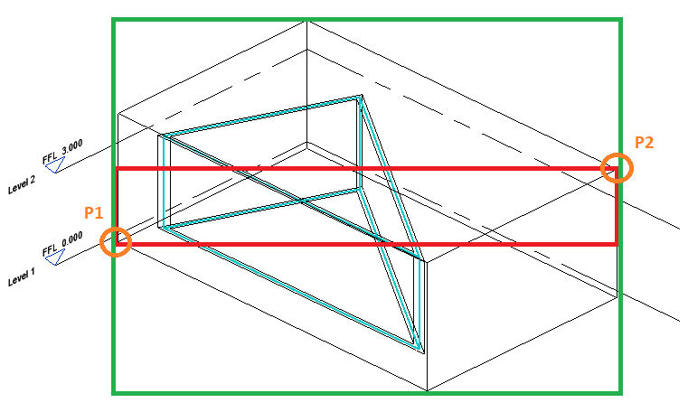

<head>
<meta http-equiv="Content-Type" content="text/html; charset=utf-8">
<link rel="stylesheet" type="text/css" href="bc.css">

</head>

<!---

- Set View Cropbox to a Section Box
  https://forums.autodesk.com/t5/revit-api-forum/set-view-cropbox-to-a-section-box/m-p/9600049

twitter:

 in the #RevitAPI @AutodeskForge @AutodeskRevit #bim #DynamoBim #ForgeDevCon 

&ndash; 
...

linkedin:

#bim #DynamoBim #ForgeDevCon #Revit #API #IFC #SDK #AI #VisualStudio #Autodesk #AEC #adsk

the [Revit API discussion forum](http://forums.autodesk.com/t5/revit-api-forum/bd-p/160) thread

-->

### Set View Crop to Section Box

Richard [RPThomas108](https://forums.autodesk.com/t5/user/viewprofilepage/user-id/1035859) Thomas
continues sharing solutions at an unsurpassed pace:

#### Set View Crop to Section Box

The main result for today is Richard's solution to
the [Revit API discussion forum](http://forums.autodesk.com/t5/revit-api-forum/bd-p/160) thread
on [setting view cropbox to a section box](https://forums.autodesk.com/t5/revit-api-forum/set-view-cropbox-to-a-section-box/m-p/9600049),
originally asked six years ago, in 2014, and now finally resolved:

**Question:** I am sure this is a simply question, but how do I set a 3D view crop box to match (the outer corners of) a section box?

**Answer:** The Building Coder discussed how
to [set view section box to match scope box](http://thebuildingcoder.typepad.com/blog/2012/08/set-view-section-box-to-match-scope-box.html).

In this differrnt situation, the two boxes have different coordinate systems, so one has to transformed into the other.
Also consider below that the maximum and minimum points of the section box are not enough alone to properly frame the section box with a crop box.
If you transform P1 and P2 below from the coordinate space of the section box into the coordinate space of the view, you would end up with the red box.
You need to know the missing corners; then you can transform all of the eight corner points into the coordinate space of the view.
You then find the max/min `XYZ` from those and set crop box to green rectangle:

 <!-- 761 -->

I wrote this extension method:

<pre class="code">

 <Extension()>
    Public Sub AdjustCropToSectionBox(View3D As View3D)
        'View3D crop can't have a shape assigned and can't be split
        If View3D.CropBoxActive = False Then
            View3D.CropBoxActive = True
        End If
        If View3D.IsSectionBoxActive = False Then
            Exit Sub
        End If

        Dim CropBox As BoundingBoxXYZ = View3D.CropBox
        Dim SectionBox As BoundingBoxXYZ = View3D.GetSectionBox

        Dim T As Transform = CropBox.Transform
        Dim Corners As XYZ() = BBCorners(SectionBox, T)

        Dim MinX As Double = Corners.Min(Function(j) j.X)
        Dim MinY As Double = Corners.Min(Function(j) j.Y)
        Dim MinZ As Double = Corners.Min(Function(j) j.Z)
        Dim MaxX As Double = Corners.Max(Function(j) j.X)
        Dim MaxY As Double = Corners.Max(Function(j) j.Y)
        Dim MaxZ As Double = Corners.Max(Function(j) j.Z)

        CropBox.Min = New XYZ(MinX, MinY, MinZ)
        CropBox.Max = New XYZ(MaxX, MaxY, MaxZ)

        View3D.CropBox = CropBox
    End Sub
    Private Function BBCorners(SectionBox As BoundingBoxXYZ, T As Transform) As XYZ()
        Dim Btm_LL As XYZ = SectionBox.Min 'Lower Left
        Dim Btm_LR As New XYZ(SectionBox.Max.X, SectionBox.Min.Y, SectionBox.Min.Z) 'Lower Right
        Dim Btm_UL As New XYZ(SectionBox.Min.X, SectionBox.Max.Y, SectionBox.Min.Z) 'Upper Left
        Dim Btm_UR As New XYZ(SectionBox.Max.X, SectionBox.Max.Y, SectionBox.Min.Z) 'Upper Right

        Dim Top_UR As XYZ = SectionBox.Max 'Upper Right
        Dim Top_UL As New XYZ(SectionBox.Min.X, SectionBox.Max.Y, SectionBox.Max.Z) 'Upper Left
        Dim Top_LR As New XYZ(SectionBox.Max.X, SectionBox.Min.Y, SectionBox.Max.Z) 'Lower Right
        Dim Top_LL As New XYZ(SectionBox.Min.X, SectionBox.Min.Y, SectionBox.Max.Z) 'Lower Left

        Dim Out As XYZ() = New XYZ(7) {Btm_LL, Btm_LR, Btm_UL, Btm_UR, Top_UR, Top_UL, Top_LR, Top_LL}

        For i = 0 To Out.Length - 1
            'Transform bounding box corords to model coords
            Out(i) = SectionBox.Transform.OfPoint(Out(i))
            'Transform bounding box coords to view coords
            Out(i) = T.Inverse.OfPoint(Out(i))
        Next
        Return Out
    End Function
</pre>

It is also worth considering that the extents of the section box may not be appropriate for how you wish to crop the view. The section box below is relatively tight on the wall elements but due to the viewing angle there is a lot of spare space to the right. When you print that on a sheet it will not be evident why the view content is off centre and what the extra space is for:

 <!-- 593 -->

**Response:** This solution worked great; I translated to C# and have posted it here for C# coders:
 
<pre class="code">

public static void AdjustCropToSectionBox(this View3D View3D)
{
if (View3D.CropBoxActive == false)
{
View3D.CropBoxActive = true;
}

if (View3D.IsSectionBoxActive == false)
{
return;
}

BoundingBoxXYZ CropBox = View3D.CropBox;
BoundingBoxXYZ SectionBox = View3D.GetSectionBox();
Transform T = CropBox.Transform;
var Corners = BBCorners(SectionBox, T);
double MinX = Corners.Min(j => j.X);
double MinY = Corners.Min(j => j.Y);
double MinZ = Corners.Min(j => j.Z);
double MaxX = Corners.Max(j => j.X);
double MaxY = Corners.Max(j => j.Y);
double MaxZ = Corners.Max(j => j.Z);
CropBox.Min = new XYZ(MinX, MinY, MinZ);
CropBox.Max = new XYZ(MaxX, MaxY, MaxZ);
View3D.CropBox = CropBox;
}

private static XYZ[] BBCorners(BoundingBoxXYZ SectionBox, Transform T)
{
XYZ Btm_LL = SectionBox.Min; // Lower Left
var Btm_LR = new XYZ(SectionBox.Max.X, SectionBox.Min.Y, SectionBox.Min.Z); // Lower Right
var Btm_UL = new XYZ(SectionBox.Min.X, SectionBox.Max.Y, SectionBox.Min.Z); // Upper Left
var Btm_UR = new XYZ(SectionBox.Max.X, SectionBox.Max.Y, SectionBox.Min.Z); // Upper Right
XYZ Top_UR = SectionBox.Max; // Upper Right
var Top_UL = new XYZ(SectionBox.Min.X, SectionBox.Max.Y, SectionBox.Max.Z); // Upper Left
var Top_LR = new XYZ(SectionBox.Max.X, SectionBox.Min.Y, SectionBox.Max.Z); // Lower Right
var Top_LL = new XYZ(SectionBox.Min.X, SectionBox.Min.Y, SectionBox.Max.Z); // Lower Left
var Out = new XYZ[8] { Btm_LL, Btm_LR, Btm_UL, Btm_UR, Top_UR, Top_UL, Top_LR, Top_LL };
for (int i = 0, loopTo = Out.Length - 1; i <= loopTo; i++)
{
// Transform bounding box corords to model coords
Out[i] = SectionBox.Transform.OfPoint(Out[i]);
// Transform bounding box coords to view coords
Out[i] = T.Inverse.OfPoint(Out[i]);
}

return Out;
}
}
</pre>

Many thanks to Richard and Frank for the solution and the C# translation.

#### 

**Response:** 

**Answer:** 

<pre class="code">
</pre>

