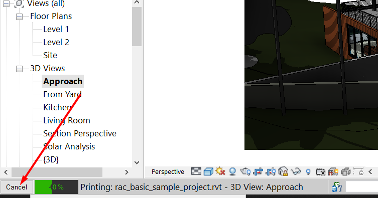
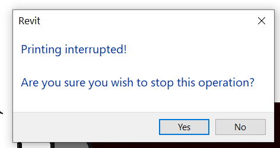

<head>
<meta http-equiv="Content-Type" content="text/html; charset=utf-8">
<link rel="stylesheet" type="text/css" href="bc.css">

</head>

<!---

- Seeking feedback from developers regarding Revit API (Derived Analytical Model)
  https://forums.autodesk.com/t5/revit-api-forum/seeking-feedback-from-developers-regarding-revit-api-derived/m-p/9615258
  Are you a developer who interacts with the Revit API regarding the Derived Analytical Model? If so, please take 5 minutes to provide your input. We would like to hear from you. Our goal is to get a better understanding what functions developers are using and how they are using them. Please feel free to forward this on to a developer you work with. Please click here to provide input: https://autodeskfeedback.az1.qualtrics.com/jfe/form/SV_9Xe2uafQg3X9xXf

- pick room in either
  https://forums.autodesk.com/t5/revit-api-forum/pickobject-to-select-room-in-current-model-or-linked-models/m-p/9624169

- How to get info that Revit custom export of a view is canceled
https://stackoverflow.com/questions/62794859/how-to-get-info-that-revit-custom-export-of-a-view-is-canceled
**Question:** I have used Revit custom export of a model for exporting a 3D View based on IExportContext. It works fine. But I found that the export process can be Canceled (see screen below) Custom export canceling Then appears a dialog Dialog screen I have 2 questions:
custom_export_cancel_button.png
1. How to get info that exporting was canceled?
2. Why the name of operation is Printing (see Dialog screen shot)
custom_export_cancel_printing.png
**Answer:** 
1. Implement and handle the [`IExportContext`
`IsCanceled` method](https://www.revitapidocs.com/2020/31f0b662-81a1-89b8-ab2a-0de99af3b753.htm).
2. Because the custom export is in fact a printing or exporting context, cf. the [`CustomExporter` documentation](https://www.revitapidocs.com/2020/d2437433-9183-cbb1-1c67-dedd86db5b5a.htm): *The Export method of this class triggers standard rendering or exporting process in Revit, but instead of displaying the result on screen or printer, the output is channeled through the given custom context that handles processing of the geometric as well as non-geometric information*.

- Revit API is single threaded; add-in can use multiple threads

- a beautiful [Beginner’s Guide To Abstraction](https://jesseduffield.com/beginners-guide-to-abstraction/)
  by Jesse Duffield in a [Pursuit of Laziness](https://jesseduffield.com)
  Experienced programmers know it all, but beatifully put for a less experienced coder.

twitter:

Selection filter to pick room in current project or linked model, determining whether custom export was cancelled and multi-threading with the single-threaded #RevitAPI @AutodeskForge @AutodeskRevit #bim #DynamoBim #ForgeDevCon https://bit.ly/pickroominlink

Cool topics to wrap up this hot and exciting week
&ndash; Are you using the derived analytical model?
&ndash; Pick room in current project or linked model
&ndash; Determine whether custom export was cancelled
&ndash; Multi-threading with the single-threaded Revit API
&ndash; Beginner’s guide to abstraction...

linkedin:

Selection filter to pick room in current project or linked model, determining whether custom export was cancelled and multi-threading with the single-threaded #RevitAPI

https://bit.ly/pickroominlink

Cool topics to wrap up this hot and exciting week:

- Are you using the derived analytical model?
- Pick room in current project or linked model
- Determine whether custom export was cancelled
- Multi-threading with the single-threaded Revit API
- Beginner’s guide to abstraction...

#bim #DynamoBim #ForgeDevCon #Revit #API #IFC #SDK #AI #VisualStudio #Autodesk #AEC #adsk

the [Revit API discussion forum](http://forums.autodesk.com/t5/revit-api-forum/bd-p/160) thread

-->

### Selection in Link, Cancel in Export, Multithreading

Cool topics to wrap up this hot and exciting week:

- [Are you using the derived analytical model?](#2)
- [Pick room in current project or linked model](#3)
- [Determine whether custom export was cancelled](#4)
- [Multi-threading with the single-threaded Revit API](#5)
- [Beginner’s guide to abstraction](#6)

#### Are You Using the Derived Analytical Model?

If so, please provide feedback on your experiences to Charlene Portante, Building Engineering User Experience Research Coordinator at Autodesk.

She is [seeking feedback from developers regarding the Derived Analytical Model Revit API](https://forums.autodesk.com/t5/revit-api-forum/seeking-feedback-from-developers-regarding-revit-api-derived/m-p/9615258):

> Are you a developer who interacts with the Revit API regarding the Derived Analytical Model?

> If so, please take 5 minutes to provide your input. We would like to hear from you.

> Our goal is to get a better understanding what functions developers are using and how they are using them.

> Please feel free to forward this on to a developer you work with.

> Please click here to provide input:

> [https://autodeskfeedback.az1.qualtrics.com/jfe/form/SV_9Xe2uafQg3X9xXf](https://autodeskfeedback.az1.qualtrics.com/jfe/form/SV_9Xe2uafQg3X9xXf)

Thank you!

#### Pick Room in Current Project or Linked Model

Richard [RPThomas108](https://forums.autodesk.com/t5/user/viewprofilepage/user-id/1035859) Thomas and I cooperated nicely and enjoyably to develop a novel solution
for [`PickObject` to select a room in current model or linked models](https://forums.autodesk.com/t5/revit-api-forum/pickobject-to-select-room-in-current-model-or-linked-models/m-p/9624169):

**Question:** I’m working on a Revit add-in and would like to prompt the user to select a room in the model.
The room can be from either the current project or the linked models.
With the help from previous posts in the forum I’m able  to make some progress so far, but still none of the approaches is ideal.
Here are what I’ve tried and the downsides:

- *PickObject( ObjectType.Element, roomSelectionFilter)* &ndash; This works great for rooms in current model, but won’t allow user to select rooms from linked models.
- *PickObject( ObjectType.LinkedElement, roomSelectionFilter_linkedRoom)* &ndash; This is the opposite of above: it works great for rooms in linked models, but won’t allow user to select rooms from current model.
- *PickObject(ObjectType.PointOnElement)* &ndash; This one allows user to select elements in both current and linked models. However, it’s not limited to rooms &ndash; or at least I haven’t come up with a proper `ISelectionFilter` to achieve so.

So, any ideas? I’m thinking if there’s a way to combine 1. and 2. in one pick, or maybe there can be an `ISelectionFilter` to filter out anything that is not a room for 3.? Appreciate your help!

**Answer:** To cut a long story short, we ended up implementing the latter suggestion, asking `PickObject` to pick a point and limiting the valid selection to room elements, either directly in the current model or in two steps in one of the linked models.

I cleaned up the solution originally implemented by Richard and added it to [The Building Coder samples](https://github.com/jeremytammik/the_building_coder_samples).
Here is the [diff to the previous version](https://github.com/jeremytammik/the_building_coder_samples/compare/2021.0.149.2.../2021.0.150.0).

The selection filter looks like this:

<pre class="code">
&nbsp;&nbsp;public&nbsp;class&nbsp;ElementInLinkSelectionFilter&lt;T&gt;
&nbsp;&nbsp;&nbsp;&nbsp;:&nbsp;ISelectionFilter&nbsp;where&nbsp;T&nbsp;:&nbsp;Element
&nbsp;&nbsp;{
&nbsp;&nbsp;&nbsp;&nbsp;private&nbsp;Document&nbsp;_doc;
 
&nbsp;&nbsp;&nbsp;&nbsp;public&nbsp;ElementInLinkSelectionFilter(&nbsp;Document&nbsp;doc&nbsp;)
&nbsp;&nbsp;&nbsp;&nbsp;{
&nbsp;&nbsp;&nbsp;&nbsp;&nbsp;&nbsp;_doc&nbsp;=&nbsp;doc;
&nbsp;&nbsp;&nbsp;&nbsp;}
 
&nbsp;&nbsp;&nbsp;&nbsp;public&nbsp;Document&nbsp;LinkedDocument&nbsp;{&nbsp;get;&nbsp;private&nbsp;set;&nbsp;}&nbsp;=&nbsp;null;
 
&nbsp;&nbsp;&nbsp;&nbsp;public&nbsp;bool&nbsp;LastCheckedWasFromLink
&nbsp;&nbsp;&nbsp;&nbsp;{
&nbsp;&nbsp;&nbsp;&nbsp;&nbsp;&nbsp;get&nbsp;{&nbsp;return&nbsp;null&nbsp;!=&nbsp;LinkedDocument;&nbsp;}
&nbsp;&nbsp;&nbsp;&nbsp;}
 
&nbsp;&nbsp;&nbsp;&nbsp;public&nbsp;bool&nbsp;AllowElement(&nbsp;Element&nbsp;e&nbsp;)
&nbsp;&nbsp;&nbsp;&nbsp;{
&nbsp;&nbsp;&nbsp;&nbsp;&nbsp;&nbsp;return&nbsp;true;
&nbsp;&nbsp;&nbsp;&nbsp;}
 
&nbsp;&nbsp;&nbsp;&nbsp;public&nbsp;bool&nbsp;AllowReference(&nbsp;Reference&nbsp;r,&nbsp;XYZ&nbsp;p&nbsp;)
&nbsp;&nbsp;&nbsp;&nbsp;{
&nbsp;&nbsp;&nbsp;&nbsp;&nbsp;&nbsp;LinkedDocument&nbsp;=&nbsp;null;
 
&nbsp;&nbsp;&nbsp;&nbsp;&nbsp;&nbsp;Element&nbsp;e&nbsp;=&nbsp;_doc.GetElement(&nbsp;r&nbsp;);
 
&nbsp;&nbsp;&nbsp;&nbsp;&nbsp;&nbsp;if(&nbsp;e&nbsp;is&nbsp;RevitLinkInstance&nbsp;)
&nbsp;&nbsp;&nbsp;&nbsp;&nbsp;&nbsp;{
&nbsp;&nbsp;&nbsp;&nbsp;&nbsp;&nbsp;&nbsp;&nbsp;RevitLinkInstance&nbsp;li&nbsp;=&nbsp;e&nbsp;as&nbsp;RevitLinkInstance;
 
&nbsp;&nbsp;&nbsp;&nbsp;&nbsp;&nbsp;&nbsp;&nbsp;LinkedDocument&nbsp;=&nbsp;li.GetLinkDocument();
 
&nbsp;&nbsp;&nbsp;&nbsp;&nbsp;&nbsp;&nbsp;&nbsp;e&nbsp;=&nbsp;LinkedDocument.GetElement(&nbsp;r.LinkedElementId&nbsp;);
&nbsp;&nbsp;&nbsp;&nbsp;&nbsp;&nbsp;}
&nbsp;&nbsp;&nbsp;&nbsp;&nbsp;&nbsp;return&nbsp;e&nbsp;is&nbsp;T;
&nbsp;&nbsp;&nbsp;&nbsp;}
&nbsp;&nbsp;}
</pre>

Here is the resulting external command for testing it:

<pre class="code">
&nbsp;&nbsp;public&nbsp;Result&nbsp;Execute(
&nbsp;&nbsp;&nbsp;&nbsp;ExternalCommandData&nbsp;commandData,
&nbsp;&nbsp;&nbsp;&nbsp;ref&nbsp;string&nbsp;message,
&nbsp;&nbsp;&nbsp;&nbsp;ElementSet&nbsp;elements&nbsp;)
&nbsp;&nbsp;{
&nbsp;&nbsp;&nbsp;&nbsp;UIApplication&nbsp;uiapp&nbsp;=&nbsp;commandData.Application;
&nbsp;&nbsp;&nbsp;&nbsp;UIDocument&nbsp;uidoc&nbsp;=&nbsp;uiapp.ActiveUIDocument;
&nbsp;&nbsp;&nbsp;&nbsp;Document&nbsp;doc&nbsp;=&nbsp;uidoc.Document;
&nbsp;&nbsp;&nbsp;&nbsp;Reference&nbsp;r;
 
&nbsp;&nbsp;&nbsp;&nbsp;ElementInLinkSelectionFilter&lt;Room&gt;&nbsp;filter
&nbsp;&nbsp;&nbsp;&nbsp;&nbsp;&nbsp;=&nbsp;new&nbsp;ElementInLinkSelectionFilter&lt;Room&gt;(
&nbsp;&nbsp;&nbsp;&nbsp;&nbsp;&nbsp;&nbsp;&nbsp;doc&nbsp;);
 
&nbsp;&nbsp;&nbsp;&nbsp;try
&nbsp;&nbsp;&nbsp;&nbsp;{
&nbsp;&nbsp;&nbsp;&nbsp;&nbsp;&nbsp;r&nbsp;=&nbsp;uidoc.Selection.PickObject(
&nbsp;&nbsp;&nbsp;&nbsp;&nbsp;&nbsp;&nbsp;&nbsp;ObjectType.PointOnElement,
&nbsp;&nbsp;&nbsp;&nbsp;&nbsp;&nbsp;&nbsp;&nbsp;filter,
&nbsp;&nbsp;&nbsp;&nbsp;&nbsp;&nbsp;&nbsp;&nbsp;&quot;Please&nbsp;pick&nbsp;a&nbsp;room&nbsp;in&nbsp;current&nbsp;project&nbsp;or&nbsp;linked&nbsp;model&quot;&nbsp;);
&nbsp;&nbsp;&nbsp;&nbsp;}
&nbsp;&nbsp;&nbsp;&nbsp;catch(&nbsp;Autodesk.Revit.Exceptions.OperationCanceledException&nbsp;)
&nbsp;&nbsp;&nbsp;&nbsp;{
&nbsp;&nbsp;&nbsp;&nbsp;&nbsp;&nbsp;return&nbsp;Result.Cancelled;
&nbsp;&nbsp;&nbsp;&nbsp;}
 
&nbsp;&nbsp;&nbsp;&nbsp;Element&nbsp;e;
 
&nbsp;&nbsp;&nbsp;&nbsp;if(&nbsp;filter.LastCheckedWasFromLink&nbsp;)
&nbsp;&nbsp;&nbsp;&nbsp;{
&nbsp;&nbsp;&nbsp;&nbsp;&nbsp;&nbsp;e&nbsp;=&nbsp;filter.LinkedDocument.GetElement(
&nbsp;&nbsp;&nbsp;&nbsp;&nbsp;&nbsp;&nbsp;&nbsp;r.LinkedElementId&nbsp;);
&nbsp;&nbsp;&nbsp;&nbsp;}
&nbsp;&nbsp;&nbsp;&nbsp;else
&nbsp;&nbsp;&nbsp;&nbsp;{
&nbsp;&nbsp;&nbsp;&nbsp;&nbsp;&nbsp;e&nbsp;=&nbsp;doc.GetElement(&nbsp;r&nbsp;);
&nbsp;&nbsp;&nbsp;&nbsp;}
 
&nbsp;&nbsp;&nbsp;&nbsp;TaskDialog.Show(&nbsp;&quot;Picked&quot;,&nbsp;e.Name&nbsp;);
 
&nbsp;&nbsp;&nbsp;&nbsp;return&nbsp;Result.Succeeded;
&nbsp;&nbsp;}
</pre>

Richard confirms that it still works for him as well.

#### Determine Whether Custom Export was Cancelled

A quickie from the StackOverflow question
on [how to get info that Revit custom export of a view is cancelled](https://stackoverflow.com/questions/62794859/how-to-get-info-that-revit-custom-export-of-a-view-is-canceled):

**Question:** I used Revit custom export of a model for exporting a 3D view based on `IExportContext`.
It works fine.
But I found that the export process can be cancelled:

 <!-- 753 -->

If the custom export is cancelled, a dialog box is shown:

 <!-- 472 -->

I have 2 questions:

1. How to get info that exporting was cancelled?
2. Why is the name of the operation *Printing*?

**Answers:**

1. Implement and handle the [`IExportContext`
`IsCanceled` method](https://www.revitapidocs.com/2020/31f0b662-81a1-89b8-ab2a-0de99af3b753.htm).
2. Because the custom export is in fact a printing or exporting context, cf. the [`CustomExporter` documentation](https://www.revitapidocs.com/2020/d2437433-9183-cbb1-1c67-dedd86db5b5a.htm): *The Export method of this class triggers standard rendering or exporting process in Revit, but instead of displaying the result on screen or printer, the output is channelled through the given custom context that handles processing of the geometric as well as non-geometric information*.

#### Multi-Threading with the Single-Threaded Revit API

**Question:** I have a quick question here: does Revit addin run as a child process of Revit or the addins run in the same process of Revit?
Also, where in the code do we start the execution of an addin?

**Answer:** I believe that it is the same process.
In fact, you have to be careful to keep execution of API from the addin code on the main thread of Revit.
As to where execution begins, an addin is packaged as an application class and there are startup/shutdown methods.
To quote: "You have to be careful to keep execution of API from the addin code on the main thread of Revit."

**Question:** Why do we need to be careful to keep the execution in the main thread?

**Answer:** You cannot call Revit API from multiple threads, because most of Revit code is a critical section.
Weird corruptions and crashes; it's totally against the way Revit runs.
It can be quite easy to accidentally let some code call Revit API from a non-main thread.
I think it can happen when you have timers and UI containers that update asynchronously and need to update something in Revit.
Here is an explantion of
why [the Revit API is never ever thread safe](https://thebuildingcoder.typepad.com/blog/2014/11/the-revit-api-is-never-ever-thread-safe.html).

**Response:** Okay, I understand the thread-safety and critical section ideas.
I think 'process' and 'thread' are different concepts.
Processes are typically independent of each other, while threads exist as the subset of a process.
Does it mean: Revit addin runs in the main thread of Revit, so addin and Revit are in the same process, they share the memory?
This is the question we want to know.

**Answer:** Yes.
Although, no, that is not entirely true.
Revit addins can be multi-threaded.
The Revit API can only be correctly accessed from the main thread.
That is one reason we have external events that give addins a chance to safely call Revit API methods when another thread says they need to.

**Question:** Is it entirely true that Revit and the addin share the same memory?

**Answer:** The way I understand it is that an addin can spawn threads for computation or UI purposes, but calls to Revit API should be made from the same thread, the one that calls those Startup/OnDocumentOpen methods, etc.
Edit: external events appear to be a special case.
The Revit process owns the main thread which executes both code inside of Revit and the .NET code.
You are able to see a call stack that starts in the addin and goes all the way down to Revit.
Past the managed/unmanaged transition.
In fact, there can be several such transitions.

**Question:** Is it entirely true that Revit and the addin share the same memory?
Could you rephrase?

**Answer:** What is being attempted or prevented?
Again, note that there is [no multithreading in Revit](https://thebuildingcoder.typepad.com/blog/2011/06/no-multithreading-in-revit.html).

**Question:** We are trying to understand the exact relationship between Revit and its addins, so we ask experts if an addin can snoop on Revit's memory and find secrets like service credentials.

**Answer:** I think that can be phrased as a general question for security experts: if you call code in a managed assembly, can it see memory inside of the caller? I think it is possible, but .NET is rather sophisticated about tracking trust level of the assemblies.

**Response:** Yes &ndash; I like that rephrase.

**Response:** Thank you! You got exactly what we want to know!

**Answer:** I can't add much, particularly not much about how managed code is restricted.
At a low level, any process like the one that is running Revit.exe has a single address space.
All threads and all DLLs that exist in the process "see" the same data.
Yes, a given thread of execution can transition between native and managed, which, at higher level, each present a different world to the executing code.
We know that the way physical memory is mapped into address space cannot be changing very much on these transitions, or when switching among threads, because remapping so often would be too slow.
Security?
Native code, in particular, could be trampling on anything at any time.
It's the Wild Wild West.
Exploits like Spectre feed on that freedom.
Addins are simply DLLs, but well-behaved addins are limited by the managed architecture and, well, correctness.
The so-called main or UI thread of Revit is usually in charge.
That's the one your addin code is running in by default.
Managed code running within an Addin is permitted to create managed side threads.
There are a lot of things the code can make happen in these threads, including ending up in native code, but for correctness, such should not be calling arbitrary Revit APIs.

#### Beginner’s Guide To Abstraction

We end this week with a beautiful [Beginner’s Guide To Abstraction](https://jesseduffield.com/beginners-guide-to-abstraction)
presented by Jesse Duffield in a [Pursuit of Laziness](https://jesseduffield.com).

Nothing new for an experienced programmer, but beautifully put for less experienced coders.

The nice name of Jesse's blog may or may not be inspired by Larry Wall's [three virtues](http://threevirtues.com).

Have a nice weekend!
