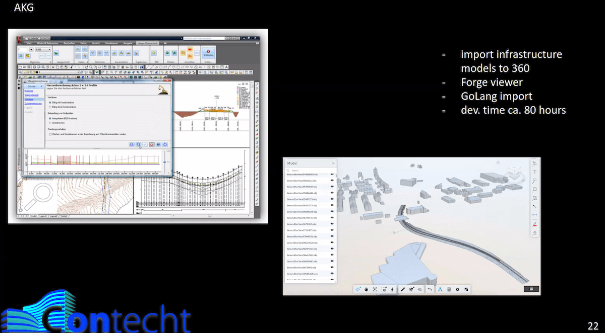
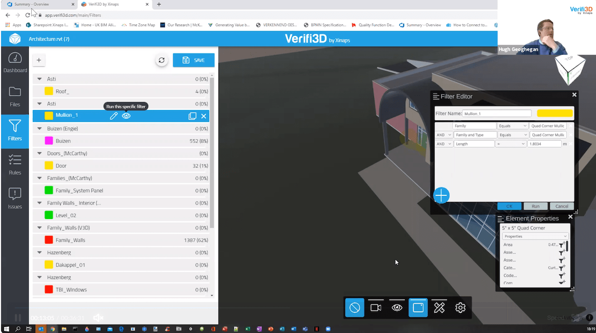

<head>
<meta http-equiv="Content-Type" content="text/html; charset=utf-8">
<link rel="stylesheet" type="text/css" href="bc.css">

</head>

<!---

twitter:

More on Revit 2021.1, IFC 21.1, and AEC Hackathon final presentations coming up with the #RevitAPI @AutodeskForge @AutodeskRevit #bim #DynamoBim #ForgeDevCon https://bit.ly/aechackpres

More on Revit 2021.1, IFC 21.1, and nearing the end of the AEC Hackathon
&ndash; Revit 2021.1 questions
&ndash; IFC 21.1 released
&ndash; AEC Hackathon final presentations...

linkedin:

More on Revit 2021.1, IFC 21.1, and AEC Hackathon final presentations coming up with the #RevitAPI

https://bit.ly/aechackpres

- Revit 2021.1 questions
- IFC 21.1 released
- AEC Hackathon final presentations...

#bim #DynamoBim #ForgeDevCon #Revit #API #IFC #SDK #AI #VisualStudio #Autodesk #AEC #adsk

the [Revit API discussion forum](http://forums.autodesk.com/t5/revit-api-forum/bd-p/160) thread

-->

### IFC 21.1 and AEC Hackathon Presentations

More on Revit 2021.1, IFC 21.1, and nearing the end of the AEC Hackathon:

- [Revit 2021.1 questions](#2)
- [IFC 21.1 released](#3)
- [AEC Hackathon final presentations](#4)

#### Revit 2021.1 Questions

Yesterday, I mentioned [the Revit 2021.1 update](https://thebuildingcoder.typepad.com/blog/2020/07/revit-20211-update-and-normalising-custom-export-uv.html#2).

Two questions arose on that:

Vincent Cadoret [@vincentcadoret](https://twitter.com/vincentcadoret)
[asks](https://twitter.com/vincentcadoret/status/1286292927573090305):

Q: Any changes in the Revit API in this 2021.1 update vs 2021.0?

A: Please read
the [Revit 2021.1 release notes](https://help.autodesk.com/view/RVT/2021/ENU/?guid=RevitReleaseNotes_2021updates_2021_1_Resolved_Issues_2021_1_html) and
let us know what you find out &ndash; I see some API enhancements and fixes, so there is a slight change, indeed.

E B [@truevis](https://twitter.com/truevis)
[asks](https://twitter.com/truevis/status/1286301553096179712):

Q: Any API access to Shared Views available?

A: Again, check out the release notes and let us know what you find out.
For example, I do see an entry saying, *Shared View: Provided an easy way to share 3D views in Revit*.

#### IFC 21.1 Released

Also on Twitter, Angel Velez [@avelezsosa](https://twitter.com/avelezsosa)
[announced](https://twitter.com/avelezsosa/status/1281601656828960769) that IFC 21.1 came out:

[#Autodesk #Revit #IFC v21.1 is now available in the Autodesk App Store](https://apps.autodesk.com/RVT/en/Detail/Index?id=7265544480016320144&appLang=en&os=Win64)

Working on getting v20.2 and v19.4 out next.

Also works with #Navisworks!  

#### AEC Hackathon Final Presentations

The [AEC Hackathon online](https://www.hackaec.com) is in full swing, nearing its final stages now

The dreaded hacking deadline is looming near, however: hacking ends today, July 24, at 23:59 EST (UTC-4).

Some presentations are already live:

- Timo Hartmann Professor from TU Berlin and CEO of Startup Contecht presenting "Hacking cloud exchanges - Finally BIM Collaboration", their Journey as a Startup and their Forge BIM 360 API Applications
&ndash; [Recording](https://us02web.zoom.us/webinar/register/WN_UGoFqfUhSymhDNd7IodC7g)

- Moicon Presentation
&ndash; [Recording](https://us02web.zoom.us/webinar/register/WN_Kn4dGTcWTr2ivQcnliWpdw )
- Xinaps Presentation
&ndash; [Recording](https://us02web.zoom.us/webinar/register/WN_DSAec3V0Q_G6l0gBovhdrg)

Here is the [Deep Dive Challenge with Jim and Jaime](https://us02web.zoom.us/webinar/register/WN__Ivnm-diRJm-3llL--mWxQ)

 <!-- 1200 -->

The final presentations are taking place tomorrow, Saturday, July 25th, 13:00 EST (UTC-4), 19:00 CET.

The judges are:

- Abdulrahman Mohamad Aarabi (Abed), [MOE](https://www.moe.dk), Artelia Group
- Hugh Geoghegan, [Xinaps](https://www.xinaps.com)
- [Jaime Rosales](https://forge.autodesk.com/author/jaime-rosales), Autodesk
- Jakob Hirn, [Build Informed GmbH](https://www.buildinformed.com)
- Martin Loučka, [ioLabs](https://iolabs.ch)

Good luck in the end spurt and much success completing and presenting!

Or, in case you are not actively participating yourself, take a look, enjoy, and prepare for being astounded seeing what the hackers created in this short space of time.

There is a lot to learn and profit from here.

