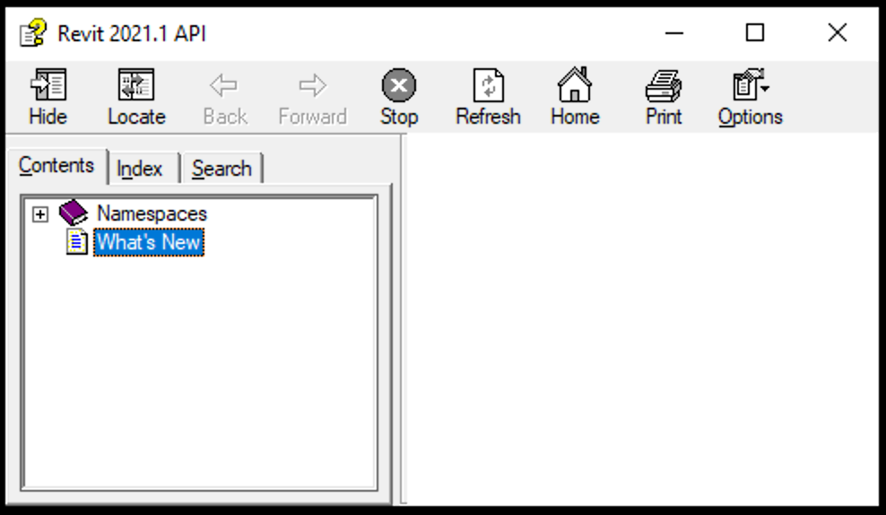

<head>
<meta http-equiv="Content-Type" content="text/html; charset=utf-8">
<link rel="stylesheet" type="text/css" href="bc.css">

</head>

<!---

- Revit 2021.1 API; 2021.1 SDK is here:
  \\usmanpdaec003\Data\Revit\SDK\2021
  https://myshare.autodesk.com/:u:/g/personal/mikako_harada_autodesk_com/EVc-ZcHTOgxJlatpdPsCnM8BBCzFDBgnki7EpRATudZryw?e=ehdzlL
  https://www.autodesk.com/developer-network/platform-technologies/revit
  ~/downloads/REVIT_2021_1_SDK.msi
  REVIT_2021_1_SDK.msi 378,425,344 bytes

- deprecated versus obsolete
  Q: What does the below statement “deprecation/replacement” mean? 
  We should keep the compatibility for API, right?? 
  Is this just a update to the SDK/documentation?
  A: Deprecated means 'it now has less value'.
  Wikipedia explains [Deprecation](https://en.wikipedia.org/wiki/Deprecation) like this:
  > In several fields, deprecation is the discouragement of use of some terminology, feature, design, or practice, typically because it has been superseded or is no longer considered efficient or safe, without completely removing it or prohibiting its use.
  > It can also imply that a feature, design, or practice will be removed or discontinued entirely in the future.
  It is not gone, not worthless.
  Using it may produce a warning message during compilation, but it wil still work.
  R: But note says 'replaced'. If so, the same code won’t work. Then, it’s a breaking change.  
  A: It does not say 'replaced', but 'replacement'.
  There is a subtle and significant difference between these two terms.
  The former 'replaced' means that is has been replaced and is hence no longer available.
  In that case, the method would not be marked as deprecated, but as obsolete.
  The latter, 'replacement', means that a replacement is available in case you wish to stop using the deprecated method, but nobody forces you to do so.
  'Deprecated' and 'replaced' has always been the terminology used by the Revit API team to mean, 'We have deprecated some functions. Here are the new ones we would like you to use as replacements. The deprecated functions will be removed in the next release.'

twitter:

 with the #RevitAPI @AutodeskForge @AutodeskRevit #bim #DynamoBim #ForgeDevCon 

&ndash; 
...

linkedin:

#bim #DynamoBim #ForgeDevCon #Revit #API #IFC #SDK #AI #VisualStudio #Autodesk #AEC #adsk

the [Revit API discussion forum](http://forums.autodesk.com/t5/revit-api-forum/bd-p/160) thread

-->

### The Revit 2021.1 SDK

#### The Revit 2021.1 SDK 

Today, just a quick note to point out that an updated SDK (Software Developer's Kit) for
the [Revit 2021.1 update release](https://thebuildingcoder.typepad.com/blog/2020/07/revit-20211-update-and-normalising-custom-export-uv.html#2)
is now available from
the [Revit developer centre](https://www.autodesk.com/developer-network/platform-technologies/revit).

#### Numerous Issues Resolved

The Revit 2021.1 update release resolves a number of reported issues.

Here is a microscopic random selection of a handful that I encountered myself:

- [Obfuscation problem](https://forums.autodesk.com/t5/revit-api-forum/issue-on-revit-2021-with-assembly-protections-and-addin-loading/m-p/9433973)
  &ndash; *REVIT-160709 RVTPR-00662: AddinManager Error for Obfuscated Add-ins*
- [Cyrillic characters in lookup tables](https://forums.autodesk.com/t5/revit-api-forum/russian-letters-doesn-t-export-in-lookup-tables/m-p/9056270)
  &ndash; *REVIT-153006 Encoding issue reading data from size lookup table with Cyrillic characters -- 15738224*
- [Extensible storage schema with `UT_Custom`](https://thebuildingcoder.typepad.com/blog/2020/04/whats-new-in-the-revit-2021-api.html#comment-4883962120)
  &ndash; *REVIT-161725 R2021 Schema with UT_Custom causes internal error*
- Documentation errors and an invalid error reporting email address in the SDK itself
  &ndash; *REVIT-163108 incorrect email and year in Revit API docs -- 16587872*

**Question:**

**Answer:** 

**Response:** 

<pre class="code">
</pre>

#### Major additions to the Revit 2021.1 API

#### API changes

#### ConnectorType API change

The following function has been deprecated and replaced:

- ConnectorType.MasterSurface() &rarr; ConnectorType.MainSurface()

#### Export API change

The following property has been deprecated and replaced:

- DGNExportOptions.MasterUnits &rarr; DGNExportOptions.WorkingUnits

#### Save As API change

The following properties have been deprecated and replaced:

- DocumentSavingAsEventArgs.IsSavingAsMasterFile &rarr; DocumentSavingAsEventArgs.IsSavingAsCentralFile
- DocumentSavedAsEventArgs.IsSavingAsMasterFile &rarr; DocumentSavedAsEventArgs.IsSavingAsCentralFile

#### API additions

#### Civil Alignments API

Revit now provides support for Civil Alignments and their associated annotations.
Alignments are imported from InfraWorks as a part of the workflow to transfer Civil Structures.
The API supports read of alignment properties and geometric information, along with read/write and create of associated annotations.
All new classes for the Alignments API are exposed through a different assembly in the Revit installation, located at:

- Addins\CivilAlignments\Autodesk.CivilAlignments.DBApplication.dll 

The new class:

- Autodesk.Revit.DB.Infrastructure.Alignment

represents an alignment and can be used to find alignments in a document, and to query a particular alignment's properties and to analyze alignment geometry. This object is not an Element, but the underlying Element can be obtained from this object if needed.

The new class:

- Autodesk.Revit.DB.Infrastructure.AlignmentStationLabel

represents an alignment station label annotation and can be used to find such labels in a document as well as to create and modify such labels. This object is not an Element, but the underlying Element (which is a SpotDimension instance) can be obtained from this object if needed.

The new classes:

- Autodesk.Revit.DB.Infrastructure.AlignmentStationLabelOptions
- Autodesk.Revit.DB.Infrastructure.AlignmentStationLabelSetOptions

provide options for creating a single alignment label or for creating a set of alignment labels.

#### Dimension API additions

Several new properties allow access to positioning for various parts of a dimension:

- Dimension.TextPosition
- Dimension.LeaderEndPosition
- Dimension.HasLeader
- SpotDimension.LeaderElbowPosition
- SpotDimension.LeaderHasElbow

#### Shared Coordinates API additions

#### Reset Shared Coordinates

The new method:

- Document.ResetSharedCoordinates()

resets the shared coordinates for the host model. It provides the same functionality as the UI Command "Reset Shared Coordinates". 

After resetting coordinates, the following changes will take place:

1. GIS coordinate system will be erased
2. Shared coordinates relationships with other linked models will be eliminated.
3. The Survey Point will be moved back to the startup location, where it coincides with the Internal Origin.
4. The angle between Project North and True North will be reset to 0.

Note: There will be no changes to linked models.

#### Clipped state of BasePoint

The new property: 

- bool BasePoint.Clipped

will get or set the clipped state of the survey point BasePoint based on the active ProjectLocation of its Document. For the project base point, the get method will always return false, and the set method will throw an exception.

#### MEP API Additions

#### Building and Space Type additions

Several new properties have been added for Building and Space Types:

- HVACLoadType.HeatingSetPoint &ndash; The heating temperature set point in unit Kelvin (K).
- HVACLoadType.CoolingSetPoint &ndash; The cooling temperature set point in unit Kelvin (K).
- HVACLoadType.HumidificationSetPoint &ndash; The humidification set point as a number between 0 and 1.
- HVACLoadType.DehumidificationSetPoint &ndash; The dehumidification set point as a number between 0 and 1.

#### Zone additions

The new property:

- GenericZone.LevelOffset

gets or sets the offset distance from this zone to the associated level.

