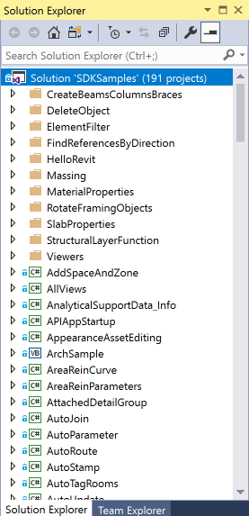

<head>
<meta http-equiv="Content-Type" content="text/html; charset=utf-8">
<link rel="stylesheet" type="text/css" href="bc.css">

</head>

<!---

twitter:

I document my compilation, adaptation and installation of the Revit SDK samples and the RvtSamples external application loading them all, plus the new SDK sample CivilAlignments for the #RevitAPI @AutodeskForge @AutodeskRevit #bim #DynamoBim #ForgeDevCon https://bit.ly/rvt_2021_1_sdk
 
I document my compilation, adaptation and installation of the Revit SDK samples and the RvtSamples external application loading them all
&ndash; Compiling the Revit 2021.1 SDK samples
&ndash; Architecture mismatch warning and <code>RvtSamples.txt</code>
&ndash; New SDK sample CivilAlignments...

linkedin:

I document my compilation, adaptation and installation of the Revit SDK samples and the RvtSamples external application loading them all, plus the new SDK sample CivilAlignments for the #RevitAPI

https://bit.ly/rvt_2021_1_sdk
 
I document my compilation, adaptation and installation of the Revit SDK samples and the RvtSamples external application loading them all:

- Compiling the Revit 2021.1 SDK samples
- Architecture mismatch warning and <code>RvtSamples.txt</code>
- New SDK sample CivilAlignments...

#bim #DynamoBim #ForgeDevCon #Revit #API #IFC #SDK #AI #VisualStudio #Autodesk #AEC #adsk

the [Revit API discussion forum](http://forums.autodesk.com/t5/revit-api-forum/bd-p/160) thread

-->

### Compile and Compare the Revit 2021.1 SDK Samples

Once again, I document my compilation, adaptation and installation of the Revit SDK samples and the RvtSamples external application loading them all:

- [Compiling the Revit 2021.1 SDK samples](#2)
- [Architecture mismatch warning and `RvtSamples.txt`](#3)
- [New SDK sample &ndash; CivilAlignments](#4)

#### Compiling the Revit 2021.1 SDK Samples

Compiling the Revit SDK Samples updated for each new major release was once a major undertaking due to hundreds of compiler errors.

In the last couple of years, happily, it became much easier.

This time around, it was a bit trickier again.

Happily, I documented the hassle involved
in [compiling the initial Revit 2021 SDK samples](https://thebuildingcoder.typepad.com/blog/2020/05/compiling-the-revit-2021-sdk-samples.html) in
full detail and was able to quite easily repeat those steps.

The main problem is very basic and not hard to fix at all: the references to the Revit API assemblies in each of the 190 sample projects is set up for different developers' specific environments using local file paths instead of an absolute path.

All you need to do is to hunt them all down and point them all to the official Revit installation location *C:\Program Files\Autodesk\Revit 2021*.

This needs to be done not only in `csproj` and `vbproj` files, but also in `target` ones.

Again, I copied the original state of the Revit 2021.1 SDK to
the [RevitSdkSamples GitHub repository](https://github.com/jeremytammik/RevitSdkSamples) before
analysing the problem and applying the fixes, so you can easily retrace my steps or download the final results of my fixes and save yourself the effort of reinventing this particular wheel.

Here is a list of some of my commits, releases, and error logs:

- [Release 2021.1.0.0](https://github.com/jeremytammik/RevitSdkSamples/releases/tag/2021.1.0.0)
  &ndash; replaced my fixed version of the initial Revit 2021 SDK by the official Revit 2021.1 SDK release
  &ndash; [0 projects succeeded, 191 failed, 8977 errors and 1119 warnings](zip/revit_2021_sdk_samples_errors_warnings_1.txt)

I performed the following steps to locate the API assemblies and update the references to the Revit API assembly DLLs to point to the absolute Revit.exe folder:

- Fixed `HintPath` in SDKSamples.targets
- Updated RevitAPI and RevitAPIUI `HintPath` settings in individual project files
- Fixed `HintPath` in SDKSamples.VB.targets
- Fixed `HintPath` in SDKSamples.Steel.targets

That enabled the first successful compilation, still producing a bunch of warnings, though:

- [Release 2021.0.0.1](https://github.com/jeremytammik/RevitSdkSamples/releases/tag/2021.0.0.1)
  &ndash; [190 projects succeeded, 0 errors and 36 warnings](zip/revit_2021_sdk_samples_errors_warnings_5.txt)

#### Architecture Mismatch Warning and RvtSamples.txt

Most of the warnings concern the
ever-recurring [architecture mismatch issue](http://thebuildingcoder.typepad.com/blog/2013/06/processor-architecture-mismatch-warning.html)
and can be resolved using
my [DisableMismatchWarning.exe utility](http://thebuildingcoder.typepad.com/blog/2013/07/recursively-disable-architecture-mismatch-warning.html)
implemented back in 2013 and available from
the [DisableMismatchWarning GitHub repository](https://github.com/jeremytammik/DisableMismatchWarning).

After that, I set up the RvtSamples external application to locate and load all the Revit SDK sample external commands:

- Fixed the architecture mismatch warning
- Added references to civil alignments and steel connections API assemblies
- Edited RvtSamples.txt for correct sample locations
- Turned on RvtSamples external command class name test
- PointsFromExcel external command was removed from Massing/PointCurveCreation sample
- Turned off RvtSamples external command class name test

- [Release 2021.0.0.2](https://github.com/jeremytammik/RevitSdkSamples/releases/tag/2021.0.0.2)
  &ndash; [190 projects succeeded, 0 errors and 5 warnings](zip/revit_2021_sdk_samples_errors_warnings_6.txt)

I will leave the remaining five warnings in there for now.

One great advantage of the GitHub repository management is that you can very easily analyse the differences between the different releases to determine the exact changes that I applied, e.g.,
[between 2021.1.0.0 and 2021.1.0.2](https://github.com/jeremytammik/RevitSdkSamples/compare/2021.1.0.0...2021.1.0.2).

#### New SDK Sample &ndash; CivilAlignments

One new SDK sample was added in the Revit 2021.1 SDK.

CivilAlignments implements an external command and an external application demonstrating the use of the API for finding, property querying and annotating of infrastructure alignment elements:

- Place major and minor alignment station label sets along an alignment
- Display a summary of properties of the alignment element and its attached alignment station label elements

Instructions:

Open *CivilAlignments_BridgeSample.rvt*.
It is a metric project, to demonstrate necessary unit conversions to feet.
The project contains an alignment.
The project also contains two special Arrowhead styles, Major Station Arrowhead and Minor Station Arrowhead, which are necessary for proper setup of the major and minor alignment station label set types.
Other projects can be used, as long as they contain an alignment and have the aforementioned arrowhead styles defined.

- In the Add-ins Tab, launch the *Create Station Labels* command and pick an alignment; result: 
    - Major and minor alignment station set tags are created. The major stations are placed starting at the alignment’s displayed start station, every 100m. The minor stations are placed every 10m for the first 100m.
    - In plan views, single alignment station labels are created at every start and end of the alignment’s horizontal curve geometry. 
- In the Add-ins Tab, launch the *Show Properties* command and pick the alignment; result:
    - A task dialog displays, listing the properties of the alignment, its horizontal curves and all of its associated station labels. 

