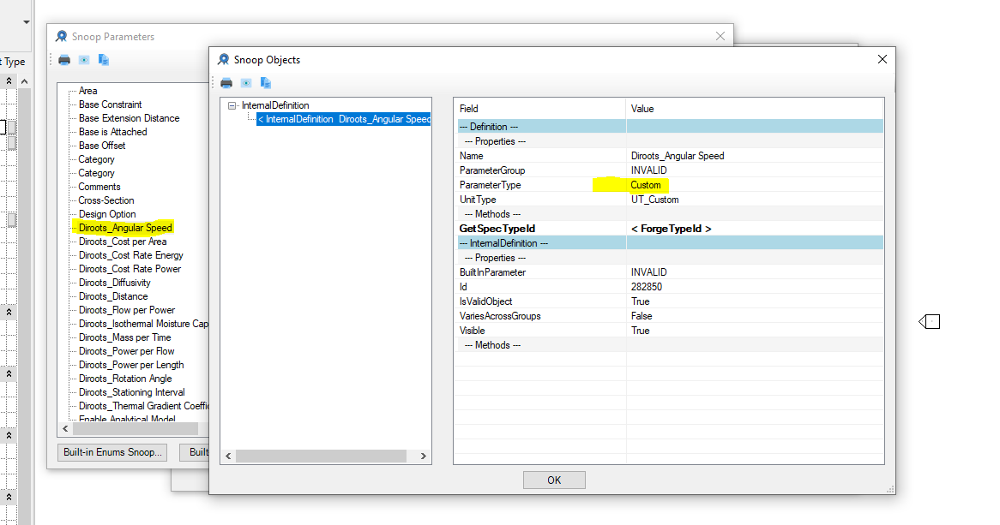

<head>
<meta http-equiv="Content-Type" content="text/html; charset=utf-8">
<link rel="stylesheet" type="text/css" href="bc.css">

</head>

<!---

- an interesting motivational article by Jesse Hall on unintentionally starting a successful YouTube channel and ending up earning moeny with it, all just to prove a point to his two teenage kids:
How I Went From 0 to 70k Subscribers on YouTube in 1 Year – And How Much Money I Made
https://www.freecodecamp.org/news/how-to-grow-your-youtube-channel/
> In conclusion, I just want to say that anyone can do anything. If you have (1) the proper motivation, (2) realistic expectations, and (3) you don't overwork yourself, you can be successful.

- Parameter type changes to custom in Revit 2021.1
https://forums.autodesk.com/t5/revit-api-forum/parameter-type-changes-to-custom-in-revit-2021-1/m-p/9693021

In Revit 2021.1, the following parameter types are automatically changed to `custom` after creation:

- Angular Speed
- Cost per Area
- Cost Rate Energy
- Cost Rate Power
- Diffusivity
- Distance
- Flow per Power
- Isothermal Moisture Capacity
- Mass per Time
- Power per Flow
- Power per Length
- Rotation Angle
- Stationing Interval
- Thermal Gradient Coefficient for Moisture Capacity

Is that intentional?

- effect of home office on meeting culture
  Microsoft analyzed data on its newly remote workforce
  https://hbr.org/2020/07/microsoft-analyzed-data-on-its-newly-remote-workforce

- How to get number of cut tiles in a room using revit api
  https://forums.autodesk.com/t5/revit-api-forum/how-to-get-number-of-cut-tiles-in-a-room-using-revit-api/m-p/9696586

twitter:

Parameter changes to custom, tile packing in room, Forge solution showcase, motivating kids and business success with the #RevitAPI @AutodeskForge @AutodeskRevit #bim #DynamoBim #ForgeDevCon http://bit.ly/tilepacking

Parameter changes and tile packing using the Revit API and AI, plus some other notes on Forge and general stuff
&ndash; Parameter type changes to <code>Custom</code>
&ndash; Determining cut tiles in room
&ndash; Optimal banana sandwich slice packing with AI
&ndash; Forge solution showcase
&ndash; Effect of home office on meeting culture
&ndash; Motivating kids can be harder than business success...

linkedin:

Parameter changes to custom, tile packing in room, Forge solution showcase, motivating kids and business success with the #RevitAPI

http://bit.ly/tilepacking

-  Parameter type changes to Custom
-  Determining cut tiles in room
-  Optimal banana sandwich slice packing with AI
-  Forge solution showcase
-  Effect of home office on meeting culture
-  Motivating kids can be harder than business success...

#bim #DynamoBim #ForgeDevCon #Revit #API #IFC #SDK #AI #VisualStudio #Autodesk #AEC #adsk

the [Revit API discussion forum](http://forums.autodesk.com/t5/revit-api-forum/bd-p/160) thread

-->

### Custom Parameters and Tile Packing

Parameter changes and tile packing using the Revit API and AI, plus some other notes on Forge and general stuff:

- [Parameter type changes to `Custom`](#2)
- [Tile packing and determining cut tiles in room](#3)
- [Bin packing and container loading in Dynamo and Excel](#3.1)
- [Optimal banana sandwich slice packing with AI](#4)
- [Forge solution showcase](#5)
- [Effect of home office on meeting culture](#6)
- [Motivating kids can be harder than business success](#7)

#### Parameter Type Changes to Custom

A question came up on why a number of parameter types can no longer be created programmatically, in 
the [Revit API discussion forum](http://forums.autodesk.com/t5/revit-api-forum/bd-p/160) thread
on [parameter type changes to custom in Revit 2021.1](https://forums.autodesk.com/t5/revit-api-forum/parameter-type-changes-to-custom-in-revit-2021-1/m-p/9693021):

**Question:** In Revit 2021.1, the following parameter types are automatically changed to `custom` after creation:

- Angular Speed
- Cost per Area
- Cost Rate Energy
- Cost Rate Power
- Diffusivity
- Distance
- Flow per Power
- Isothermal Moisture Capacity
- Mass per Time
- Power per Flow
- Power per Length
- Rotation Angle
- Stationing Interval
- Thermal Gradient Coefficient for Moisture Capacity

 <!-- 1166 -->

It looks like we don't have API support (for creating) these parameter types.

Is that intentional?

**Answer:** The development team replied:

Yes, it's intentional, and we recognise it as a limitation.

A future major release of Revit will offer a better experience.

The reason behind it is that the new data types in this list can be identified by `ForgeTypeId` but do not map to values in the deprecated `UnitType` enumeration or the `ParameterType` enumeration (which will be deprecated in future releases of Revit).

You can use these new data types to create parameters in the Revit user interface, but if you try to read the `ParameterType` value in the API, you'll get Custom.

However, I believe you can use the `Definition.GetSpecTypeId` method to distinguish between these Custom parameters.

So, you are absolutely correct: currently no support for these parameter types.

That support will come in a future major release of Revit.

It is in fact also already available in the current preview release.

#### Tile Packing and Determining Cut Tiles in Room

Richard [RPThomas108](https://forums.autodesk.com/t5/user/viewprofilepage/user-id/1035859) Thomas
has been extremely active and helpful lately in
the [Revit API discussion forum](http://forums.autodesk.com/t5/revit-api-forum/bd-p/160).

Here is some very down-to-earth (or -floor) advice of his on 
[how to get the number of cut tiles in a room using the Revit API](https://forums.autodesk.com/t5/revit-api-forum/how-to-get-number-of-cut-tiles-in-a-room-using-revit-api/m-p/9696586):

**Question:** I want to get number of tiles in a room.

After getting the number of tiles I also want to get the cut tiles in percentage of tiles.

Having collected rooms in floor plan, is there any way to get the tiles?

**Answer:** This is an interesting task.

I am not aware of any support for this in the Revit API right out of the box.

Is this functionality provided by the Revit end user interface?

The API hardly ever provides functionality that is not available in the end user interface.

If not, you can definitely implement something yourself to retrieve the exact area that you wish to cover with tiles and run some kind of partitioning and optimisation algorithm on it to achieve the task you describe.

First, some rather abstract theoretical research in this area:

- [Euclidean tilings by convex regular polygons](https://en.wikipedia.org/wiki/Euclidean_tilings_by_convex_regular_polygons)
- [Tiling with rectangles](https://en.wikipedia.org/wiki/Tiling_with_rectangles)
- [Tiling an orthogonal polygon with squares](https://cs.stackexchange.com/questions/16661/tiling-an-orthogonal-polygon-with-squares)
- [hextile &ndash; Generate tile representations of polygon objects on map](https://github.com/datagovsg/hextile)

Another idea:

Implement a family instance representing one tile.
Use the Revit 2021 generative design functionality to place a maximum number of tiles on the desired surface.

Continued researching this:

- [Nesting maximum amount of shapes on a surface](https://stackoverflow.com/questions/2675123/nesting-maximum-amount-of-shapes-on-a-surface)

The proper term to search for is 'packing':

- [Packing problems](https://en.wikipedia.org/wiki/Packing_problems)
- [Packing algorithms](https://github.com/topics/packing-algorithm)
- [What algorithm can be used for packing rectangles of different sizes into the smallest rectangle possible in a fairly optimal way?](https://stackoverflow.com/questions/1213394/what-algorithm-can-be-used-for-packing-rectangles-of-different-sizes-into-the-sm)

Addendum while editing the blog post: check
out [Nest2D, a C++ 2D bin packaging tool for Python](https://github.com/markfink/nest2D),
mentioned below for optimised banana slice packing.
That looks as if it will solve the problem for you right out of the box.

In any case, do remember to appropriately align the polygon surface you wish to fill (or tile).

Now for the more down-to-earth aspects:

Not to complicate the issue but is this tiles with grout tolerance allowance between the tiles?

If I were thinking of how I would do it then I'd place the tiles as solids in a given grid arrangement overlapping the room boundary, get the total volume of this grid arrangement = Vol1.

Cut the room shape out of this tile arrangement to get the volume again = Vol2.

You can then get the volume inside the room by deducting Vol2 from Vol1.

Separate out the disjoined solids in Vol2 (I believe there is a function for that).

Then you can also identify the cut tiles around the perimeter of the room in Vol2 because each of those have a volume less than a tile. This is the inverse volume so you deduct each of these from the tile size to give you each partial tile size and its location.
I speak in terms of volumes because volume is easy to determine from solids and then you can divide by tile thickness.

Also, I'm using the inverse because I know the boundary of the room to use for deducting from the overall set. I could do it the other way around (deduct the excess from around the room) but I would have to allow a border around the room to ensure all the excess tiles are deducted and this seems slightly more complicated in determining that border width (probably a tile size plus an allowance).

I think where you start the tiling becomes arbitrary in a sense because rarely in reality are tiles set out on site to such precision. I imagine you usually start from the centre and work your way out to the edges so it gives the impression of symmetry.  I'm wondering how many variations you'd get by changing the tile offset i.e. if all the tiles are the same size do you cover the variations by offsetting through the tile unit dimensions? Do you then discount arrangements that lead to impractical tile sizes?

In the end, what area of tiles do you need to fill a room of 10m2? Workmanship will play a large part in how many tiles you need so costs are usually not that specific. It'll likely be 10m2 worth of tiles + tolerance because I can't sell you half tiles (you cut them).
Also, I'll sell you boxes of 20 tiles not individual ones.
Then, there is colour variations in tiles; perhaps you have a pattern and you want to know how many of each colour?

**Response:** Thank you for reply.
We are not considering tolerance part or the colour of different tiles as of now.

I am thinking to do some different way.

Assuming room is rectangular:

I will get centre of rectangle.

Then I fire a reference intersector in both directions (x,y).

I know the size of the tiles (width,height).
Divide reference intersector by length.
That returns the no of tiles in that line.

Multiply by room dimension get total tiles.

If reference intersector is not divide equally, then last tiles are cut tiles; I will get total cut tiles by multiplying with length of room.

**Answer:** Sounds like an approach but I'm not sure you need a `ReferenceIntersector` for a rectangular room.

If the room is rectangular then you just need to find the room boundaries with opposite or same vector direction and measure the distance between them to get your room size.

Then, it's just as you say, dividing room dimension into tile dimension to give you a count.
The remainder is then the portion of cut tile at either end:

5000 / 300 = 16.6666 recurring (16 full units).

0.6666 * 300 = 200 (rounded) so a strip of 100mm at each end to close the gap.

That kind of thing?

Grout tolerance is likely means to artificially increase the tile size dimensions by the grout width.
We do similar with reinforcement bars to get maximum spacing but we are then counting the gaps.

#### Bin Packing and Container Loading in Dynamo and Excel

Kostya added some further useful suggestions
in [his comment below](https://thebuildingcoder.typepad.com/blog/2020/08/custom-parameters-and-tile-packing.html#comment-5053479490):

I have recently been looking for 1D/2D/3D bin packaging algorithms as well. Reference links helped me a lot.

In addition to them I think it worth mentioning
the [Dynamo package Miscellany](https://github.com/thomascorrie/Miscellany), based on
the [C# library 3DContainerPacking](https://github.com/davidmchapman/3DContainerPacking).

I also came across two free Excel workbooks by Güneş Erdoğan for representing, solving, and visualising the results of Bin Packing Problems (BPPs) and Container Loading Problems (CLPs), also known as 3D Bin Packing Problems:

- [BPP Spreadsheet Solver (2D)](https://people.bath.ac.uk/ge277/bpp-spreadsheet-solver) 
- [CLP Spreadsheet Solver (3D)](https://people.bath.ac.uk/ge277/clp-spreadsheet-solver)

They implement Large Neighborhood Search:

- Step 1 (Initialization): Sort the items with respect to their priority, size, and profit. Sort bins with respect to their size and cost.
- Step 2 (Constructive step): Use the First-Fit-Decreasing heuristic to pack the items into the bins.
- Step 3 (Perturbation): Randomly remove items from bins, and randomly empty a number of bins. Sort the bins with respect to the area packed into them and their cost per unit area.
- Step 4 (Reoptimization): Use the First-Fit-Decreasing heuristic to repack the removed items.
- Step 5 (Solution update): If the new solution is better than the best known solution, update the best known solution. Otherwise, revert back to the best known solution. If the time limit is not exceeded, go to Step 3.

Many thanks to Kostya for these helpful links!

####Optimal Banana Sandwich Slice Packing with AI

On the topic of optimal packing, a full-fledged solution with a modern and thorough approach for solving a challenging real-world problem is addressed in the article
on [optimal peanut butter and banana sandwiches](https://www.ethanrosenthal.com/2020/08/25/optimal-peanut-butter-and-banana-sandwiches):

<video style="display:block; width:600px; height:auto;" autoplay="" muted="" loop="loop">
<source src="img/banana_small.mp4" type="video/mp4">
<source src="https://thebuildingcoder.typepad.com/2020/banana_small.mp4" type="video/mp4">
</video>

It uses a pretrained torchvision deep learning model for image recognition and labelling to find the banana and slice of bread in a photo, geometrically analyses and virtually slices the banana to produce the packing polygons, and finally packs the banana slices onto the sandwich
using [Nest2D, a C++ 2D bin packaging tool for Python](https://github.com/markfink/nest2D).

####Forge Solution Showcase

The new [Forge solution showcase web page](https://forge.autodesk.com/solution-showcase) is now live.

The goal of this page is to showcase what you can do with Forge.
It features solutions created by the community for things like Digital Twins, Visual Insights, and Design Automation.
 
It includes a call to action for others to submit their stories as well. 
The Forge Fund team receives these notifications as well, so if there is an opportunity for the Forge Fund, they can reach out.

####Effect of Home Office on Meeting Culture

Some interesting aspects of meeting culture working at home were discovered and discussed 
as [Microsoft analysed data on its newly remote workforce](https://hbr.org/2020/07/microsoft-analyzed-data-on-its-newly-remote-workforce).

####Motivating Kids can be Harder than Business Success

An inspiring motivational article by Jesse Hall on semi-unintentionally starting a successful YouTube channel and ending up earning money with it, all just to prove a point to his two teenage kids:
[How I Went From 0 to 70k Subscribers on YouTube in 1 Year &ndash; And How Much Money I Made](https://www.freecodecamp.org/news/how-to-grow-your-youtube-channel):

> In conclusion, I just want to say that anyone can do anything.
If you have (1) the proper motivation, (2) realistic expectations, and (3) you don't overwork yourself, you can be successful.

